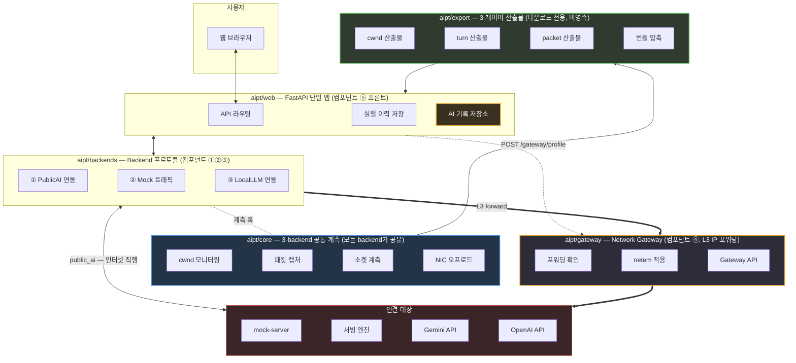
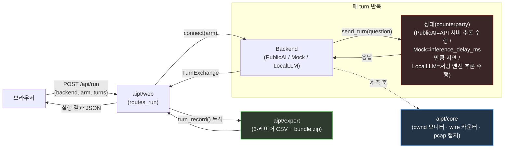
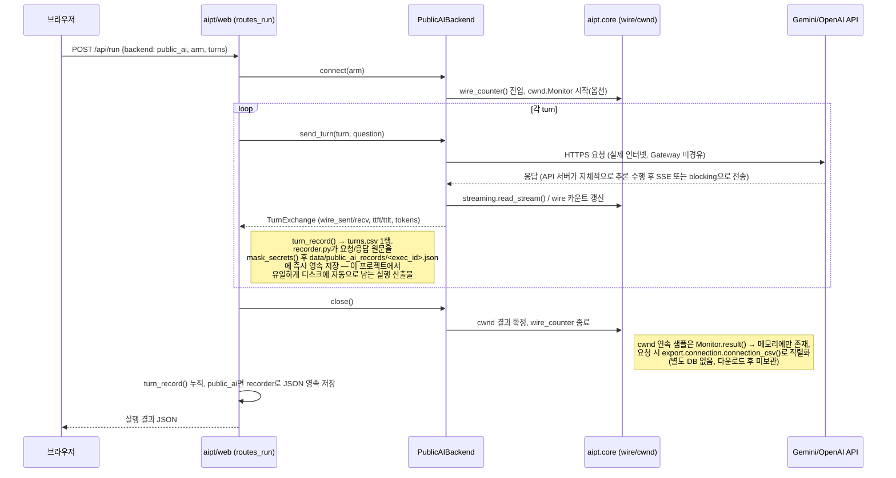
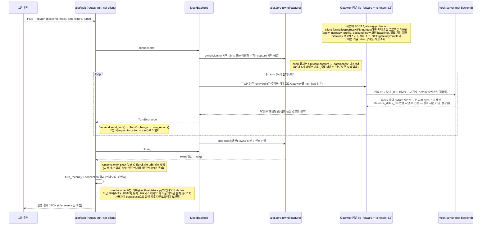
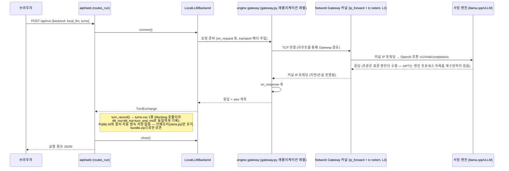
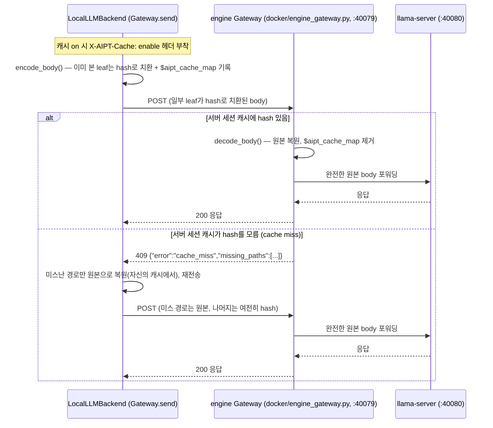

# AIPT — Architecture (Final)

이 문서는 병합/구현이 완료된 시점 기준으로 AIPT(AI Protocol Traffic lab)의
아키텍처를 정리한다. 설계 결정의 근거와 진행 이력은 `DESIGN.md`를 참고하고,
이 문서는 "지금 이 코드가 어떻게 동작하는가"를 보여주는 참조 문서다.

---

## 1. 전체 아키텍처

### 1.1 아키텍처 다이어그램



> **Gateway는 L3 IP 포워딩 컨테이너다**: `web`은 `net-client`(172.28.1.0/24), `mock-server`는
> `net-backend`(172.28.2.0/24)에 각각 격리되어 있고, Gateway만 두 네트워크
> 모두에 속해 커널(`net.ipv4.ip_forward=1`)로 그 사이를 라우팅한다. 컨테이너
> 시작 시 `entrypoint_web.py`/`entrypoint_mockserver.py`가 상대 서브넷으로
> 가는 경로를 Gateway 경유로 명시적으로 추가(`ip route add`)해서, 왕복
> 트래픽(요청+응답)이 반드시 Gateway를 통과하게 한다. `tc netem`은
> **client-facing leg에만** 적용된다(egress 직접 + ingress는 IFB 경유,
> `apply_gateway_profile()`) — backend-facing leg는 항상 고정된
> `ETHERNET_BASELINE`(무손상에 가까움)만 적용된다, 자세한 근거는 §4.2
> 참고. Gateway는 TCP 상태를 전혀 보지 않는 순수 L3 라우팅이며, 애플리케이션
> 레벨 프록시 코드는 없다.

> 실행 결과 저장 범위는 §3.1에서 자세히 다룬다:
> **Public AI(상용 API) 요청/응답 JSON만** `data/public_ai_records/`에
> 자동으로 영속 저장되고, 그 외 산출물(cwnd/pcap/mock/local_llm 턴 기록)은
> 인메모리에만 있다가 `bundle.zip`으로 사용자가 직접 받아서 관리한다.

### 1.2 패키지/폴더 구조

```
AIPT/
├── DESIGN.md                      # 설계 결정 이력 (근거, 대안, 미해결 이슈)
├── ARCHITECTURE.md                # 이 문서 — 최종 아키텍처 레퍼런스
├── MIGRATION.md                   # 파일 단위 이관 체크리스트
├── README.md
├── pyproject.toml                 # base deps=requests, extras: dev/export/web
├── docker-compose.yml             # web + gateway + mock-server + local-llm + quic-mock-server 5-service
│
├── aipt/                          # 설치 가능한 패키지 루트
│   ├── core/                      # ★ 3-backend 공통 계측 계층
│   │   ├── cwnd.py                 #   netlink 연속 cwnd 모니터 (+ 적응형 샘플링 주기)
│   │   ├── capture.py              #   tcpdump 캡처 (+ timestamp_source)
│   │   ├── offload.py              #   NIC TSO/GSO 토글
│   │   ├── netem.py                #   tc netem 저수준 wrapper (gateway가 승격 사용)
│   │   ├── wire.py                 #   소켓 바이트 카운터
│   │   ├── streaming.py            #   SSE 리더
│   │   ├── tcpinfo.py              #   1회성 TCP_INFO 스냅샷
│   │   ├── congestion.py           #   TCP 커널 가용 혼잡제어 알고리즘 조회 (/proc 실측)
│   │   ├── quic_congestion.py      #   QUIC(aioquic) 가용 혼잡제어 알고리즘 조회 (userspace)
│   │   └── config.py               #   env 플래그 판독
│   │
│   ├── backends/                  # ★ Backend 프로토콜 + 3개 구현체 + 1개 실험 스파이크
│   │   ├── base.py                 #   Backend 프로토콜(connect/send_turn/close), TurnExchange
│   │   ├── record.py               #   turn_record() 공통 스키마
│   │   ├── public_ai/              #   ① Public AI backend
│   │   │   ├── gemini.py / openai.py   (6+4 arm)
│   │   │   ├── recorder.py             (실측 캡처→fixture)
│   │   │   └── _call.py / _cachebust.py
│   │   ├── mock/                   #   ② Mock backend
│   │   │   ├── server.py               (keep-alive HTTP mock 서버)
│   │   │   ├── records.py              (ScenarioRecord: byte-sweep + Q&A JSON 통합 로딩)
│   │   │   ├── replay.py               (실측 재생, 바이트만)
│   │   │   ├── conversation.py         (MockBackend, core 연동)
│   │   │   └── probe.py                (idle RTT probe)
│   │   ├── local_llm/              #   ③ Local LLM backend
│   │   │   ├── engine_adapter.py       (표준 엔진 OpenAI 호환 클라이언트)
│   │   │   └── gateway.py              ("engine gateway" — 애플리케이션 레벨 프록시)
│   │   └── quic_mock/               #   QUIC idle-probe 혼잡제어 실험 스파이크 (Backend 미구현,
│   │       ├── backend.py / server.py    번호 없는 4번째 backend 후보 — Mock 전용 측정 실험,
│   │       ├── congestion.py             aipt/web에서 아직 호출 불가)
│   │       ├── experiment.py / spike_runner.py    ("idle_probe" QUIC 알고리즘 — PING으로 idle-gap 능동 측정)
│   │
│   ├── gateway/                   # ★ ④ Network Gateway (L3 IP 포워딩, 별도 컨테이너)
│   │   ├── profiles.py             #   clean/wired/wireless/custom (근거: ITU-T Y.1541 / 3GPP TS 23.501)
│   │   ├── netem_control.py        #   apply_gateway_profile() — client leg(egress+IFB ingress)만 shaping, backend leg는 고정 baseline
│   │   ├── forwarding.py           #   net.ipv4.ip_forward 상태 확인
│   │   └── app.py                  #   독립 FastAPI 미니앱 (/health, /gateway/profile)
│   │
│   ├── export/                    # 3-레이어 통합 산출물
│   │   ├── connection.py / turns.py / packets.py / bundle.py
│   │
│   └── web/                       # ★ ⑤ 프론트 (FastAPI 단일 앱)
│       ├── app.py                  #   create_app() 팩토리
│       ├── routes_config.py        #   GET /, GET /api/config
│       ├── routes_run.py           #   POST /api/run
│       ├── routes_runs.py          #   /api/runs*, CSV/zip 다운로드
│       ├── store.py                #   인메모리 실행 이력
│       └── templates/ + static/
│
├── native/
│   └── cwnd_monitor.c              # 별도 프로세스로 도는 netlink 폴링 루프
│
├── docker/
│   ├── Dockerfile.web              # web 서비스 (cwnd 헬퍼 빌드 + tcpdump + iproute2)
│   ├── Dockerfile.gateway          # gateway 서비스 (iproute2, NET_ADMIN 필요)
│   ├── Dockerfile.mockserver       # mock-server 서비스
│   ├── Dockerfile.local_llm        # local-llm 서비스 (engine gateway 컨테이너)
│   ├── Dockerfile.quic_mock_server # quic-mock-server 서비스 (idle-probe 실험용)
│   └── entrypoint_{web,mockserver,local_llm,quic_mock_server}.py
│
└── tests/                          # core(8) / backends(19) / export(4) / web(4) / gateway(4) / top-level(1) — 40 test files, 519 tests
```

---

## 2. 주요 컴포넌트 설계

5개 컴포넌트: **① PublicAIBackend, ② MockBackend,
③ LocalLLMBackend, ④ Network Gateway, ⑤ 프론트(aipt/web)**.

### ① PublicAIBackend

**역할**: 실제 Gemini/OpenAI API를 상대하는 backend. 상용 API 호출을 통해
진짜 인터넷 경로의 RTT·손실·혼잡 특성을 그대로 관측 대상에 포함.

**주요 기능**
- Gemini 6종 / OpenAI 4종, 총 10개 arm 지원 — 대화 히스토리를 클라이언트가
  들고 있는지, 서버가 포인터로 관리하는지에 따른 실험 조건 구분
- 소켓 레벨 계측이 가능한 요청 방식 채택 (공식 SDK 대신 requests 기반 세션)
- 실제 호출의 요청/응답 원문 캡처 후 민감정보 마스킹, Mock backend의
  재생용 fixture로 저장
- Network Gateway 미경유 — 이미 실제 네트워크 특성을 보유하므로 인터넷 직행

### ② MockBackend

**역할**: 로컬에서 재현 가능한 고정 트래픽 패턴 생성. 과금 없이 반복
재현 가능한 실험 환경 제공.

**주요 기능**
- 두 가지 입력 방식 지원 — 고정 byte-size 스윕(순수 페이로드 크기 실험),
  Q&A JSON fixture(누적 컨텍스트 멀티턴 시나리오)
- HTTP/1.1 keep-alive 서버로 응답 — fixture 텍스트 또는 지정 byte 크기
- 실측 데이터 재생 시 바이트 패턴만 재현, 지연시간은 별도 설정값으로 제어
  (재현 정확도보다 구현 명료성 우선)
- Network Gateway를 반드시 경유 — 완벽한 로컬 네트워크라는 암묵적 가정 제거

### ③ LocalLLMBackend

**역할**: 표준 서빙 엔진(llama.cpp/vLLM)을 그대로 활용, 앞단에 자체
애플리케이션 프록시("engine gateway")를 둔 실험 환경. 추론 엔진 재구현
없이 HTTP 신기능 실험 지점 확보.

**주요 기능**
- OpenAI 호환 API에 요청을 전달하는 얇은 클라이언트 — 엔진 프로세스
  자체는 다루지 않고 외부 실행 중인 엔진을 환경변수로 참조
- 요청/응답 훅 포인트 제공 — 향후 HTTP/QUIC 확장을 위한 transport 슬롯
  마련(현재는 미구현)
- Network Gateway를 L3로 경유 — Mock과 동일한 네트워크 특성 주입 대상
- **요청 본문 leaf-hash 중복 제거 캐싱**(2026-09-01 구현 완료,
  §3.3 참고) — 멀티턴 대화에서 매 턴 재전송되는 이전 `messages` 텍스트를
  session(TCP 커넥션) 단위로 hash 치환해 전송량을 절감. `X-AIPT-Cache:
  enable` 헤더로 opt-in, local_llm backend 전용, 기본값 off.

> ⚠️ 이 "engine gateway"(애플리케이션 레벨 프록시)와 아래 ④ "Network
> Gateway"(L3 커널 레벨)는 이름이 비슷하지만 서로 다른 컴포넌트. 이번
> 캐싱 기능은 전자("engine gateway")에만 구현되며 후자와는 무관하다.

### ④ Network Gateway

**역할**: Mock/LocalLLM 경로에 실제 네트워크 특성(지연·손실·재정렬)을
주입하는 순수 L3 IP 포워딩 컨테이너. PublicAI는 이미 실제 인터넷이 이
역할을 하므로 경유 대상에서 제외.

**주요 기능**
- 두 개의 분리된 네트워크(net-client, net-backend) 사이에서 커널 IP
  포워딩 수행 — TCP 페이로드/헤더는 들여다보지 않음
- 커널 sysctl(ip_forward) 활성 여부를 런타임에 직접 검증 후 상태 노출 —
  설정 반영을 가정하지 않고 확인
- 클라이언트-facing leg에만(egress+IFB ingress 양방향) 사용자 선택 프로파일
  적용 — backend-facing leg는 항상 고정 Ethernet baseline (§4.2 참고)
- 프로파일 프리셋(clean/wired/wireless/custom, 근거는 §4.2 참고) + 런타임
  API 교체 지원
- 실패 시 예외 대신 개별 인터페이스 단위로 원인 보고 (정직한 실패 보고 원칙)

### ⑤ 프론트(aipt/web)

**역할**: FastAPI 단일 앱. 기존 두 프로젝트(Flask/FastAPI)의 웹 서버를
통합, backend 선택부터 결과 조회까지 단일 진입점 제공.

**주요 기능**
- 사용 가능한 backend 목록과 준비 상태를 동적으로 수집해 노출 — 신규
  backend 추가 시 하드코딩 불필요
- API Type → Context Handle 2단계 선택 UI로 arm 구성 단순화
- 실행 라이프사이클(connect → send_turn → close)을 스레드풀에서 처리 —
  이벤트 루프 블로킹 방지
- Public AI 실행 시에만 자동 기록/영속 저장, 그 외 실행은 인메모리
  이력만 유지(최근 50건)
- 3-레이어 CSV(cwnd/turn/packet) + bundle.zip 다운로드 라우트 제공

---

## 3. 데이터 흐름

### 3.1 전체 데이터 흐름 (추상화)

§3.2의 3개 backend별 sequence diagram에 공통되는 뼈대만 뽑으면 아래처럼
하나의 흐름으로 요약된다 — backend가 무엇이든 **"연결 → 턴 반복(상대가
내부 동작 수행 → 응답) → 계측 결과 export"** 순서는 동일하고, 달라지는
것은 상대(counterparty)가 누구인지와 그 상대가 괄호 안에서 무엇을
하는지뿐이다.



**읽는 법**
- **연결(connect)**: backend가 상대와의 세션/소켓을 열고, 동시에 `aipt/core`
  계측(cwnd 모니터, wire 카운터, 필요시 pcap 캡처)이 훅으로 걸린다.
- **턴 반복(send_turn)**: backend가 질문을 보내면 상대가 **자기 내부에서
  실제 일**을 한 뒤(PublicAI는 API 서버가 추론, Mock은 `inference_delay_ms`
  만큼만 기다렸다가 고정 응답, LocalLLM은 서빙 엔진이 실제 추론) 응답을
  돌려준다. 이 "내부 동작"의 정체가 §3.2 다이어그램에서 `(...)`로 상세화된
  부분이다.
- **계측/기록**: 매 턴이 끝날 때마다 `TurnExchange`가 `aipt/web`으로
  올라오고, 여기서 `turn_record()`로 쌓인 뒤 요청 시 `aipt/export`가
  connection/turn/packet 3-레이어 CSV + `bundle.zip`으로 직렬화한다.
  Public AI만 예외적으로 요청/응답 원문이 자동으로 디스크에 영속 저장되고
  (과금이 발생해 재현 불가능하기 때문), 나머지는 인메모리에만 있다가
  사용자가 직접 다운로드해야 남는다 — 이 차이의 구체적인 위치(어떤 파일,
  어떤 시점)는 §3.2 각 다이어그램의 `Note`에 표기되어 있다.

### 3.2 Backend별 통신 Sequence Diagram

위 §3.1의 추상 흐름을 backend별로 구체화한 것이다. 각 화살표 옆 `(...)`는
그 모듈이 자기 내부에서 수행하는 동작(추론, 지연 대기, 훅 실행 등)이고,
`Note`는 그 시점에 실제로 남는 로그/추출 데이터(어떤 파일에 어떻게
저장/비저장되는지)를 가리킨다.

#### (a) PublicAIBackend — 실제 인터넷 경유



#### (b) MockBackend — Network Gateway 경유 (L3 IP 포워딩)



#### (c) LocalLLMBackend — engine gateway(애플리케이션) + Network Gateway(L3) 이중 경유



### 3.3 요청 leaf-hash 중복 제거 캐싱 (2026-09-01 구현 완료)

**동기**: LLM 멀티턴 대화는 매 요청마다 `messages` 배열 전체(이전 턴
누적분 포함)를 재전송하는 게 일반적인 API 관례라, 턴이 쌓일수록 요청
바디 대부분이 "이미 서버가 받았던 내용"의 반복이 되어 HTTP 전송량이
선형으로 증가한다. 이를 애플리케이션 코드가 아니라 **HTTP 프로토콜
계층**에서 능동적으로 줄이는 것이 이 기능의 목적이다. 상세 설계 근거·
와이어 포맷 worked example·해시 충돌 확률 계산은
`docs/engine_gateway_caching_seed.md`(Seed 문서)를 참고 — 이 절은 그
확정 설계가 실제로 어떻게 배치·동작하는지만 요약한다.

**적용 범위**: `local_llm` backend 전용, 기본값 off, `X-AIPT-Cache:
enable` 헤더로 opt-in(양단 모두 지원할 때만 동작 — 헤더가 없으면 기존
패스스루와 동일).

**컴포넌트 배치** (`aipt/core/cache_protocol.py`가 클라이언트/서버 양쪽이
공유하는 stdlib-only 프로토콜 모듈 — `hashlib`/`json` 외 의존성 없음,
`local-llm` 이미지의 최소 `aipt` 슬라이스에도 그대로 복사됨):

| 위치 | 역할 | 실행 위치 |
|---|---|---|
| `aipt/backends/local_llm/gateway.py`의 `Gateway.send()` | **클라이언트측**: 요청 바디 leaf 순회 → 이미 본 값은 hash로 치환(`cache_protocol.encode_body`) → 전송. 409(cache_miss) 응답을 가로채 미스난 경로만 원본으로 복원해 1회 재전송 | `web` 프로세스 안 (backend 어댑터 코드지만 발신측) |
| `docker/engine_gateway.py`(`_Handler._relay_cacheable`) | **서버측**: `$aipt_cache_map`에 나열된 경로를 세션 캐시에서 조회해 원본 복원(`cache_protocol.decode_body`), 없으면 HTTP 409 + `missing_paths` 반환. 항상 완전한 원본 body만 llama-server로 포워딩 | `local-llm` 컨테이너 안, L7 리버스 프록시 sidecar (포트 40079) |

**세션 경계**: 캐시 저장소는 HTTP keep-alive TCP 커넥션 그 자체와 생애를
같이 한다 — 별도 세션 ID/TTL 없음. 클라이언트측은 `Gateway` 인스턴스,
서버측은 `_Handler`(`BaseHTTPRequestHandler`) 인스턴스에 각각
`SessionCache` 하나씩을 붙여 구현한다.

**토폴로지 변화**: `web`이 이제 `local-llm:40080`(llama-server 직접)이
아니라 `local-llm:40079`(engine Gateway sidecar)를 향한다 —
`docker-compose.yml`의 `LOCAL_LLM_ENGINE_URL` 기본값이 이 커밋에서
바뀌었다 (§4.8 다이어그램 및 DESIGN.md §4.10 참고).



**실측 결과** (`scripts/measure_perf_cache_savings.py`,
`records/perf_short_smoketest.json` 20턴 시나리오, 실컨테이너 대상 —
`data/runs/cache_savings_multiturn.csv` 원본):

| 지표 | 캐싱 off (baseline) | 캐싱 on | 절감 |
|---|---|---|---|
| 요청 payload 총합(bytes) | 529,002 | 67,592 | **87.2%** |
| 실제 wire 전송량 총합(bytes) | 533,942 | 72,952 | **86.3%** |

턴이 쌓일수록(누적 컨텍스트가 길어질수록) 턴별 절감률도 함께 증가하는
추세(turn 1: 96.0% → turn 19: 86.3%, 캐싱 자체의 고정 오버헤드
`$aipt_cache_map` 필드 비중이 body 대비 상대적으로 커지며 완만히
낮아짐). turn 0(최초 등장)은 캐시가 비어 있어 저장 대상이 없으므로
절감이 0에 가깝다(오히려 헤더/캐시 정합성 확인 오버헤드로 미세하게
음수). 측정값은 `turns.csv`의 신규 컬럼 `cache_bytes_saved`(§4.6/DESIGN.md
§4.10)로 실행별로도 확인 가능.

**남은 과제**: Seed 문서 §9 참고 — 멀티모달 `content`(현재 코드베이스엔
없음, 항상 plain string 전제) 확장 시 leaf 순회 로직 재검토 필요.

---

## 4. API 설계

### 4.1 외부 API (Public AI backend가 호출하는 대상)

세 가지 상태 관리 방식이 arm으로 구분된다 — 이 구분 자체가 이 프로젝트의
핵심 측정 축이다.

| 구분 | 예시 arm | 상태 위치 | 매 턴 업로드되는 것 |
|---|---|---|---|
| **Stateless** | `gemini:stateless`, `openai:chat_stateless`/`responses_stateless` | 클라이언트가 전체 히스토리 보유 | system + 전체 이전 turn + 새 질문 (O(N²) 업로드) |
| **Stateful (server-side pointer)** | `gemini:interaction`/`interaction_inline`, `openai:responses`/`responses_inline` | 서버가 히스토리 보유, 클라이언트는 pointer(`previous_interaction_id`/`previous_response_id`)만 유지 | 새 질문만 (단, `instructions`/`system_instruction`은 재전송 필요한 경우 있음 — arm별 상이) |
| **Explicit cache** | `gemini:cached` | 서버의 명시적 캐시 리소스(`cachedContents`)에 프리픽스 고정 | 새 질문 + 캐시 포인터 |

### 4.2 내부 API — Network Gateway 제어

Gateway 컨테이너가 노출하는 API. `aipt/web`이 이 API를 호출해 실험 조건을
바꾼다 (import가 아니라 HTTP 호출 — 프로세스/컨테이너 경계 유지). Gateway는
L3 IP 포워딩 컨테이너이므로, 이 API는 트래픽 자체를 다루지 않고 순수하게
"인터페이스에 어떤 netem 특성을 걸지"와 "커널 포워딩이 켜져 있는지"만
제어/보고한다.

Gateway는 netem 프로파일(지연/지터/손실/재정렬)만 제어한다 — **TCP 혼잡제어
알고리즘은 Gateway API의 관할이 아니다** (아래 별도 항목 참고).

**2026-09 client-link-only 재설계 (중요, 토폴로지 반영)**: Gateway는 두
Docker 브리지 네트워크(`net-client`, `net-backend`)에 양쪽 인터페이스로
걸쳐 있지만, **두 leg를 동일하게 취급하지 않는다**:

- **client_iface** (`net-client`, client↔Gateway): 사용자가 고른
  프로파일(clean/wired/wireless/custom)을 **양방향** 모두에 적용한다 —
  실제 인터넷의 access network(마지막 구간)를 흉내내는 대상이므로 여기가
  손상을 겪어야 하는 구간이다.
- **backend_iface** (`net-backend`, Gateway↔backend): 사용자가 고른
  프로파일과 **무관하게 항상 고정된 `ETHERNET_BASELINE`**(사실상 무손상,
  delay 1ms만)만 적용된다 — 이 구간은 실제로는 같은 데이터센터/호스트 내부의
  Docker 브리지 위 Ethernet 홉이라 손상을 흉내낼 이유가 없다.

이전 설계(2026-08)는 "왕복 지연을 재현"하려고 양쪽 egress에 사용자가 고른
프로파일을 똑같이 걸었는데, 이는 client↔backend 전체를 하나의 논리적 링크로
뭉뚱그린 근사였고 실제 토폴로지(access network는 client 쪽에만 있음)와
맞지 않는다는 지적을 받아 재설계했다.

**tc netem이 egress 전용이라 ingress shaping에 IFB가 필요하다**: `tc
netem`은 나가는 방향(egress)에만 걸 수 있고 들어오는 방향(ingress)에는
직접 걸 수 없다. client_iface 기준으로 "응답"(Gateway→client)은 egress라서
바로 걸리지만, "요청"(client→Gateway)은 client_iface 입장에서 ingress라서
그냥은 손상을 줄 수 없다. 이를 위해 client_iface의 ingress를 IFB
(Intermediate Functional Block) 가상 디바이스로 리다이렉트(`tc filter ...
action mirred egress redirect dev ifb0`)한 뒤, 그 IFB 디바이스의 egress에
동일한 netem을 걸어 "요청 방향도 결국 shaping된 egress를 통과"하게
만든다(`aipt/gateway/netem_control.py`의 `apply_ingress_profile`/
`build_ingress_redirect_commands`/`build_ifb_setup_commands`). 컨테이너에
`ifb` 커널 모듈이 없거나 CAP_NET_ADMIN이 없으면 `{"ok": false, "reason":
...}`로 정직하게 실패를 보고한다(500 없음, 기존 원칙 유지).

| 엔드포인트 | 메서드 | 역할 |
|---|---|---|
| `/health` | GET | liveness + `tc netem` 사용 가능 여부(`netem_control.available()`) + client_iface/backend_iface/**ifb_dev** 이름 + `net.ipv4.ip_forward`가 실제로 켜져 있는지(`ip_forward_available`/`ip_forward_reason`) |
| `/gateway/profile` | GET | client leg의 egress+ingress 프로파일과 backend leg의(고정) 프로파일을 각각 조회 (`current_gateway_profile()`) |
| `/gateway/profile` | POST | **client leg**의 프로파일을 교체(egress 직접 + ingress는 IFB 경유 양방향 적용) — **backend leg는 요청 내용과 무관하게 항상 `ETHERNET_BASELINE`으로 재적용**됨 (`apply_gateway_profile()`) |

`POST /gateway/profile`의 Body로 설정 가능한 값(`aipt/gateway/app.py`의
`ProfileRequest`, `aipt/gateway/profiles.py`) — **이 Body는 client leg에만
적용되고, backend leg에는 아무 영향을 주지 않는다**:

| 필드 | 타입 | 의미 |
|---|---|---|
| `profile` | string (필수) | 프리셋 이름 3개 중 하나 — `clean` / `wired` / `wireless` / `custom` (`PRESET_NAMES`) |
| `delay_ms` | int, ≥0 | (`custom`일 때만 적용) 편도 지연 |
| `jitter_ms` | int, ≥0 | (`custom`일 때만 적용) 지연 지터 |
| `loss_pct` | float, ≥0 | (`custom`일 때만 적용) 패킷 손실 % |
| `reorder_pct` | float, ≥0 | (`custom`일 때만 적용) 패킷 재정렬 % |

각 프리셋(`aipt/gateway/profiles.py`의 `PRESETS`)의 값과 근거:

| 프리셋 | delay_ms | jitter_ms | loss_pct | 근거 |
|---|---|---|---|---|
| `clean` | 0 | 0 | 0 | 무손상 기준선 (경로 자체가 완벽하다고 가정하던 이전 암묵적 전제를 명시적·선택적으로 전환) |
| `wired` | 15 (illustrative) | 3 (illustrative) | **0.1** | loss_pct는 **ITU-T Rec. Y.1541** Table 1, QoS Class 0–4의 IP Packet Loss Ratio 상한(1×10⁻³)에 근거. delay/jitter는 실측/공식자료 기반 아님(상대적 크기 구분용) |
| `wireless` | 40 (illustrative) | 15 (illustrative) | **0.001** | loss_pct는 **3GPP TS 23.501** Table 5.7.4-1, 5QI=9(일반 인터넷 트래픽이 타는 비GBR 기본 베어러)의 Packet Error Rate 목표(10⁻⁶)를 netem이 표현 가능한 스케일로 반올림한 근사치 |

그리고 client leg의 값과 별도로, backend leg에 항상 고정 적용되는
`ETHERNET_BASELINE`(`PRESETS`에 없음, 사용자가 요청할 수 없는 값):

| 이름 | delay_ms | jitter_ms | loss_pct | 근거 |
|---|---|---|---|---|
| `ethernet_baseline` | 1 (illustrative, 무시 가능한 수준) | 0 | 0 | Gateway↔backend가 사실상 같은 데이터센터/호스트 내부의 Ethernet 홉이라는 토폴로지 반영. 공식 Ethernet-LAN 지연 표준을 인용한 값이 아니라, "0(=clean, Gateway가 없는 것처럼 보임)과 구분되는 무시 가능한 수준"을 의도한 illustrative 상수 |

- `wired`/`wireless`는 `PRESETS`에 고정된 값(`profiles.py`)을 그대로
  적용하고, Body에 함께 온 `delay_ms` 등 숫자 필드는 **무시**된다
  (`resolve()`의 "선택하면 그 프리셋" 규칙).
- `profile: "custom"`일 때만 `delay_ms`/`jitter_ms`/`loss_pct`/`reorder_pct`
  가 실제로 읽혀 임의 조합의 netem 프로파일을 만든다(`custom_profile()`).
  이 커스텀 값도 client leg에만 적용되고 backend leg는 여전히
  `ETHERNET_BASELINE` 고정.
- 예: `{"profile": "wireless"}` (프리셋) 또는 `{"profile": "custom", "delay_ms": 80, "jitter_ms": 10, "loss_pct": 0.2, "reorder_pct": 0.0}` (커스텀).
- 컨테이너 기동 시 초기 프로파일(client leg만)은 `GATEWAY_PROFILE` 등
  환경변수로도 설정 가능(`profiles.from_env()`, DESIGN.md 4.7 설정 방식
  (a)) — 이 POST API와 동일한 값 체계를 공유한다.

**"wireless"가 loss를 낮게 유지하는 이유(중요, 모델링 한계 명시)**:
LTE/NR 무선 구간은 MAC 계층 HARQ + RLC AM(Acknowledged Mode) ARQ로 프레임
오류를 국소적으로 재전송·복구한다. 그 결과 IP/TCP 계층까지 실제로 새어
올라오는 것은 "패킷 손실"이 아니라 "재전송으로 인한 지연/지터 증가"인
경우가 대부분이며, 이것이 3GPP 5QI=9의 잔여 PER 목표가 유선(Y.1541)보다도
낮게 잡히는 이유다. 따라서 `wireless` 프리셋은 손상을 주로 delay/jitter로
표현하고 loss는 낮게 유지한다 — "무선=손실 많음"이라는 통념과 다르게
설계된 것이 의도된 결과다. 다만 이 역시 근사 모델이며, HARQ/RLC의 최대
재전송 횟수를 다 쓰고도 실패하는 드문 진짜 IP-loss 케이스는 표현하지
못한다(그런 시나리오가 필요하면 `custom`으로 loss_pct를 직접 올려서
구성). netem 자체에는 "profile"이라는 개념이 없다는 점도 유의 — 이름
붙은 프리셋은 `tc netem`의 raw 파라미터(delay/loss/reorder)를 이 프로젝트가
추상화한 것이다.

**TCP 혼잡제어 알고리즘 변경 — Gateway가 아니라 `aipt/web`(웹 서버) 쪽 관심사**:
Gateway API(`/gateway/profile`)에는 혼잡제어 관련 필드가 전혀 없다. 알고리즘
선택은 웹 서버(`aipt/web`)가 실험을 실행하며 접속을 여는 코드 경로에서, `connect()`
이전에 `TCP_CONGESTION` 소켓옵션으로 직접 적용한다. Mock은 raw socket을 직접 여는
`aipt/backends/mock/conversation.py`(tcp_congestion 원본 기능 승계)에서, Public
AI(Gemini/ChatGPT)/Local LLM은 `aipt.core.wire`가 관리하는 pooled HTTP 세션의
커넥션 클래스(`_CountingConnection._new_conn`)에서 동일하게 적용한다 — 이전에는
Mock에서만 가능했던 알고리즘 선택이 이제 모든 backend에서 동작한다
(`aipt/web/routes_run.py`가 `POST /api/run` 요청 바디의 `algorithm` 필드를
`wire.set_congestion_algorithm()` + `wire.reset_session()`으로 연결 — 4.3절
`/api/run` 참고). 선택 가능한 목록도 고정 리스트가 아니라 `aipt/core/congestion.py`가
`/proc/sys/net/ipv4/tcp_available_congestion_control`을 매 요청마다 실시간
으로 읽어 이 커널에 실제로 로드된 알고리즘만 노출한다(`GET /api/config`의
congestion algorithm 목록도 같은 소스). 요청한 알고리즘
(`algorithm.requested`)과 실제 적용값(`algorithm.actual`, `getsockopt`로
재확인)이 다르면 `algorithm.error`에 사유가 남는다 — 로드되지 않은 알고리즘
요청 시 조용히 폴백되는 것을 방지하기 위함.

### 4.3 내부 API — 실행/결과 조회 (`aipt/web`)

| 엔드포인트 | 역할 |
|---|---|
| `GET /api/config` | backend 목록/준비 상태, congestion algorithm 목록, cwnd/capture 가용성 |
| `POST /api/run` | 실험 실행 (backend 이름 + arm + turns). `public_ai`는 응답에 `record_saved`/`record_path` 포함 |
| `GET /api/runs`, `GET/DELETE /api/runs/{id}` | 실행 이력 (인메모리, 비영속) |
| `GET /api/runs/{id}/{turns,summary,cwnd,cwnd_summary,packets}.csv` | 3-레이어 CSV (`turns.csv`에 `cache_bytes_saved` 컬럼 포함 — local_llm 캐싱 활성 시 턴별 절감 bytes, §3.3/DESIGN.md §4.10) |
| `GET /api/runs/{id}/bundle.zip` | 전체 산출물 zip — **비영속 데이터를 보관하는 유일한 방법**, 실행 직후 받아야 함 |
| `GET /api/pcaps/{name}` | pcap 원본 다운로드 |
| `GET /api/public-ai-records` | `data/public_ai_records/`(디스크, 영속) 파일 목록 — 인메모리 store와 무관 |
| `GET /api/public-ai-records/{exec_id}` | 저장된 Public AI 요청/응답 JSON 원문 |

---

## 5. 성능 설계

### 5.1 비동기 처리와 네이티브 스레드/프로세스 분리

`aipt/web`의 라우트는 FastAPI 비동기 이벤트 루프 위에서 동작하지만,
backend의 `connect`/`send_turn`/`close`는 (원래 동기 API인) `requests`
기반이므로 `run_in_threadpool()`로 감싸 이벤트 루프를 블로킹하지 않는다.

그러나 **TCP/네트워크 타이밍 측정 자체는 이 비동기 처리와 별개의 층**이다
(DESIGN.md §4.9 원칙):

- `aipt/core/cwnd.py`의 `Monitor`는 Python 스레드가 아니라 **완전히 별도의
  OS 프로세스**(`native/cwnd_monitor.c`, `subprocess.Popen`으로 기동)를
  띄우고, 그 프로세스가 자신의 클록으로 netlink `sock_diag`를 폴링한다.
  Python 쪽은 리더 스레드(`threading.Thread`, daemon)로 그 프로세스의
  stdout(NDJSON)을 소비만 할 뿐, 샘플링 자체에는 관여하지 않는다.
  이렇게 분리하는 이유는 GIL 스케줄링/이벤트 루프 지연이 샘플링 주기
  자체를 왜곡시키면 "idle 후 cwnd가 IW로 리셋되는 정확한 시점"을 놓치기
  때문 — Python 프로세스가 바쁘면 샘플링도 밀리는 구조로는 이 실험이
  성립하지 않는다.
- 샘플링 주기는 **적응형**이다: 고정 2ms가 아니라 경로 RTT에 비례해
  `interval_ms = max(1, rtt_ms / K)`로 계산한다. 짧은 RTT 경로(예: Mock
  backend, Gateway `clean` 프로파일)에서 고정 주기를 쓰면 슬로우스타트
  burst 자체를 샘플러가 건너뛸 수 있기 때문이다. 물리적 하한(1ms) 아래로
  계산되면 `floor_clamped`로 명시하고 `measurement_confidence:
  "degraded"`를 결과에 남긴다 — 없는 정밀도를 있는 것처럼 보고하지 않는다.

### 5.2 pcap 캡처 운영

`aipt/core/capture.py`가 `tcpdump`를 별도 프로세스로 기동해 캡처 구간
동안 패킷을 디스크에 기록한다 (AF_PACKET 커널 캡처 — userspace보다 정확).

- **NIC offload(TSO/GSO) 인지**: 오프로드가 켜져 있으면 pcap에 실제
  MTU 프레임이 아니라 커널이 만든 최대 64KB "super-packet"이 찍힌다.
  `aipt.core.offload`로 캡처 구간 동안 오프로드를 끌 수 있는 옵션을
  제공하되 기본은 off(끄면 CPU 비용 증가, 타이밍 자체가 바뀜) — 상태를
  항상 결과에 기록해 어떤 상태로 캡처됐는지 사후에 구분 가능하게 한다.
- **타임스탬프 정밀도**: `timestamp_source(iface)`가 `ethtool -T`로
  하드웨어/소프트웨어 타임스탬프 지원 여부를 판별해 결과에 포함한다.
  `aipt.export.packets.gap_confidence_summary()`가 이 정보와 실제
  inter-arrival gap 중앙값을 조합해, "소프트웨어 타임스탬프 + 짧은 gap"
  조합일 때 `timestamp_precision_reason`으로 경고를 남긴다.
- **AppArmor 회피**: `~/.` 하위 디렉터리에서는 Ubuntu의 tcpdump AppArmor
  프로파일이 쓰기를 막는다(`audit deny @{HOME}/.* `) — `capture.py`가
  이를 감지해 `/tmp` 등으로 자동 폴백한다. 이 문제로 실제 시간을 허비한
  이력이 있어 회귀 방지용으로 반드시 보존된 로직이다.

### 5.3 Goodput 계산

`aipt/export/turns.py`가 각 turn의 `wire_recv`(또는 `resp_payload_bytes`
폴백)와 `(turn_end_ms − req_sent_ms)` 구간으로 `goodput_bps`를 산출한다.
0-나눗셈 가드 포함. byte 카운트만으로는 "실제로 유효하게 전달된 처리량"을
알 수 없다는 문제의식에서 신규 추가된 지표.

---

## 6. 테스트 설계

### 6.1 단위 테스트 — 핵심 모듈

| 영역 | 파일 수 | 테스트 수(`not live`) | 대표 검증 포인트 |
|---|---|---|---|
| `tests/core/` | 9 | 170 | cwnd reset 판정(idle 후 리셋 vs loss recovery 구분), AppArmor 감지, 적응형 주기(interval_from_rtt), timestamp_source 판별, idle-reset 실험 인프라, QUIC congestion 파라미터 |
| `tests/backends/` (public_ai/mock/local_llm) | 15 | 163 | 3개 backend 각각의 Backend 프로토콜 준수, arm별 body 빌드, fixture/replay 왕복, engine gateway 훅 |
| `tests/backends/quic_mock/` | 4 | 11 | QUIC mock backend 프로토콜 준수, congestion 실험 파라미터, experiment 시나리오, live e2e(`@pytest.mark.live`) |
| `tests/export/` | 4 | 42 | 3-레이어 CSV 스키마 불변성, goodput_bps 계산, pcap 라운드트립(합성 pcap으로 dpkt/stdlib 파서 교차검증) |
| `tests/web/` | 5 | 51 | FastAPI TestClient로 실제 mock backend 실행까지 포함한 라우트 스모크, gateway 프로파일 라우트, public_ai/scenario 레코드 조회, 세션 store |
| `tests/gateway/` | 4 | 65 | 프로파일 값 정의, tc 명령 구성(subprocess mock), 프로파일 API 라우트, client-link-only L3 forwarding 로직 |
| `tests/test_backends_base.py` (루트) | 1 | 11 | Backend 레지스트리(등록/조회/미등록 이름 거부) 단위 검증 |
| **합계** | **42** | **513** (512 passed + 1 skipped) | |

> ⚠️ **`cache_protocol.py`는 이 pytest 스위트에 포함되어 있지 않다** (2026-09-01
> 구현, `git log`에 포착된 시점 기준 최신 기능). 대신 `scripts/` 아래 별도의
> **standalone 스크립트**(`python3 scripts/... .py`, plain `assert` 기반, pytest
> 아님)로만 검증되어 있다 — 즉 위 513개 카운트/CI 기본 실행(`pytest -m "not
> live"`)에 **잡히지 않는다**. 이는 실제 커버리지 공백이며, 후속 작업으로
> `tests/core/test_cache_protocol.py`(pytest화)를 추가해야 한다.
>
> | 스크립트 | 성격 | 커버 범위 |
> |---|---|---|
> | `scripts/_smoketest_cache_protocol.py` | 순수 유닛(네트워크 불필요) | leaf 순회/치환, path↔label 라운드트립, encode/decode 대칭성, `CacheMiss` 예외, 원본 body 불변성 — 10개 assert 함수, 10/10 pass 확인 (`python3 scripts/_smoketest_cache_protocol.py`) |
> | `scripts/_smoketest_e2e_cache.py` | 통합(실 HTTP, echo 업스트림) | `Gateway.send()` ↔ `engine_gateway.py` 실제 와이어 라운드트립 — hash 치환이 실제로 발생하고 업스트림은 항상 원본을 받는지 |
> | `scripts/_smoketest_cache_miss_recovery.py` | 통합 | 서버 세션 캐시 소실(재연결 시나리오) 시 클라이언트가 자기 캐시로 복구·재전송하는지 |
> | `scripts/_smoketest_gateway_409_path.py` | 통합(실컨테이너) | `Gateway.send()`의 409 캐치→복구→재전송 실제 분기(테스트 코드가 아니라 프로덕션 코드 경로)가 실제로 타는지, `docker compose`로 띄운 실컨테이너 대상으로 확인 |

**현재 스위트 규모**: 512 passed, 1 skipped(플랫폼 가드), 36 deselected
(`@pytest.mark.live` — 실제 소켓/커널 netlink 필요, CI 기본 실행에서 제외).

> 이 표/카운트는 실측(`pytest -m "not live"` 실행 결과 + `tests/` 파일 수 카운트) 기준으로
> 2026-09-01에 갱신함. 신규 backend/gateway/web 테스트 추가 시 이 표도 같이 갱신할 것 —
> 과거 §6.1이 최초 작성(`0433d11c`) 이후 여러 기능 커밋(quic_mock, web 라우트 확장,
> gateway forwarding 등)에서 갱신되지 않고 방치된 이력이 있음.

핵심 설계: 실제 커널 자원(netlink, tc, tcpdump)이 필요한 테스트는 전부
`live` 마커로 분리해서 샌드박스/CI에서도 스위트 전체가 깨지지 않게 하고,
정직한 가용성 감지(`available()`/`reason` 패턴)로 "이 환경에서 왜 안
되는지"를 결과에 남긴다.

### 6.2 성능 테스트 — 최종 검증 지표

병합 자체의 목적이 "idle-reset이 실제로 관측되는지"와 "히스토리 관리
전략별 트래픽 차이"를 측정하는 것이므로, 성능 테스트는 기능 테스트와
별도로 **실측 지표의 개선/변화를 확인**하는 층으로 둔다.

| 지표 | 측정 방법 | 무엇을 검증하는가 |
|---|---|---|
| **RTT** | Gateway 프로파일 전환 전/후 `aipt.core.probe`(idle-gap HTTP PING) 또는 pcap의 SYN-ACK 왕복 시간 | Gateway의 `tc netem delay` 설정이 실제로 경로 RTT에 반영되는지 (`wireless` 프로파일 적용 시 RTT가 설정값 근방으로 올라가는지) |
| **대역폭(처리량)** | `aipt/export/turns.py`의 `goodput_bps` | congestion algorithm(cubic/reno/bbr/vegas) 및 idle-reset 발생 여부에 따라 실질 처리량이 어떻게 달라지는지 |
| **cwnd 회복/리셋** | `cwnd.csv`의 `reset_events`, `idle_resets` 카운트 | idle 구간 후 실제로 슬로우스타트 재진입이 발생하는지, 알고리즘별로 회복 곡선이 어떻게 다른지 |
| **완료 시간(turn_end_ms)** | `turns.csv`의 `req_sent_ms`~`turn_end_ms` 마크 5종 | 히스토리 관리 전략(stateless/stateful/cached)별로 턴당 소요 시간이 실제로 얼마나 차이나는지 — 특히 `store_tail_ms`(서버가 응답 완료 후 상태 저장에 쓰는 시간)가 stateful arm에서 눈에 띄게 존재하는지 |
| **네트워크 손실 영향** | Gateway `custom` 프로파일(loss_pct를 명시적으로 올린 설정) 적용 후 재시도/재전송으로 인한 `turn_end_ms` 증가폭 | TCP 재전송이 애플리케이션 레벨 지연에 미치는 실제 영향 |
| **캐싱으로 인한 트래픽 볼륨 감소**(신규, 2026-09-01) | `scripts/measure_perf_cache_savings.py` — 동일한 20턴 멀티턴 시나리오(`records/perf_short_smoketest.json`)를 실제 docker-compose 4-서비스 토폴로지(web → Network Gateway L3/L4 → engine Gateway L7 → llama-server) 위에서 `X-AIPT-Cache: enable` **off/on 두 번 실행**해, 턴별 `req_payload_bytes`(캐싱 로직이 보는 JSON 직렬화 크기)와 `wire_sent`(`aipt.core.wire`의 실제 소켓 바이트 카운터, TCP/HTTP 프레이밍 오버헤드까지 포함한 진짜 온와이어 값) 두 지표를 각각 baseline/cached로 나란히 기록 | leaf-hash 중복 제거 프로토콜(§3.3/DESIGN.md §4.10)이 **애플리케이션 레벨 절감(payload)뿐 아니라 실제 커널 소켓 레벨 전송량(wire)까지** 줄이는지 — payload만 재고 wire를 확인하지 않으면 "JSON은 작아졌는데 TCP 재전송/헤더 오버헤드로 실제 온와이어 비용은 그대로"인 착시를 놓칠 수 있어 두 지표를 반드시 함께 본다. 결과(`data/runs/cache_savings_multiturn.csv`, ARCHITECTURE.md §3.3 표): 20턴 누적 기준 요청 payload **87.2%**, 실제 wire 전송량 **86.3%** 절감 — 두 수치가 거의 일치해 애플리케이션 레벨 절감이 실제 네트워크 트래픽 절감으로 고스란히 이어짐을 확인. 턴 0(캐시 미보유)은 절감 거의 0(오히려 `$aipt_cache_map` 헤더/필드 오버헤드로 미세 음수), 턴이 쌓일수록 턴별 절감률은 최대 96.0%(turn 1)에서 86.3%(turn 19)로 완만히 낮아지는 추세(누적 컨텍스트가 길어지며 캐시맵 오버헤드 비중이 상대적으로 커짐) |

**검증 절차 원칙**: 위 지표들은 반드시 **같은 시나리오(fixture)를 여러
조건(알고리즘, Gateway 프로파일, backend)으로 반복 실행**해서 비교해야
의미가 있다 — 단발성 실행값 하나를 "개선됐다"고 주장하지 않는다
(token_traffic 원본의 측정 철학 계승: "답변 품질은 채점하지 않는다,
바이트/토큰/지연만 잰다").

---

## 7. 아직 열려 있는 것

- **QUIC/HTTP 신기능 실험** — `LocalLLMBackend`의 engine gateway에
  `transport` 슬롯(현재 `X-AIPT-Transport` 헤더로 반영되는 것까지만)만
  마련되어 있고, 실제 QUIC 구현이나 신규 HTTP 기능 실험 로직은 아직 없다.
  단, **요청 leaf-hash 중복 제거 캐싱**(§3.3)은 이 슬롯을 실제로 활용한
  첫 신기능 실험으로 2026-09-01 구현 완료됨.
- **local-llm 서빙 엔진의 docker-compose 서비스화** — ~~현재는 외부에서 실행
  중인 엔진에 `LOCAL_LLM_ENGINE_URL`로 연결하는 방식만 지원한다. 실제
  llama.cpp/vLLM 컨테이너를 compose에 포함시키는 건 무겁다는 이유로 범위
  밖에 두었다.~~ **완료 (2026-08-27)**: `docker-compose.yml`에 `local-llm`
  서비스가 실제로 추가됨(`docker/Dockerfile.local_llm`이 상용
  `ghcr.io/ggml-org/llama.cpp:server` 이미지를 감싸는 방식). 4-서비스
  토폴로지(web/gateway/mock-server/local-llm)로 실컨테이너 검증까지
  완료 — 이 문단은 이관 직후 시점의 기술이라 실제로는 이미 해소됨(과거 이력
  섹션이라 아래 취소선으로 표기, 별도 후속 문서 개정 시 정리 예정).
- **웹 UI 결과 시각화** — 현재 텍스트/테이블 렌더링만 있고 cwnd 곡선 차트
  등은 없다 (tcp_congestion 원본에 있던 기능, 범위 밖으로 명시).
- **Gateway↔backend 구간의 별도 계측** — 지금은 client↔Gateway 구간만
  cwnd/capture로 관찰한다. Gateway↔mock-server 구간은 별도 관찰 대상이
  아니다.

원본 `token_traffic/`, `tcp_congestion/` 디렉터리는 병합 완료 후 저장소에서
제거되었다(git 히스토리에는 보존).
