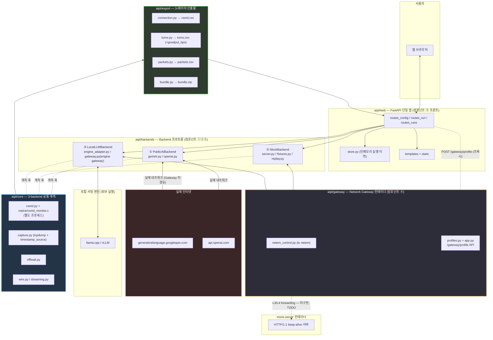
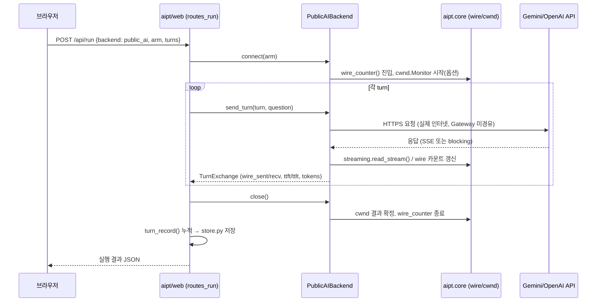
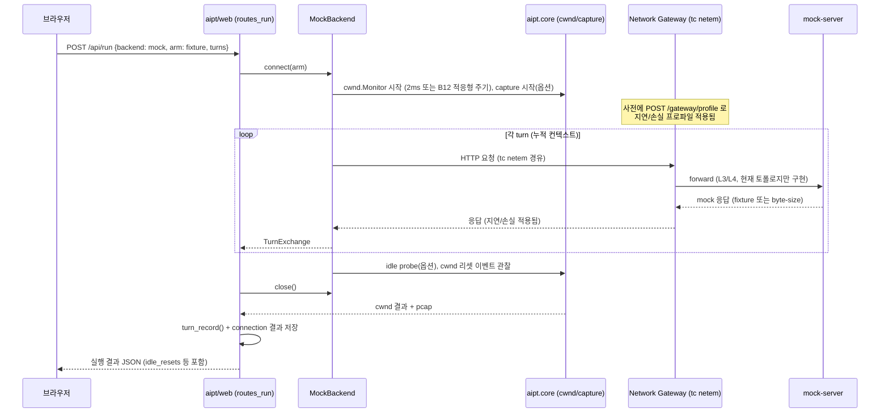
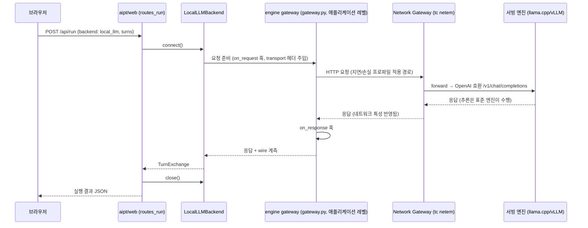

# AIPT — Architecture (Final)

이 문서는 병합/구현이 완료된 시점 기준으로 AIPT(AI Protocol Traffic lab)의
아키텍처를 정리한다. 설계 결정의 근거와 진행 이력은 `DESIGN.md`를 참고하고,
이 문서는 "지금 이 코드가 어떻게 동작하는가"를 보여주는 참조 문서다.

---

## 1. 전체 아키텍처

### 1.1 아키텍처 다이어그램



> **구현 상태 주석**: Gateway의 `mock-server`/`local-llm`으로의 실제 L3/L4
> forwarding은 아직 미구현이다 (`docker-compose.yml`에 TODO로 명시됨).
> 현재 Gateway 컨테이너는 프로파일 제어 API(`/gateway/profile`)와
> 자기 자신의 네트워크 인터페이스에 대한 `tc netem` 적용까지만 동작한다.
> 컨테이너 토폴로지(`web → gateway → mock-server`, `depends_on` 순서,
> `mock-server`는 호스트에 미노출)는 갖춰져 있다.

### 1.2 패키지/폴더 구조

```
AIPT/
├── DESIGN.md                      # 설계 결정 이력 (근거, 대안, 미해결 이슈)
├── ARCHITECTURE.md                # 이 문서 — 최종 아키텍처 레퍼런스
├── MIGRATION.md                   # 파일 단위 이관 체크리스트
├── README.md
├── pyproject.toml                 # base deps=requests, extras: dev/export/web
├── docker-compose.yml             # web + gateway + mock-server 3-service
│
├── aipt/                          # 설치 가능한 패키지 루트
│   ├── core/                      # ★ 3-backend 공통 계측 계층
│   │   ├── cwnd.py                 #   netlink 연속 cwnd 모니터 (+ B12 적응형 주기)
│   │   ├── capture.py              #   tcpdump 캡처 (+ B13 timestamp_source)
│   │   ├── offload.py              #   NIC TSO/GSO 토글
│   │   ├── netem.py                #   tc netem 저수준 wrapper (gateway가 승격 사용)
│   │   ├── wire.py                 #   소켓 바이트 카운터
│   │   ├── streaming.py            #   SSE 리더
│   │   ├── tcpinfo.py              #   1회성 TCP_INFO 스냅샷
│   │   └── config.py               #   env 플래그 판독
│   │
│   ├── backends/                  # ★ Backend 프로토콜 + 3개 구현체
│   │   ├── base.py                 #   Backend 프로토콜(connect/send_turn/close), TurnExchange
│   │   ├── record.py               #   turn_record() 공통 스키마
│   │   ├── public_ai/              #   ① Public AI backend
│   │   │   ├── gemini.py / openai.py   (6+4 arm)
│   │   │   ├── recorder.py             (B2: 실측 캡처→fixture)
│   │   │   └── _call.py / _cachebust.py
│   │   ├── mock/                   #   ② Mock backend
│   │   │   ├── server.py               (keep-alive HTTP mock 서버)
│   │   │   ├── fixtures.py             (B1: Q&A JSON / byte-sweep)
│   │   │   ├── replay.py               (B3: 실측 재생, 바이트만)
│   │   │   ├── conversation.py         (MockBackend, core 연동)
│   │   │   └── probe.py                (idle RTT probe)
│   │   └── local_llm/              #   ③ Local LLM backend
│   │       ├── engine_adapter.py       (표준 엔진 OpenAI 호환 클라이언트)
│   │       └── gateway.py              ("engine gateway" — 애플리케이션 레벨 프록시)
│   │
│   ├── gateway/                   # ★ ④ Network Gateway (별도 컨테이너/프로세스)
│   │   ├── profiles.py             #   clean/broadband/3g/satellite/lossy/custom
│   │   ├── netem_control.py        #   tc qdisc 명령 구성/실행
│   │   └── app.py                  #   독립 FastAPI 미니앱 (/gateway/profile)
│   │
│   ├── export/                    # 3-레이어 통합 산출물
│   │   ├── connection.py / turns.py / packets.py / bundle.py
│   │
│   └── web/                       # ★ ⑤ 프론트 (FastAPI 단일 앱)
│       ├── app.py                  #   create_app() 팩토리
│       ├── routes_config.py        #   GET /, GET /api/config
│       ├── routes_run.py           #   POST /api/run
│       ├── routes_runs.py          #   /api/runs*, CSV/zip 다운로드
│       ├── store.py                #   인메모리 실행 이력
│       └── templates/ + static/
│
├── native/
│   └── cwnd_monitor.c              # 별도 프로세스로 도는 netlink 폴링 루프
│
├── docker/
│   ├── Dockerfile.web              # web 서비스 (cwnd 헬퍼 빌드 + tcpdump + iproute2)
│   ├── Dockerfile.gateway          # gateway 서비스 (iproute2, NET_ADMIN 필요)
│   ├── Dockerfile.mockserver       # mock-server 서비스
│   └── entrypoint_mockserver.py
│
└── tests/                          # core(7) / backends(15) / export(4) / web(1) / gateway(3)
```

---

## 2. 주요 컴포넌트 설계

5개 컴포넌트로 나눠 설명한다: **① PublicAIBackend, ② MockBackend,
③ LocalLLMBackend, ④ Network Gateway, ⑤ 프론트(aipt/web)**.

### ① PublicAIBackend — `aipt/backends/public_ai/`

실제 Gemini/OpenAI API를 대상으로 한다. `Backend` 프로토콜을 구현하는
`PublicAIBackend` 파사드가 arm 이름으로 `gemini.py`/`openai.py` 중 하나를
자동 선택하거나 `engine=` 파라미터로 고정한다.

- **arm 목록**: Gemini 6종(`stateless`/`nocontext`/`cached`/`interaction`/
  `interaction_inline`/`interaction_stateless`), OpenAI 4종
  (`chat_stateless`/`responses_stateless`/`responses`/`responses_inline`).
  각 arm은 "대화 히스토리를 누가/어떻게 들고 있는가"가 다른 실험 조건이다.
- **측정 수단**: `requests` 기반 소켓 카운팅 세션(`aipt.core.wire`) — 공식
  SDK(httpx 기반)는 소켓 레벨 계측 훅을 걸 수 없어 의도적으로 배제.
- **recorder.py (B2)**: 실제 API 호출의 request/response 원문을 캡처해서
  `MockBackend`의 replay fixture 포맷으로 저장. API 키 등은 저장 전
  재귀적으로 마스킹.
- **네트워크 경로**: Gateway를 거치지 않고 실제 인터넷으로 직행 — 이미
  진짜 RTT/손실/혼잡 특성을 갖고 있기 때문 (§4.7 결정).

### ② MockBackend — `aipt/backends/mock/`

로컬에서 재현 가능한 고정 트래픽 패턴을 만든다.

- **fixtures.py (B1)**: 두 가지 입력 방식 — (a) 고정 byte-size 스윕(순수
  페이로드 크기 실험용), (b) Q&A JSON fixture(`{system_prompt, turns:
  [{question, answer}]}`, `token_traffic`의 fixture 개념 확장).
- **server.py**: HTTP/1.1 keep-alive mock 서버. fixture의 답변 텍스트
  또는 지정된 byte 크기로 응답.
- **replay.py (B3)**: `recorder.py`가 캡처한 실측 데이터를 재생하되
  **바이트 패턴만 재현**한다 — 지연시간은 재현하지 않고 `inference_delay_ms`
  설정값으로 별도 제어 (설계 결정: 구현 복잡도보다 명료성 우선).
- **conversation.py**: 누적 컨텍스트 멀티턴 시나리오 + `aipt.core.cwnd`/
  `capture`/`offload` 연동. `MockBackend`가 이를 Backend 프로토콜로 감쌈.

### ③ LocalLLMBackend — `aipt/backends/local_llm/`

표준 서빙 엔진(llama.cpp/vLLM)을 그대로 쓰고, 그 앞단에 자체 "engine
gateway"(애플리케이션 레벨 프록시)를 둔다. **주의**: 이 "engine gateway"는
컴포넌트 ④의 "Network Gateway"와 이름이 비슷하지만 서로 다른 컴포넌트다.

- **engine_adapter.py**: OpenAI 호환 `/v1/chat/completions` API에 요청을
  보내는 얇은 클라이언트. 엔진 자체(서버 프로세스 spawn)는 다루지 않고
  `LOCAL_LLM_ENGINE_URL` 환경변수로 외부에서 실행 중인 엔진을 가리킴 —
  추론 재구현은 하지 않는다는 설계 원칙 (DESIGN.md §4.5 확정 방침).
- **gateway.py (engine gateway)**: engine_adapter 앞단의 훅 포인트
  (`on_request`/`on_response` 콜백). `transport` 슬롯 필드를
  `X-AIPT-Transport` 헤더로 반영 — 향후 HTTP 신기능/QUIC 실험을 위한
  확장 지점이며, 이번 범위에서는 실제 신기능을 구현하지 않는다.
- **네트워크 경로**: Mock과 마찬가지로 Network Gateway를 경유한다
  (토폴로지상 전제, 실제 L3/L4 forwarding은 §1.1 주석대로 미구현).

### ④ Network Gateway — `aipt/gateway/`

Mock/LocalLLM 경로에 실제 네트워크 특성(지연/손실/재정렬)을 주입하는
**별도 컨테이너/프로세스**. PublicAI는 실제 인터넷이 이미 이 역할을 하므로
경유하지 않는다.

- **profiles.py**: 프리셋 5종(`clean`/`broadband`/`3g`/`satellite`/
  `lossy`) + `custom`(임의 delay/jitter/loss/reorder 조합). `from_env()`가
  `GATEWAY_*` 환경변수와 구 `CLIENT_NETEM_DELAY_MS`/`SERVER_NETEM_DELAY_MS`
  alias를 모두 지원.
- **netem_control.py**: `aipt.core.netem`을 확장해 `tc qdisc` 명령을
  구성/실행. **정직한 실패 보고** — CAP_NET_ADMIN이 없으면 예외 대신
  `{"ok": false, "reason": "..."}`를 반환 (offload.py/capture.py와 동일한
  가용성 감지 패턴).
- **app.py**: 독립 FastAPI 미니앱. `GET /health`, `GET/POST
  /gateway/profile`. `aipt/web`과는 별도 프로세스로, HTTP로만 통신한다
  (import하지 않음).

### ⑤ 프론트 — `aipt/web/`

FastAPI 단일 앱. 기존 token_traffic(Flask) + tcp_congestion(FastAPI) 두
개의 웹 서버를 하나로 통합했다.

- **routes_config.py**: 랜딩 페이지 + `/api/config` — `aipt.backends`
  registry에서 사용 가능한 backend 목록/준비 상태(`ready`)를 동적으로
  수집해서 반환 (하드코딩 없음, backend가 추가되면 자동 반영).
- **routes_run.py**: `POST /api/run` — backend 이름으로 인스턴스를 얻어
  `connect → send_turn* → close` 라이프사이클을 스레드풀에서 실행
  (`run_in_threadpool`, 이벤트 루프 블로킹 방지). 미구현 backend는 501로
  응답(예외를 그대로 전파하지 않음).
- **routes_runs.py**: 실행 이력 조회/삭제, `aipt.export`의 4개 CSV +
  bundle.zip 다운로드 라우트.
- **store.py**: 인메모리 `OrderedDict` 기반 최근 실행 이력 저장
  (`MAX_RUNS=50`). 파일 영속화는 TODO로 남겨져 있다 (§8 참고).

---

## 3. 데이터 흐름

### 3.1 저장되는 데이터와 관리 방식

| 데이터 | 저장 위치 | 관리 방식 |
|---|---|---|
| 실행 결과(run document) | `aipt/web/store.py`의 인메모리 dict | 최근 50개(MAX_RUNS) 유지, 프로세스 재시작 시 소실(파일 영속화 TODO) |
| cwnd 연속 샘플 | `Monitor.result()` → 메모리 → `export.connection.connection_csv()` | 요청 시 CSV로 직렬화, 별도 DB 없음 |
| turn 단위 레코드 | `Backend.send_turn()` → `TurnExchange` → `turn_record()` | 요청 시 `export.turns.turns_csv()`로 직렬화 |
| pcap 캡처 | `aipt.core.capture` → `data/pcaps/` 디스크 | run당 1개 파일, `export.packets`가 파싱해 CSV 생성 |
| packets.csv | pcap을 매 요청마다 파싱 (사전 계산 없음) | dpkt 있으면 사용, 없으면 순수 stdlib 파서 폴백 |
| Gateway 프로파일 상태 | `aipt/gateway`가 커널 qdisc 상태에 위임 | Gateway 프로세스가 진실의 소스, 별도 저장 안 함(`GET /gateway/profile`이 매번 커널에 조회) |
| 실측 fixture(재생용) | `recorder.py` → JSON 파일 | `MockBackend.replay`가 로드해서 재생 |

핵심 설계 원칙(§4.6 계승): **connection/turn/packet 3-레이어를 분리** —
서로 다른 단위(tick vs turn vs packet)를 하나의 테이블에 섞지 않는다.

### 3.2 Backend별 통신 Sequence Diagram

#### (a) PublicAIBackend — 실제 인터넷 경유



#### (b) MockBackend — Network Gateway 경유



#### (c) LocalLLMBackend — engine gateway + Network Gateway 이중 경유



---

## 4. API 설계

### 4.1 외부 API (Public AI backend가 호출하는 대상)

세 가지 상태 관리 방식이 arm으로 구분된다 — 이 구분 자체가 이 프로젝트의
핵심 측정 축이다.

| 구분 | 예시 arm | 상태 위치 | 매 턴 업로드되는 것 |
|---|---|---|---|
| **Stateless** | `gemini:stateless`, `openai:chat_stateless`/`responses_stateless` | 클라이언트가 전체 히스토리 보유 | system + 전체 이전 turn + 새 질문 (O(N²) 업로드) |
| **Stateful (server-side pointer)** | `gemini:interaction`/`interaction_inline`, `openai:responses`/`responses_inline` | 서버가 히스토리 보유, 클라이언트는 pointer(`previous_interaction_id`/`previous_response_id`)만 유지 | 새 질문만 (단, `instructions`/`system_instruction`은 재전송 필요한 경우 있음 — arm별 상이) |
| **Explicit cache** | `gemini:cached` | 서버의 명시적 캐시 리소스(`cachedContents`)에 프리픽스 고정 | 새 질문 + 캐시 포인터 |

### 4.2 내부 API — Network Gateway 제어

Gateway 컨테이너가 노출하는 API. `aipt/web`이 이 API를 호출해 실험 조건을
바꾼다 (import가 아니라 HTTP 호출 — 프로세스/컨테이너 경계 유지).

| 엔드포인트 | 메서드 | 역할 |
|---|---|---|
| `/health` | GET | liveness + `tc netem` 사용 가능 여부(`netem_control.available()`) |
| `/gateway/profile` | GET | 현재 인터페이스에 적용된 프로파일 조회 (커널 qdisc 상태 직접 조회) |
| `/gateway/profile` | POST | 프로파일 교체. Body: `{"profile": "3g"}` 또는 `{"profile": "custom", "delay_ms", "jitter_ms", "loss_pct", "reorder_pct"}` |

**TCP 혼잡제어 알고리즘 변경**: Gateway API 자체가 아니라 `MockBackend`가
소켓 `connect()` 이전에 `TCP_CONGESTION` 소켓옵션으로 적용한다
(`aipt/backends/mock/conversation.py`, tcp_congestion 원본 기능 승계 —
cubic/reno/bbr/vegas 4종). 요청한 알고리즘(`algorithm_requested`)과 실제
적용값(`algorithm`, `getsockopt`로 재확인)이 다르면 응답에 경고가 포함된다
— 로드되지 않은 알고리즘 요청 시 조용히 폴백되는 것을 방지하기 위함.

### 4.3 내부 API — 실행/결과 조회 (`aipt/web`)

| 엔드포인트 | 역할 |
|---|---|
| `GET /api/config` | backend 목록/준비 상태, congestion algorithm 목록, cwnd/capture 가용성 |
| `POST /api/run` | 실험 실행 (backend 이름 + arm + turns) |
| `GET /api/runs`, `GET/DELETE /api/runs/{id}` | 실행 이력 |
| `GET /api/runs/{id}/{turns,summary,cwnd,cwnd_summary,packets}.csv` | 3-레이어 CSV |
| `GET /api/runs/{id}/bundle.zip` | 전체 산출물 zip |
| `GET /api/pcaps/{name}` | pcap 원본 다운로드 |

---

## 5. 성능 설계

### 5.1 비동기 처리와 네이티브 스레드/프로세스 분리

`aipt/web`의 라우트는 FastAPI 비동기 이벤트 루프 위에서 동작하지만,
backend의 `connect`/`send_turn`/`close`는 (원래 동기 API인) `requests`
기반이므로 `run_in_threadpool()`로 감싸 이벤트 루프를 블로킹하지 않는다.

그러나 **TCP/네트워크 타이밍 측정 자체는 이 비동기 처리와 별개의 층**이다
(DESIGN.md §4.9 원칙):

- `aipt/core/cwnd.py`의 `Monitor`는 Python 스레드가 아니라 **완전히 별도의
  OS 프로세스**(`native/cwnd_monitor.c`, `subprocess.Popen`으로 기동)를
  띄우고, 그 프로세스가 자신의 클록으로 netlink `sock_diag`를 폴링한다.
  Python 쪽은 리더 스레드(`threading.Thread`, daemon)로 그 프로세스의
  stdout(NDJSON)을 소비만 할 뿐, 샘플링 자체에는 관여하지 않는다.
  이렇게 분리하는 이유는 GIL 스케줄링/이벤트 루프 지연이 샘플링 주기
  자체를 왜곡시키면 "idle 후 cwnd가 IW로 리셋되는 정확한 시점"을 놓치기
  때문 — Python 프로세스가 바쁘면 샘플링도 밀리는 구조로는 이 실험이
  성립하지 않는다.
- 샘플링 주기는 **적응형(B12)**이다: 고정 2ms가 아니라 경로 RTT에 비례해
  `interval_ms = max(1, rtt_ms / K)`로 계산한다. 짧은 RTT 경로(예: Mock
  backend, Gateway `clean` 프로파일)에서 고정 주기를 쓰면 슬로우스타트
  burst 자체를 샘플러가 건너뛸 수 있기 때문이다. 물리적 하한(1ms) 아래로
  계산되면 `floor_clamped`로 명시하고 `measurement_confidence:
  "degraded"`를 결과에 남긴다 — 없는 정밀도를 있는 것처럼 보고하지 않는다.

### 5.2 pcap 캡처 운영

`aipt/core/capture.py`가 `tcpdump`를 별도 프로세스로 기동해 캡처 구간
동안 패킷을 디스크에 기록한다 (AF_PACKET 커널 캡처 — userspace보다 정확).

- **NIC offload(TSO/GSO) 인지**: 오프로드가 켜져 있으면 pcap에 실제
  MTU 프레임이 아니라 커널이 만든 최대 64KB "super-packet"이 찍힌다.
  `aipt.core.offload`로 캡처 구간 동안 오프로드를 끌 수 있는 옵션을
  제공하되 기본은 off(끄면 CPU 비용 증가, 타이밍 자체가 바뀜) — 상태를
  항상 결과에 기록해 어떤 상태로 캡처됐는지 사후에 구분 가능하게 한다.
- **타임스탬프 정밀도(B13)**: `timestamp_source(iface)`가 `ethtool -T`로
  하드웨어/소프트웨어 타임스탬프 지원 여부를 판별해 결과에 포함한다.
  `aipt.export.packets.gap_confidence_summary()`가 이 정보와 실제
  inter-arrival gap 중앙값을 조합해, "소프트웨어 타임스탬프 + 짧은 gap"
  조합일 때 `timestamp_precision_reason`으로 경고를 남긴다.
- **AppArmor 회피**: `~/.` 하위 디렉터리에서는 Ubuntu의 tcpdump AppArmor
  프로파일이 쓰기를 막는다(`audit deny @{HOME}/.* `) — `capture.py`가
  이를 감지해 `/tmp` 등으로 자동 폴백한다. 이 문제로 실제 시간을 허비한
  이력이 있어 회귀 방지용으로 반드시 보존된 로직이다.

### 5.3 Goodput 계산

`aipt/export/turns.py`가 각 turn의 `wire_recv`(또는 `resp_payload_bytes`
폴백)와 `(turn_end_ms − req_sent_ms)` 구간으로 `goodput_bps`를 산출한다.
0-나눗셈 가드 포함. byte 카운트만으로는 "실제로 유효하게 전달된 처리량"을
알 수 없다는 문제의식에서 신규 추가된 지표(B7).

---

## 6. 테스트 설계

### 6.1 단위 테스트 — 핵심 모듈

| 영역 | 파일 수 | 대표 검증 포인트 |
|---|---|---|
| `tests/core/` | 7 | cwnd reset 판정(idle 후 리셋 vs loss recovery 구분), AppArmor 감지, 적응형 주기(interval_from_rtt), timestamp_source 판별 |
| `tests/backends/` | 15 | 3개 backend 각각의 Backend 프로토콜 준수, arm별 body 빌드, fixture/replay 왕복, engine gateway 훅 |
| `tests/export/` | 4 | 3-레이어 CSV 스키마 불변성, goodput_bps 계산, pcap 라운드트립(합성 pcap으로 dpkt/stdlib 파서 교차검증) |
| `tests/web/` | 1 | FastAPI TestClient로 실제 mock backend 실행까지 포함한 라우트 스모크 |
| `tests/gateway/` | 3 | 프로파일 값 정의, tc 명령 구성(subprocess mock), 프로파일 API 라우트 |

**현재 스위트 규모**: 410 passed, 1 skipped(플랫폼 가드), 12 deselected
(`@pytest.mark.live` — 실제 소켓/커널 netlink 필요, CI 기본 실행에서 제외).

핵심 설계: 실제 커널 자원(netlink, tc, tcpdump)이 필요한 테스트는 전부
`live` 마커로 분리해서 샌드박스/CI에서도 스위트 전체가 깨지지 않게 하고,
정직한 가용성 감지(`available()`/`reason` 패턴)로 "이 환경에서 왜 안
되는지"를 결과에 남긴다.

### 6.2 성능 테스트 — 최종 검증 지표

병합 자체의 목적이 "idle-reset이 실제로 관측되는지"와 "히스토리 관리
전략별 트래픽 차이"를 측정하는 것이므로, 성능 테스트는 기능 테스트와
별도로 **실측 지표의 개선/변화를 확인**하는 층으로 둔다.

| 지표 | 측정 방법 | 무엇을 검증하는가 |
|---|---|---|
| **RTT** | Gateway 프로파일 전환 전/후 `aipt.core.probe`(idle-gap HTTP PING) 또는 pcap의 SYN-ACK 왕복 시간 | Gateway의 `tc netem delay` 설정이 실제로 경로 RTT에 반영되는지 (`3g` 프로파일 적용 시 RTT가 설정값 근방으로 올라가는지) |
| **대역폭(처리량)** | `aipt/export/turns.py`의 `goodput_bps` | congestion algorithm(cubic/reno/bbr/vegas) 및 idle-reset 발생 여부에 따라 실질 처리량이 어떻게 달라지는지 |
| **cwnd 회복/리셋** | `cwnd.csv`의 `reset_events`, `idle_resets` 카운트 | idle 구간 후 실제로 슬로우스타트 재진입이 발생하는지, 알고리즘별로 회복 곡선이 어떻게 다른지 |
| **완료 시간(turn_end_ms)** | `turns.csv`의 `req_sent_ms`~`turn_end_ms` 마크 5종 | 히스토리 관리 전략(stateless/stateful/cached)별로 턴당 소요 시간이 실제로 얼마나 차이나는지 — 특히 `store_tail_ms`(서버가 응답 완료 후 상태 저장에 쓰는 시간)가 stateful arm에서 눈에 띄게 존재하는지 |
| **네트워크 손실 영향** | Gateway `lossy` 프로파일 적용 후 재시도/재전송으로 인한 `turn_end_ms` 증가폭 | TCP 재전송이 애플리케이션 레벨 지연에 미치는 실제 영향 |

**검증 절차 원칙**: 위 지표들은 반드시 **같은 시나리오(fixture)를 여러
조건(알고리즘, Gateway 프로파일, backend)으로 반복 실행**해서 비교해야
의미가 있다 — 단발성 실행값 하나를 "개선됐다"고 주장하지 않는다
(token_traffic 원본의 측정 철학 계승: "답변 품질은 채점하지 않는다,
바이트/토큰/지연만 잰다").

---

## 7. 아직 열려 있는 것

- Gateway의 `mock-server`/`local-llm`으로의 실제 L3/L4 forwarding (§1.1)
- QUIC/HTTP 신기능 실험 (engine gateway의 transport 슬롯만 마련된 상태)
- 실행 결과의 디스크 영속화 (`aipt/web/store.py`는 현재 인메모리만)
- local-llm 서빙 엔진의 docker-compose 서비스화 (현재는 외부 실행 엔진에
  `LOCAL_LLM_ENGINE_URL`로 연결하는 방식만 지원)

원본 `token_traffic/`, `tcp_congestion/` 디렉터리는 아직 보존되어 있다 —
정리 방침은 별도 확인 후 진행한다.
