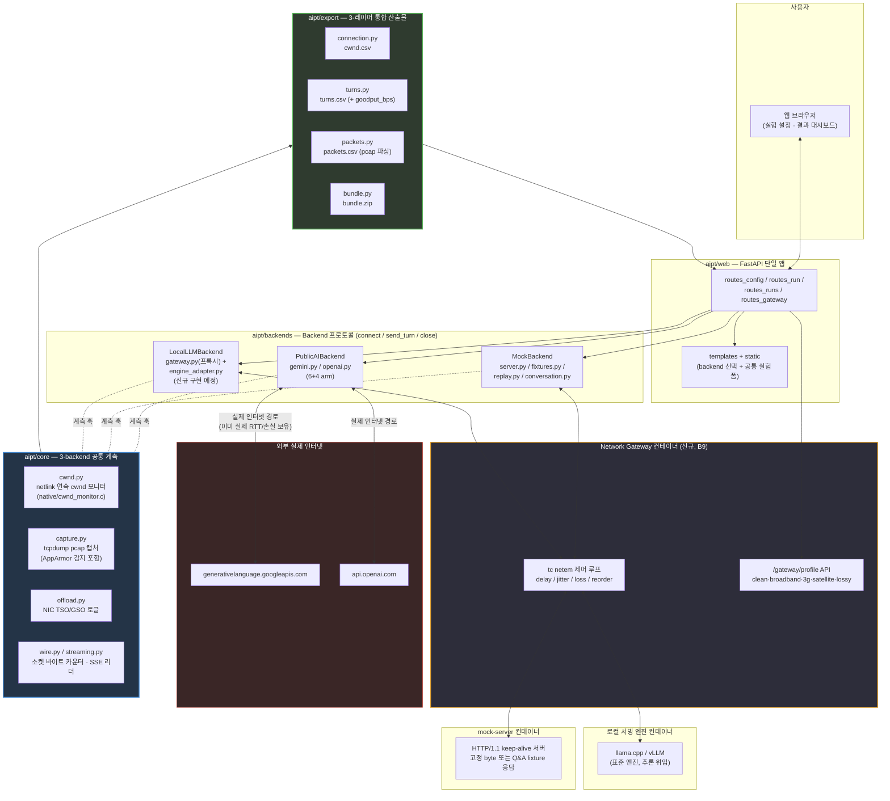
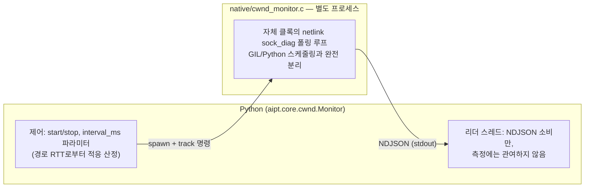

# AIPT — Design Document

**AIPT** (AI Protocol Traffic lab) merges two previously separate projects that
measure the same underlying phenomenon — TCP behaviour under LLM multi-turn
traffic patterns — from two different angles:

| 원 프로젝트 | 관측 대상 | 트래픽 소스 |
|---|---|---|
| `token_traffic` | 요청/응답 **byte·token·latency** (arm 간 비교) | 실제 Gemini/OpenAI API — 과금 발생 |
| `tcp_congestion` | idle 구간 후 **TCP cwnd 리셋** (slow-start-after-idle) | 로컬 mock 서버 — 무료, 재현 가능 |

`tcp_congestion`은 실제로 `token_traffic/core/{cwnd,capture,offload}.py`와
`native/cwnd_monitor.c`를 이식(포크)해서 만들어졌다 — 소스 코드 주석에
"Adapted from token_traffic/core/cwnd.py" 라고 명시되어 있다. 즉 이미 하나의
계보였던 코드가 두 개의 독립 디렉터리로 갈라져 있었고, 이번 작업은 그것을
원래대로 하나의 코어로 되돌리는 일에 가깝다.

## 1. 현황 분석 요약

### 1.1 코드 규모

| | token_traffic | tcp_congestion |
|---|---|---|
| 웹 프레임워크 | Flask (`core/app.py`, 365줄) | FastAPI (`tcp_congestion/app.py`, 209줄) |
| 코어 모듈 | 16개, ~3,600줄 | 9개, ~1,340줄 |
| 프로바이더 어댑터 | gemini.py(715) + openai.py(634) | 없음 (mock 서버 자체 구현) |
| 테스트 | 19개 파일 | 13개 파일 |
| 컨테이너 구성 | 단일 Dockerfile (앱만) | Dockerfile.client + Dockerfile.server (실제 소켓 페어) |
| native C | `native/cwnd_monitor.c` | 동일 파일 (완전 동일, diff 없음) |

### 1.2 모듈별 관계 (diff 기반 확인)

| 모듈 | 관계 | 병합 방침 |
|---|---|---|
| `native/cwnd_monitor.c` | **완전 동일** | 그대로 1개만 유지 |
| `cwnd.py` | tcp_congestion판이 token_traffic판의 단순화 파생 (`core.config`/`core.wire` 의존 제거, `announce(sock)` API로 정리) | **tcp_congestion의 단순화된 인터페이스**를 채택하되, token_traffic의 상세 docstring(설계 근거)과 `dumps`/`exact_queries` 계측 필드를 병합 |
| `capture.py` | tcp_congestion판은 token_traffic판에서 AppArmor 회피 로직 등을 제거하고 "run 1개당 pcap 1개"로 단순화 | token_traffic의 **AppArmor 감지 로직은 반드시 보존** (실제로 시간 낭비했던 이슈, 주석에 경고 있음). label 파라미터를 일반화해서 두 lab 모두 지원 |
| `offload.py` | 사실상 같은 기능, env var 네이밍만 다름 (`TRAFFIC_PCAP_NO_OFFLOAD` vs `NIC_OFFLOAD_DISABLE`) | 통합 후 **두 이름 모두 지원**(alias) — 기존 docker-compose.yml/문서 호환 |
| `export.py` | 서로 다른 레코드 스키마(제공자별 arm vs 턴별 요약)라 병합이 아니라 **공존** | `export/` 서브패키지로 분리, `records_csv()`(external_api용), `turns_csv()`(synthetic_mock용) 공존 |
| `probe.py`, `netem.py`, `congestion.py`, `tcpinfo.py`, `server.py`, `conversation.py` | tcp_congestion 전용, token_traffic에 대응물 없음 | synthetic_mock lab 전용으로 그대로 이관 |
| `wire.py`, `streaming.py`, `call.py`, `record.py`, `metrics.py`, `store.py`, `scenario.py`, `cachebust.py`, `providers/*` | token_traffic 전용, tcp_congestion에 대응물 없음 | external_api lab 전용으로 그대로 이관 |

## 2. 목표 폴더 구조

```
AIPT/
├── DESIGN.md                     # 이 문서
├── MIGRATION.md                  # 파일 단위 이관 체크리스트 (실행 단계에서 갱신)
├── README.md                     # 프로젝트 개요, 빠른 시작
├── pyproject.toml                # 단일 의존성 정의 (fastapi, uvicorn, requests, google-genai, openai 등)
├── Makefile                      # native C 빌드, 테스트 실행
│
├── aipt/                         # 설치 가능한 패키지 루트
│   ├── __init__.py
│   ├── core/                     # 두 lab이 공유하는 측정 인프라
│   │   ├── config.py             # env 플래그 판독 (양쪽 통합)
│   │   ├── cwnd.py               # 연속 netlink cwnd 모니터 (통합판)
│   │   ├── capture.py            # tcpdump 캡처 (AppArmor 감지 포함, label 일반화)
│   │   ├── offload.py            # NIC offload 토글 (env alias 지원)
│   │   ├── tcpinfo.py            # 1회성 TCP_INFO 스냅샷 (경량 대안)
│   │   ├── wire.py               # 소켓 바이트 카운터 (external_api 전용, 재사용 가능하게 core에 위치)
│   │   ├── streaming.py          # SSE 리더 (external_api 전용)
│   │   ├── record.py             # 레코드 스키마 (external_api 전용)
│   │   └── export_base.py        # CSV export 공통 유틸 (컬럼 정의, writer 헬퍼)
│   │
│   ├── providers/                # external_api 전용 — 그대로 이관
│   │   ├── base.py
│   │   ├── gemini.py
│   │   └── openai.py
│   │
│   ├── labs/
│   │   ├── external_api/         # 구 token_traffic 도메인 로직
│   │   │   ├── call.py           # 1~2-pass HTTP 호출
│   │   │   ├── cachebust.py
│   │   │   ├── metrics.py
│   │   │   ├── runner.py         # 여러 (provider, arm) 조합 실행
│   │   │   ├── scenario.py       # fixtures/perf.json 재생
│   │   │   ├── store.py          # 런 저장 + 보존 정책
│   │   │   └── export.py         # records.csv / summary.csv
│   │   │
│   │   └── synthetic_mock/       # 구 tcp_congestion 도메인 로직
│   │       ├── server.py         # HTTP keep-alive mock 서버
│   │       ├── probe.py          # idle 구간 RTT HTTP PING
│   │       ├── conversation.py   # 누적 컨텍스트 멀티턴 시나리오
│   │       ├── congestion.py     # 알고리즘(cubic/reno/bbr/vegas) + qdisc 점검
│   │       ├── netem.py          # tc netem 지연 주입
│   │       └── export.py         # cwnd.csv / turns.csv
│   │
│   └── web/                      # 단일 FastAPI 앱
│       ├── app.py                # create_app(): 루트에 랜딩 페이지, /external-api, /synthetic-mock 마운트
│       ├── routes_external_api.py    # 구 core/app.py(Flask) 라우트 → FastAPI로 포팅
│       ├── routes_synthetic_mock.py  # 구 tcp_congestion/app.py 라우트 이관
│       ├── templates/
│       │   ├── index.html            # 랜딩: 두 lab 선택
│       │   ├── external_api/index.html
│       │   └── synthetic_mock/index.html
│       └── static/
│           ├── app.js               # 구 token_traffic 정적 자산
│           └── style.css
│
├── native/
│   └── cwnd_monitor.c             # 유일한 사본 (양쪽 동일 확인됨)
│
├── fixtures/
│   └── perf.json                  # external_api 시나리오 fixture
│
├── docker/
│   ├── Dockerfile.web             # 웹앱 (native C 빌드 스테이지 포함)
│   ├── Dockerfile.mockserver      # synthetic_mock의 상대편 서버 컨테이너
│   └── docker-compose.yml         # web + mockserver (+ netem용 NET_ADMIN/NET_RAW)
│
├── tests/
│   ├── core/                      # cwnd, capture, offload, wire, streaming 등
│   ├── providers/                 # gemini, openai
│   ├── labs/external_api/
│   ├── labs/synthetic_mock/
│   └── web/
│
└── docs/
    ├── core-contracts.md          # token_traffic/docs/core-contracts.md 갱신판
    └── outputs.md                 # 두 lab의 산출물 포맷 통합 문서
```

## 3. 웹 UI 통합 방침 (FastAPI 단일화)

- `token_traffic/core/app.py`는 **Flask**, `tcp_congestion/app.py`는 **FastAPI**.
  하나로 합치기로 결정했으므로 Flask 라우트 전체를 FastAPI로 포팅한다.
- 라우트 이관 시 매핑 원칙:
  - Flask `@app.route("/api/run", methods=["POST"])` → FastAPI `@router.post("/api/run")`
  - Flask의 `request.get_json()` → FastAPI Pydantic 모델 또는 `await request.json()`
  - Flask의 동기 blocking 실행(외부 API 호출은 원래도 동기)은 FastAPI에서 `run_in_threadpool`로 감싸 이벤트 루프 블로킹 방지 (synthetic_mock의 `conversation.run()`도 동일하게 스레드풀 위임)
- URL 네임스페이스: `/external-api/*` (구 token_traffic), `/synthetic-mock/*` (구 tcp_congestion). 루트 `/`는 두 실험을 선택하는 랜딩 페이지.
- 정적/템플릿 파일은 하위 폴더로 분리해서 두 UI가 서로의 CSS/JS를 침범하지 않게 한다.
- 다운로드 엔드포인트(`/api/download/*`, `/api/runs/<id>/*`)는 각 lab 아래로 이관하되 경로 프리픽스만 붙인다 — 응답 스키마는 변경하지 않는다 (외부에서 참조 중일 수 있음).

## 4. Docker/인프라 통합 방침

- `token_traffic`은 단일 컨테이너(앱만, 외부 API 호출), `tcp_congestion`은 client+server 페어 컨테이너.
- 병합 후: `docker-compose.yml`에 **web**(FastAPI 앱, external-api 기능 포함) + **mockserver**(synthetic_mock의 keep-alive 서버) 2개 서비스로 구성.
- `native/cwnd_monitor.c`는 web 컨테이너 빌드 시 1회만 컴파일 (멀티스테이지 빌드로 분리 — tcp_congestion의 `b7cf75cb fix(docker)` 커밋 교훈 반영).
- 포트: mockserver 기본 8888 유지, 웹UI 기본 10000 유지 (tcp_congestion 관례), external-api 기능은 같은 웹앱 프로세스 내 라우트이므로 별도 포트 불필요.
- `CLIENT_NETEM_DELAY_MS` / `SERVER_NETEM_DELAY_MS` env는 그대로 유지.
- NIC offload env는 `NIC_OFFLOAD_DISABLE`(기존 tcp_congestion 이름)을 정식으로 채택하고 `TRAFFIC_PCAP_NO_OFFLOAD`를 deprecated alias로 지원.

## 4.5 아키텍처 개정 v2 — 3-Backend 공통 클라이언트 구조

**배경**: §1~4의 최초 설계는 "external_api lab / synthetic_mock lab, 두 실험을
나란히 두고 core만 공유"하는 구조였다. 사용자 피드백에 따라 이를
**"클라이언트가 3개 backend 중 하나를 선택해서 동일한 인터페이스로 호출"**하는
구조로 개정한다. 기존 §2 폴더 구조의 `aipt/labs/{external_api,synthetic_mock}`
분리는 **기능(무엇을 측정하나) 기준**이었는데, 이제는 **backend(무엇을
상대하나) 기준**으로 재편한다.

```
Client 측 (측정 로직: cwnd/capture/stats export — 3개 backend에 공통 적용)
  └── Backend 프로토콜 (신규 추상화)
        ├── PublicAIBackend   — Gemini / ChatGPT      (기존 token_traffic providers/* 재사용)
        ├── MockBackend       — 고정 JSON I/O 재생      (기존 tcp_congestion server.py 확장)
        └── LocalLLMBackend   — 표준 서빙엔진 + 자체 프록시 (신규 구현)
```

### 확정된 설계 결정

| 결정 사항 | 확정 내용 |
|---|---|
| 로컬 LLM 스택 | **llama.cpp/vLLM 같은 표준 서빙 프레임워크를 그대로 사용**하고, 그 앞단에 자체 프록시/게이트웨이를 둔다. 프록시가 HTTP 신기능/향후 QUIC 확장 지점을 담당하고, 토큰 생성 자체는 표준 엔진에 위임 — 추론 엔진을 직접 재구현하지 않는다 |
| QUIC/신규 HTTP 실험 범위 | **이번 AIPT 병합에는 포함하지 않는다.** `Backend`/프록시 인터페이스에 transport 확장 지점(예: `transport: "http1"｜"http3"` 같은 슬롯)만 마련해두고, 실제 QUIC 구현은 별도 후속 프로젝트로 분리 |
| Mock 재생 충실도 | **바이트 패턴만 재현**한다. 지연시간(추론 대기)은 실측값을 그대로 재생하지 않고, 기존 tcp_congestion처럼 설정값(`inference_delay`)으로 별도 제어 — 재생 로직의 복잡도를 낮춘다 |

### 폴더 구조 변경 (§2 대비 diff)

```diff
 aipt/
   core/                        # 변경 없음: cwnd, capture, offload, tcpinfo
+  backends/                    # 신규 — 구 aipt/labs/*, aipt/providers/* 를 흡수
+    base.py                    # Backend 프로토콜: connect/send_turn/close, transport 확장 슬롯 포함
+    public_ai/
+      gemini.py                # 구 aipt/providers/gemini.py
+      openai.py                # 구 aipt/providers/openai.py
+      recorder.py              # 신규 — 실측 요청/응답 캡처 (B2)
+    mock/
+      server.py                # 구 tcp_congestion server.py, 고정 byte → fixture 재생으로 확장 (B1)
+      fixtures.py              # 신규 — fixture 포맷 로더 (dummy bytes ↔ 실측 재생 데이터 공통 스키마)
+      replay.py                # 신규 — 실측 캡처 데이터를 fixture로 변환해 재생 (B3, 바이트 패턴만)
+    local_llm/
+      gateway.py                # 신규 — 표준 서빙엔진 앞단 프록시 (B4)
+      engine_adapter.py         # 신규 — llama.cpp/vLLM 등 백엔드 엔진 선택 어댑터
-  labs/
-    external_api/...            # → backends/public_ai/ 로 흡수
-    synthetic_mock/...          # → backends/mock/ 로 흡수
-  providers/...                 # → backends/public_ai/ 로 흡수
   export/                       # 신규 통합 — 구 aipt/labs/*/export.py 통합 (§4.6 참고)
     turns.py                    # 턴 단위 CSV (bytes/tokens/latency/goodput)
     packets.py                  # 신규 — pcap → 패킷 간격 CSV (B6)
     connection.py               # cwnd.csv (기존 그대로)
   web/                          # 변경 없음: FastAPI 단일 앱, 다만 라우트는 backend 선택 파라미터로 통합
```

`aipt/labs/`, `aipt/providers/`는 폐기하고 `aipt/backends/`로 통합한다.
MIGRATION.md의 Phase 2/3 대상 파일들은 목적지 경로만 `backends/public_ai/`,
`backends/mock/`으로 바뀌고 이관 대상 자체는 동일하다.

## 4.6 통계/CSV 3-레이어 통합 (3개 backend 공통)

이전 설계는 lab별로 export.py를 유지했으나, 3-backend 공통 구조에서는
**어떤 backend를 상대하든 동일한 3-레이어 CSV 세트**를 내야 한다.

| 레이어 | 파일 | 내용 | 출처 | 상태 |
|---|---|---|---|---|
| 1. Connection-level | `cwnd.csv` | tick별 snd_cwnd/rtt/delivery_rate | 기존 `cwnd.py` (양쪽 동일) | 이관만 하면 됨 |
| 2. Turn-level | `turns.csv` | prompt_bytes, wire_sent/recv, tokens, ttft/ttlt/turn_end, **goodput(신규)** | token_traffic records.csv + tcp_congestion turns.csv 병합 | **신규 병합 필요** |
| 3. Packet-level | `packets.csv` | 패킷 간격(inter-arrival gap), 패킷 크기 분포 — pcap에서 추출 | 없음 (지금은 pcap 저장만 함) | **완전 신규** |

세 CSV + pcap을 기존 `bundle.zip` 방식으로 묶어서 다운로드하는 구조는 유지.

## 5. 신규/머지 작업 리스트업 (최종)

### A. 머지 작업 (기존 코드 재사용/재구성)

| # | 작업 | 원본 | 목적지 |
|---|---|---|---|
| A1 | `Backend` 프로토콜 정의 | `token_traffic/providers/base.py` 일반화 | `aipt/backends/base.py` |
| A2 | Gemini/OpenAI 어댑터 이관 | `token_traffic/providers/{gemini,openai}.py` | `aipt/backends/public_ai/{gemini,openai}.py` |
| A3 | Mock 서버 이관 (확장은 B1) | `tcp_congestion/tcp_congestion/server.py` | `aipt/backends/mock/server.py` |
| A4 | cwnd 연속 모니터링 통합 | `cwnd.py` (양쪽) | `aipt/core/cwnd.py` |
| A5 | tcpdump 캡처 통합 | `capture.py` (양쪽, AppArmor 감지 보존) | `aipt/core/capture.py` |
| A6 | 턴별 트래픽 통계 정의 일반화 | `token_traffic/core/{wire,record,metrics}.py` | `aipt/core/` + `aipt/export/turns.py` |
| A7 | offload/netem 이관 | `offload.py`, `netem.py` | `aipt/core/` |

### B. 신규 구현 작업

| # | 작업 | 내용 | 비고 |
|---|---|---|---|
| B1 | Mock fixture 포맷 설계 + 구현 | 고정 byte dummy → Q&A 쌍 JSON 시나리오 재생 (`token_traffic/fixtures/perf.json` 개념 확장) | `aipt/backends/mock/fixtures.py` |
| B2 | 실측 데이터 recorder | Public AI backend 호출 시 request/response 원문을 B1 포맷으로 저장 | `aipt/backends/public_ai/recorder.py`. API 키 등 민감정보 마스킹 필요 |
| B3 | Mock replay (바이트 패턴만) | B2로 캡처한 실측 데이터를 Mock backend가 재생. **지연은 재현 안 함**, 설정값(`inference_delay`)으로 별도 제어 | `aipt/backends/mock/replay.py` |
| B4 | LocalLLMBackend (표준 엔진 + 자체 프록시) | llama.cpp/vLLM을 서빙 엔진으로 세우고, 앞단에 자체 게이트웨이를 둬서 HTTP 신기능 실험 지점 마련 | `aipt/backends/local_llm/{gateway,engine_adapter}.py`. 엔진 선택은 `huggingface-hub`/`llama-cpp`/`serving-llms-vllm` 스킬 활용 |
| B5 | Transport 확장 슬롯 (QUIC 자리만) | `Backend`/게이트웨이에 `transport` 파라미터 슬롯만 마련, 구현은 후속 프로젝트로 이관 | 이번 범위: 인터페이스 설계만 |
| B6 | 패킷 간격 통계 (`packets.csv`) | pcap 파싱(`dpkt`/`scapy`)으로 inter-arrival gap, 패킷 크기 분포 계산 | `aipt/export/packets.py` — 신규 의존성 추가 필요 |
| B7 | Goodput 계산 | 기존 wire_sent/recv + 마크(req_sent_ms~turn_end_ms)로 턴별 goodput 산출 | `aipt/export/turns.py`에 컬럼 추가 |
| B8 | 통합 CSV 스키마 확정 | §4.6의 3-레이어를 실제 컬럼 단위로 확정 | Phase 진행 중 `docs/outputs.md`에 기술 |

### C. 폐기/대체

- tcp_congestion의 고정 byte dummy 생성 로직 → B1 완료 시 대체 (다만 "순수 바이트 크기만 스윕"하고 싶은 실험을 위해 옵션으로는 유지)
- `aipt/labs/`, `aipt/providers/` 네임스페이스 → `aipt/backends/`로 전량 이전, 폐기

## 4.7 Network Gateway 컨테이너 — mock/local_llm 경로의 지연/손실 모사

**배경**: `PublicAIBackend`는 이미 실제 인터넷을 거치므로 진짜 RTT/지연/손실을
겪는다. 반면 `MockBackend`와 `LocalLLMBackend`는 지금까지 컨테이너 간 직결
(loopback 수준)이라 "완벽한 네트워크"에서만 측정되어 왔다 — idle-reset이나
cwnd 실험의 사실성이 떨어지는 지점이다. tcp_congestion에 있던
`CLIENT_NETEM_DELAY_MS`/`SERVER_NETEM_DELAY_MS`도 컨테이너 자체의 인터페이스에
건 ad-hoc 설정이었을 뿐, 독립된 아키텍처 구성요소는 아니었다.

**결정**: 클라이언트(측정 코드)가 **mock 또는 local_llm backend를 상대할 때는
반드시 Gateway 컨테이너를 경유**하도록 만든다. Gateway는 두 종단(client ↔
mock-server / client ↔ local-llm) 사이에 위치하는 별도 컨테이너로, 내부에
지연·손실·지터·재정렬 설정을 갖고 트래픽에 주입한다. `PublicAIBackend`는
이미 실제 인터넷이 이 역할을 하므로 Gateway를 경유하지 않는다.

```
Client (측정 코드: cwnd/capture/export — 공통)
  ├── PublicAIBackend ────────────────────────────► 실제 인터넷 (Gemini/OpenAI)
  │                                                    (이미 실제 네트워크 특성 보유)
  │
  └── ┌─────────────────────────────┐
      │  Network Gateway 컨테이너      │   tc netem 기반: delay/jitter/loss/reorder/duplicate
      │  (aipt/core/netem.py 승격)    │   런타임 프로파일 전환 지원 (§구성 참고)
      └──────────────┬────────────────┘
                      │
        ┌─────────────┴─────────────┐
        ▼                           ▼
  MockBackend                LocalLLMBackend
  (mock-server 컨테이너)      (프록시/게이트웨이 + 표준 서빙엔진 컨테이너)
```

### 구성

| 항목 | 방침 |
|---|---|
| 위치 | `aipt/gateway/` 신규 패키지 + `docker/Dockerfile.gateway` — 별도 컨테이너로 배포 |
| 트래픽 제어 수단 | `tc qdisc netem` (지연/지터/손실/재정렬/중복), 기존 `aipt/core/netem.py`를 얇은 wrapper가 아니라 **Gateway 컨테이너의 제어 루프 본체**로 승격 |
| 적용 대상 | `MockBackend`, `LocalLLMBackend`만 경유. `PublicAIBackend`는 경유하지 않음 (실제 인터넷이 이미 그 역할) |
| 설정 방식 | (a) 컨테이너 기동 시 env 프리셋(`GATEWAY_DELAY_MS`, `GATEWAY_JITTER_MS`, `GATEWAY_LOSS_PCT`, `GATEWAY_REORDER_PCT` 등, 기존 `CLIENT_NETEM_DELAY_MS` 계열 대체) — (b) **런타임 API** `POST /gateway/profile` 로 실행 중 프로파일 교체 지원 (실험 웹 UI에서 "3G 프로파일", "위성 링크 프로파일" 같은 프리셋 선택 가능하게) |
| 웹 UI 연동 | `aipt/web` 실험 설정 폼에 "Network profile" 드롭다운 추가 (`clean`/`broadband`/`3g`/`satellite`/`lossy`/`custom`) — 선택값을 Gateway의 `/gateway/profile`로 전달 |
| 계측과의 관계 | Gateway 자체는 순수 L3/L4 트래픽 셰이핑만 하고 애플리케이션 로직에는 개입하지 않는다. `aipt/core/cwnd.py`/`capture.py`가 관찰하는 소켓은 client↔gateway 구간이며, Gateway↔backend 구간은 별도 관찰 대상이 아니다 (필요시 후속 확장) |
| Docker 토폴로지 | `docker-compose.yml`에 서비스 3~4개: `web`(client), `gateway`, `mock-server`, `local-llm-gateway`(+엔진). `web`은 `gateway`의 주소로 mock/local_llm에 접속하고, `gateway`가 `mock-server`/`local-llm-gateway`로 forward하며 그 경로에 netem을 건다 |
| PublicAI와의 대칭성 참고 | 이 구조 덕분에 3개 backend 모두 "클라이언트가 겪는 경로 특성"이 명시적으로 기술된다: PublicAI=실제 인터넷, Mock/LocalLLM=Gateway가 흉내낸 네트워크. 지금까지처럼 "로컬은 공짜 네트워크"라는 암묵적 가정이 제거된다 |

### 미해결 세부사항 (Phase 진행 중 확정)

1. Gateway가 L4(TCP 프록시)로 동작할지, L3(라우팅 경유, netem만 인터페이스에 적용)로 동작할지 — L3가 훨씬 단순하고 TCP 스택 자체를 왜곡하지 않아 선호되나, Docker 브리지 네트워크에서 "가운데 라우팅 홉"을 강제하려면 컨테이너 네트워크 네임스페이스 구성이 필요 (veth pair + 정책 라우팅, 또는 gateway 컨테이너를 유일한 next-hop으로 강제).
2. 런타임 프로파일 전환 시 기존 연결(keep-alive)에도 즉시 반영되는지, 아니면 새 연결부터 적용되는지 — tc netem은 인터페이스 단위라 기존 연결에도 즉시 적용됨(이 편이 실험 재현성엔 유리).
3. LocalLLMBackend(B4, 표준 서빙엔진+자체 프록시)의 "자체 프록시"와 이 Gateway가 개념적으로 겹치는지 구분 필요 — **결론(잠정)**: LocalLLMBackend의 프록시는 HTTP 신기능/프로토콜 실험 지점(애플리케이션 레벨), Gateway는 순수 네트워크 특성 주입(L3/L4). 서로 다른 관심사이므로 별도 컨테이너로 유지하고 체인으로 연결(`client → Gateway → LocalLLM 프록시 → 서빙엔진`).

## 5.1 리스트업 갱신 — Gateway 관련 신규 작업

| # | 작업 | 내용 |
|---|---|---|
| B9 | Gateway 컨테이너 신규 구현 | `aipt/gateway/`: netem 제어 루프 + 프로파일 프리셋 + `/gateway/profile` API. `aipt/core/netem.py` 로직을 재사용/승격 |
| B10 | Docker 토폴로지 확장 | `docker-compose.yml`에 `gateway` 서비스 추가, `mock-server`/`local-llm`이 `gateway`를 통해서만 도달 가능하도록 네트워크 구성 |
| B11 | 웹 UI Network profile 선택 | 실험 설정 폼에 프로파일 드롭다운 + Gateway API 연동 |

## 4.8 전체 아키텍처 다이어그램 (Mermaid)



**읽는 법**:
- **점선 화살표**(`-. 계측 훅 .-`)는 "이 backend가 core 모니터링을 훅으로 사용한다"는 관계 — 3개 backend 모두 동일한 `aipt/core`를 공유하며, backend별로 별도의 cwnd/capture 구현을 갖지 않는다.
- **PublicAIBackend**만 Gateway를 거치지 않고 실제 인터넷으로 직행 — 이미 진짜 네트워크 특성(RTT/손실/혼잡)을 갖고 있기 때문 (§4.7).
- **Mock/LocalLLM**은 반드시 **Gateway**를 경유 — Gateway가 `tc netem`으로 지연/손실/재정렬을 주입해 "완벽한 로컬 네트워크"라는 암묵적 가정을 제거한다.
- **LocalLLMBackend**의 게이트웨이(프록시, 애플리케이션 레벨 HTTP 신기능 실험 지점)와 **Network Gateway 컨테이너**(순수 네트워크 특성 주입, L3/L4)는 서로 다른 컴포넌트다 — 이름이 비슷해 혼동하기 쉬우므로 문서/코드에서 전자는 "engine gateway/proxy", 후자는 "network gateway"로 구분 표기할 것을 권장.
- 모든 backend의 turn 결과는 `aipt/core`가 관찰한 데이터와 함께 `aipt/export`의 3-레이어 CSV(connection/turns/packets) + bundle.zip으로 수렴한다.

## 4.9 정밀 측정: 짧은 RTT 환경을 위한 C 기반 수집기

**문제의식**: TCP/네트워크 통계는 Python 레벨에서 측정하면 GIL 스케줄링,
syscall 왕복, 타이머 해상도 때문에 측정 자체가 지터를 갖는다. 이 지터는
RTT가 수십 ms인 실제 인터넷(PublicAIBackend)에서는 무시할 수준이지만,
**RTT가 짧을수록 지터가 신호 자체를 삼켜버린다** — 애초에 `cwnd.py`의
2ms netlink 샘플링 주기가 이 문제 때문에 C 헬퍼(`native/cwnd_monitor.c`)로
분리되어 있는 것이 그 증거다: token_traffic 원본 주석에 "api.openai.com
엣지까지 3.3ms 경로에서, cwnd가 10→65로 슬로우스타트 복귀하는 데 걸리는
시간이 약 10ms인데, 10ms 주기 샘플러는 그 사건 자체를 건너뛴다"고
명시되어 있다.

**v2 아키텍처에서 이 문제가 더 커지는 이유**: PublicAIBackend만 다루던
때는 RTT가 항상 수 ms~수십 ms 범위(실제 인터넷)였다. 그런데 이제
MockBackend/LocalLLMBackend는 컨테이너 간 직결이거나 Gateway의 `clean`
프로파일(지연 0)일 때 RTT가 **수백 μs 이하**로 떨어진다. 기존 2ms 고정
주기로는 이런 경로에서 발생하는 idle-reset이나 slow-start 이벤트를
Python은커녕 C 헬퍼조차 놓칠 수 있다 — "3.3ms 경로에 10ms 샘플러"와
같은 실수를 "0.3ms 경로에 2ms 샘플러"로 반복하게 되는 셈이다.

### 결정: 네이티브 수집기를 정식 아키텍처 계층으로 승격 + 적응형 주기

| 항목 | 방침 |
|---|---|
| 원칙 | **TCP/네트워크 타이밍 관련 모든 정밀 측정(cwnd 샘플링, 패킷 도착 타임스탬프)은 Python이 아니라 C로 구현된 별도 프로세스가 수행**하고, Python은 그 결과를 소비만 한다. GIL/스케줄링의 영향을 받지 않는 별도 OS 프로세스/스레드로 분리하는 것이 핵심이며, 이미 `cwnd.py` + `native/cwnd_monitor.c`가 이 원칙을 구현하고 있다 — 이번 결정은 그 원칙을 **명시적 아키텍처 요소로 승격**하고 **RTT가 짧은 backend까지 확장**하는 것 |
| 샘플링 주기 적응 (신규) | 고정 2ms 대신, **경로의 예상 RTT에 비례해 주기를 정하는 적응형 로직** 도입: `interval_ms = max(MIN_INTERVAL_MS, measured_or_declared_rtt_ms / K)` (K는 슬로우스타트 burst 하나를 최소 몇 회 샘플링할지 결정하는 상수, 기존 문서의 "3.3ms 경로 → 10ms 복귀 → 2ms 주기로 5회 샘플" 비율을 기준으로 역산). Gateway가 주입한 지연값(`GATEWAY_DELAY_MS`)이나 mock/local_llm의 실측 RTT를 실행 전에 알 수 있으므로, 실행 시작 시 이 값을 `cwnd.Monitor`에 넘겨 주기를 자동 산정 |
| 하한 주기 | 순수 loopback/컨테이너 직결(RTT < 0.1ms) 같은 극단적으로 짧은 경로에서는 C 헬퍼도 물리적 하한(스케줄링 tick, netlink 왕복 비용)에 부딪힌다. 이 경우 "측정 불가/신뢰 구간 밖"임을 결과에 명시적으로 표시(`interval_below_reliable_floor: true` 같은 플래그) — 없는 정밀도를 있는 것처럼 보고하지 않는다 |
| 패킷 타임스탬프도 동일 원칙 적용 (신규, 확장) | `aipt/export/packets.py`의 inter-arrival gap 계산은 지금 tcpdump가 pcap에 기록한 타임스탬프에 의존한다. tcpdump 자체는 커널 캡처(AF_PACKET)라 userspace Python보다는 정확하지만, **짧은 RTT 경로에서 패킷 간격이 μs 단위로 좁아지면 pcap 타임스탬프의 커널 클록 해상도(통상 1μs, NIC에 따라 다름)가 병목**이 될 수 있다. 하드웨어 타임스탬프(`SO_TIMESTAMPNS`/`ETHTOOL_GET_TS_INFO`)가 있는 환경에서는 이를 우선 사용하도록 `capture.py`에 감지 로직 추가 검토 |
| 결과 스키마 | `cwnd.Monitor.result()`와 `packets.csv`에 **주기 산정 근거를 기록**: `interval_ms`, `interval_reason`("fixed" / "adaptive:rtt=<x>ms" / "floor_clamped"), `measurement_confidence`("high"/"degraded") — 나중에 어떤 실행이 신뢰할 만한지 사후에 판별 가능하게 |
| 적용 범위 | PublicAIBackend는 원래도 실제 인터넷 RTT(수~수십 ms)라 기존 2ms 고정 주기로 충분 — 적응형 로직은 **MockBackend/LocalLLMBackend에서만 활성화**해도 됨 (단, 공통 코드 경로이므로 구현은 `aipt/core/cwnd.py`에 위치하고 파라미터로 제어) |

### 아키텍처 다이어그램 반영

§4.8 다이어그램의 `CORE` 서브그래프를 아래처럼 이해할 것: `Cwnd`(cwnd.py +
native C 헬퍼)와 향후 확장될 패킷 타임스탬프 수집기는 **Python 프로세스와
독립된 네이티브 프로세스**로 그려야 정확하다 — 화살표가 Python 쪽에서
"제어(시작/중지, 주기 파라미터 전달)"만 하고, 실측 자체는 C 프로세스가
자신의 클록으로 수행한 뒤 NDJSON으로 결과만 넘기는 단방향 데이터 흐름이다.



### 신규 작업 리스트업 (B12)

| # | 작업 | 내용 |
|---|---|---|
| B12 | 적응형 cwnd 샘플링 주기 | `aipt/core/cwnd.py`에 `interval_from_rtt(rtt_ms, k=...)` 헬퍼 추가, Mock/LocalLLM backend의 `connect()`가 경로 RTT(Gateway 프로파일의 delay 설정값 또는 실측 RTT)를 넘기도록 연동. 결과에 `interval_reason`/`measurement_confidence` 필드 추가 |
| B13 (검토) | pcap 타임스탬프 정밀도 확인 | `capture.py`가 캡처 인터페이스의 타임스탬프 소스(소프트웨어 vs 하드웨어)를 확인하고 결과에 기록. 짧은 RTT 경로에서 `packets.csv`의 inter-arrival gap 신뢰도 판단 근거로 사용 |

## 6. 미해결 설계 결정 (구현 전 확인 필요)

1. **`aipt/core/cwnd.py` 최종 API** — token_traffic의 `provider/arm/kind` 3필드 라벨링 vs tcp_congestion의 단일 `label` 문자열. 제안: `label` 하나로 통일하고 호출측에서 `f"{provider}:{arm}:{kind}"` 형태로 조립 (synthetic_mock은 조립 없이 그대로 label 사용).
2. **`core/capture.py`의 caller당 pcap 개수** — external_api는 (provider, arm, kind)당 1개, synthetic_mock은 run당 1개. `label` 파라미터로 이미 일반화 가능해 보이나, external_api의 dual-pass(bytes/latency 분리 캡처) 요구사항까지 커버되는지 이관 시 재검증 필요.
3. **의존성 통합** — token_traffic은 `requests` 기반, google-genai/openai SDK는 사용 안 함(SDK가 httpx라 소켓 카운터 훅이 안 걸림). synthetic_mock은 표준 라이브러리 위주. `pyproject.toml` 하나로 합칠 때 optional-dependency 그룹(`[external-api]`, `[dev]`)으로 나눌지 결정 필요.
4. **테스트 마킹** — 기존 `test_conversation_live.py`, `test_cwnd_live.py` 등 "live"(실제 소켓/커널 필요) 테스트를 pytest 마커(`@pytest.mark.live`)로 통합 표시할지, 두 프로젝트 관례가 달랐다면 통일 필요.
5. **`data/` 저장 위치** — token_traffic은 `TRAFFIC_DATA_DIR`(런 JSON), tcp_congestion은 `data/pcaps/`(pcap만, 메모리에 최근 1건만 유지). 병합 후 두 lab이 저장소를 공유할지, `data/external-api/`·`data/synthetic-mock/`으로 분리할지 결정 필요. **권장: 분리** — 두 lab의 보존 정책이 다르다(external_api는 20개 런 유지 pruning, synthetic_mock은 최근 1건만 메모리 유지).
6. **모노레포 `CLAUDE.md` 갱신** — `remote_work/CLAUDE.md`의 프로젝트 테이블에서 `token_traffic` 행을 `AIPT`로 교체하고, `tcp_congestion`(테이블에 없었음 — 등록 필요했을 수도)도 정리. 실제 코드 이관 완료 후 반영.

## 6. 실행 계획 (다음 단계, 리뷰 후 진행)

이번 세션은 **설계 문서 + 폴더 스켈레톤까지만** 완료. 실제 코드 이동/포팅은
아래 순서로 별도 작업 세션에서 진행 예정:

| Phase | 내용 | 산출물 |
|---|---|---|
| 1 | `native/cwnd_monitor.c`, 순수 공유 가능 core(cwnd/capture/offload) 이관 + 유닛 테스트 이식 | `aipt/core/*.py` + `tests/core/*` 그린 |
| 2 | external_api 도메인 로직(wire/streaming/call/record/metrics/store/scenario/cachebust/providers) 이관 | `aipt/labs/external_api/*`, `aipt/providers/*` + 테스트 그린 |
| 3 | synthetic_mock 도메인 로직(server/probe/conversation/congestion/netem) 이관 | `aipt/labs/synthetic_mock/*` + 테스트 그린 |
| 4 | Flask → FastAPI 라우트 포팅, 템플릿/정적 자산 이관, 랜딩 페이지 신설 | `aipt/web/*` 로컬 구동 확인 |
| 5 | Docker 통합(web + mockserver 2-서비스 compose), 빌드 스테이지 정리 | `docker compose up --build` 통과 |
| 6 | 문서 최종화(README/docs), 모노레포 CLAUDE.md 갱신, 원본 `token_traffic/`·`tcp_congestion/` 삭제(또는 archive) | 단일 소스 오브 트루스 확정 |

각 Phase는 독립적으로 테스트 가능한 단위로 커밋하고, Phase 종료마다 사용자
리뷰를 받는다 (`git mv` 없이 새로 복사하기로 했으므로, Phase별로 원본을 지우지
않고 새 경로에 먼저 만든 뒤 마지막 Phase 6에서 원본을 정리한다).
