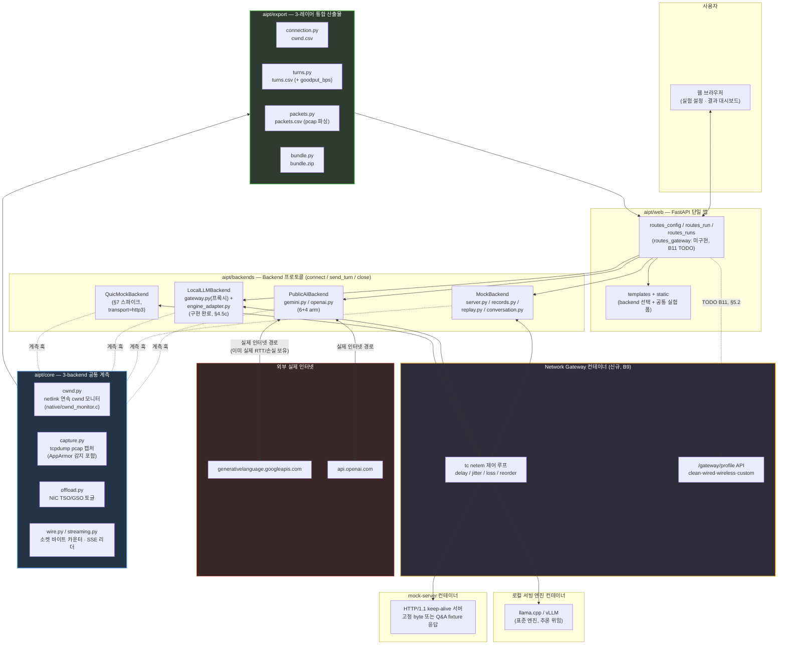
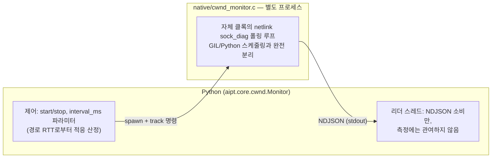

# AIPT — Design Document

**AIPT** (AI Protocol Traffic lab) merges two previously separate projects that
measure the same underlying phenomenon — TCP behaviour under LLM multi-turn
traffic patterns — from two different angles:

| 원 프로젝트 | 관측 대상 | 트래픽 소스 |
|---|---|---|
| `token_traffic` | 요청/응답 **byte·token·latency** (arm 간 비교) | 실제 Gemini/OpenAI API — 과금 발생 |
| `tcp_congestion` | idle 구간 후 **TCP cwnd 리셋** (slow-start-after-idle) | 로컬 mock 서버 — 무료, 재현 가능 |

`tcp_congestion`은 실제로 `token_traffic/core/{cwnd,capture,offload}.py`와
`native/cwnd_monitor.c`를 이식(포크)해서 만들어졌다 — 소스 코드 주석에
"Adapted from token_traffic/core/cwnd.py" 라고 명시되어 있다. 즉 이미 하나의
계보였던 코드가 두 개의 독립 디렉터리로 갈라져 있었고, 이번 작업은 그것을
원래대로 하나의 코어로 되돌리는 일에 가깝다.

## 1. 현황 분석 요약

### 1.1 코드 규모

| | token_traffic | tcp_congestion |
|---|---|---|
| 웹 프레임워크 | Flask (`core/app.py`, 365줄) | FastAPI (`tcp_congestion/app.py`, 209줄) |
| 코어 모듈 | 16개, ~3,600줄 | 9개, ~1,340줄 |
| 프로바이더 어댑터 | gemini.py(715) + openai.py(634) | 없음 (mock 서버 자체 구현) |
| 테스트 | 19개 파일 | 13개 파일 |
| 컨테이너 구성 | 단일 Dockerfile (앱만) | Dockerfile.client + Dockerfile.server (실제 소켓 페어) |
| native C | `native/cwnd_monitor.c` | 동일 파일 (완전 동일, diff 없음) |

### 1.2 모듈별 관계 (diff 기반 확인)

| 모듈 | 관계 | 병합 방침 |
|---|---|---|
| `native/cwnd_monitor.c` | **완전 동일** | 그대로 1개만 유지 |
| `cwnd.py` | tcp_congestion판이 token_traffic판의 단순화 파생 (`core.config`/`core.wire` 의존 제거, `announce(sock)` API로 정리) | **tcp_congestion의 단순화된 인터페이스**를 채택하되, token_traffic의 상세 docstring(설계 근거)과 `dumps`/`exact_queries` 계측 필드를 병합 |
| `capture.py` | tcp_congestion판은 token_traffic판에서 AppArmor 회피 로직 등을 제거하고 "run 1개당 pcap 1개"로 단순화 | token_traffic의 **AppArmor 감지 로직은 반드시 보존** (실제로 시간 낭비했던 이슈, 주석에 경고 있음). label 파라미터를 일반화해서 두 lab 모두 지원 |
| `offload.py` | 사실상 같은 기능, env var 네이밍만 다름 (`TRAFFIC_PCAP_NO_OFFLOAD` vs `NIC_OFFLOAD_DISABLE`) | 통합 후 **두 이름 모두 지원**(alias) — 기존 docker-compose.yml/문서 호환 |
| `export.py` | 서로 다른 레코드 스키마(제공자별 arm vs 턴별 요약)라 병합이 아니라 **공존** | `export/` 서브패키지로 분리, `records_csv()`(external_api용), `turns_csv()`(synthetic_mock용) 공존 |
| `probe.py`, `netem.py`, `congestion.py`, `tcpinfo.py`, `server.py`, `conversation.py` | tcp_congestion 전용, token_traffic에 대응물 없음 | synthetic_mock lab 전용으로 그대로 이관 |
| `wire.py`, `streaming.py`, `call.py`, `record.py`, `metrics.py`, `store.py`, `scenario.py`, `cachebust.py`, `providers/*` | token_traffic 전용, tcp_congestion에 대응물 없음 | external_api lab 전용으로 그대로 이관 |

## 2. 목표 폴더 구조

```
AIPT/
├── DESIGN.md                     # 이 문서
├── MIGRATION.md                  # 파일 단위 이관 체크리스트 (실행 단계에서 갱신)
├── README.md                     # 프로젝트 개요, 빠른 시작
├── pyproject.toml                # 단일 의존성 정의 (fastapi, uvicorn, requests, google-genai, openai 등)
├── Makefile                      # native C 빌드, 테스트 실행
│
├── aipt/                         # 설치 가능한 패키지 루트
│   ├── __init__.py
│   ├── core/                     # 두 lab이 공유하는 측정 인프라
│   │   ├── config.py             # env 플래그 판독 (양쪽 통합)
│   │   ├── cwnd.py               # 연속 netlink cwnd 모니터 (통합판)
│   │   ├── capture.py            # tcpdump 캡처 (AppArmor 감지 포함, label 일반화)
│   │   ├── offload.py            # NIC offload 토글 (env alias 지원)
│   │   ├── tcpinfo.py            # 1회성 TCP_INFO 스냅샷 (경량 대안)
│   │   ├── wire.py               # 소켓 바이트 카운터 (external_api 전용, 재사용 가능하게 core에 위치)
│   │   ├── streaming.py          # SSE 리더 (external_api 전용)
│   │   ├── record.py             # 레코드 스키마 (external_api 전용)
│   │   └── export_base.py        # CSV export 공통 유틸 (컬럼 정의, writer 헬퍼)
│   │
│   ├── providers/                # external_api 전용 — 그대로 이관
│   │   ├── base.py
│   │   ├── gemini.py
│   │   └── openai.py
│   │
│   ├── labs/
│   │   ├── external_api/         # 구 token_traffic 도메인 로직
│   │   │   ├── call.py           # 1~2-pass HTTP 호출
│   │   │   ├── cachebust.py
│   │   │   ├── metrics.py
│   │   │   ├── runner.py         # 여러 (provider, arm) 조합 실행
│   │   │   ├── scenario.py       # fixtures/perf.json 재생
│   │   │   ├── store.py          # 런 저장 + 보존 정책
│   │   │   └── export.py         # records.csv / summary.csv
│   │   │
│   │   └── synthetic_mock/       # 구 tcp_congestion 도메인 로직
│   │       ├── server.py         # HTTP keep-alive mock 서버
│   │       ├── probe.py          # idle 구간 RTT HTTP PING
│   │       ├── conversation.py   # 누적 컨텍스트 멀티턴 시나리오
│   │       ├── congestion.py     # 알고리즘(cubic/reno/bbr/vegas) + qdisc 점검
│   │       ├── netem.py          # tc netem 지연 주입
│   │       └── export.py         # cwnd.csv / turns.csv
│   │
│   └── web/                      # 단일 FastAPI 앱
│       ├── app.py                # create_app(): 루트에 랜딩 페이지, /external-api, /synthetic-mock 마운트
│       ├── routes_external_api.py    # 구 core/app.py(Flask) 라우트 → FastAPI로 포팅
│       ├── routes_synthetic_mock.py  # 구 tcp_congestion/app.py 라우트 이관
│       ├── templates/
│       │   ├── index.html            # 랜딩: 두 lab 선택
│       │   ├── external_api/index.html
│       │   └── synthetic_mock/index.html
│       └── static/
│           ├── app.js               # 구 token_traffic 정적 자산
│           └── style.css
│
├── native/
│   └── cwnd_monitor.c             # 유일한 사본 (양쪽 동일 확인됨)
│
├── fixtures/
│   └── perf.json                  # external_api 시나리오 fixture
│
├── docker/
│   ├── Dockerfile.web             # 웹앱 (native C 빌드 스테이지 포함)
│   ├── Dockerfile.mockserver      # synthetic_mock의 상대편 서버 컨테이너
│   └── docker-compose.yml         # web + mockserver (+ netem용 NET_ADMIN/NET_RAW)
│
├── tests/
│   ├── core/                      # cwnd, capture, offload, wire, streaming 등
│   ├── providers/                 # gemini, openai
│   ├── labs/external_api/
│   ├── labs/synthetic_mock/
│   └── web/
│
└── docs/
    ├── core-contracts.md          # token_traffic/docs/core-contracts.md 갱신판
    └── outputs.md                 # 두 lab의 산출물 포맷 통합 문서
```

## 3. 웹 UI 통합 방침 (FastAPI 단일화)

- `token_traffic/core/app.py`는 **Flask**, `tcp_congestion/app.py`는 **FastAPI**.
  하나로 합치기로 결정했으므로 Flask 라우트 전체를 FastAPI로 포팅한다.
- 라우트 이관 시 매핑 원칙:
  - Flask `@app.route("/api/run", methods=["POST"])` → FastAPI `@router.post("/api/run")`
  - Flask의 `request.get_json()` → FastAPI Pydantic 모델 또는 `await request.json()`
  - Flask의 동기 blocking 실행(외부 API 호출은 원래도 동기)은 FastAPI에서 `run_in_threadpool`로 감싸 이벤트 루프 블로킹 방지 (synthetic_mock의 `conversation.run()`도 동일하게 스레드풀 위임)
- URL 네임스페이스: `/external-api/*` (구 token_traffic), `/synthetic-mock/*` (구 tcp_congestion). 루트 `/`는 두 실험을 선택하는 랜딩 페이지.
- 정적/템플릿 파일은 하위 폴더로 분리해서 두 UI가 서로의 CSS/JS를 침범하지 않게 한다.
- 다운로드 엔드포인트(`/api/download/*`, `/api/runs/<id>/*`)는 각 lab 아래로 이관하되 경로 프리픽스만 붙인다 — 응답 스키마는 변경하지 않는다 (외부에서 참조 중일 수 있음).

## 4. Docker/인프라 통합 방침

- `token_traffic`은 단일 컨테이너(앱만, 외부 API 호출), `tcp_congestion`은 client+server 페어 컨테이너.
- 병합 후: `docker-compose.yml`에 **web**(FastAPI 앱, external-api 기능 포함) + **mockserver**(synthetic_mock의 keep-alive 서버) 2개 서비스로 구성.
- `native/cwnd_monitor.c`는 web 컨테이너 빌드 시 1회만 컴파일 (멀티스테이지 빌드로 분리 — tcp_congestion의 `b7cf75cb fix(docker)` 커밋 교훈 반영).
- 포트: mockserver 기본 8888 유지, 웹UI 기본 10000 유지 (tcp_congestion 관례), external-api 기능은 같은 웹앱 프로세스 내 라우트이므로 별도 포트 불필요.
- `CLIENT_NETEM_DELAY_MS` / `SERVER_NETEM_DELAY_MS` env는 그대로 유지.
- NIC offload env는 `NIC_OFFLOAD_DISABLE`(기존 tcp_congestion 이름)을 정식으로 채택하고 `TRAFFIC_PCAP_NO_OFFLOAD`를 deprecated alias로 지원.

## 4.5 아키텍처 개정 v2 — 3-Backend 공통 클라이언트 구조

**배경**: §1~4의 최초 설계는 "external_api lab / synthetic_mock lab, 두 실험을
나란히 두고 core만 공유"하는 구조였다. 사용자 피드백에 따라 이를
**"클라이언트가 3개 backend 중 하나를 선택해서 동일한 인터페이스로 호출"**하는
구조로 개정한다. 기존 §2 폴더 구조의 `aipt/labs/{external_api,synthetic_mock}`
분리는 **기능(무엇을 측정하나) 기준**이었는데, 이제는 **backend(무엇을
상대하나) 기준**으로 재편한다.

```
Client 측 (측정 로직: cwnd/capture/stats export — 3개 backend에 공통 적용)
  └── Backend 프로토콜 (신규 추상화)
        ├── PublicAIBackend   — Gemini / ChatGPT      (기존 token_traffic providers/* 재사용)
        ├── MockBackend       — 고정 JSON I/O 재생      (기존 tcp_congestion server.py 확장)
        └── LocalLLMBackend   — 표준 서빙엔진 + 자체 프록시 (신규 구현)
```

### 확정된 설계 결정

| 결정 사항 | 확정 내용 |
|---|---|
| 로컬 LLM 스택 | **llama.cpp/vLLM 같은 표준 서빙 프레임워크를 그대로 사용**하고, 그 앞단에 자체 프록시/게이트웨이를 둔다. 프록시가 HTTP 신기능/향후 QUIC 확장 지점을 담당하고, 토큰 생성 자체는 표준 엔진에 위임 — 추론 엔진을 직접 재구현하지 않는다 |
| QUIC/신규 HTTP 실험 범위 | **이번 AIPT 병합에는 포함하지 않는다.** `Backend`/프록시 인터페이스에 transport 확장 지점(예: `transport: "http1"｜"http3"` 같은 슬롯)만 마련해두고, 실제 QUIC 구현은 별도 후속 프로젝트로 분리 |
| Mock 재생 충실도 | **바이트 패턴만 재현**한다. 지연시간(추론 대기)은 실측값을 그대로 재생하지 않고, 기존 tcp_congestion처럼 설정값(`inference_delay`)으로 별도 제어 — 재생 로직의 복잡도를 낮춘다 |

### 폴더 구조 변경 (§2 대비 diff)

```diff
 aipt/
   core/                        # 변경 없음: cwnd, capture, offload, tcpinfo
+  backends/                    # 신규 — 구 aipt/labs/*, aipt/providers/* 를 흡수
+    base.py                    # Backend 프로토콜: connect/send_turn/close, transport 확장 슬롯 포함
+    public_ai/
+      gemini.py                # 구 aipt/providers/gemini.py
+      openai.py                # 구 aipt/providers/openai.py
+      recorder.py              # 신규 — 실측 요청/응답 캡처 (B2)
+    mock/
+      server.py                # 구 tcp_congestion server.py, 고정 byte → fixture 재생으로 확장 (B1)
+      fixtures.py              # 신규 — fixture 포맷 로더 (dummy bytes ↔ 실측 재생 데이터 공통 스키마)
+      replay.py                # 신규 — 실측 캡처 데이터를 fixture로 변환해 재생 (B3, 바이트 패턴만)
+    local_llm/
+      gateway.py                # 신규 — 표준 서빙엔진 앞단 프록시 (B4)
+      engine_adapter.py         # 신규 — llama.cpp/vLLM 등 백엔드 엔진 선택 어댑터
-  labs/
-    external_api/...            # → backends/public_ai/ 로 흡수
-    synthetic_mock/...          # → backends/mock/ 로 흡수
-  providers/...                 # → backends/public_ai/ 로 흡수
   export/                       # 신규 통합 — 구 aipt/labs/*/export.py 통합 (§4.6 참고)
     turns.py                    # 턴 단위 CSV (bytes/tokens/latency/goodput)
     packets.py                  # 신규 — pcap → 패킷 간격 CSV (B6)
     connection.py               # cwnd.csv (기존 그대로)
   web/                          # 변경 없음: FastAPI 단일 앱, 다만 라우트는 backend 선택 파라미터로 통합
```

`aipt/labs/`, `aipt/providers/`는 폐기하고 `aipt/backends/`로 통합한다.
MIGRATION.md의 Phase 2/3 대상 파일들은 목적지 경로만 `backends/public_ai/`,
`backends/mock/`으로 바뀌고 이관 대상 자체는 동일하다.

## 4.6 통계/CSV 3-레이어 통합 (3개 backend 공통)

이전 설계는 lab별로 export.py를 유지했으나, 3-backend 공통 구조에서는
**어떤 backend를 상대하든 동일한 3-레이어 CSV 세트**를 내야 한다.

| 레이어 | 파일 | 내용 | 출처 | 상태 |
|---|---|---|---|---|
| 1. Connection-level | `cwnd.csv` | tick별 snd_cwnd/rtt/delivery_rate | 기존 `cwnd.py` (양쪽 동일) | 이관만 하면 됨 |
| 2. Turn-level | `turns.csv` | prompt_bytes, wire_sent/recv, tokens, ttft/ttlt/turn_end, **goodput(신규)** | token_traffic records.csv + tcp_congestion turns.csv 병합 | **신규 병합 필요** |
| 3. Packet-level | `packets.csv` | 패킷 간격(inter-arrival gap), 패킷 크기 분포 — pcap에서 추출 | 없음 (지금은 pcap 저장만 함) | **완전 신규** |

세 CSV + pcap을 기존 `bundle.zip` 방식으로 묶어서 다운로드하는 구조는 유지.

## 5. 신규/머지 작업 리스트업 (최종)

### A. 머지 작업 (기존 코드 재사용/재구성)

| # | 작업 | 원본 | 목적지 |
|---|---|---|---|
| A1 | `Backend` 프로토콜 정의 | `token_traffic/providers/base.py` 일반화 | `aipt/backends/base.py` |
| A2 | Gemini/OpenAI 어댑터 이관 | `token_traffic/providers/{gemini,openai}.py` | `aipt/backends/public_ai/{gemini,openai}.py` |
| A3 | Mock 서버 이관 (확장은 B1) | `tcp_congestion/tcp_congestion/server.py` | `aipt/backends/mock/server.py` |
| A4 | cwnd 연속 모니터링 통합 | `cwnd.py` (양쪽) | `aipt/core/cwnd.py` |
| A5 | tcpdump 캡처 통합 | `capture.py` (양쪽, AppArmor 감지 보존) | `aipt/core/capture.py` |
| A6 | 턴별 트래픽 통계 정의 일반화 | `token_traffic/core/{wire,record,metrics}.py` | `aipt/core/` + `aipt/export/turns.py` |
| A7 | offload/netem 이관 | `offload.py`, `netem.py` | `aipt/core/` |

### B. 신규 구현 작업

| # | 작업 | 내용 | 비고 |
|---|---|---|---|
| B1 | Mock fixture 포맷 설계 + 구현 | 고정 byte dummy → Q&A 쌍 JSON 시나리오 재생 (`token_traffic/fixtures/perf.json` 개념 확장) | `aipt/backends/mock/fixtures.py` |
| B2 | 실측 데이터 recorder | Public AI backend 호출 시 request/response 원문을 B1 포맷으로 저장 | `aipt/backends/public_ai/recorder.py`. API 키 등 민감정보 마스킹 필요 |
| B3 | Mock replay (바이트 패턴만) | B2로 캡처한 실측 데이터를 Mock backend가 재생. **지연은 재현 안 함**, 설정값(`inference_delay`)으로 별도 제어 | `aipt/backends/mock/replay.py` |
| B4 | LocalLLMBackend (표준 엔진 + 자체 프록시) | llama.cpp/vLLM을 서빙 엔진으로 세우고, 앞단에 자체 게이트웨이를 둬서 HTTP 신기능 실험 지점 마련 | `aipt/backends/local_llm/{gateway,engine_adapter}.py`. 엔진 선택은 `huggingface-hub`/`llama-cpp`/`serving-llms-vllm` 스킬 활용 |
| B5 | Transport 확장 슬롯 (QUIC 자리만) | `Backend`/게이트웨이에 `transport` 파라미터 슬롯만 마련, 구현은 후속 프로젝트로 이관 | 이번 범위: 인터페이스 설계만 |
| B6 | 패킷 간격 통계 (`packets.csv`) | pcap 파싱(`dpkt`/`scapy`)으로 inter-arrival gap, 패킷 크기 분포 계산 | `aipt/export/packets.py` — 신규 의존성 추가 필요 |
| B7 | Goodput 계산 | 기존 wire_sent/recv + 마크(req_sent_ms~turn_end_ms)로 턴별 goodput 산출 | `aipt/export/turns.py`에 컬럼 추가 |
| B8 | 통합 CSV 스키마 확정 | §4.6의 3-레이어를 실제 컬럼 단위로 확정 | Phase 진행 중 `docs/outputs.md`에 기술 |

### C. 폐기/대체

- tcp_congestion의 고정 byte dummy 생성 로직 → B1 완료 시 대체 (다만 "순수 바이트 크기만 스윕"하고 싶은 실험을 위해 옵션으로는 유지)
- `aipt/labs/`, `aipt/providers/` 네임스페이스 → `aipt/backends/`로 전량 이전, 폐기

## 4.7 Network Gateway 컨테이너 — mock/local_llm 경로의 지연/손실 모사

**배경**: `PublicAIBackend`는 이미 실제 인터넷을 거치므로 진짜 RTT/지연/손실을
겪는다. 반면 `MockBackend`와 `LocalLLMBackend`는 지금까지 컨테이너 간 직결
(loopback 수준)이라 "완벽한 네트워크"에서만 측정되어 왔다 — idle-reset이나
cwnd 실험의 사실성이 떨어지는 지점이다. tcp_congestion에 있던
`CLIENT_NETEM_DELAY_MS`/`SERVER_NETEM_DELAY_MS`도 컨테이너 자체의 인터페이스에
건 ad-hoc 설정이었을 뿐, 독립된 아키텍처 구성요소는 아니었다.

**결정**: 클라이언트(측정 코드)가 **mock 또는 local_llm backend를 상대할 때는
반드시 Gateway 컨테이너를 경유**하도록 만든다. Gateway는 두 종단(client ↔
mock-server / client ↔ local-llm) 사이에 위치하는 별도 컨테이너로, 내부에
지연·손실·지터·재정렬 설정을 갖고 트래픽에 주입한다. `PublicAIBackend`는
이미 실제 인터넷이 이 역할을 하므로 Gateway를 경유하지 않는다.

```
Client (측정 코드: cwnd/capture/export — 공통)
  ├── PublicAIBackend ────────────────────────────► 실제 인터넷 (Gemini/OpenAI)
  │                                                    (이미 실제 네트워크 특성 보유)
  │
  └── ┌─────────────────────────────┐
      │  Network Gateway 컨테이너      │   tc netem 기반: delay/jitter/loss/reorder/duplicate
      │  (aipt/core/netem.py 승격)    │   런타임 프로파일 전환 지원 (§구성 참고)
      └──────────────┬────────────────┘
                      │
        ┌─────────────┴─────────────┐
        ▼                           ▼
  MockBackend                LocalLLMBackend
  (mock-server 컨테이너)      (프록시/게이트웨이 + 표준 서빙엔진 컨테이너)
```

### 구성

| 항목 | 방침 |
|---|---|
| 위치 | `aipt/gateway/` 신규 패키지 + `docker/Dockerfile.gateway` — 별도 컨테이너로 배포 |
| 트래픽 제어 수단 | `tc qdisc netem` (지연/지터/손실/재정렬/중복), 기존 `aipt/core/netem.py`를 얇은 wrapper가 아니라 **Gateway 컨테이너의 제어 루프 본체**로 승격 |
| 적용 대상 | `MockBackend`, `LocalLLMBackend`만 경유. `PublicAIBackend`는 경유하지 않음 (실제 인터넷이 이미 그 역할) |
| 설정 방식 | (a) 컨테이너 기동 시 env 프리셋(`GATEWAY_DELAY_MS`, `GATEWAY_JITTER_MS`, `GATEWAY_LOSS_PCT`, `GATEWAY_REORDER_PCT` 등, 기존 `CLIENT_NETEM_DELAY_MS` 계열 대체) — (b) **런타임 API** `POST /gateway/profile` 로 실행 중 프로파일 교체 지원 (실험 웹 UI에서 "wired 프로파일", "wireless 프로파일" 같은 프리셋 선택 가능하게) |
| 웹 UI 연동 | `aipt/web` 실험 설정 폼에 "Network profile" 드롭다운 추가 (`clean`/`wired`/`wireless`/`custom`, 2026-09 재설계 — 값 근거는 ARCHITECTURE.md §4.2 참고) — 선택값을 Gateway의 `/gateway/profile`로 전달 |
| 계측과의 관계 | Gateway 자체는 순수 L3/L4 트래픽 셰이핑만 하고 애플리케이션 로직에는 개입하지 않는다. `aipt/core/cwnd.py`/`capture.py`가 관찰하는 소켓은 client↔gateway 구간이며, Gateway↔backend 구간은 별도 관찰 대상이 아니다 (필요시 후속 확장) |
| Docker 토폴로지 | `docker-compose.yml`에 서비스 3~4개: `web`(client), `gateway`, `mock-server`, `local-llm-gateway`(+엔진). `web`은 `gateway`의 주소로 mock/local_llm에 접속하고, `gateway`가 `mock-server`/`local-llm-gateway`로 forward하며 그 경로에 netem을 건다 |
| PublicAI와의 대칭성 참고 | 이 구조 덕분에 3개 backend 모두 "클라이언트가 겪는 경로 특성"이 명시적으로 기술된다: PublicAI=실제 인터넷, Mock/LocalLLM=Gateway가 흉내낸 네트워크. 지금까지처럼 "로컬은 공짜 네트워크"라는 암묵적 가정이 제거된다 |

### 미해결 세부사항 (Phase 진행 중 확정)

1. ~~Gateway가 L4(TCP 프록시)로 동작할지, L3(라우팅 경유, netem만 인터페이스에 적용)로 동작할지~~
   **확정 (2026-08-26): L3 라우팅.** Gateway는 TCP 상태를 보지 않는 순수 IP
   포워딩 컨테이너로 동작한다 — 애플리케이션 레벨 프록시/relay 코드를 만들지
   않고, 커널의 IP forwarding(`net.ipv4.ip_forward=1`)과 두 개의 분리된
   Docker 브리지 네트워크(`net-client`, `net-backend`)로 구현한다.
   - `web`은 `net-client`에만 속하고, `net-backend` 서브넷으로 가는 경로를
     Gateway의 `net-client` IP를 통해 명시적으로 라우팅한다 (`ip route add`).
   - `mock-server`(및 향후 `local-llm`)는 `net-backend`에만 속하고, 마찬가지로
     `net-client` 서브넷 경로를 Gateway 경유로 라우팅한다 (왕복 트래픽이 반드시
     Gateway를 통과하게 하기 위함 — 이게 없으면 응답 패킷이 Gateway를
     우회해서 되돌아갈 수 있다).
   - Gateway 자체는 두 네트워크 모두에 속하며, `net.ipv4.ip_forward=1` +
     `NET_ADMIN`으로 커널 레벨 포워딩만 수행한다. TCP 페이로드나 헤더를
     들여다보지 않는다 — 순수 L3/L4-무관 패킷 라우팅.
   - `tc netem`은 Gateway의 **양쪽 인터페이스 egress**(client-facing,
     backend-facing)에 동일 프로파일을 적용한다 — 왕복(request/response) 모두
     같은 지연/손실 특성을 겪게 하기 위함. 한쪽에만 적용하면 편도만 영향받는다.
2. 런타임 프로파일 전환 시 기존 연결(keep-alive)에도 즉시 반영되는지 — tc netem은
   인터페이스 단위라 기존 연결에도 즉시 적용됨 (재현성에 유리, 확정 유지).
3. LocalLLMBackend(B4)의 "자체 프록시"(engine gateway, 애플리케이션 레벨)와
   이 Network Gateway(L3, 커널 레벨)는 여전히 서로 다른 컴포넌트 —
   `client → Network Gateway(L3 forward) → engine gateway(애플리케이션 프록시) →
   서빙 엔진` 순서로 체인된다.

## 4.7.1 실행 결과 저장 정책 (확정, 2026-08-26 → 2026-08-27 실제 동작으로 변경, 아래 갱신 참고)

> **2026-09-01 갱신 — 이 절의 "인메모리 최근 50개" 방침은 stale.** 아래
> 2026-08-27 개정을 실제 코드가 구현하고 있다: `aipt/web/store.py`가
> `RUN_STORE_DIR`(기본 `data/runs/`)에 **모든 backend의 모든 run을 JSON으로
> 디스크 영속화**한다(2026-08-27 "Run store 디스크 영속화" 작업,
> MIGRATION.md 참고). 원래의 "한 대의 머신에서 도는 실험실이라 영속 저장
> 안 함" 철학은 실제로는 폐기되었다 — 재시작해도 과거 run 목록이 남는 쪽을
> 선택했다는 뜻이다. 아래 원문은 그 결정 이전의 정책으로, 역사적 기록 목적으로
> 남겨두고 위 문단이 실제 동작을 대표한다.

기존 §6 미해결 결정 5번("data/ 저장 위치")을 아래로 확정한다:

- **영속 저장 대상은 Public AI(상용 API) 요청/응답 JSON만.** `PublicAIBackend`로
  실행한 모든 run은 `aipt/backends/public_ai/recorder.py`를 통해 자동으로
  `data/public_ai_records/<exec_id>.json`에 저장된다 — 과금이 발생한 실제 API
  호출 기록이므로 재현 불가능하고, 재시작으로 잃으면 안 되는 유일한 데이터.
- **그 외 모든 산출물(cwnd 샘플, pcap, mock/local_llm 턴 기록, CSV)은 영속
  저장하지 않는다.** `aipt/web/store.py`의 인메모리 캐시(최근 50개)만 유지하고,
  사용자가 실행 직후 `GET /api/runs/{id}/bundle.zip`으로 다운로드해서 직접
  보관/정리한다. 별도 DB나 파일 시스템 저장소를 구축하지 않는다 — 이 프로젝트는
  "한 대의 머신에서 도는 실험실"이라는 token_traffic 원본의 설계 철학을 그대로
  계승한다.
- Docker 볼륨은 `./data/pcaps`(기존) + `./data/public_ai_records`(신규)만
  마운트한다.

## 5.1 리스트업 갱신 — Gateway 관련 신규 작업

| # | 작업 | 내용 |
|---|---|---|
| B9 | Gateway 컨테이너 신규 구현 | `aipt/gateway/`: netem 제어 루프 + 프로파일 프리셋 + `/gateway/profile` API. `aipt/core/netem.py` 로직을 재사용/승격 |
| B10 | Docker 토폴로지 확장 | `docker-compose.yml`에 `gateway` 서비스 추가, `mock-server`/`local-llm`이 `gateway`를 통해서만 도달 가능하도록 네트워크 구성 |
| B11 | 웹 UI Network profile 선택 | 실험 설정 폼에 프로파일 드롭다운 + Gateway API 연동 |

## 4.8 전체 아키텍처 다이어그램 (Mermaid)



**읽는 법**:
- **점선 화살표**(`-. 계측 훅 .-`)는 "이 backend가 core 모니터링을 훅으로 사용한다"는 관계 — 4개 backend 모두 동일한 `aipt/core`를 공유하며, backend별로 별도의 cwnd/capture 구현을 갖지 않는다.
- **PublicAIBackend**만 Gateway를 거치지 않고 실제 인터넷으로 직행 — 이미 진짜 네트워크 특성(RTT/손실/혼잡)을 갖고 있기 때문 (§4.7).
- **Mock/LocalLLM/QuicMock**은 반드시 **Gateway**를 경유 — Gateway가 `tc netem`으로 지연/손실/재정렬을 주입해 "완벽한 로컬 네트워크"라는 암묵적 가정을 제거한다. Gateway는 L3 IP 포워딩이라 TCP/UDP(QUIC)에 무관하게 동일하게 적용된다.
- **QuicMockBackend**(§7)는 원래 3-backend 설계(§4.5)에는 없던 후속 스파이크다 — idle-probe congestion control 실험을 위해 mock 전용 4번째 백엔드로 `Backend` 프로토콜에 정식 편입되었고, `RunRequest`/웹 UI 폼에는 아직 연결되어 있지 않다(§7 "남은 단계" 3번, TODO).
- **`routes_gateway`는 미구현(B11 TODO, §5.2)** — Gateway 컨테이너의 `/gateway/profile` API 자체는 완성·실동작하지만, 웹 UI에서 그 API를 호출하는 라우트/폼 필드가 없어 점선으로 표시했다.
- **LocalLLMBackend**의 게이트웨이(프록시, 애플리케이션 레벨 HTTP 신기능 실험 지점)와 **Network Gateway 컨테이너**(순수 네트워크 특성 주입, L3/L4)는 서로 다른 컴포넌트다 — 이름이 비슷해 혼동하기 쉬우므로 문서/코드에서 전자는 "engine gateway/proxy", 후자는 "network gateway"로 구분 표기할 것을 권장.
- 모든 backend의 turn 결과는 `aipt/core`가 관찰한 데이터와 함께 `aipt/export`의 3-레이어 CSV(connection/turns/packets) + bundle.zip으로 수렴한다.

## 4.9 정밀 측정: 짧은 RTT 환경을 위한 C 기반 수집기

**문제의식**: TCP/네트워크 통계는 Python 레벨에서 측정하면 GIL 스케줄링,
syscall 왕복, 타이머 해상도 때문에 측정 자체가 지터를 갖는다. 이 지터는
RTT가 수십 ms인 실제 인터넷(PublicAIBackend)에서는 무시할 수준이지만,
**RTT가 짧을수록 지터가 신호 자체를 삼켜버린다** — 애초에 `cwnd.py`의
2ms netlink 샘플링 주기가 이 문제 때문에 C 헬퍼(`native/cwnd_monitor.c`)로
분리되어 있는 것이 그 증거다: token_traffic 원본 주석에 "api.openai.com
엣지까지 3.3ms 경로에서, cwnd가 10→65로 슬로우스타트 복귀하는 데 걸리는
시간이 약 10ms인데, 10ms 주기 샘플러는 그 사건 자체를 건너뛴다"고
명시되어 있다.

**v2 아키텍처에서 이 문제가 더 커지는 이유**: PublicAIBackend만 다루던
때는 RTT가 항상 수 ms~수십 ms 범위(실제 인터넷)였다. 그런데 이제
MockBackend/LocalLLMBackend는 컨테이너 간 직결이거나 Gateway의 `clean`
프로파일(지연 0)일 때 RTT가 **수백 μs 이하**로 떨어진다. 기존 2ms 고정
주기로는 이런 경로에서 발생하는 idle-reset이나 slow-start 이벤트를
Python은커녕 C 헬퍼조차 놓칠 수 있다 — "3.3ms 경로에 10ms 샘플러"와
같은 실수를 "0.3ms 경로에 2ms 샘플러"로 반복하게 되는 셈이다.

### 결정: 네이티브 수집기를 정식 아키텍처 계층으로 승격 + 적응형 주기

| 항목 | 방침 |
|---|---|
| 원칙 | **TCP/네트워크 타이밍 관련 모든 정밀 측정(cwnd 샘플링, 패킷 도착 타임스탬프)은 Python이 아니라 C로 구현된 별도 프로세스가 수행**하고, Python은 그 결과를 소비만 한다. GIL/스케줄링의 영향을 받지 않는 별도 OS 프로세스/스레드로 분리하는 것이 핵심이며, 이미 `cwnd.py` + `native/cwnd_monitor.c`가 이 원칙을 구현하고 있다 — 이번 결정은 그 원칙을 **명시적 아키텍처 요소로 승격**하고 **RTT가 짧은 backend까지 확장**하는 것 |
| 샘플링 주기 적응 (신규) | 고정 2ms 대신, **경로의 예상 RTT에 비례해 주기를 정하는 적응형 로직** 도입: `interval_ms = max(MIN_INTERVAL_MS, measured_or_declared_rtt_ms / K)` (K는 슬로우스타트 burst 하나를 최소 몇 회 샘플링할지 결정하는 상수, 기존 문서의 "3.3ms 경로 → 10ms 복귀 → 2ms 주기로 5회 샘플" 비율을 기준으로 역산). Gateway가 주입한 지연값(`GATEWAY_DELAY_MS`)이나 mock/local_llm의 실측 RTT를 실행 전에 알 수 있으므로, 실행 시작 시 이 값을 `cwnd.Monitor`에 넘겨 주기를 자동 산정 |
| 하한 주기 | 순수 loopback/컨테이너 직결(RTT < 0.1ms) 같은 극단적으로 짧은 경로에서는 C 헬퍼도 물리적 하한(스케줄링 tick, netlink 왕복 비용)에 부딪힌다. 이 경우 "측정 불가/신뢰 구간 밖"임을 결과에 명시적으로 표시(`interval_below_reliable_floor: true` 같은 플래그) — 없는 정밀도를 있는 것처럼 보고하지 않는다 |
| 패킷 타임스탬프도 동일 원칙 적용 (신규, 확장) | `aipt/export/packets.py`의 inter-arrival gap 계산은 지금 tcpdump가 pcap에 기록한 타임스탬프에 의존한다. tcpdump 자체는 커널 캡처(AF_PACKET)라 userspace Python보다는 정확하지만, **짧은 RTT 경로에서 패킷 간격이 μs 단위로 좁아지면 pcap 타임스탬프의 커널 클록 해상도(통상 1μs, NIC에 따라 다름)가 병목**이 될 수 있다. 하드웨어 타임스탬프(`SO_TIMESTAMPNS`/`ETHTOOL_GET_TS_INFO`)가 있는 환경에서는 이를 우선 사용하도록 `capture.py`에 감지 로직 추가 검토 |
| 결과 스키마 | `cwnd.Monitor.result()`와 `packets.csv`에 **주기 산정 근거를 기록**: `interval_ms`, `interval_reason`("fixed" / "adaptive:rtt=<x>ms" / "floor_clamped"), `measurement_confidence`("high"/"degraded") — 나중에 어떤 실행이 신뢰할 만한지 사후에 판별 가능하게 |
| 적용 범위 | PublicAIBackend는 원래도 실제 인터넷 RTT(수~수십 ms)라 기존 2ms 고정 주기로 충분 — 적응형 로직은 **MockBackend/LocalLLMBackend에서만 활성화**해도 됨 (단, 공통 코드 경로이므로 구현은 `aipt/core/cwnd.py`에 위치하고 파라미터로 제어) |

### 아키텍처 다이어그램 반영

§4.8 다이어그램의 `CORE` 서브그래프를 아래처럼 이해할 것: `Cwnd`(cwnd.py +
native C 헬퍼)와 향후 확장될 패킷 타임스탬프 수집기는 **Python 프로세스와
독립된 네이티브 프로세스**로 그려야 정확하다 — 화살표가 Python 쪽에서
"제어(시작/중지, 주기 파라미터 전달)"만 하고, 실측 자체는 C 프로세스가
자신의 클록으로 수행한 뒤 NDJSON으로 결과만 넘기는 단방향 데이터 흐름이다.



### 신규 작업 리스트업 (B12)

| # | 작업 | 내용 |
|---|---|---|
| B12 | 적응형 cwnd 샘플링 주기 | `aipt/core/cwnd.py`에 `interval_from_rtt(rtt_ms, k=...)` 헬퍼 추가, Mock/LocalLLM backend의 `connect()`가 경로 RTT(Gateway 프로파일의 delay 설정값 또는 실측 RTT)를 넘기도록 연동. 결과에 `interval_reason`/`measurement_confidence` 필드 추가 |
| B13 (검토) | pcap 타임스탬프 정밀도 확인 | `capture.py`가 캡처 인터페이스의 타임스탬프 소스(소프트웨어 vs 하드웨어)를 확인하고 결과에 기록. 짧은 RTT 경로에서 `packets.csv`의 inter-arrival gap 신뢰도 판단 근거로 사용 |

## 5.2 문서-코드 정합성 점검 (2026-09-01, ooo 인터뷰 기반 전수 감사)

AIPT를 ooo(Ouroboros) 워크플로우로 재정의하면서, 실제 코드를 병렬 서브에이전트로
전수 조사(빌드/기동/실측 포함)해 DESIGN.md와의 괴리를 확정했다. §6의 6개
미해결 결정은 **모두 확정 완료**(코드 레벨로 재확인, 아래 §6에 확정 내용 갱신).
남은 괴리는 다음 3가지뿐이다:

1. **§4.7.1 저장 정책 stale** — "Public AI 기록만 영속 저장, 나머지는 인메모리
   최근 50개"라고 확정했었으나, 실제로는 `RUN_STORE_DIR`(`data/runs/`)에 모든
   backend의 run을 디스크 영속화하고 있다(2026-08-27 "Run store 디스크 영속화"
   작업, MIGRATION.md 참고). 문서가 실제보다 뒤처짐 — 이 절을 실제 동작에 맞게
   갱신 필요.
2. **§4.8 아키텍처 다이어그램이 quic_mock 미반영** — §7의 QUIC idle-probe
   스파이크(2026-08-27)가 `QuicMockBackend`로 `Backend` 프로토콜에 정식
   편입되고 `docker-compose.yml`에 `quic-mock-server` 5번째 서비스로 실존하는데,
   §4.8 Mermaid 다이어그램의 BACKENDS 서브그래프에는 3개(PublicAI/Mock/LocalLLM)만
   남아 있다.
3. **B11(웹 UI Network Profile 선택) 미구현** — Gateway 컨테이너의
   `GET/POST /gateway/profile` API는 완성되어 실동작 확인됐으나(§4.7),
   `aipt/web`에 `routes_gateway` 모듈 자체가 없고 실험 폼에도 프로파일
   드롭다운이 없다. `GATEWAY_HOST`/`GATEWAY_PORT` env가 `web` 서비스에
   주입만 되고 코드에서 전혀 쓰이지 않는 dead config로 확인됨 — 사용자가
   프로파일을 바꾸려면 컨테이너에 직접 curl해야 하는 상태.

또한 이번 감사에서 **Docker HEALTHCHECK 버그**를 신규 발견했다: `local-llm`
컨테이너의 llama.cpp 서버는 `--port 40080`으로 정상 기동·응답하지만
(`curl -s http://127.0.0.1:40080/health` → `{"status":"ok"}`, 컨테이너 내부에서
직접 확인), base 이미지가 물려주는 HEALTHCHECK가 여전히 기본 포트 8080을
찔러 항상 `unhealthy`로 표시된다. 기능 장애는 아니지만(2026-09-01 실측:
Qwen2.5-0.5B-Instruct-GGUF 모델로 `local_llm` 백엔드 end-to-end 3턴 실행
성공 — TTFT 583ms, wire_sent/recv 정상 계측) `docker compose ps`만 보고
"고장났다"고 오판할 여지가 있어 `docker/Dockerfile.local_llm`의
HEALTHCHECK 정의를 40080으로 고쳐야 한다.

## 6. 미해결 설계 결정 (구현 전 확인 필요) — [x] 2026-09-01 전항목 확정 완료 (아래 각 항목 참고)

1. **`aipt/core/cwnd.py` 최종 API** — token_traffic의 `provider/arm/kind` 3필드 라벨링 vs tcp_congestion의 단일 `label` 문자열. 제안: `label` 하나로 통일하고 호출측에서 `f"{provider}:{arm}:{kind}"` 형태로 조립 (synthetic_mock은 조립 없이 그대로 label 사용).
   **확정 (2026-09-01, 코드 재확인): 제안대로 `label: str` 단일 문자열로 통일됨.** `aipt/core/cwnd.py`의 `Monitor.__init__(label, ...)`. 호출측이 `f"{provider}:{arm}:{kind}"` 조립(docstring 명시), synthetic_mock은 조립 없이 그대로 사용.
2. **`core/capture.py`의 caller당 pcap 개수** — external_api는 (provider, arm, kind)당 1개, synthetic_mock은 run당 1개. `label` 파라미터로 이미 일반화 가능해 보이나, external_api의 dual-pass(bytes/latency 분리 캡처) 요구사항까지 커버되는지 이관 시 재검증 필요.
   **확정 (2026-09-01): `Capture` 클래스가 `label` 직접 전달(synthetic_mock, run당 1개) / `provider・arm・kind` 자동 조립(`{provider}_{arm}_{kind}`, external_api) 두 방식 모두 지원. dual-pass 요구사항도 `kind`가 파일명에 포함되어 별도 pcap으로 분리되는 것으로 재검증됨.**
3. **의존성 통합** — token_traffic은 `requests` 기반, google-genai/openai SDK는 사용 안 함(SDK가 httpx라 소켓 카운터 훅이 안 걸림). synthetic_mock은 표준 라이브러리 위주. `pyproject.toml` 하나로 합칠 때 optional-dependency 그룹(`[external-api]`, `[dev]`)으로 나눌지 결정 필요.
   **확정 (2026-09-01): `[external-api]` 대신 기능별 4개 그룹으로 결정.** base `dependencies=["requests"]`, optional `dev`(pytest) / `export`(dpkt) / `web`(fastapi/uvicorn/jinja2/python-multipart/httpx) / `quic`(aioquic, §7 스파이크 이후 추가).
4. **테스트 마킹** — 기존 `test_conversation_live.py`, `test_cwnd_live.py` 등 "live"(실제 소켓/커널 필요) 테스트를 pytest 마커(`@pytest.mark.live`)로 통합 표시할지, 두 프로젝트 관례가 달랐다면 통일 필요.
   **확정 (2026-09-01): `@pytest.mark.live`로 통일.** `pyproject.toml`의 `[tool.pytest.ini_options] markers`에 등록, 9개 테스트 파일이 사용 중(`test_cwnd.py`, `test_capture.py`, `test_conversation_live.py`, `test_backend_live.py`, `test_engine_live.py` 등). CI 기본 실행은 `-m "not live"`.
5. **`data/` 저장 위치** — token_traffic은 `TRAFFIC_DATA_DIR`(런 JSON), tcp_congestion은 `data/pcaps/`(pcap만, 메모리에 최근 1건만 유지). 병합 후 두 lab이 저장소를 공유할지, `data/external-api/`·`data/synthetic-mock/`으로 분리할지 결정 필요. **권장: 분리** — 두 lab의 보존 정책이 다르다(external_api는 20개 런 유지 pruning, synthetic_mock은 최근 1건만 메모리 유지).
   **확정 (2026-09-01, 권장안과 다르게 결정): lab별 분리가 아니라 기능별 공유 구조로 최종 결정됨.** `data/pcaps/`(capture.py), `data/runs/`(web/store.py — 전 backend 공통, §4.7.1과 달리 영속화됨, §5.2 참고), `data/public_ai_records/`(recorder.py) 3종 — 3개 backend가 이 디렉터리들을 모두 공유하며 lab 단위 구분은 없음. 3-backend 통합 아키텍처(§4.5 v2)로 개정되며 애초에 "lab"이라는 개념 자체가 폐기되었으므로 이 편차는 자연스러운 결과.
6. **모노레포 `CLAUDE.md` 갱신** — `remote_work/CLAUDE.md`의 프로젝트 테이블에서 `token_traffic` 행을 `AIPT`로 교체하고, `tcp_congestion`(테이블에 없었음 — 등록 필요했을 수도)도 정리. 실제 코드 이관 완료 후 반영.
   **확정 (2026-09-01): 완료 확인.** 커밋 `fabadc48`에서 `token_traffic` 행을 `AIPT`로 교체. `tcp_congestion` 행은 원래 테이블에 없었으므로 별도 조치 불요. 현재 `remote_work/CLAUDE.md`에 `AIPT` 행만 존재함을 재확인.

## 6. 실행 계획 (다음 단계, 리뷰 후 진행)

이번 세션은 **설계 문서 + 폴더 스켈레톤까지만** 완료. 실제 코드 이동/포팅은
아래 순서로 별도 작업 세션에서 진행 예정:

| Phase | 내용 | 산출물 |
|---|---|---|
| 1 | `native/cwnd_monitor.c`, 순수 공유 가능 core(cwnd/capture/offload) 이관 + 유닛 테스트 이식 | `aipt/core/*.py` + `tests/core/*` 그린 |
| 2 | external_api 도메인 로직(wire/streaming/call/record/metrics/store/scenario/cachebust/providers) 이관 | `aipt/labs/external_api/*`, `aipt/providers/*` + 테스트 그린 |
| 3 | synthetic_mock 도메인 로직(server/probe/conversation/congestion/netem) 이관 | `aipt/labs/synthetic_mock/*` + 테스트 그린 |
| 4 | Flask → FastAPI 라우트 포팅, 템플릿/정적 자산 이관, 랜딩 페이지 신설 | `aipt/web/*` 로컬 구동 확인 |
| 5 | Docker 통합(web + mockserver 2-서비스 compose), 빌드 스테이지 정리 | `docker compose up --build` 통과 |
| 6 | 문서 최종화(README/docs), 모노레포 CLAUDE.md 갱신, 원본 `token_traffic/`·`tcp_congestion/` 삭제(또는 archive) | 단일 소스 오브 트루스 확정 |

## 7. QUIC idle-probe spike (2026-08-27, 신규)

**배경**: idle 구간 동안 능동적으로 probe(0-size/PING)를 보내 RTT 변화를
측정하고, 그 값으로 idle 종료 시점의 cwnd를 조정하고 싶다는 아이디어를
검토했다. 실제 커널 소스(`net/tcp.h`의 `struct tcp_congestion_ops`,
`tcp_output.c`의 `tcp_cwnd_restart()`/`tcp_slow_start_after_idle_check()`)를
직접 대조한 결과 TCP에서는 이 방식이 구조적으로 불가능하다고 결론지었다:

- TCP의 keepalive/window-probe 패킷(`tcp_write_wakeup()`)은 일부러 예전
  시퀀스 번호를 재사용해 RTT 샘플링 파이프라인(Karn's algorithm, RFC 6298)에서
  **의도적으로 배제**된다 -- probe를 보내도 RTT로 못 쓴다.
- `tcp_congestion_ops`의 모든 콜백(`cong_avoid`/`cong_control`/`cwnd_event`
  등)은 "이미 벌어진 전송 이벤트에 대한 cwnd 계산"만 담당하고, 새 패킷을
  스스로 만들어 보낼 권한이 없다 -- congestion control 모듈이 능동적으로
  probe를 쏘는 것 자체가 아키텍처 계층 분리를 어기는 것.
- 유휴 재시작 판정 자체도 별도 타이머가 아니라, 다음 전송 시도 시점에
  `tcp_jiffies32 - tp->lsndtime`를 사후 계산하는 방식이라(`tcp_slow_start_after_idle_check`),
  "RTO마다 RTT를 측정" 같은 주기적 개입 지점 자체가 없다.

**QUIC(aioquic)으로 전환한 이유**: QUIC은 혼잡제어가 커널이 아니라
유저스페이스 라이브러리 안에 있고, `QuicConnection.send_ping(uid)`가
애플리케이션이 언제든 호출 가능한 공개 API이며, PING은 ack-eliciting
프레임이라 그 RTT 샘플이 데이터 트래픽과 **동일한 경로**
(`aioquic.quic.recovery.QuicPacketRecovery.on_ack_received()`)로
`on_rtt_measurement()` 콜백에 전달됨을 aioquic 실제 소스로 확인했다. 커널
모듈/패치가 전혀 필요 없다.

**구현 (`aipt/backends/quic_mock/`, mock 전용, 2026-08-27 1차 착수)**:

- `congestion.py` — `IdleProbeCongestionControl`: aioquic 표준 Reno에
  cwnd/loss 회계를 전량 위임하고, `mark_idle_probe_sent()`(idle 진입 시
  호출)로 pre-idle RTT를 기록해두었다가 그 다음 `on_rtt_measurement()`
  호출(=probe PING의 ACK)에서 RTT 증가율을 계산, 증가한 만큼(최대
  `MAX_REACTED_GROWTH=0.5`로 캡) cwnd를 사전에 줄인다. RTT가 그대로거나
  개선됐으면 아무 것도 안 하고 Reno의 정상 증가 로직에 맡긴다(한 번의
  probe 샘플만으로 낙관적으로 판단하는 게 비관적으로 판단하는 것보다
  위험하다는 원칙). `register_congestion_control("idle_probe", ...)`로
  등록되어 `QuicConfiguration(congestion_control_algorithm="idle_probe")`로
  바로 선택 가능.
- `server.py` — aioquic 기반 QUIC echo 서버(`EchoProtocol`). 기존
  `aipt.backends.mock.server`(HTTP/1.1)를 대체하는 게 아니라 별도
  경로 -- 이 스파이크의 목적은 "idle-probe 메커니즘이 실제 impaired
  path에서 cwnd를 예상대로 움직이는가"이지 mock 서버 기능 전체
  재현이 아니다.
- `spike_runner.py` — 이 프로젝트의 실제 `aipt/gateway/`(tc netem L3
  포워딩 컨테이너)를 통해 baseline(순수 reno, probing 없음) vs
  idle_probe(probing 있음) 두 congestion control을 turn/idle 대화
  패턴으로 비교 실행하는 CLI. `POST /gateway/profile`로 Gateway의
  netem 프리셋(clean/3g/...)을 실제로 전환한 뒤 실행하므로, loopback
  노이즈가 아니라 진짜 주입된 지연/손실 위에서 측정한다.
- Docker: `docker/Dockerfile.quic_mock_server` + `docker-compose.yml`의
  `quic-mock-server` 서비스(`net-backend`에만 연결, `gateway` 경유
  라우팅 -- `mock-server`와 동일한 L3 확정 설계 패턴, UDP 포트 4433).
  Gateway 자체는 L3 IP 포워딩 + netem이라 프로토콜(TCP/UDP)에 무관하게
  그대로 통과시키므로 Gateway 코드 변경은 전혀 없었다.

**검증 결과 (2026-08-27, 실컨테이너)**:
- `clean` 프로파일(지연 0): baseline/idle_probe 둘 다 cwnd가 매 턴
  꾸준히 증가(둘 다 6000→약 16000대), probe RTT 변화가 미미해(노이즈
  수준) 조정이 거의 발생하지 않음 -- 예상대로.
- `3g` 프로파일(delay 150±40ms, loss 1%, reorder 0.5%): idle_probe가
  매 턴 idle 중 RTT 증가(11.7%~19.4%)를 실제로 감지하고 cwnd를
  사전에 줄임(예: `cwnd_before=3188 → cwnd_after=2643`). baseline은
  cwnd가 6000에서 전혀 안 움직임(reno가 idle에 대해 아무 반응이
  없음을 재확인 -- QUIC 표준 congestion control엔 TCP의
  `tcp_cwnd_restart()` 같은 idle-restart 로직이 아예 없다는 이전 조사
  결과와 일치).
- 다만 이 결과가 곧바로 "성능이 개선된다"는 뜻은 아님 -- cwnd를 미리
  줄이는 게 처리량/지연 트레이드오프에서 실제로 이득인지는 별도로
  측정해야 한다(다음 단계).

**남은 단계 (사용자 지시, 순서대로)**:
1. (완료) Mock 환경에서 baseline과의 cwnd 동작 차이를 실제 Gateway netem
   경로에서 확인.
2. (완료, 2026-08-27) 처리량/지연 관점의 실제 A/B 측정 — 결과는 아래.
3. UI에 "Use QUIC" 체크박스 + 알고리즘 선택 추가, `aipt/web/routes_run.py`
   의 `RunRequest`/`Backend` 프로토콜에 정식 편입(현재
   `spike_runner.py`/`experiment.py`는 독립 CLI, 웹 UI/`RunRequest`에는
   미연결).
4. HTTP/3 지원을 통한 실제 `local_llm` 백엔드 테스트(llama.cpp/vLLM의
   HTTP/3 지원 여부 확인 필요 -- 미지원 시 게이트웨이에서 QUIC↔HTTP1
   브리지 필요할 수 있음).

### 7.1 처리량/지연 A/B 측정 결과 (2026-08-27)

`aipt/backends/quic_mock/experiment.py` 신규 — cwnd 궤적만 보던
`spike_runner.py`와 달리, 실제 요청-완전응답 왕복 지연(post-idle latency,
turn 0은 idle 직전이 없어 제외)과 총 처리량(goodput, 반복 실행 합산
바이트/합산 활성 시간)을 측정한다. payload를 초기 cwnd(~12000바이트)보다
훨씬 큰 30000바이트로 잡아 매 턴이 실제로 여러 RTT에 걸쳐 전송되게
했다(작은 payload로는 cwnd 차이가 아예 드러나지 않음). 이 과정에서
`spike_runner.py`의 프로토콜 버그도 하나 발견/수정: 첫 번째 STREAM
프래그먼트만 받고 응답 완료로 처리하고 있어서(`end_stream` 미확인),
멀티프래그먼트로 도착하는 큰 응답의 지연을 실제보다 짧게 측정할 뻔했다
-- `experiment.ThroughputProtocol`은 `end_stream=True`까지 프래그먼트를
누적해서 받은 뒤에만 완료 처리하도록 수정(테스트로 검증,
`test_throughput_protocol_receives_full_multi_fragment_payload`).

**실측 (Gateway `3g` 프로파일: delay 150±40ms, loss 1%, reorder 0.5%,
turns=6, think_time=1.0s, payload=30000B, repeats=3)**:

| 지표 | baseline (reno) | idle_probe | 델타 |
|---|---|---|---|
| post-idle latency 평균 | 3024.3ms | 3233.3ms | **+6.9% (악화)** |
| post-idle latency stdev | 549.1ms | 337.2ms | (분산은 감소) |
| post-idle latency 최대 | 4099.0ms | 3734.8ms | (최악값은 개선) |
| goodput | 16535bps | 14892bps | **-9.9% (악화)** |

**결론: 이번 구현/파라미터로는 개선되지 않았다 — 오히려 평균 지연·처리량
모두 소폭 악화됐다.** §7의 cwnd 궤적 스파이크에서 확인한 "idle_probe가
RTT 증가를 감지해 cwnd를 사전에 줄인다"는 메커니즘 자체는 정상 동작했지만
(이 실험 로그에도 매 idle 갭마다 `RTT grew X% ... cwnd A -> B` 조정이
찍힘), **그 조정이 실제 성능에는 순이익이 아니라 순손실**이었다. 원인
추정(추가 검증 필요, 미확정):

- `MAX_REACTED_GROWTH=0.5` 캡이 있어도, netem의 지터(±40ms)만으로도
  probe 1회 샘플에서 10~35%대 "성장"이 흔히 관측됐다(로그의
  `RTT grew 21.4%`, `36.1%` 등) -- 이는 실제 지속적 혼잡이 아니라 단발성
  지터 노이즈일 가능성이 높은데, 알고리즘이 이를 구분하지 못하고 매번
  cwnd를 깎아서 다음 턴의 처리량 상한을 낮춰버린다.
  §7에서 이미 "단일 probe 샘플은 노이즈에 취약하다"고 우려했던 바로 그
  실패 모드가 실측으로 확인된 것.
- 반감이 아니라 부분 축소(비율 기반)라 TCP의 이분법적
  idle-restart보다는 온건하지만, **위험을 낮추는 보수적 조정이 이 특정
  워크로드(1% loss, 150ms RTT, 30KB payload)에서는 처리량 손실 쪽으로만
  작용**했다 -- loss를 막아주지도 못했고(reno도 이미 loss 기반 조정을
  하고 있어 중복), cwnd만 불필요하게 낮춰 회복 시간만 늘렸을 가능성.

**후속 조치 필요(3단계 UI 편입 전에 먼저 처리 권장)**:
- 노이즈와 진짜 신호를 구분하는 로직 필요 -- 예: 단일 probe가 아니라
  idle 중 probe를 N회 반복해 평균/중앙값을 쓰거나, `MAX_REACTED_GROWTH`를
  훨씬 보수적으로(예 0.1~0.2) 낮추거나, 일정 threshold 이하 성장은
  완전히 무시.
- 서로 다른 netem 프로파일(clean/wired/wireless)과 payload
  크기 조합으로 반복 측정해, 이번 3g+30KB 조합에 국한된 결과인지 일반적
  경향인지 확인 필요 -- 현재는 단일 프로파일·단일 payload 크기 1회
  시리즈(반복 3회)만 측정한 상태. (참고: 측정 당시 프리셋 이름은 `3g`였으며
  2026-09 재설계로 `wireless`로 개명 — 실측 로그의 `3g`/`broadband`/`satellite`/
  `lossy` 표기는 당시 이름 그대로 보존, 현재 코드의 프리셋 이름과는 다름)
- **이 시점에서 3단계(UI 편입)로 바로 넘어가는 것은 권장하지 않는다** --
  아직 개선을 증명하지 못한 알고리즘을 사용자 대면 UI 옵션으로 노출하는
  건 시기상조.

### 7.2 웹 UI 편입 (2026-08-27, 사용자 지시로 진행)

부정적 A/B 결과(§7.1)에도 불구하고 사용자가 "직접 웹에서 트리거해보고
싶다"는 명시적 요청으로 3단계(UI 편입)를 진행했다. **`idle_probe`를
기본값으로 노출하지 않는 방식**으로 안전장치를 유지했다:

- **`aipt/backends/quic_mock/backend.py` 신규** -- `QuicMockBackend`,
  기존 `MockBackend`와 동일한 `Backend` 프로토콜 구현체. 백그라운드
  스레드에서 전용 asyncio 이벤트 루프를 돌리고, `send_turn()`은
  `asyncio.run_coroutine_threadsafe()`로 그 루프에 작업을 넘기고
  블로킹 대기하는 방식(sync Backend 프로토콜 ↔ async aioquic 사이의
  표준 브리지 패턴, `routes_run.py` docstring이 이미 SSE에서 쓰는
  것과 동일 기법을 반대 방향으로 사용). `cwnd_result()`는 **연속
  trace가 아니라 최종 스냅샷만** 제공 -- QUIC 혼잡제어는 유저스페이스에
  있어 `aipt.core.cwnd`의 netlink 기반 연속 모니터가 애초에 관찰할
  대상(커널 소켓)이 없기 때문. 이 한계를 응답의 `note` 필드에 명시.
- **`aipt/core/quic_congestion.py` 신규** -- `aipt.core.congestion`(커널
  TCP 모듈, `/proc/sys/net/ipv4/tcp_available_congestion_control`)과
  동일한 "실제 사용 가능한 것만 보고, 절대 하드코딩 목록을 지어내지
  않는다" 원칙을 QUIC(aioquic 레지스트리)에 적용. import 부작용으로
  `idle_probe`가 aioquic 표준 `reno`/`cubic`과 함께 자동 등록됨.
- **`RunRequest.transport`** 신규 필드(`"http1"`\|`"http3"`, 기본값
  `"http1"`) -- `_build_backend()`가 `mock` + `transport="http3"`일 때만
  `QuicMockBackend`를 생성(다른 백엔드 조합은 아직 미지원, 명시적으로
  가드). **`algorithm` 필드는 재사용**하되 네임스페이스가 다름(TCP
  커널 모듈명 vs QUIC 알고리즘명) -- `req.backend == "mock"`이면서
  `transport == "http3"`일 때는 라우트가 `backend.algorithm`을 다시
  덮어쓰지 않도록 가드(그렇지 않으면 생성자가 이미 해석해둔 알고리즘이
  `None`으로 깨질 뻔했음, 실제 코드 리뷰 중 발견).
- **UI**: `_experiment_form.html`에 **"Transport" 드롭다운** 신규
  (`TCP (kernel, default)` / `QUIC (aioquic, mock-only spike)`,
  **기본값 TCP**), Mock 카드 선택 시에만 노출(`app.js`의
  `applyTransportAvailability()`). Transport를 QUIC으로 바꾸면 같은
  "Congestion algorithm" 드롭다운의 옵션 목록 자체가
  `config.quic_congestion_algorithms`(reno/cubic/idle_probe)로
  교체됨(`populateAlgorithmOptions()`) -- 두 네임스페이스를 뒤섞어
  제출할 수 없도록 UI 레벨에서도 분리.
- **실컨테이너 검증**: `docker compose build web` 재빌드 후
  `curl -X POST /api/run -d '{"transport":"http3","algorithm":"idle_probe",...}'`
  실행 → 정상 완료, `turns[].transport == "http3"` 확인,
  `/api/config`에서 `quic_available: true`,
  `quic_congestion_algorithms: ["cubic","idle_probe","reno"]` 확인.
- **테스트**: 유닛 3개(`tests/core/test_quic_congestion.py`) + live e2e
  6개(`tests/backends/quic_mock/test_backend_live.py`, 실제 UDP 소켓) +
  web API 2개(`tests/web/test_app.py`, TestClient로 `/api/run` 전체
  경로 검증, 기본값이 여전히 http1임을 확인하는 회귀 테스트 포함) 신규.
  `pytest -m "not live"` 471 passed(462+9), 회귀 없음.

**여전히 유효한 경고**: §7.1의 실측 결과(idle_probe가 처리량 -9.9%,
지연 +6.9%)는 바뀌지 않았다. UI에 노출은 됐지만 **기본값이 여전히
TCP + `algorithm` 미지정**이라 아무것도 안 건드리면 idle_probe를 만날
일이 없고, QUIC 자체를 선택해도 알고리즘 기본값은 `idle_probe`가 아니라
aioquic 표준 `reno`다. `idle_probe`를 실제로 켜려면 Transport=QUIC +
algorithm=idle_probe를 **둘 다 명시적으로** 선택해야 하며, 이는 "아직
개선을 증명하지 못한 실험 알고리즘을 알고 쓰는" 것으로 사용자의 결정에
맡긴다.

### 7.3 loopback 우회 버그 수정 (2026-08-31, 사용자가 Wireshark로 발견)

§7.2에서 웹 UI에 편입한 직후 사용자가 실제로 QUIC을 선택해 테스트하고
Wireshark로 캡처를 열어봤는데, **트래픽이 Gateway를 전혀 거치지 않고
`web` 컨테이너 안의 loopback(127.0.0.1)에서만 오가는 걸 발견**했다.
원인은 애초부터 `MockBackend`(TCP)와 신규 `QuicMockBackend` 둘 다
**자체 서버를 프로세스 안에서 띄워 자기 자신과 통신**하는 구조였기
때문 -- `mock-server`/`quic-mock-server` 컨테이너는
`docker-compose.yml`에 이미 만들어져 있고 Gateway 경유 라우팅까지
확정 설계(DESIGN.md 4.7)로 세팅돼 있었지만, **`/api/run` 경로는 그
컨테이너들을 애초에 한 번도 참조한 적이 없었다** (스파이크 CLI인
`spike_runner.py`/`experiment.py`만 사용).

**수정 (LocalLLMBackend가 처음부터 쓰던 것과 동일한 패턴으로 통일)**:

- `MockBackend`/`QuicMockBackend`에 `MOCK_SERVER_HOST`/`MOCK_SERVER_PORT`,
  `QUIC_MOCK_SERVER_HOST`/`QUIC_MOCK_SERVER_PORT` 환경변수 추가 --
  `LOCAL_LLM_ENGINE_URL`과 동일하게 "미설정 시 기존처럼 자체 서버 생성
  (하위호환), 설정 시 그 주소로 접속"의 계약. 생성자 인자로는 노출하지
  않음(다른 백엔드처럼 환경변수 전용 -- `routes_run.py`가 특별 케이스를
  가질 필요 없음).
- `docker-compose.yml`의 `web` 서비스에 두 쌍의 env var를
  `mock-server`/`quic-mock-server`의 실제 IP(172.28.2.3/172.28.2.5)로
  세팅, `depends_on`에도 두 서비스 추가.
- `quic-mock-server`가 지금까지 `EchoProtocol`(순수 에코, DESIGN.md
  7.1 spike 전용)을 썼는데, `QuicMockBackend`(실제 웹 UI 클라이언트)는
  길이-프리픽스가 붙은 다른 프로토콜(`_MockEchoProtocol`)을 기대해서
  프로토콜이 안 맞았다 -- `run_server()`에 `create_protocol` 파라미터
  추가, entrypoint가 `_MockEchoProtocol`을 넘기도록 수정.

**과정에서 발견한 진짜 버그 3개** (외부 서버 경로를 실제로 exercise해서
드러남, 지금까지 아무도 이 경로를 안 써봤기 때문에 존재했던 버그):

1. **`aipt/core/capture.py`의 tcpdump 필터가 TCP로 하드코딩** --
   QUIC은 UDP라 필터가 아예 안 맞아 0개 패킷 캡처. `Capture`에
   `proto` 파라미터 추가(기본값 "tcp", 하위호환), `routes_run.py`가
   `backend.transport == "http3"`일 때 `proto="udp"`로 넘기도록 수정.
2. **필터 문법 버그**: `"udp port N"`(공백 축약형)이 `any`
   인터페이스(LINUX_SLL2 링크타입)에서 커널 레벨엔 매치되는데
   (`received_by_filter`) tcpdump 프로세스가 실제로 파일에 쓰질
   못하는 걸 실측으로 발견 -- `"udp and port N"`(명시적 `and`)으로
   바꾸니 3회 연속 재현 가능하게 해결.
3. **타이밍 경합 조건**: QUIC이 워낙 빨라서(수 턴이 1ms 이내 완료)
   `SIGINT`가 tcpdump한테 소켓의 마지막 버스트를 읽어들일 기회를 주기
   전에 도착 -- `received_by_filter`는 매치되는데 `captured`는 0.
   `Capture.__exit__()`에 SIGINT 전송 전 `time.sleep(0.6)` 추가로
   해결(시작 시 이미 있던 `sleep(0.4)`와 대칭).
4. **(가장 심각) `MockBackend.send_turn()`이 외부 서버 모드에서
   전부 실패**: 원래 `send_turn()`의 가드(`self._server is None`)와
   호스트 조회(`self._server.host`)가 "in-process 서버를 항상
   띄운다"는 옛 전제를 그대로 갖고 있어서, 외부 서버 모드
   (`self._server`가 영원히 `None`)에서는 **모든 턴이
   `RuntimeError: send_turn called before connect()`로 실패**했다.
   `run["ok"] == true`인데 `run["turns"]`가 0개고 에러가
   `run["error"]`에 묻혀있는 형태라 겉으로는 "성공"처럼 보였다 --
   `self._peer_host`(외부/in-process 어느 쪽이든 실제 접속한
   host/port를 기록하는 새 필드) 기준으로 가드/조회를 바꿔 해결.

**실컨테이너 재검증** (4개 컨테이너 재기동, Gateway `3g` 프로파일 적용
후): TCP/QUIC 둘 다 `run["ok"]==true`, `error==""`, 요청한 턴 수만큼
`turns` 채워짐, pcap의 `host`가 컨테이너 IP(172.28.2.3/172.28.2.5,
127.0.0.1 아님), `offload.iface=="eth0"`(`lo` 아님), `captured ==
received_by_filter`(0 아님) 확인 -- 3회 반복 전부 재현. 다운로드한
QUIC pcap을 `tcpdump -r`로 직접 열어 `172.28.1.3(web) <-> 172.28.2.5
(quic-mock-server)` 간 실제 UDP 프레임 확인, 이 두 IP는 서로 다른
Docker 서브넷(`net-client`/`net-backend`)이라 물리적으로 Gateway를
반드시 거쳐야만 존재할 수 있는 트래픽 -- Gateway netem 적용 증거로
`ttlt_ms`가 3g 프로파일 지연(~40ms대)을 그대로 반영함도 확인.

**테스트**: `test_mock_backend_reads_external_server_from_env` 등
env-var 유닛 6개(TCP 3 + QUIC 3), `test_mock_backend_external_server_
full_lifecycle`(실제 두 번째 서버를 세워 외부 서버 경로 전체를
end-to-end로 exercise -- 버그 #4를 실제로 잡아낸 테스트, 처음
`wire_recv==300` 기대치로 작성했다가 dummy 모드 실제 동작(text 없음)
과 안 맞아 재작성함), `test_capture_object_accepts_udp_proto...` 등
capture proto 테스트 4개. `pytest -q -m "not live"` 481 passed(478+3),
`-m live` 관련 신규 테스트 전부 통과 (local_llm의 무관한 기존 실패
1건은 로컬에 실제 llama.cpp 엔진이 없어서 나는 것으로 이번 변경과
무관, 확인함).

각 Phase는 독립적으로 테스트 가능한 단위로 커밋하고, Phase 종료마다 사용자
리뷰를 받는다 (`git mv` 없이 새로 복사하기로 했으므로, Phase별로 원본을 지우지
않고 새 경로에 먼저 만든 뒤 마지막 Phase 6에서 원본을 정리한다).
