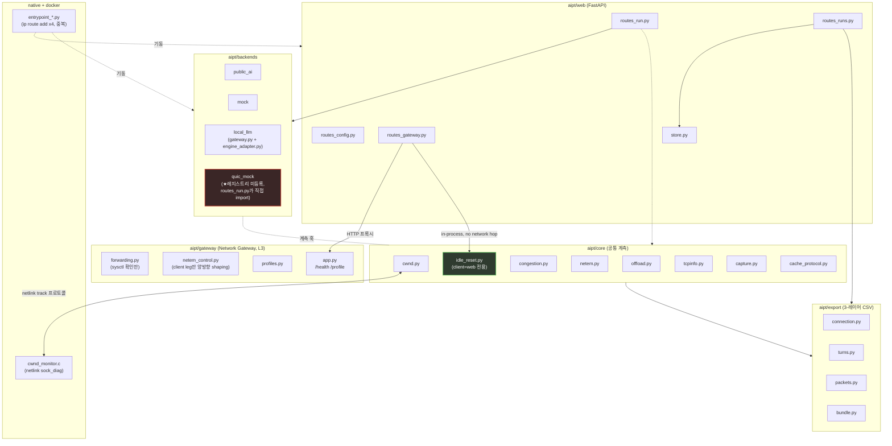

# AIPT 코드-문서 정합성 감사 — INDEX (2026-09-02)

## 배경 / 목적

주인님이 idle-reset 활성화 여부에 따른 성능 실험을 client 쪽에 적용하려는
의도였는데, 실제로는 반대로(서버 쪽) 적용되고 있었던 사례를 계기로,
"의도하지 않은 대로 구현된 부분이 얼마나 더 있는가"를 전 코드베이스
(core/backends/gateway/export/web/native) 단위로 감사했다.

**절차 (역순 금지, 6개 모듈 병렬 서브에이전트 공통 적용)**:
1. 코드를 먼저 전량 정독 (문서 참고 없이) — 함수/클래스별 실제 동작 파악
2. 그 구현이 왜 존재하는지 역으로 추론해 Task 카드 생성 (요구사항 역추적)
3. 모듈 내부/모듈 간 연결관계를 Mermaid 다이어그램으로 작성
4. **마지막 단계에서만** DESIGN.md/ARCHITECTURE.md/MIGRATION.md와 대조해
   불일치를 우선순위순으로 추출

**이번 세션 범위**: 감사·문서화만. 코드 수정 없음(주인님 지시). 발견된
불일치의 수정은 별도 승인 후 다음 세션에서 착수.

**재검증**: 아래 findings 중 idle-reset(★1)과 quic_mock 레지스트리 누락(★는
core.md/web.md/backends.md 근거) 두 건은 제가 직접 `idle_reset.py`,
`routes_gateway.py`, `aipt/backends/__init__.py`, `routes_run.py`를 다시
읽어 파일:라인 근거로 재확인했습니다. 나머지 항목은 각 서브에이전트 보고서의
파일:라인 인용을 신뢰 근거로 채택했습니다(전수 재검증은 아님 — 필요시
개별 항목 요청해 주시면 추가 검증하겠습니다).

## 모듈별 상세 문서

| 모듈 | 문서 | 분량 | Task 카드 수 |
|---|---|---|---|
| core | [core.md](./core.md) | 248줄 | 20 |
| backends | [backends.md](./backends.md) | 459줄 | - |
| gateway | [gateway.md](./gateway.md) | 514줄 | 7 (G1-G7) |
| export | [export.md](./export.md) | 409줄 | - |
| web | [web.md](./web.md) | 451줄 | - |
| native | [native.md](./native.md) | 545줄 | - |

## 전체 아키텍처 (통합)

## 발견된 불일치 — 전체 우선순위표

| # | 심각도 | 모듈 | 발견 내용 | 문서 주장 | 코드 사실 | 근거 |
|---|---|---|---|---|---|---|
| 1 | **정보 공백 (원 이슈 배경)** | core/web | idle-reset 토글 적용 대상 | DESIGN.md/ARCHITECTURE.md 본문에 client-only 방향 서술 자체가 없음(grep 0건) | `idle_reset.py`+`routes_gateway.py` 확인: **client(`web` 프로세스) 자기 자신의 `/proc/sys/net/ipv4/tcp_slow_start_after_idle`만** in-process로 토글. 서버측 라우트(mock-server `/admin/idle-reset`, local-llm sidecar)는 2026-09-02 삭제됨(docstring 이력) | core.md §4.1, web.md §5.1 — **제가 직접 파일:라인 재확인 완료** |
| 2 | **높음 (문서 stale)** | gateway/web | 웹 UI Gateway profile 연동(B11) | DESIGN.md/ARCHITECTURE.md가 "미구현"이라 서술 | `aipt/web/routes_gateway.py`가 이미 완전 구현·테스트됨(GET/POST `/gateway/profile` 프록시), `GATEWAY_HOST`/`GATEWAY_PORT` 실사용 중 | gateway.md §4.1, web.md §5.4 (git log `39c4ea78`,`85dc19fc`로 교차확인) |
| 3 | **중간** | backends | quic_mock이 백엔드 레지스트리에 없음 | (문서는 quic_mock을 §7 애드온으로만 취급) | `aipt/backends/__init__.py`의 `_KNOWN = ("public_ai","mock","local_llm")`에 quic_mock 없음, `routes_run.py`가 `get()` 우회해 직접 import — 실제 `aioquic`(UDP+TLS1.3+QUIC) 스택인데 `NAME="mock"` 재사용 | backends.md §4.1 — **제가 직접 재확인 완료** |
| 4 | **중간** | backends | ARCHITECTURE.md §1.1 다이어그램에 quic_mock 서브그래프 없음 | DESIGN.md §5.2는 이미 이 문제를 자체 인지·기록 | ARCHITECTURE.md는 여전히 미반영 | backends.md §4.1 |
| 5 | **중간** | export | 적응형 cwnd 신뢰도 필드가 core에는 있는데 export에는 없음 | DESIGN.md §4.9 B12: `interval_reason`/`measurement_confidence` 반영 예정 | `cwnd.py`에 필드 존재·`Monitor.result()` 반환하지만 `connection.py`의 `CONNECTION_SUMMARY_COLUMNS`/`connection_summary_csv()`는 누락 (B13 `gap_confidence_summary`와 대칭 조치 필요) | export.md §4.1 |
| 6 | **낮음** | native | HEALTHCHECK 비대칭 | 3개 문서 어디에도 언급 없음 | `local-llm`만 HEALTHCHECK 존재(8080→40080 수정 완료), web/mock-server/gateway/quic-mock-server는 전무 | native.md §3.2 |
| 7 | **낮음** | native | MIGRATION.md Phase 1 체크리스트 stale | `[ ]` 미착수로 표시 | DESIGN.md §6과 실제 코드는 이미 완료·확정 상태 | native.md §3.3 |
| 8 | **낮음** | core | `offload.py`의 두 API 기능 세트 실제로 다름 | DESIGN.md는 "env var 네이밍만 다름"으로 단순화 서술 | capture-time(`tso/gso/gro`) vs entrypoint-time(`tso/gso/sg/gro/lro`) — feature-set 자체가 다름 | core.md §4.2 |
| 9 | **참고** | web | §4.7.1 저장 정책(public_ai만 영속) | "public_ai record만 영속, 나머지 인메모리 50개"라 서술 | 모든 backend run이 `RUN_STORE_DIR`에 디스크 영속화 | web.md §5.2 — 문서가 스스로 이미 stale 인지·경고문 존재, 근본 개정만 대기 |
| 10 | **참고** | gateway | docker-compose.yml 헤더 주석 자기모순 | 헤더 주석이 재설계 이전(`apply_profile_both`, 양쪽 동일 프로파일) 서술 유지 | 서비스 블록 본문은 최신 설계(client leg만 비대칭 shaping)로 이미 반영됨 | gateway.md §4.4 |
| 11 | **참고** | core | `quic_congestion.py`의 `idle_probe` import 부작용 | 결과(드롭다운 옵션)만 언급, 등록 메커니즘 미서술 | `available_algorithms()`가 import 시 `idle_probe`를 부작용으로 등록 | core.md §4.6 |
| 12 | **참고** | native | C↔Python NDJSON 필드 순서 불일치 | 40개 필드 집합은 완전 일치 | `rto_us`/`ato_us` 나열 순서가 실제 printf 순서와 다름(JSON 키 기반이라 기능 영향 없음) | native.md §1.2 |

## 원래 문제 제기(idle-reset "반대로 적용") 재확인 결론

**현재 코드는 문서가 의도한 대로(client-only) 구현되어 있습니다.**
`idle_reset.py`/`routes_gateway.py` docstring에 "2026-09-02 REDESIGNED
(operator direction)"이라고 명시된 것으로 보아, **이전 세션에서 이미
반대 적용 문제를 발견하고 client-only로 재설계·수정하셨던 것으로 보입니다**
(서버측 admin route/sidecar는 삭제됨). 다만 이 재설계 사실이 DESIGN.md/
ARCHITECTURE.md 본문에는 전혀 반영되어 있지 않아(#1), 문서만 보면 어느
소켓이 토글되는지 알 수 없는 상태입니다 — 이번 감사로 처음 발견된 "숨은
불일치"라기보다 "이미 고친 것이 문서화 안 됨"에 가깝습니다.

## 다음 단계 제안 (승인 필요, 이번 세션에서는 실행 안 함)

1. **#1, #2 우선 해결**: DESIGN.md/ARCHITECTURE.md에 idle-reset client-only
   방향과 routes_gateway.py 구현 완료 사실을 반영 (문서만 갱신, 코드 변경 없음)
2. **#3, #4**: quic_mock을 정식 4번째 backend로 승격할지 spike 격리 유지할지
   결정 필요 (T3, 이전 seed에서도 미결정 항목)
3. **#5**: export 계층에 `interval_reason`/`measurement_confidence` 컬럼 추가
4. **#6~#12**: 문서 동기화 위주 저비용 정리 (일괄 처리 가능)

각 항목 착수 여부/순서는 주인님 승인 후 결정하겠습니다.
