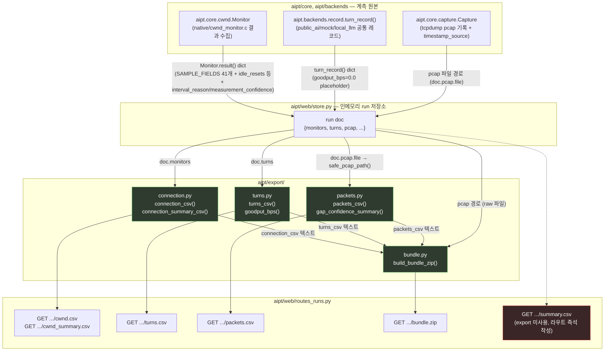

# `aipt/export/` 코드 감사 (2026-09-02)

대상: `aipt/export/{__init__.py, connection.py, turns.py, packets.py, bundle.py}`,
참고: `tests/export/*`, 소비자 `aipt/web/routes_runs.py`,
데이터 소스 `aipt/core/cwnd.py`, `aipt/backends/record.py`, `aipt/core/capture.py`.

감사 방식: 코드를 먼저 전부 읽고(1절), 설계 의도를 역추론하고(2절),
데이터 흐름을 Mermaid로 그린 뒤(3절), 마지막에 DESIGN.md/ARCHITECTURE.md/MIGRATION.md와
대조했다(4절). 인용은 모두 실제 파일:라인.

---

## 1. 코드 확인 — 각 레이어가 실제로 만드는 데이터

### 1.0 `__init__.py` (모듈 docstring, 코드 없음)

`aipt/export/__init__.py:1-20`은 모듈 전체를 요약하는 docstring만 갖고 있고
런타임 코드는 없다(`from __future__ import annotations` 한 줄뿐, 1:20).
docstring이 스스로 밝히는 3-레이어 구성:

- `connection.py` → `cwnd.csv`/`cwnd_summary.csv`, `aipt.core.cwnd.Monitor` 기원 (1:8-9)
- `turns.py` → `turns.csv`, `aipt.backends.record.turn_record()` 기원 + `goodput_bps`(B7) (1:10-12)
- `packets.py` → `packets.csv`(B6, 신규), pcap 파싱 (1:13-14)
- `bundle.py` → 위 셋 + raw pcap을 zip으로 묶음 (1:16-17)

### 1.1 `connection.py` — layer 1 (`cwnd.csv` / `cwnd_summary.csv`)

**소스**: `aipt.core.cwnd.Monitor.result()`가 반환하는 dict 리스트
(`connection.py:40` `from aipt.core import cwnd as cwndmon`). 코드는 `Monitor`를
직접 생성하지 않고, 이미 만들어진 `result()` dict들만 소비한다 — docstring이
"caller가 하나 이상의 monitor 결과를 모아 리스트로 넘긴다"고 명시 (connection.py:7-9).

**`connection_csv(monitors)`** (connection.py:57-78): raw per-tick 시리즈,
"(label, tick, socket)"당 1행.

- 컬럼: `CONNECTION_COLUMNS = ["label", "host", "port", *cwndmon.SAMPLE_FIELDS]`
  (connection.py:45-46) — `SAMPLE_FIELDS`는 `aipt/core/cwnd.py:101-112`에서 정의된
  41개 필드(`t_ms, wall, local, remote, state, ca_state, snd_cwnd, snd_ssthresh,
  rcv_ssthresh, rtt_us, ..., inode`)를 그대로 물려받는다. export 계층이 필드
  이름/순서를 재정의하지 않고 core의 것을 `dict.fromkeys`로 중복만 제거해 그대로 씀
  (connection.py:45).
- 각 `mon`(= `Monitor.result()`)의 `samples` 리스트(core의 netlink 헬퍼가 NDJSON으로
  쌓은 tick 샘플, `aipt/core/cwnd.py:489-491` `_drain()`에서 append)를 순회하며
  `label/host/port` 헤더 + `SAMPLE_FIELDS`만 뽑아 한 행씩 씀 (connection.py:71-77).
- `monitors=[]`(cwnd 비활성/미사용)이면 헤더만 있는 CSV — "모니터링 안 함"과
  "관측했지만 아무것도 못 봄"을 구분한다는 주석 (connection.py:64-66).

**`connection_summary_csv(monitors)`** (connection.py:81-113): 라벨당 1행 요약.

- 컬럼(`CONNECTION_SUMMARY_COLUMNS`, connection.py:48-54): `label, host, port, ips,
  interval_ms, samples, ticks, seconds, sockets, announced, dumps, exact_queries,
  tracked, peak_cwnd, final_cwnd, idle_resets, truncated, error`.
- 값은 모두 `mon.get(...)`로 `Monitor.result()`의 동일 키에서 그대로 옮겨온다
  (connection.py:93-112). `idle_resets`는 core가 계산한 값을 그대로 실어 나를 뿐,
  export 계층은 재계산하지 않는다.
- **주의(코드로 확인한 사실, 4절에서 다시 다룸)**: `Monitor.result()`는
  `interval_reason`과 `measurement_confidence`도 반환한다
  (`aipt/core/cwnd.py:529-530`, B12 적응형 샘플링). 하지만
  `CONNECTION_SUMMARY_COLUMNS`에는 이 두 필드가 없다 — `connection.py` 전체를
  검색해도 `interval_reason`/`measurement_confidence` 문자열이 한 번도 등장하지
  않는다. `interval_ms`만 실려서(connection.py:49,98) 어떤 값이든 정적으로 보이고,
  "왜 이 interval인지"(fixed vs adaptive:rtt=Xms vs floor_clamped)와 "이 tick
  간격을 얼마나 신뢰해도 되는지"는 CSV에서 사라진다.

### 1.2 `turns.py` — layer 2 (`turns.csv`)

**소스**: `aipt.backends.record.turn_record()`가 만드는 dict
(turns.py:3-8). 세 백엔드(`public_ai`/`mock`/`local_llm`)가 모두 이 함수 하나만
거쳐 턴 레코드를 만든다는 게 전제(`aipt/backends/record.py:5-9`, `turn_record()`
자체 구현 114-195).

- `_CORE_COLUMNS`(turns.py:49-58): `schema_version, backend, arm, phase, turn,
  measure, transport, wire_sent, wire_recv, req_payload_bytes, resp_payload_bytes,
  req_sent_ms, ttfb_ms, ttft_ms, ttlt_ms, turn_end_ms, store_tail_ms, input_tokens,
  cached_tokens, output_tokens, reasoning_tokens, total_tokens, goodput_bps,
  cache_bytes_saved, error` — `turn_record()`가 실제로 채우는 키(record.py:146-192)와
  1:1 대응. `provider`는 `backend`로 리네임됐다는 사실이 turns.py:15와
  record.py:13에 각각 명시.
- `_OPTIONAL_COLUMNS`(turns.py:65-68): `prompt_bytes, request_ms, idle_ms,
  probe_count, probe_rtt_mean_ms, probe_rtt_min_ms, probe_rtt_max_ms` — tcp_congestion
  계열 전용, `turn_record()`의 `extra` dict로만 채워짐(record.py:125,193-194).
  안 채우는 백엔드는 값이 `""`가 됨(`row = {c: rec.get(c, "")...}`, turns.py:124).
- `request_raw/response_raw/question/response_text`는 **의도적으로 CSV에서 제외**
  (`extrasaction="ignore"`, turns.py:73-75,121) — "증거는 런의 JSON에 남기고
  스프레드시트 셀에는 안 담는다"는 규칙.
- **`goodput_bps(record)`**(turns.py:78-103): `(wire_recv>0이면 wire_recv, 아니면
  resp_payload_bytes) * 8 / ((turn_end_ms - req_sent_ms)/1000)`. 창구간이 0 이하거나
  바이트가 0 이하면 `0.0` (turns.py:96-102) — 예외를 던지지 않고 "측정 안 됨"으로
  읽히게 함.
- **`turn_record()`가 저장 시점엔 `goodput_bps=0.0`으로 남겨둔다**는 사실이
  `record.py:173-176`에 명시돼 있고, `turns_csv()`가 매 행마다
  `row["goodput_bps"] = goodput_bps(rec)`로 **재계산**한다(turns.py:125) — 즉
  런 저장 당시의 0은 export 시점에 export 계층의 바이트/창 규약으로 다시 채워진다.
- `turns_csv(records)`(turns.py:106-127): prep phase(`cachegen` 등) 행도 그대로
  포함, 스팀 턴만 남기고 싶은 독자는 `phase=="steady"`로 직접 필터하라는 방침
  (turns.py:107-111).

### 1.3 `packets.py` — layer 3 (`packets.csv`, B6 신규)

**소스**: `aipt.core.capture`가 이미 디스크에 쓰는 pcap 파일(경로만 받음,
`aipt.core.capture` 모듈 자체는 import하지 않음 — packets.py는 pcap 바이트만 다룸,
packets.py:1-3, gap_confidence_summary도 마찬가지로 `timestamp_source` dict를
파라미터로만 받아 core를 import하지 않음, packets.py:237, 367 MIGRATION.md와 대조 시
"export/core 간 의존성 방향 유지" 의도로 명시돼 있음).

- 두 개의 파서: `_iter_packets_dpkt`(dpkt optional dep 있을 때, packets.py:118-150)와
  `_iter_packets_stdlib`(struct만으로 classic pcap 파싱, packets.py:68-115). 우선순위는
  `iter_packets()`(packets.py:153-164)에서 `dpkt is not None`이면 dpkt 경로.
- `PACKET_COLUMNS = ["index", "ts", "ts_ms", "gap_ms", "caplen", "wire_len",
  "truncated"]` (packets.py:44-46).
- `packets_csv(pcap_path)`(packets.py:167-214): pcap이 없으면(`path.exists()` False)
  헤더만 반환(packets.py:196-198) — "모니터링 안 함"과 같은 규약을 pcap 레이어에서도
  반복. 있으면 패킷을 순서대로(=도착 순서, capture 순서와 동일하다고 docstring이
  명시, packets.py:158-159) 순회하며 `gap_ms`(첫 패킷은 `""`, packets.py:203)와
  `truncated = caplen < wire_len`(packets.py:211, snaplen에 의한 잘림)을 계산.
- `gap_confidence_summary(pcap_path, timestamp_source=None)`(packets.py:226-291):
  DESIGN.md의 B13. **`packets.csv`의 컬럼이 아니라 별도 dict**를 반환 —
  "packets.csv 스키마는 다른 툴이 읽는 안정 계약이므로 컬럼을 늘리지 않는다"는
  이유가 packets.py:186-190, 229-232에 명시. `median_gap_ms < 1.0ms`이고
  `timestamp_source.get("hardware_timestamping")`가 False/None이면 경고 문장을
  채움(packets.py:268-284); `timestamp_source`가 없으면(caller가 캡처를 안
  돌렸으면) `hardware=None`으로 시작해 "불명" 경고만 나감(packets.py:263-265).
- `write_pcap(...)`(packets.py:302-318)는 테스트 픽스처 생성용 minimal pcap writer —
  운영 코드가 아니라 "실제 pcap 없이 두 파서를 왕복 검증"하기 위한 헬퍼로,
  packets.py 안에 의도적으로 둠(주석, packets.py:294-300).

### 1.4 `bundle.py` — 3-레이어 CSV + pcap을 zip으로 묶기

**소스**: `connection_csv`/`turns_csv`/`packets_csv`의 **렌더링된 텍스트**
(이미 만들어진 CSV 문자열)와 pcap **경로**만 받는다 — bundle.py 자체는
run/backend/HTTP를 전혀 모른다(bundle.py:8-10).

- `slugify(label, default="run")`(bundle.py:28-37): `_SAFE_SLUG =
  re.compile(r"[^a-z0-9_-]+")`(bundle.py:25)로 소문자화 + 비허용 문자를 `-`로 치환,
  전부 사라지면 `default`로 폴백(빈 zip 엔트리 이름을 만들지 않기 위해).
- `build_bundle_zip(...)`(bundle.py:40-86): `connection_csv/turns_csv/packets_csv`
  각각이 `None`이면 해당 zip 엔트리 자체를 안 만듦(bundle.py:67-72) —
  "측정 안 함"(엔트리 없음)과 "측정했지만 비어 있음"(export 계층이 이미 헤더만
  CSV로 만든 경우)을 구분. pcap은 `path.exists()`일 때만 포함, 없으면 조용히
  스킵(bundle.py:74-81). `extra_files` dict로 임의 파일(예: run.json) 추가 가능
  (bundle.py:83-84).
- 엔트리 이름은 `{slug}_cwnd.csv` / `{slug}_turns.csv` / `{slug}_packets.csv`
  (bundle.py:68,70,72).
- `bundle_zip_name(label)`(bundle.py:89-93): 다운로드 파일명
  `aipt_{slug}_bundle.zip`.

### 1.5 소비자: `aipt/web/routes_runs.py`

export 함수들의 유일한 실사용처(코드베이스 검색 결과 `from aipt.export import`는
이 파일 하나, `routes_runs.py:16-19`). 라우트별 매핑:

| 라우트 | 호출 | 데이터 소스(런 저장소 dict 키) |
|---|---|---|
| `GET /api/runs/{id}/turns.csv` | `turns_mod.turns_csv(doc.get("turns"))` (routes_runs.py:69) | `doc["turns"]` |
| `GET /api/runs/{id}/cwnd.csv` | `connection_mod.connection_csv(doc.get("monitors"))` (114) | `doc["monitors"]` |
| `GET /api/runs/{id}/cwnd_summary.csv` | `connection_mod.connection_summary_csv(...)` (123) | 동일 |
| `GET /api/runs/{id}/packets.csv` | `packets_mod.packets_csv(path or "__no_such_file__.pcap")` (137-141) | `doc["pcap"]["file"]` → `capture_mod.safe_pcap_path()` |
| `GET /api/runs/{id}/bundle.zip` | `bundle_mod.build_bundle_zip(...)`에 위 세 CSV 텍스트 + pcap 경로 전달 (159-165) | 위 전부 |
| `GET /api/runs/{id}/summary.csv` | **export 모듈을 쓰지 않고** 라우트 자체에서 `csv.DictWriter`로 즉석 작성 (routes_runs.py:85-105) | `doc` 최상위 필드 |

`summary.csv`는 `aipt/export/`의 4개 파일 어디에도 대응 함수가 없다 —
export 3-레이어 밖에서 독립적으로 존재하는 4번째 CSV(런당 1행 요약)라는 점을
확인. `_tag(doc)`(routes_runs.py:57-61)가 `mock_` 접두어를 붙이는 것도
`aipt/export/` 자체가 아니라 라우트 계층의 책임.

---

## 2. Task 카드 — 왜 이렇게 구현했나 (역추론)

### T1. `label` 단일 컬럼 (provider/arm/kind 분리 안 함)
- **관찰**: `CONNECTION_COLUMNS`/`CONNECTION_SUMMARY_COLUMNS`는 `label` 하나만 갖고
  `provider`/`arm`/`kind`로 다시 쪼개지 않는다(connection.py:26-32).
- **근거(코드 인용)**: connection.py:26-32 — "the monitor itself only knows a single
  opaque label string ... the export layer never has an opinion about a format
  the monitor itself does not enforce."
- **왜**: `aipt.core.cwnd.Monitor`가 애초에 `label: str`만 받는 설계(core/cwnd.py의
  라벨 관련 docstring, connection.py 인용과 일치)이므로, export가 구조를 추측해서
  재조립하면 core가 몰라도 되는 포맷 규약을 export가 대신 강요하게 된다. 그래서
  분리 책임은 라벨을 만드는 caller(`f"{backend}:{arm}:{kind}"`)에게 남기고
  export는 그 문자열을 그대로 옮긴다.

### T2. `goodput_bps`를 저장 시점이 아니라 export 시점에 계산
- **관찰**: `turn_record()`는 `goodput_bps=0.0`으로 고정(record.py:173-176),
  `turns_csv()`가 매번 재계산(turns.py:125).
- **왜**: goodput 계산은 "이 레코드 하나"의 정보만으로는 안 되고, export 계층이
  정의한 바이트 우선순위(`wire_recv` 우선, 없으면 `resp_payload_bytes`)와 0-분모
  가드 규약이 필요하다(turns.py:78-103 docstring). 이 규약을 레코드 생성 시점
  (백엔드마다 제각각 호출)에 흩어 두면 세 백엔드가 각자 다르게 구현할 위험이 있어,
  "레코드는 원재료만 갖고, CSV를 만드는 단일 지점에서 유도값을 계산"하는 구조로
  강제한 것으로 읽힌다. 부가 효과: 저장된 JSON을 나중에 다시 읽어 CSV를 재생성해도
  항상 최신 export 규약으로 계산되어(레코드 자체를 마이그레이션할 필요 없음) 값이
  일관된다.

### T3. `packets.csv`에 dpkt optional + stdlib fallback 이중 구현
- **관찰**: `dpkt`는 `pyproject.toml`의 `export` extra(옵션)이고, 없으면
  `_iter_packets_stdlib`가 대신 돈다(packets.py:39-42, 68-115).
- **왜**: DESIGN.md 4.6 B6가 "pcap 파싱은 완전 신규"라고만 했지 "신규 하드 의존성
  이 없으면 이 패키지의 어떤 테스트도 못 돌린다"고는 안 했다는 게 packets.py의
  docstring이 스스로 대는 이유(packets.py:13-20). 즉 오프라인/의존성 미설치
  체크아웃에서도 최소 기능(고전 pcap 파싱)은 보장하려는 결정.

### T4. `gap_confidence_summary`를 `packets.csv`의 컬럼이 아니라 별도 함수/dict로 분리
- **관찰**: B13(타임스탬프 정밀도)은 `packets.csv`에 컬럼을 추가하지 않고
  `gap_confidence_summary()`라는 새 함수가 반환(packets.py:226-291).
- **왜**: `PACKET_COLUMNS`는 "다른 툴이 이미 파싱하는 안정된 스키마"
  (`test_packets.py`의 헤더 검사를 코드가 직접 지목, packets.py:186-190)이고,
  B13의 신뢰도 판단은 애초에 패킷 단위가 아니라 캡처(run) 단위 판정
  ("per-capture 판정, per-packet 아님", packets.py:230-232)이라 컬럼을 늘리는 것
  자체가 개념적으로 안 맞는다. 스키마 안정성(하위 호환)을 컬럼 추가보다 우선한
  결정.

### T5. `bundle.py`가 zip 로직만 갖고 run/HTTP를 전혀 모름
- **관찰**: `build_bundle_zip()`은 렌더링된 CSV 텍스트와 pcap 경로만 받는 순수
  함수(bundle.py:40-86); 어떤 run store나 FastAPI 객체도 참조하지 않는다.
- **왜**: `tcp_congestion/tcp_congestion/app.py`의 `download_bundle_zip` 라우트가
  했던 일(zip 만들기)에서 "라우트"라는 부분만 떼어내 재사용 가능하게 만든 것
  (bundle.py:1-10, MIGRATION.md Phase 4.6도 "라우트 비의존 형태로 일반화" 명시).
  결과적으로 `aipt/web/routes_runs.py`가 이 함수를 얇게 감싸기만 하면 되고,
  CLI나 다른 테스트도 HTTP 없이 같은 zip을 만들 수 있다.

### T6. 결측/미사용을 "0"이 아니라 `""`/헤더뿐/엔트리 없음으로 표현하는 반복 패턴
- **관찰**: `connection_csv([])`→헤더만(connection.py:64-66), `turns.csv`의
  optional 컬럼→`""`(turns.py:60-64), `packets.csv`의 첫 행 `gap_ms`→`""`
  (packets.py:171-174), `bundle.py`의 `csv=None`→엔트리 없음(bundle.py:52-57).
- **왜**: 세 레이어 모두 독립적으로 구현됐는데도 이 규약이 반복되는 걸 보면
  "측정을 안 함"과 "측정했지만 값이 0/없음"을 구분하는 것이 이 모듈군 전체의
  설계 원칙으로 자리잡았음을 알 수 있다(각 파일이 서로를 "같은 규칙을 따른다"고
  교차 인용: turns.py:28-29가 record.py의 `store_tail_ms`를, packets.py:172-174가
  record.py의 규칙을 각각 언급).

---

## 3. 데이터 흐름 (Mermaid)

---

## 4. 문서 대조 (DESIGN.md / ARCHITECTURE.md / MIGRATION.md) — 불일치 우선

### 4.1 [불일치, 최우선] `interval_reason`/`measurement_confidence`가 core에는 있고 export에는 없음

- **DESIGN.md §4.9 B12** (DESIGN.md:525): "적응형 cwnd 샘플링 주기 —
  `aipt/core/cwnd.py`에 `interval_from_rtt(rtt_ms, k=...)` 헬퍼 추가 ...
  **결과에 `interval_reason`/`measurement_confidence` 필드 추가**".
- **코드 확인**: `aipt/core/cwnd.py:169-172`에 `interval_from_rtt()` 구현 존재,
  `Monitor.__init__`이 `self.interval_reason`/`self.measurement_confidence`를
  세 경로(fixed / adaptive:rtt=Xms / floor_clamped)로 설정
  (`aipt/core/cwnd.py:332-344`), `result()`가 이 둘을 실제로 반환
  (`aipt/core/cwnd.py:529-530`). B12는 DESIGN.md/MIGRATION.md 어디에도 "완료"
  체크가 안 달려 있지만(§4.9 B12 표에는 완료 마크가 없고, MIGRATION.md 전체
  검색에서 "B12"/"interval_from_rtt"/"적응형" 문자열이 0건) **코드는 실제로
  구현·동작 중**이다.
- **`aipt/export/connection.py`**: `CONNECTION_SUMMARY_COLUMNS`
  (connection.py:48-54)에 `interval_ms`만 있고 `interval_reason`,
  `measurement_confidence`는 없음. `connection_summary_csv()`도 이 두 키를
  전혀 읽지 않음(connection.py:93-112) — `mon.get("interval_reason", ...)` 같은
  호출이 파일 전체에 없다.
- **영향**: core가 "이 tick 간격이 왜 이 값인지, 짧은 RTT 경로에서 이 샘플을
  얼마나 신뢰할 수 있는지"를 계산해서 `result()`에 넣어주는데, 유일한 소비자인
  `cwnd_summary.csv`가 이를 버린다. B13(packets.csv의 `gap_confidence_summary`)이
  같은 목적(짧은 gap 신뢰도)으로 별도 dict를 추가한 것과 대칭적으로,
  `connection.py`도 같은 문제(짧은 tick 간격 신뢰도)를 이미 core가 풀어놨는데
  export가 옮기지 않은 것 — B13 구현 시점에 B12 필드를 함께 실어야 했던 것으로
  보이는 누락.
- **문서 자체의 정합성**: DESIGN.md §4.9 B12 항목(DESIGN.md:525)에 완료
  체크(`[x]`)가 없다는 점에서, 문서상으로도 "설계는 됐지만 완료 확인이 안 된
  항목"으로 남아 있다 — 코드는 core 쪽은 끝났고 export 쪽만 비어 있는 상태와
  문서의 미완료 표시가 실제로 일치한다(문서가 틀렸다기보다, 문서가 옳게
  "미완료"라 적어둔 작업이 export 레이어에서 방치돼 있다는 뜻).

### 4.2 [일치] 3-레이어 구성과 소스

- **DESIGN.md §4.6**(DESIGN.md:218-229) 표: `cwnd.csv`←기존 `cwnd.py`,
  `turns.csv`←token_traffic records.csv + tcp_congestion turns.csv 병합 +
  goodput(B7), `packets.csv`←pcap에서 신규 추출. 코드(1.1~1.3절)와 정확히 일치.
- **DESIGN.md §4.5 폴더 구조**(DESIGN.md:207-211): `export/turns.py`,
  `export/packets.py`(B6), `export/connection.py`(기존 그대로) — 실제 파일
  구성과 일치.
- **ARCHITECTURE.md §1.1 Mermaid**(ARCHITECTURE.md:59-65): `EXPORT` 서브그래프에
  `Connection/Turns/Packets/Bundle` 4개 노드, `CORE --> EXPORT --> WEBAPP` 화살표
  — 본 감사 3절의 흐름도와 방향이 일치(core→export→web).
- **ARCHITECTURE.md §1.2**(ARCHITECTURE.md:155-157): `export/` 폴더에
  `connection.py / turns.py / packets.py / bundle.py` 4개 파일 나열, 실제와 일치.

### 4.3 [일치] `bundle.zip` 구조 유지 방침

- **DESIGN.md §4.6**(DESIGN.md:229): "세 CSV + pcap을 기존 `bundle.zip` 방식으로
  묶어서 다운로드하는 구조는 유지." `bundle.py`의 실제 구현(1.4절)이 정확히 이
  구조(3 CSV + pcap, zip)를 따름 — 일치.
- **MIGRATION.md Phase 4.6**(MIGRATION.md:103): "`TC/tcp_congestion/app.py`의
  `download_bundle_zip` 로직을 라우트 비의존 형태로 일반화(`build_bundle_zip()`)"
  — bundle.py:1-10 docstring이 스스로 같은 계보를 명시, 일치.

### 4.4 [일치] `label` 단일 컬럼 결정

- **DESIGN.md §6 결정#1**(DESIGN.md:611-612): "`label: str` 단일 문자열로
  통일됨." connection.py:26-32의 설명과 완전히 일치(2절 T1 참고).

### 4.5 [일치] B7 goodput 계산식

- **DESIGN.md §5 B7**(DESIGN.md:255): "기존 wire_sent/recv + 마크
  (req_sent_ms~turn_end_ms)로 턴별 goodput 산출" → `aipt/export/turns.py`에
  컬럼 추가. **MIGRATION.md Phase 4.6**(MIGRATION.md:101): 정확한 계산식까지
  명시 — "`(wire_recv 또는 resp_payload_bytes) * 8 / (turn_end_ms - req_sent_ms)`,
  0-나눗셈 가드". `turns.py:78-103`의 실제 구현(1.2절)과 계산식·가드 모두 일치.

### 4.6 [일치] B6 packets.csv 구현 방식

- **MIGRATION.md Phase 4.6**(MIGRATION.md:102): "`dpkt` optional dependency +
  순수 stdlib(`struct`) classic-pcap 파서 폴백 양쪽 구현, 실제 pcap 파일 없이
  `write_pcap()` 헬퍼로 합성 픽스처 생성 후 라운드트립 테스트." packets.py의
  실제 구조(1.3절, `_iter_packets_dpkt`/`_iter_packets_stdlib`/`write_pcap`)와
  완전히 일치.

### 4.7 [일치] B13 gap_confidence_summary가 별도 함수인 이유

- **MIGRATION.md Phase 4.9**(MIGRATION.md:361-368): "기존 `packets_csv()`의
  `PACKET_COLUMNS` 스키마(컬럼 순서/개수)는 건드리지 않음. 대신 신규
  `gap_confidence_summary(pcap_path, timestamp_source=None) -> dict` 별도 함수
  추가 ... `aipt.core.capture`를 import하지 않고 `timestamp_source` dict를
  파라미터로만 받아 export/core 간 의존성 방향 유지." packets.py:226-291의
  실제 구현·의존성 방향과 정확히 일치(2절 T4).

### 4.8 [문서 내부 상호 참조 확인] `summary.csv`는 export 3-레이어 밖

- ARCHITECTURE.md/DESIGN.md 어디에도 "`summary.csv`가 `aipt/export/`에 속한다"는
  진술은 없다 — DESIGN.md §4.6 표는 3개 레이어(connection/turns/packets)만
  기술하고, `summary.csv`는 `aipt/web/routes_runs.py` 라우트 docstring
  (routes_runs.py:75-80)에서 "token_traffic의 summary.csv를 라우트 URL parity를
  위해 유지, turns.csv에 안 넣고 별도 엔드포인트로 뒀다"는 설명만 있다. 즉
  코드와 설계 문서가 **둘 다** `summary.csv`를 export 3-레이어의 일부로
  다루지 않는다는 점에서 서로 모순 없이 일치 — 다만 `aipt/export/` 감사
  범위 밖의 4번째 CSV가 라우트 계층에 산재해 있다는 사실 자체는 export 모듈
  경계를 확인하는 과정에서 기록해 둘 가치가 있다(1.5절).

---

## 요약

| # | 항목 | 상태 |
|---|---|---|
| 1 | `interval_reason`/`measurement_confidence`(B12, core에 구현됨)가 `cwnd_summary.csv`에 없음 | **불일치 / 누락** |
| 2 | 3-레이어 구성·소스·폴더 구조 (DESIGN §4.5/4.6, ARCHITECTURE §1.1/1.2) | 일치 |
| 3 | `bundle.zip` 구조 유지 (DESIGN §4.6, MIGRATION Phase 4.6) | 일치 |
| 4 | `label` 단일 컬럼 결정 (DESIGN §6 결정#1) | 일치 |
| 5 | B7 goodput 계산식 (DESIGN §5, MIGRATION Phase 4.6) | 일치 |
| 6 | B6 packets.csv dpkt+stdlib 이중 구현 (MIGRATION Phase 4.6) | 일치 |
| 7 | B13 gap_confidence_summary 별도 함수·의존성 방향 (MIGRATION Phase 4.9) | 일치 |
| 8 | `summary.csv`는 export 3-레이어 밖 (코드·문서 공통 인식) | 일치(범위 확인) |

가장 시급한 후속 조치는 **§4.1**: `aipt/export/connection.py`의
`CONNECTION_SUMMARY_COLUMNS`에 `interval_reason`, `measurement_confidence`를
추가하고 `connection_summary_csv()`가 `mon.get("interval_reason", "")`,
`mon.get("measurement_confidence", "")`를 채우도록 하는 것 — B12가 만든 신뢰도
정보가 지금은 core의 `Monitor.result()` dict 안에서만 존재하고 어떤 CSV/zip
산출물에도 도달하지 못한다.
