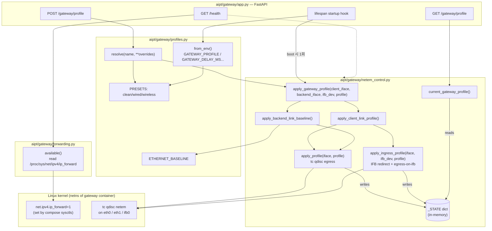
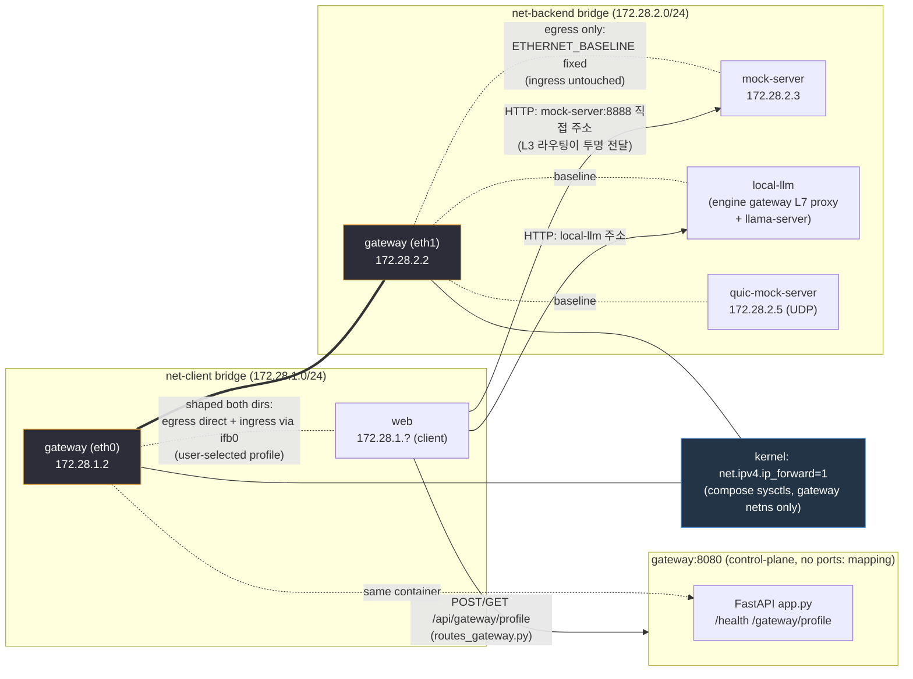

# Network Gateway (`aipt/gateway/`) 코드 감사 — 2026-09-02

대상: `aipt/gateway/{app.py,forwarding.py,netem_control.py,profiles.py,__init__.py}`,
`docker/Dockerfile.gateway`, `docker-compose.yml`의 `gateway` 서비스 정의,
`tests/gateway/*`, `tests/web/test_routes_gateway.py`, `aipt/web/routes_gateway.py`.

감사 방법: 코드/설정을 라인 단위로 먼저 정독하고(1절), 설계 의도를 역추론하고(2절),
연결 관계를 다이어그램화한 뒤(3절), 마지막에 DESIGN.md/ARCHITECTURE.md/MIGRATION.md와
대조했다(4절). 코드 수정 없음, 감사 전용.

---

## 1. 구현 현황 (코드 인용 기반)

### 1.1 L3 IP forwarding — `aipt/gateway/forwarding.py`

- Gateway는 애플리케이션 레벨 프록시가 아니라 순수 커널 L3 포워딩 훅이라는 것이
  모듈 독스트링에 명시됨: "no application-level proxy code, no TCP payload/header
  inspection" (forwarding.py:4-8).
- 실제 라우팅 자체는 이 모듈이 하지 않는다 — **커널이 한다.**
  `docker-compose.yml`의 `sysctls: [net.ipv4.ip_forward=1]` (compose L143-144)가
  라우팅을 켜는 유일한 지점이고, 이 모듈은 그게 실제로 적용됐는지 런타임에
  `/proc/sys/net/ipv4/ip_forward`를 읽어 확인만 한다 (`IP_FORWARD_PATH`,
  forwarding.py:29,45-59).
- `read_ip_forward()`는 파일 내용이 정확히 `"1"`일 때만 `(True, "ready")`를
  반환하고, 그 외(파일 없음/권한 없음/"0")는 `(False, reason)`을 반환 —
  절대 예외를 던지지 않음(forwarding.py:45-59).
- `available()`/`status()`는 `netem_control`과 동일한 `(ok, reason)` /
  `{"ok": bool, "reason": ...}` 계약을 따름(forwarding.py:62-75) — `GET /health`에서
  바로 노출하기 위한 설계(주석에 명시).

**결론**: 이 모듈에는 `iptables`도, 라우팅 테이블 조작 코드도 없다. IP forwarding은
100% 커널 sysctl + Docker 브리지 네트워크 조합으로 이뤄지고, 이 파일은 감사/확인
전용이다.

### 1.2 tc netem 적용 — `aipt/gateway/netem_control.py`

**두 인터페이스, 비대칭 처리** (2026-09 client-link-only 재설계, 모듈 독스트링
L20-40에 근거 서술):

- `DEFAULT_CLIENT_IFACE`: env `GATEWAY_CLIENT_IFACE` (fallback `GATEWAY_IFACE`,
  기본 `eth0`) — netem_control.py:70.
- `DEFAULT_BACKEND_IFACE`: env `GATEWAY_BACKEND_IFACE` (기본 `eth1`) —
  netem_control.py:71.
- `DEFAULT_IFB_DEV`: env `GATEWAY_IFB_DEV` (기본 `ifb0`) — netem_control.py:75.
- Docker가 멀티 네트워크 attach 시 eth0/eth1 순서를 보장하지 않으므로 하드코딩 대신
  명시적 env override로 받는다는 주석(netem_control.py:66-69) — 실제로
  docker-compose.yml에서 `GATEWAY_CLIENT_IFACE=eth0`, `GATEWAY_BACKEND_IFACE=eth1`을
  명시적으로 주입함(compose L152-153).

**client_iface (양방향)**:
- **egress (Gateway→client, 응답 leg)**: `apply_profile(client_iface, profile)` →
  `build_commands()`가 `tc qdisc del ... root` 후 `tc qdisc add ... root handle 1:
  netem <args>` + `tc qdisc add ... parent 1: handle 10: fq`를 생성
  (netem_control.py:112-135). fq 자식 큐잉은 BBR pacing 보존 목적(주석,
  L131-133).
- **ingress (client→Gateway, 요청 leg)**: tc netem은 egress만 shape할 수 있으므로
  IFB(Intermediate Functional Block)로 우회. `apply_ingress_profile()`이
  ① `build_ifb_setup_commands(ifb_dev)` = `modprobe ifb` + `ip link add <ifb> type
  ifb` + `ip link set dev <ifb> up` (L158-170), ② `build_ingress_redirect_commands()`
  = `tc qdisc add dev <iface> handle ffff: ingress` + `tc filter ... u32 ... action
  mirred egress redirect dev <ifb>` (L138-155), ③ 그 `ifb_dev`의 **egress**에
  `build_commands(ifb_dev, profile)`을 적용(L259) — 순서대로 실행
  (netem_control.py:242-273).
- `apply_client_link_profile()`이 egress+ingress 둘 다 시도하고, 둘 다 성공해야
  `ok: True` (netem_control.py:306-343).

**backend_iface (고정 baseline만)**:
- `apply_backend_link_baseline()`은 사용자가 뭘 선택했든 항상
  `profiles.ETHERNET_BASELINE`만 `apply_profile(backend_iface, ...)`로 적용
  (netem_control.py:346-354). ingress는 건드리지 않음 — baseline이 무손상이라
  shaping할 이유가 없다는 주석(L351-352).
- `apply_gateway_profile()`이 top-level 진입점: client link(양방향) + backend
  baseline을 모두 적용하되, 반환 `ok`는 **client link 성공 여부로만 결정**된다.
  backend 실패는 `backend.ok=False`로 리포트되지만 top-level `ok`를 뒤집지
  않음(netem_control.py:357-407, 특히 385-391 docstring 및 396-406 구현).

**idempotent 재적용**: `tc qdisc del ... root`가 빈 인터페이스에서 nonzero를
반환하는 경우, `ip link add`가 이미 존재하는 디바이스에 재시도되는 경우,
`modprobe`가 이미 로드된 모듈에 재시도되는 경우 모두 실패로 취급하지 않고
`(True, "")`로 흡수(`_run()`, netem_control.py:194-213, 특히 210-211).

**never raises 계약**: `CAP_NET_ADMIN` 부재/`tc` 미설치/`ifb` 커널 모듈 부재 등은
모두 예외가 아니라 `{"ok": False, "reason": "..."}`으로 리포트
(`_NO_TC`/`_NO_CAP_ADMIN`/`_NO_IFB` 상수, netem_control.py:77-91).

**상태 저장**: `_STATE` 딕셔너리(in-memory, 프로세스 재시작 시 초기화, comment L276-283)에
`iface`(egress) / `"<iface>:ingress"`(ingress) 키로 마지막 성공 적용 `Profile`을
기록 — `GET /gateway/profile`이 실제 `tc qdisc show`를 파싱하지 않고 이 상태를
반환.

### 1.3 profiles.py — 프리셋 실제 값

`PRESET_NAMES = ("clean", "wired", "wireless", "custom")` (profiles.py:58) —
**5개(clean/broadband/3g/satellite/lossy) 프리셋이 아니라 3개+custom** (2026-09
재설계, profiles.py:16-48 독스트링에 무선 구간 HARQ/RLC ARQ 재전송 근거 상세 서술).

| 프리셋 | delay_ms | jitter_ms | loss_pct | reorder_pct | 근거(코드 주석) |
|---|---|---|---|---|---|
| `clean` | 0 | 0 | 0.0 | 0.0 | 무손상, 명시적 opt-in |
| `wired` | 15 | 3 | 0.1 | 0.0 | ITU-T Y.1541 Table 1 QoS Class 0-4 IP Packet Loss Ratio 상한 1e-3 (loss만 근거有, delay/jitter는 illustrative) |
| `wireless` | 40 | 15 | 0.001 | 0.0 | loss: 3GPP TS 23.501 Table 5.7.4-1 5QI=9 PER 목표 1e-6 반올림 근사; jitter: HARQ/RLC AM 재전송 정성적 반영(특정 실측 없음, illustrative) |
| `ETHERNET_BASELINE` (backend leg 전용, PRESETS엔 없음) | 1 | 0 | 0.0 | 0.0 | 근거 문서 없는 "0은 아니지만 무시할 수준" 상수(profiles.py:107-119) |

(정의: profiles.py:101-105, 119.)

`resolve(name, **overrides)`: `"custom"`이면 `custom_profile(**overrides)`, 아니면
프리셋 반환하며 overrides 무시(profiles.py:150-156).

`from_env()`: `GATEWAY_PROFILE`이 우선(named preset), 미설정/`"custom"`이면
`GATEWAY_DELAY_MS`/`GATEWAY_JITTER_MS`/`GATEWAY_LOSS_PCT`/`GATEWAY_REORDER_PCT`를
읽는다. `GATEWAY_DELAY_MS`가 비어 있으면 레거시 `CLIENT_NETEM_DELAY_MS`→
`SERVER_NETEM_DELAY_MS` 순으로 fallback(profiles.py:181-207, 198). 넷 다 0이면
`clean` 반환.

### 1.4 app.py — API 엔드포인트

- **`GET /health`** (app.py:99-115): `netem_control.available()`(tc 존재 여부),
  `forwarding.available()`(ip_forward sysctl 실제 값), 두 인터페이스 이름,
  `ifb_dev` 이름을 반환. `iface` 필드는 "Deprecated single-iface field, kept for
  backward compatibility"라고 명시(L107-109) — 하위호환 잔재.
- **`GET /gateway/profile`** (app.py:118-124): `netem_control.current_gateway_profile()`
  호출 → `{client: {egress, ingress}, backend}` 구조 반환.
- **`POST /gateway/profile`** (app.py:127-151): body `ProfileRequest`
  (`profile: str`, `delay_ms/jitter_ms/loss_pct/reorder_pct` 기본 0, `ge=0`
  Pydantic validation — app.py:91-96). 이름이 `PRESET_NAMES`에 없으면 200 OK로
  `{"ok": False, "reason": "unknown profile ..."}` 반환(500 아님, app.py:129-137).
  유효하면 `profiles.resolve()` → `netem_control.apply_gateway_profile()` 그대로
  반환.
- **startup lifespan hook** (`_lifespan`, app.py:55-75): 컨테이너 부팅 시
  `profiles.from_env()`로 얻은 프로파일을 `apply_gateway_profile()`로 **실제
  설치**한다. 독스트링에 "Without this hook the env vars were read but never
  actually installed via `tc qdisc`"라는 과거 버그 설명이 있음(app.py:61-64) —
  회귀 방지용 코드로 보임(1.6절 테스트에서 확인).

### 1.5 Dockerfile.gateway

- Base: `python:3.12-slim` (Dockerfile.gateway:29).
- `apt-get install iproute2 kmod` — `tc`(iproute2)와 `modprobe`(kmod, IFB 모듈 로드용)
  (L44-46).
- `pip install ".[web]"` — 별도 `gateway` extra 없이 `web` extra(fastapi/uvicorn) 재사용
  (L53-57, 이유 명시).
- `ENV GATEWAY_IFACE=eth0 GATEWAY_CLIENT_IFACE=eth0 GATEWAY_BACKEND_IFACE=eth1
  GATEWAY_IFB_DEV=ifb0` (L75-78) — 이미지 레벨 기본값, compose가 재정의.
- `EXPOSE 8080`, `CMD uvicorn aipt.gateway.app:app --host 0.0.0.0 --port 8080`
  (L80-82).
- 주석에 "REQUIRES CAP_NET_ADMIN AT RUNTIME"/"ALSO REQUIRES
  net.ipv4.ip_forward=1"를 명시하며 이건 Dockerfile이 아니라 compose가 책임진다고
  분명히 씀(L8-27) — Dockerfile 자체는 특권 없이 빌드/기동되고, netem 적용만
  권한 실패 시 `{"ok": false}`로 우아하게 실패.

### 1.6 docker-compose.yml — `gateway` 서비스 정의 (L125-186)

```yaml
gateway:
  build: {context: ., dockerfile: docker/Dockerfile.gateway}
  cap_add: [NET_ADMIN]
  sysctls: [net.ipv4.ip_forward=1]
  networks:
    net-client:  {ipv4_address: ${GATEWAY_CLIENT_IP:-172.28.1.2}}
    net-backend: {ipv4_address: ${GATEWAY_BACKEND_IP:-172.28.2.2}}
  environment:
    - GATEWAY_IFACE=${GATEWAY_IFACE:-eth0}
    - GATEWAY_CLIENT_IFACE=${GATEWAY_CLIENT_IFACE:-eth0}
    - GATEWAY_BACKEND_IFACE=${GATEWAY_BACKEND_IFACE:-eth1}
    - GATEWAY_IFB_DEV=${GATEWAY_IFB_DEV:-ifb0}
    - GATEWAY_PROFILE=${GATEWAY_PROFILE:-custom}
    - GATEWAY_DELAY_MS=${GATEWAY_DELAY_MS:-20}
    - GATEWAY_JITTER_MS=${GATEWAY_JITTER_MS:-0}
    - GATEWAY_LOSS_PCT=${GATEWAY_LOSS_PCT:-0}
    - GATEWAY_REORDER_PCT=${GATEWAY_REORDER_PCT:-0}
    - MOCK_SERVER_HOST=mock-server
    - MOCK_SERVER_PORT=8888   # documentation-only, gateway never proxies
  expose: ["8080"]
  depends_on: [mock-server, local-llm]
```

- **`network_mode` 없음** — 즉 기본값(각 서비스 고유 네트워크 네임스페이스), 대신
  `networks:` 블록으로 **`net-client`와 `net-backend` 양쪽에 고정 IP로 동시
  연결**(L145-149). 이게 L3 forwarding이 성립하는 물리적 전제조건.
- `cap_add: [NET_ADMIN]` (L138-139) — `tc qdisc`, `ip link add ifb`에 필요
  (주석이 정확히 명시).
- `sysctls: [net.ipv4.ip_forward=1]` (L143-144) — 커널 포워딩 스위치.
- 기본 20ms 지연이 client-facing leg 양방향(왕복 ~40ms)에 적용되고
  `GATEWAY_PROFILE=custom`이 기본값(named preset이 아니라 개별 delay_ms를 읽는
  경로) — 주석이 정확히 이렇게 서술(L160-171).
- `MOCK_SERVER_HOST/PORT` env는 "documentation only"라고 명시 — gateway 앱
  코드 어디에서도 이 값을 읽지 않음(app.py/netem_control.py/profiles.py/forwarding.py
  전체에 `MOCK_SERVER` 문자열 없음, 코드 재확인 완료) — L3 라우팅이라 gateway는
  목적지 주소를 알 필요가 없다는 설계와 일치하지만, 죽은 env var라는 점은 사실.
- `expose: ["8080"]`만 있고 `ports:` 없음 — 호스트에서 직접 접근 불가, 컨테이너
  네트워크 내부(`web`, `local-llm`의 engine gateway 등)에서만 `gateway:8080`으로
  접근.
- `depends_on: [mock-server, local-llm]` — 시작 순서 보장(헬스체크 대기는 아님,
  compose에 `condition:` 없음).

### 1.7 tests/gateway/*, tests/web/test_routes_gateway.py

- `test_profiles.py`, `test_netem_control.py`(전량 `subprocess.run`
  monkeypatch, 실제 `tc` 실행 없음), `test_forwarding.py`, `test_app.py`
  (FastAPI `TestClient`) 4개 파일 확인.
- `test_app.py`에 중요한 회귀 테스트 존재:
  `test_startup_applies_env_derived_profile` /
  `test_startup_with_default_env_installs_clean` /
  `test_startup_profile_is_actually_installed_end_to_end`
  (test_app.py:120-219) — "env 프리셋이 읽히기만 하고 실제 설치가 안 되던" 과거
  버그(app.py:61-64 독스트링에서 언급된 그 버그)의 재발 방지 테스트로, `with
  TestClient(app) as client:` 형태로 lifespan을 실제로 트리거해야만 검증 가능하다는
  주석이 상세함(test_app.py:109-117).
- `test_netem_control.py`의 `TestApplyGatewayProfile` 클래스가
  `apply_gateway_profile()`의 커맨드 개수(15개 = client egress 3 + IFB setup 3 +
  ingress redirect 3 + IFB netem 3 + backend baseline 3)까지 검증
  (test_netem_control.py:193-217) — 1.2절 분석과 정확히 일치.
- `tests/web/test_routes_gateway.py`는 `aipt/web/routes_gateway.py`(웹 UI →
  Gateway 프록시 라우트)를 테스트 — 4절에서 상세.

### 1.8 `aipt/web/routes_gateway.py` — 웹 UI ↔ Gateway 연동 (범위 확장 확인)

과제 지시 대상엔 명시되지 않았으나 `aipt/web`이 gateway와 맺는 유일한 연결점이라
감사에 포함:

- `GET/POST /api/gateway/profile`이 `GATEWAY_HOST`/`GATEWAY_PORT`(기본
  `gateway:8080`, compose L292-293과 일치)로 `requests`를 통해 Gateway 컨테이너의
  `GET/POST /gateway/profile`을 그대로 프록시(routes_gateway.py:58-85).
  `requests.RequestException`을 잡아 500이 아니라 `{"ok": False, "reason":
  "gateway unreachable: ..."}`을 200으로 반환(L70-71, 84-85) — Gateway 자체의
  "never 500s" 계약을 웹 레이어까지 일관되게 유지.
- 파일 독스트링(L4-12)에 스스로 "Was previously entirely unimplemented"라고
  써 있고, git 이력상 `39c4ea78`(구현) 이후 `85dc19fc`(2026-09-02 18:47,
  idle-reset 리팩터)에서 수정됨 — 4절에서 문서 대조.

---

## 2. Task 카드 (왜 이렇게 구현했는가 — 역추론)

### Task G1 — L3 IP forwarding을 애플리케이션 프록시 대신 커널 sysctl+브리지로 구현

- **관찰**: `forwarding.py`에 소켓 relay/프록시 코드가 전혀 없고, `read_ip_forward()`가
  하는 일은 오직 `/proc/sys/net/ipv4/ip_forward` 읽기뿐. 실제 포워딩은
  `docker-compose.yml`의 `sysctls:`가 전부 담당.
- **추론한 이유**: (1) TCP 상태를 들여다보지 않아야 congestion control/cwnd 실험이
  "진짜 네트워크 특성"을 반영 — 애플리케이션 프록시는 자체 소켓 버퍼링/재조립으로
  원 TCP 동역학을 왜곡한다. (2) L4 프록시 대비 구현 복잡도가 훨씬 낮다(코드 없음).
  (3) TCP/UDP(QUIC) 모두에 프로토콜 무관하게 적용 가능 — DESIGN.md/코드 주석에서
  quic-mock-server가 "Gateway 코드 변경 없이" 그대로 재사용됐다고 명시.
- **트레이드오프로 감수한 것**: sysctl이 "조용히 실패"할 수 있는 리스크(호스트
  커널 netns 지원 여부, 설정 누락 등) — 이를 감수하는 대신 `GET /health`에서
  실제 값을 읽어 정직하게 보고하는 것으로 상쇄.

### Task G2 — client_iface/backend_iface 비대칭 shaping (2026-09 재설계)

- **관찰**: 이전 설계(주석에 명시)는 양쪽 egress에 동일 프로파일을 걸어 왕복
  지연을 절반씩 나눴으나, 지금은 client_iface만 왕복 shaping하고 backend_iface는
  고정 baseline.
- **추론한 이유**: 실제 배포 토폴로지에서 Gateway↔backend(mock-server/local-llm)는
  같은 Docker 브리지, 같은 호스트 — 실제 인터넷 access network가 아니다. 손상을
  거기 걸면 "존재하지 않는 홉의 특성"을 시뮬레이션에 섞는 셈이 되어 측정
  왜곡(예: idle-probe congestion control 실험에서 원인 오귀속). 사용자(주인님) 피드백으로
  재설계됐다고 모듈 독스트링에 명시.

### Task G3 — IFB를 통한 ingress shaping

- **관찰**: `tc netem`은 egress만 shape 가능한데 클라이언트→Gateway 요청 leg는
  Gateway 입장에서 ingress. `build_ingress_redirect_commands()` + IFB egress로
  우회.
- **추론한 이유**: netem의 근본적 제약(man7 tc-mirred 인용, netem_control.py:142)을
  해결하는 표준 Linux 기법. 이걸 안 하면 client→Gateway 방향(요청, 즉 업로드
  latency)이 전혀 shape되지 않아 "왕복" 시뮬레이션이 반쪽짜리가 됨 — idle-reset
  실험이 "클라이언트 send-side" 관점으로 재설계된 것(routes_gateway.py 독스트링
  L14-28)과 정합적: 업로드 방향 지연도 실측 가능해야 그 실험이 성립.

### Task G4 — 5개 illustrative 프리셋 → 3개(clean/wired/wireless)+custom 근거 명시 재설계

- **관찰**: profiles.py 독스트링이 스스로 "원래 5개 프리셋은 illustrative 숫자였고
  근거 문서가 없었다"고 인정하며, wireless의 loss를 낮게(0.001%) 유지하고
  jitter로 재전송 지연을 근사하는 이유를 3GPP/HARQ 메커니즘으로 설명.
- **추론한 이유**: netem의 `loss`는 균등 확률 드롭인데, 실제 무선 구간은 MAC
  HARQ+RLC AM ARQ로 로컬 재전송하여 IP 계층엔 손실이 아니라 지연/지터로
  나타난다 — 이 구분을 안 하면 TCP 재전송/cwnd 급감을 과대 유발해 "무선망은
  성능이 나쁘다"는 결론이 인위적으로 만들어질 위험. 즉 실험 결과의 타당성을
  지키기 위한 모델링 정확도 개선.

### Task G5 — 모든 netem_control/forwarding 함수가 예외 대신 `{ok, reason}` 반환

- **관찰**: `_run()`이 `FileNotFoundError`/일반 `Exception`을 모두 잡아 `(False,
  reason)`으로 변환, `apply_profile`/`apply_gateway_profile` 등도 전부 동일 계약.
- **추론한 이유**: 이 컨테이너가 `CAP_NET_ADMIN` 없이 뜰 수 있는 환경(로컬
  개발/테스트 샌드박스, `ifb` 모듈 없는 호스트 커널 등)이 실제로 존재하고, 그때
  500/크래시 대신 "왜 안 되는지"를 API 응답으로 바로 노출해야 운영/디버깅이
  가능 — `aipt.core.offload`/`aipt.core.capture`의 기존 관례를 그대로 승격
  적용(주석에서 명시적으로 그 두 모듈을 인용).

### Task G6 — startup lifespan hook에서 env 프로파일을 실제로 apply

- **관찰**: `app.py`의 `_lifespan`이 `apply_gateway_profile()`을 부팅 시 1회
  호출. 독스트링이 "without this hook ... GATEWAY_DELAY_MS=20 set yet `tc qdisc
  show` stayed `noqueue`"라는 과거 버그를 명시.
- **추론한 이유**: env var는 읽기만 하고 설치 안 하는 게 실제로 발생했던 결함 —
  compose 기본값 `GATEWAY_DELAY_MS=20`이 설정돼 있어도 최초 `POST
  /gateway/profile` 호출 전까지 아무 shaping도 없었다는 뜻. 이건 "기본 20ms를
  깔고 실험을 시작한다"는 운영 가정을 깨는 심각한 결함이라 회귀 테스트 3종까지
  추가됨(1.7절).

### Task G7 — `MOCK_SERVER_HOST`/`MOCK_SERVER_PORT`를 gateway 서비스 env에 주입하지만 코드가 안 읽음

- **관찰**: compose L180-181에 두 값이 있고 주석이 "documentation only"라고 자백.
  gateway 코드베이스 전체에 해당 문자열을 읽는 곳 없음.
- **추론한 이유**: L3 순수 라우팅 설계에서는 Gateway가 목적지를 알 필요가 없다
  (커널이 라우팅 테이블로 처리) — 그럼에도 운영자가 compose만 보고 "gateway가
  mock-server 주소를 어떻게 아는지" 헷갈리지 않도록 문서화 목적으로 남겨둔
  죽은 설정으로 보인다. 기능적 위험은 없으나 dead config라는 점 자체가 잠재적
  혼동 요인(§4에서 web 서비스의 `GATEWAY_HOST`/`GATEWAY_PORT`가 실제로 쓰이게 된
  최근 변경과 대조).

---

## 3. 연결 관계 다이어그램

### 3.1 Gateway 내부 함수 호출 관계 + API 노출



### 3.2 네트워크 토폴로지 (docker-compose.yml 기준)



**읽는 법**:
- `gateway`만 두 브리지 네트워크(`net-client`, `net-backend`)에 동시 접속 —
  나머지 서비스는 한쪽에만 속함 (`web`→net-client only, `mock-server`/`local-llm`/
  `quic-mock-server`→net-backend only).
- `PublicAIBackend`(실제 인터넷 경유)는 이 토폴로지에 등장하지 않음 —
  gateway를 아예 경유하지 않기 때문(코드/설계 원칙, 1.1절).
- 굵은 선(`===`)은 동일 컨테이너 내부의 두 인터페이스, 점선은 netem 손상이
  적용되는 논리적 leg, 실선 화살표는 실제 애플리케이션 트래픽/HTTP 호출.

---

## 4. 문서 대조 — 불일치 (우선순위 높은 순)

### 4.1 [최우선/확정 불일치] `routes_gateway.py`(B11) 구현 완료 사실이 DESIGN.md/ARCHITECTURE.md에 반영 안 됨

- **코드 사실**: `aipt/web/routes_gateway.py`가 이미 존재하고 `GET/POST
  /api/gateway/profile`을 완전히 구현해 Gateway 컨테이너로 프록시한다(1.8절).
  `tests/web/test_routes_gateway.py`도 존재. git 이력상 `39c4ea78`
  커밋에서 최초 구현("T1 Gateway profile B11도 함께 구현"), 이후
  `85dc19fc`(**2026-09-02 18:47:46 +0900**)에서 최종 수정.
- **문서 주장**: `DESIGN.md`(마지막 커밋 **2026-09-02 16:23:44**) §6 L592-596:
  "B11(웹 UI Network Profile 선택) 미구현 — ... `aipt/web`에 `routes_gateway`
  모듈 자체가 없고 실험 폼에도 프로파일 드롭다운이 없다. `GATEWAY_HOST`/
  `GATEWAY_PORT` env가 `web` 서비스에 주입만 되고 코드에서 전혀 쓰이지 않는
  dead config로 확인됨."
  `ARCHITECTURE.md`(마지막 커밋 **2026-09-01 17:56:23**) L463: "`routes_gateway`는
  미구현(B11 TODO, §5.2) — Gateway 컨테이너의 `/gateway/profile` API 자체는
  완성·실동작하지만, 웹 UI에서 그 API를 호출하는 라우트/폼 필드가 없어 점선으로
  표시했다." (그리고 §4.8 다이어그램에서 `WEBAPP -.->|"POST /gateway/profile"|
  GATEWAY`를 점선으로 그림 — "미구현"을 나타내는 표기.)
- **판정**: **명백한 문서 stale.** `routes_gateway.py` 구현 커밋(`39c4ea78`)이
  DESIGN.md/ARCHITECTURE.md의 마지막 편집 시각보다 앞선지 뒤인지와 무관하게,
  **현재 저장소 HEAD 시점에는 코드가 이미 존재하고 테스트도 통과 가능한 상태**인데
  두 문서 모두 "미구현"으로 서술한다. `MOCK_SERVER_HOST/PORT`가 "documentation
  only(안 쓰임)"라는 §1.6/§G7의 감사 결과와, DESIGN.md가 언급한 "`GATEWAY_HOST`/
  `GATEWAY_PORT` dead config" 주장은 서로 다른 env var 쌍을 가리키는데 문서가
  혼동했을 가능성도 있음: 실제로 `GATEWAY_HOST`/`GATEWAY_PORT`는 `web` 서비스
  환경(compose L292-293)에 주입되고 `routes_gateway.py:59-60`이 **정확히 그
  값을 읽어 사용 중**이다 — 즉 이 env var는 dead가 아니라 live. DESIGN.md의
  주장은 이제 사실과 어긋난다.
- **권고**: DESIGN.md §6 항목 3과 ARCHITECTURE.md §4.8 다이어그램/L463 주석을
  "B11 구현 완료(커밋 39c4ea78, 이후 85dc19fc에서 idle-reset 리팩터와 함께
  갱신)"로 갱신하고, 다이어그램의 점선(`-.->`)을 실선(`-->`)으로 바꿀 것.

### 4.2 [경미] DESIGN.md/ARCHITECTURE.md의 프리셋 개수·근거 서술은 실제로 일치함 (참고용, 불일치 아님)

- DESIGN.md §4.7 표(L301-302)와 ARCHITECTURE.md §4.2/§1.2(L150,247)는 모두
  `clean/wired/wireless/custom` 4개로 정확히 코드(`PRESET_NAMES`)와 일치.
- 단, DESIGN.md L736, L775-776 등 §7(QUIC 스파이크 섹션)에는 "3g/broadband/
  satellite/lossy" 등 **구 프리셋 이름의 실측 로그**가 그대로 남아 있는데, 이는
  문서 자신이 "측정 당시 프리셋 이름은 3g였으며 2026-09 재설계로 wireless로
  개명 — 실측 로그는 당시 이름 그대로 보존"이라고 명시적으로 각주 처리했음
  (DESIGN.md L774-776). **불일치 아님** — 의도된 역사적 기록.

### 4.3 [경미] ARCHITECTURE.md §4.2의 client/backend leg 서술은 코드와 일치

- ARCHITECTURE.md L506-523("Gateway 컨테이너가 노출하는 API", client_iface
  양방향/backend_iface baseline 서술)은 netem_control.py의 실제 동작(1.2절)과
  정확히 일치. MIGRATION.md L299-334("Network Gateway 컨테이너... 신규 구현")도
  당시 구현 스냅샷을 정확히 기록(단, 여기 역시 `PRESETS`로 "clean/broadband/3g/
  satellite/lossy"를 적어 2026-08 시점 기준 서술로 남아 있음 — MIGRATION.md는
  체크리스트/이력 문서 성격상 당시 스냅샷 보존이 정상이나, 현재 코드
  (`clean/wired/wireless`)와 이름이 다르다는 점은 독자가 헷갈릴 수 있어 각주
  필요).

### 4.4 [참고] `docker-compose.yml` 자체 주석 중 오래된 서술 발견

- compose 파일 헤더 주석(L38-40)이 "`tc netem`은 `gateway`의 양쪽
  인터페이스(client-facing, backend-facing) egress 모두에 동일 프로파일이
  적용된다 (`aipt/gateway/netem_control.py` `apply_profile_both`)"라고 서술 —
  이는 **2026-09 client-link-only 재설계 이전의 구 동작**이며, 함수명
  `apply_profile_both`도 현재 코드에 존재하지 않음(현재는
  `apply_gateway_profile`/`apply_client_link_profile`/`apply_backend_link_baseline`).
  같은 파일 안의 `gateway:` 서비스 블록 주석(L129-137, L160-171)은 새 설계를
  정확히 서술하고 있어 파일 내부에서도 헤더(오래됨) vs 서비스 블록(최신)
  간 불일치가 존재함. **compose 파일 자체의 자기모순** — 헤더 주석 갱신 필요.

---

## 요약

- Gateway는 코드상 순수 L3 커널 포워딩(애플리케이션 프록시 아님) + client leg만
  양방향 shaping(egress 직접, ingress는 IFB 경유) + backend leg는 고정
  `ETHERNET_BASELINE`이라는 2026-09 재설계를 정확히 구현하고 있으며, 모든 실패
  경로가 예외 대신 `{ok, reason}`으로 보고되는 일관된 계약을 지킨다. 테스트
  스위트(48개, tests/gateway/*)가 커맨드 시퀀스 개수까지 검증하고 있어 코드와
  테스트 간 정합성은 높다.
- **가장 중요한 불일치는 문서 쪽**: DESIGN.md/ARCHITECTURE.md가 여전히
  "B11(웹 UI Gateway profile 연동) 미구현"이라고 서술하지만, 실제로는
  `aipt/web/routes_gateway.py`가 완전히 구현되어 있고 테스트도 존재한다. 이
  괴리는 사용자가 문서만 보고 "웹 UI에서 네트워크 프로파일을 못 바꾼다"고
  오판할 수 있는 실질적 리스크이므로 최우선 수정 대상이다.
- 부차적으로 `docker-compose.yml` 헤더 주석이 재설계 이전 동작(`apply_profile_both`)을
  그대로 남기고 있어 파일 내부 자기모순이 존재한다.
