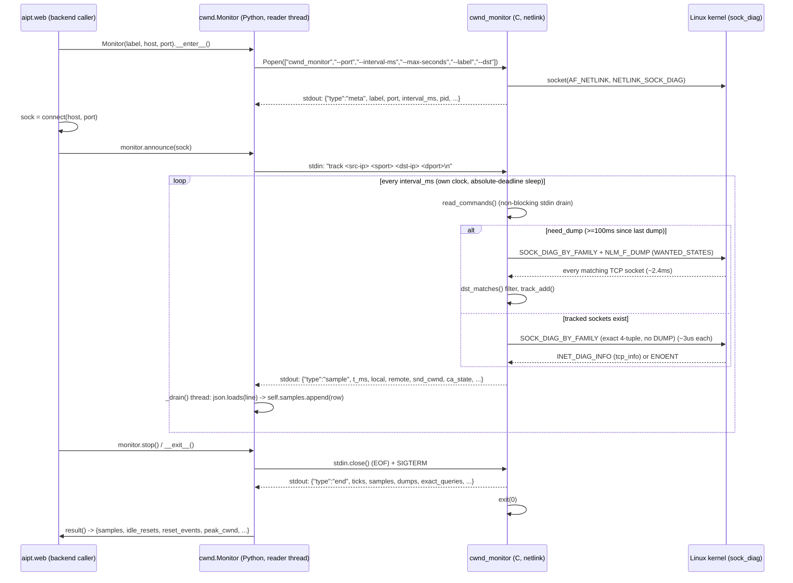
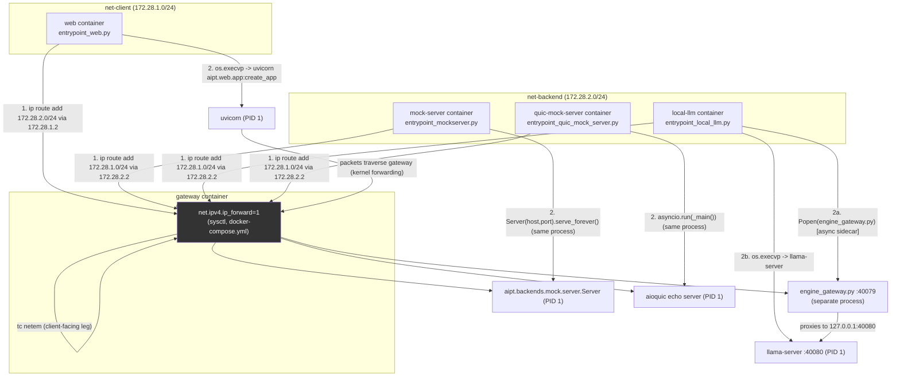

# native/ (C) + docker entrypoint 코드 감사 — 2026-09-02

대상: `native/cwnd_monitor.c`, `aipt/core/cwnd.py`(연동), `docker/entrypoint_web.py`,
`docker/entrypoint_mockserver.py`, `docker/entrypoint_local_llm.py`,
`docker/entrypoint_quic_mock_server.py`, `docker/Dockerfile.{web,mockserver,local_llm,
quic_mock_server,gateway}`, `docker/engine_gateway.py`, `docker-compose.yml`.

방법: 코드를 라인 단위로 먼저 읽고(추측 금지), 왜 이렇게 만들었는지 역추론한 뒤,
마지막에만 DESIGN.md/ARCHITECTURE.md/MIGRATION.md와 대조했다. 아래 순서를 그대로 유지한다.

---

## 1. 코드 사실관계 (라인 인용)

### 1.1 `native/cwnd_monitor.c` — 무엇을 어떻게 읽는가

- **소켓 정보 획득 경로**: `getsockopt(TCP_INFO)`가 아니라 **netlink `sock_diag`**
  (`AF_NETLINK`, `NETLINK_SOCK_DIAG`)다.
  ```
  405: int fd = socket(AF_NETLINK, SOCK_RAW | SOCK_CLOEXEC, NETLINK_SOCK_DIAG);
  ```
  이유는 모듈 자체 주석에 명시: `getsockopt`은 소켓을 소유한 프로세스(Python)의 fd가
  필요하지만, `sock_diag`는 같은 uid·같은 netns이면 소유하지 않은 소켓도 조회 가능
  (`ss -ti`와 동일 메커니즘) — 12~17행.
- **요청 종류**: `SOCK_DIAG_BY_FAMILY` 메시지에 `INET_DIAG_INFO` 확장을 요청
  (424~449행). `id`가 있으면(4-tuple 지정) `NLM_F_DUMP` 없이 **exact 쿼리**(해시 룩업,
  ~3us), 없으면 `NLM_F_DUMP`로 **테이블 전체 덤프**(~2410us, 측정치는 226~239행
  주석에 기록). exact 쿼리는 `idiag_states = 0xffffffffu`(전 상태) 사용(443~446행),
  dump는 `WANTED_STATES`(85~88행, ESTABLISHED/SYN_SENT/SYN_RECV/FIN_WAIT1/FIN_WAIT2/
  CLOSE_WAIT/LAST_ACK/CLOSING — LISTEN·TIME_WAIT 제외, 66~69행 사유 명시).
- **캐싱/추적 전략**: `g_tracked[]`(266~273행)에 `inet_diag_sockid` + 쿠키를 보관해
  두 번째 틱부터는 dump 대신 exact 쿼리만 수행. 재발견 주기 `REDISCOVER_SECONDS =
  0.100`(253행), 소켓 소실 후 재발견 `REDISCOVER_AFTER_LOSS = 0.020`(264행) — 각각
  실측 수치(1017틱 중 117회 vs 20회 dump 등)로 정당화됨(248~264행 주석).
- **클라이언트 알림(`track` 명령) 프로토콜**: stdin으로 한 줄짜리 텍스트 커맨드를
  받는다.
  ```
  335: static void handle_command(char *line)
  339:     if (sscanf(line, "%15s %63s %u %63s %u", verb, src, &sport, dst, &dport) != 5)
  343:     if (strcmp(verb, "track") != 0) { ... }
  ```
  형식은 `"track <src-ip> <sport> <dst-ip> <dport>"`(329행 주석). 파싱 실패/미지 verb는
  stderr 경고 후 무시(에러로 종료하지 않음, 331~334행). `read_commands()`(373~399행)는
  `poll(..., 0)`으로 논블로킹 드레인만 수행 — 클라이언트가 쓰지 않아도 틱이 막히지
  않게 하기 위함(368~372행 주석: "클라이언트가 시간을 조작할 권한을 갖지 않게").
  announced 소켓은 쿠키 없이(`INET_DIAG_NOCOOKIE`) 4-tuple만으로 등록되고
  (`track_add_announced`, 319~327행), 첫 응답에서 실제 쿠키를 회수해 고정
  (563~570행) — 포트 재사용으로 인한 소켓 착오 창을 "쿼리 1회"로 최소화.
- **출력 프로토콜(NDJSON)**: 3종 라인.
  - `{"type":"meta", ...}` (669~673행): `label, port, dsts, interval_ms, pid,
    wall_start, tcp_info_build`.
  - `{"type":"sample", ...}` (`emit_sample`, 466~515행): 아래 §1.2에서 필드 단위로
    Python과 대조.
  - `{"type":"end", ...}` (767~772행): `ticks, samples, seconds, dumps,
    exact_queries, tracked, announced, tcp_info_len`.
  라인 버퍼링(`setvbuf(..., _IOLBF, 0)`, 641행)으로 틱마다 즉시 flush, 진단은 항상
  stderr로 분리(36~38행 주석, 실제로 `fprintf(stderr, ...)` 전용 사용 확인).
- **종료**: `SIGTERM`/`SIGINT` 핸들러가 `g_stop` 플래그만 세팅(111~113행, 646~648행
  등록) → 메인 루프가 다음 틱 경계에서 빠져나오며 `end` 트레일러를 반드시 씀(40~41행
  주석, 761~773행 실제 흐름). `--max-seconds`(0=무제한, 기본 프로세스 소유자가
  `MAX_SECONDS` 지정)로 고아 프로세스 상한.
- **주기**: 기본 `interval_ms = 2`(620행), 최소 1ms로 클램프(636행). 절대 시각 슬립
  (`clock_nanosleep(CLOCK_MONOTONIC, TIMER_ABSTIME, ...)`, 753~760행)으로 드리프트
  방지(675~678행 주석).

### 1.2 `native/cwnd_monitor.c` ↔ `aipt/core/cwnd.py` 필드 대조 (라인 단위)

C `emit_sample`이 실제로 찍는 숫자 필드 순서(474~491행, `type`/`t_ms`/`wall`/
`local`/`remote`/`state`/`ca_state` 제외한 tcp_info 파생 필드만, 총 40개 키):

```
t_ms wall local remote state ca_state
snd_cwnd snd_ssthresh rcv_ssthresh
rtt_us rttvar_us min_rtt_us
snd_mss rcv_mss advmss pmtu
unacked sacked lost retrans total_retrans reordering
bytes_sent bytes_acked bytes_received bytes_retrans
segs_out segs_in delivered delivery_rate pacing_rate
snd_wnd rwnd_limited_us sndbuf_limited_us busy_time_us
last_data_sent_ms last_data_recv_ms last_ack_recv_ms
rto_us ato_us
inode
```

Python `SAMPLE_FIELDS`(`aipt/core/cwnd.py` 101~112행):

```
t_ms wall local remote state ca_state
snd_cwnd snd_ssthresh rcv_ssthresh
rtt_us rttvar_us min_rtt_us rto_us ato_us
snd_mss rcv_mss advmss pmtu
unacked sacked lost retrans total_retrans reordering
bytes_sent bytes_acked bytes_received bytes_retrans
segs_out segs_in delivered delivery_rate pacing_rate
snd_wnd rwnd_limited_us sndbuf_limited_us busy_time_us
last_data_sent_ms last_data_recv_ms last_ack_recv_ms
inode
```

**집합 일치, 순서 불일치.** 40개 키 이름은 완전히 동일한 집합이지만 C는
`rto_us`/`ato_us`를 필드 목록의 맨 끝(마지막이 `inode` 직전)에 두는 반면 Python
`SAMPLE_FIELDS`는 `min_rtt_us` 바로 뒤(앞쪽)에 배치한다. `_drain()`
(`aipt/core/cwnd.py` 467~499행)이 `json.loads(line)`로 딕셔너리 파싱 후
`row.get("type")`으로 분기하고(488~497행), `SAMPLE_FIELDS`는 오직
`CONNECTION_COLUMNS`(export CSV 헤더, `aipt/export/connection.py` 45~46행,
75~77행)와 `row.get(c, "")` 방식으로만 소비되므로, **JSON 키-값 매핑에는 영향이
없다** — CSV 컬럼 순서만 이 리스트 순서를 따른다. 즉 기능적 버그는 아니지만,
`SAMPLE_FIELDS`의 주석("Every numeric field the helper emits, in the order a
reader wants them", 99~100행)이 주장하는 "helper가 내보내는 순서"는 실제 C
`emit_sample`의 printf 순서와 다르다 — 문서화상 사소한 부정확.

필드 값 의미도 1:1 대응 확인:
- `snd_cwnd`(478행) ↔ `idle_resets()`의 `cwnd = s.get("snd_cwnd")`(cwnd.py 580행) —
  이 모듈 전체의 핵심 지표.
- `ca_state`(477행, `ca_name(ti->tcpi_ca_state)`, 99행에서 `open/disorder/cwr/
  recovery/loss`) ↔ `idle_resets()`의 `s.get("ca_state") == "open"` 게이트(586행) —
  "loss로 인한 window 붕괴"와 "idle reset"을 구분하는 조건이 C가 만든 문자열
  이름(`"open"`)에 정확히 의존한다. `CA_NAMES` 배열(99행)이 바뀌면 이 조건이
  조용히 항상 false가 되는 결합이 있음(테스트로 방지되지 않으면 취약).
- `state`(477행, `state_name(m->idiag_state)`) — Python 쪽은 `state` 필드를
  `SAMPLE_FIELDS`에는 포함하지만 `idle_resets()` 로직에서는 사용하지 않음(단순
  통과 필드).
- `local`(476행, `"%s:%u"` 포맷 — IP:port 문자열) ↔ Python `key = s.get("local")`
  (cwnd.py 579행)로 소켓 식별 키 사용, `Monitor.result()`의 `sockets` 집합도
  동일 필드 기준(516행).

### 1.3 `Monitor` (Python) 쪽 프로세스 구동/명령 송신

- 실행: `subprocess.Popen(argv, stdin=PIPE, stdout=PIPE, stderr=PIPE, text=True,
  bufsize=1)`(cwnd.py 375~377행) — argv에 `--port, --interval-ms, --max-seconds,
  --label`, 있으면 `--dst`(362~368행). `--max-seconds`는 항상 모듈 상수
  `MAX_SECONDS = 3600`(97행)을 넘김 — C 헬퍼 자체의 고아 방지 타이머와는 별개로,
  Python 쪽이 `stop()`(426~450행)에서 SIGTERM을 먼저 보내는 정상 종료 경로가
  주 경로임.
- `announce(sock)`(390~424행)가 `"track {local_ip} {local_port} {peer_ip}
  {peer_port}\n"`을 그대로 stdin에 write+flush — C `handle_command`가 기대하는
  포맷과 정확히 일치(415행 vs 329행 주석). `peer_port != self.port`이면 무시
  (409~410행) — 감시 대상 포트가 아닌 연결은 등록하지 않음.
- `available()`(241~282행)이 실제로 20ms 헬퍼를 실행해(`--max-seconds 0.02`,
  273행) stdout에 `'"type":"end"'`가 있는지 확인(280~281행) — netlink가 막힌
  샌드박스(gVisor 등)를 "존재는 하지만 동작 안 함"으로 정확히 구분(244~248행
  주석과 일치).
- `build()`(216~238행)이 `cc -O2 -Wall -o <out> <source>`로 그때그때 컴파일 가능 —
  Dockerfile.web의 별도 빌더 스테이지(§2.1)와 별개의, 로컬 체크아웃용 폴백 경로.

---

## 2. Docker entrypoint / Dockerfile 사실관계

### 2.1 `docker/Dockerfile.web` — 멀티스테이지 빌드

```
24-32: FROM python:3.12-slim AS builder
       RUN apt-get install build-essential
       COPY native/ ./native/
       RUN cc -O2 -Wall -o native/cwnd_monitor native/cwnd_monitor.c
34-57: FROM python:3.12-slim (runtime)
       RUN apt-get install iproute2 tcpdump ethtool   # gcc 없음
       COPY --from=builder /build/native ./native
```
런타임 스테이지엔 컴파일러가 없다 — `native/cwnd_monitor` **바이너리만** 복사됨
(57행). 8행 주석이 이 설계를 "tcp_congestion의 `b7cf75cb fix(docker)` 교훈(매
요청마다/런타임에 재컴파일하지 말 것)"으로 명시. `CMD ["python",
"entrypoint_web.py"]`(87행) → uvicorn은 entrypoint가 `execvp`로 대체 실행.

### 2.2 각 entrypoint의 라우팅 설정 — `ip route add`

네 엔트리포인트(`entrypoint_web.py`, `entrypoint_mockserver.py`,
`entrypoint_local_llm.py`, `entrypoint_quic_mock_server.py`) 모두 거의 동일한
`_add_route()` 함수를 각각 독립 정의(공유 모듈 없음, 코드 중복):

```python
argv = ["ip", "route", "add", PEER_SUBNET, "via", ROUTE_VIA]
proc = subprocess.run(argv, capture_output=True, text=True, timeout=15)
```
(entrypoint_web.py 57~59행 / entrypoint_mockserver.py 62~64행 /
entrypoint_local_llm.py 53~55행 / entrypoint_quic_mock_server.py 39~41행 —
4개 파일 모두 동일 패턴)

- `PEER_SUBNET`/`ROUTE_VIA`는 env(`GATEWAY_PEER_SUBNET`/`GATEWAY_ROUTE_VIA`)가
  비어있으면 **route 설정을 건너뛴다**(각 파일 45~55행대 — 예:
  entrypoint_web.py 50~56행) — standalone/개발 실행에서 no-op.
- 실패는 항상 로그만 남기고 계속 진행(crash 없음): `FileNotFoundError`(ip 없음),
  `"File exists"`(멱등 재적용, 이미 라우트 있음 — idempotent 처리), 그 외 exit
  code 비0 시 "NET_ADMIN 누락 가능성" 메시지(각 파일 66~80행대) — 4개 파일 공통.
- **실제 방향**: `web`은 `net-backend`(172.28.2.0/24, docker-compose.yml 296행
  `GATEWAY_PEER_SUBNET=...:172.28.2.0/24`, `GATEWAY_ROUTE_VIA=...:172.28.1.2`
  = gateway의 net-client IP)로, `mock-server`/`local-llm`/`quic-mock-server`는
  거꾸로 `net-client`(172.28.1.0/24, compose 89~90/226~227/120~121행,
  `GATEWAY_ROUTE_VIA=172.28.2.2` = gateway의 net-backend IP)로 라우트를
  추가한다 — DESIGN.md 4.7 확정 설계 1의 "왕복 트래픽이 반드시 gateway를
  통과" 요구를 코드가 그대로 구현.
- 순서: 4개 엔트리포인트 모두 `_add_route()`를 **실제 서버 프로세스를 시작하기
  전에** 호출한다(entrypoint_web.py 82~83행 `main()`; entrypoint_mockserver.py
  85행 모듈 레벨 호출; entrypoint_local_llm.py 76행; entrypoint_quic_mock_server.py
  61행).

### 2.3 `entrypoint_web.py` — 최종 실행

```
82-95: def main():
    _add_route()
    ...
    argv = ["uvicorn", "aipt.web.app:create_app", "--factory", "--host", host, "--port", port]
    os.execvp(argv[0], argv)
```
`os.execvp`로 프로세스 이미지를 uvicorn으로 완전히 대체(PID 1 = uvicorn) —
시그널/헬스체크가 래퍼가 아닌 실제 앱 프로세스를 대상으로 함.

### 2.4 `entrypoint_mockserver.py` — 서버 직접 구동(exec 아님)

```
87: from aipt.backends.mock.server import Server
93: srv = Server(host=host, port=port)
94-97: try: srv.serve_forever() except KeyboardInterrupt: pass finally: srv.shutdown()
```
`execvp`가 아니라 **같은 Python 프로세스 안에서** `Server.serve_forever()`를
직접 호출 — PID 1이 이 wrapper 스크립트 자체다(web/local_llm과 다른 패턴).
`sys.path.insert(0, "/app")`(48행)로 import 경로 보정.

### 2.5 `entrypoint_local_llm.py` — 2단계: sidecar 기동 후 exec

```
85-90: _ENGINE_GATEWAY_SCRIPT = .../engine_gateway.py
       subprocess.Popen([sys.executable, _ENGINE_GATEWAY_SCRIPT])   # 비동기 fire-and-forget
...
99-106: argv = ["/app/llama-server", "-hf", model_repo, "--host", host, "--port", port, "-c", ctx_size]
        os.execvp(argv[0], argv)
```
`engine_gateway.py`를 **별도 OS 프로세스**로 `Popen`(87행, wait 없음)한 뒤
자기 자신은 `execvp`로 `llama-server`로 교체된다(106행). 81~84행 주석이 이유를
명시: 스레드였다면 `execvp` 시점에 프로세스 이미지가 통째로 llama-server로
바뀌면서 사라졌을 것 — 별도 프로세스여야 부모(entrypoint 스크립트)가 exec으로
사라져도 살아남는다. `engine_gateway.py`가 죽어도 `except Exception`으로
잡아 로그만 남기고 계속 진행(89~90행) — llama-server 기동을 막지 않음.

### 2.6 `entrypoint_quic_mock_server.py` — asyncio 서버

```
63-64: from aipt.backends.quic_mock.server import run_server
       from aipt.backends.quic_mock.backend import _MockEchoProtocol
72-81: async def _main():
    server = await run_server(HOST, PORT, CERT, KEY, create_protocol=_MockEchoProtocol)
    ... loop.add_signal_handler(SIGINT/SIGTERM, stop.set) ...
    await stop.wait(); server.close()
84-85: if __name__ == "__main__": asyncio.run(_main())
```
UDP/QUIC 서버(aioquic 기반)를 asyncio 이벤트루프에서 직접 구동, `_add_route()`는
동기 함수로 이벤트 루프 진입 전에 이미 실행 완료(61행).

### 2.7 `docker/Dockerfile.mockserver` / `.quic_mock_server` / `.local_llm` — 공통 요소

- 셋 다 `iproute2` 설치(`ip route add`용) — mockserver 33~35행, quic_mock_server
  21~23행, local_llm 26~28행. mockserver의 주석(23~32행)은 이 패키지가 빠져서
  실제로 `docker compose up`에서 라우트가 조용히 no-op됐던 실측 사고를 기록.
- `Dockerfile.local_llm`은 `FROM ghcr.io/ggml-org/llama.cpp:server`(17행, 업스트림
  이미지 그대로) + `USER root`(25행, 패키지 설치를 위해)로 전환 후 iproute2 설치.
  `engine_gateway.py`가 필요로 하는 `aipt.core.cache_protocol`만 최소 슬라이스로
  복사(39~41행: `aipt/__init__.py`, `aipt/core/__init__.py`,
  `aipt/core/cache_protocol.py`) — 전체 aipt 패키지(및 requests/fastapi 의존성)는
  설치하지 않음.
- **HEALTHCHECK 재정의**: `Dockerfile.local_llm` 63~64행
  ```
  HEALTHCHECK --interval=5s --timeout=2s --start-period=60s --retries=3 \
      CMD curl -sf http://127.0.0.1:40080/health || exit 1
  ```
  55~62행 주석이 명시: 업스트림 이미지의 기본 HEALTHCHECK가 llama-server 고전
  기본 포트 8080을 찌르는데, 이 프로젝트는 40080을 쓰므로 그대로 두면 서비스가
  정상이어도 항상 unhealthy로 표시됨 — 2026-09-01 실측 후 수정됨(§3에서
  DESIGN.md 서술과 대조).
- `Dockerfile.mockserver`/`Dockerfile.quic_mock_server`에는 HEALTHCHECK 지시문이
  **없다**(전체 파일 검토, grep 결과 0건) — `docker compose ps`가 이 두 서비스는
  상태를 표시하지 않는다(healthy/unhealthy 구분 불가).
- `Dockerfile.web`에도 HEALTHCHECK가 없다(87줄 전체 확인). `Dockerfile.gateway`도
  없다(82줄 전체 확인).

### 2.8 `docker/engine_gateway.py` — L7 캐싱 sidecar (local-llm 컨테이너 내부)

- `ThreadingHTTPServer`가 `ENGINE_GATEWAY_PORT`(기본 40079)에서 리슨하고
  `ENGINE_GATEWAY_UPSTREAM_HOST:PORT`(기본 `127.0.0.1:40080`, 즉 같은 컨테이너의
  llama-server)로 프록시(83~91행, 210~214행).
- 스트리밍 여부는 **요청 시점에 한 번만** 결정(`_is_stream_request`, 132~147행 —
  `Accept: text/event-stream` 헤더 또는 JSON body의 `"stream"` 필드)하고, 이후
  절대 재판정하지 않는다(23~56행 module docstring이 "SSE 청크 하나가 그 자체로
  완전한 JSON일 수 있어 '완전한 JSON처럼 보임'을 '응답 전체가 끝남'의 신호로 쓰면
  안 된다"는 근거를 명시).
- 스트리밍 경로(`_relay_streaming`, 227~264행)는 청크를 그대로 릴레이하며 캐시
  훅을 절대 호출하지 않음(228행 docstring). 비스트리밍 경로(`_relay_cacheable`,
  266~314행)만 `on_cacheable_request`/`on_cacheable_response` 훅을 호출하는데,
  두 훅 모두 현재 `return None`뿐인 **완전 no-op**(112~129행) — 이 패스는 "hook
  point만 배선, 캐싱 로직 자체는 다음 단계"(36~38행 명시).
- 별개로 `cache_on` 게이트(`X-AIPT-Cache` 헤더, `cache_protocol.CACHE_HEADER`)로
  구동되는 요청 바디 dedup 프로토콜은 **실제 동작한다**(279~296행,
  `cache_protocol.decode_body`/`CacheMiss` → HTTP 409 반환) — 이것과 위
  `on_cacheable_*` 훅은 별개 기능이며 문서(§3에서 대조)가 이를 구분해 설명하는지
  확인 필요.

### 2.9 `docker-compose.yml`의 실제 배선 (entrypoint 코드와 대조)

- `mock-server`(60~97행), `quic-mock-server`(108~124행), `local-llm`(188~235행)
  세 서비스 모두 `GATEWAY_PEER_SUBNET=${NET_CLIENT_SUBNET:-172.28.1.0/24}` +
  `GATEWAY_ROUTE_VIA=${GATEWAY_BACKEND_IP:-172.28.2.2}` 주입 — entrypoint의
  `_add_route()`가 요구하는 두 변수와 이름·값 모두 일치.
- `web`(242~373행)은 `GATEWAY_PEER_SUBNET=${NET_BACKEND_SUBNET:-172.28.2.0/24}` +
  `GATEWAY_ROUTE_VIA=${GATEWAY_CLIENT_IP:-172.28.1.2}`(296~297행) — 반대 방향,
  entrypoint_web.py의 요구와 일치.
- `web` 서비스는 `privileged: true`(258행) — 주석(251~257행)은 이것이 라우팅이나
  cwnd 때문이 아니라 idle-reset 실험용 `/proc/sys/net/ipv4/tcp_slow_start_after_idle`
  쓰기 때문이라고 명시(CAP_NET_ADMIN만으로는 Docker 기본 read-only /proc/sys
  마스킹을 못 뚫음). `cap_add: [NET_ADMIN, NET_RAW]`(259~261행)는 각각 cwnd
  netlink+offload, tcpdump 캡처용 — 세 가지 이유가 한 서비스에 겹쳐 있다.
- `local-llm`에는 `ENGINE_GATEWAY_*` env 5종(220~223행)이 주입되지만, 이는
  `docker/Dockerfile.local_llm`의 `ENV` 기본값(47~51행)과 값이 동일 — compose가
  Dockerfile 기본값을 그대로 재선언(중복이지만 불일치는 아님).
- `web`의 `LOCAL_LLM_ENGINE_URL` 기본값은 `http://172.28.2.4:40079`(317행) — 즉
  llama-server(40080)가 아니라 engine Gateway(40079)를 가리킨다. 코드
  (`docker/engine_gateway.py`)가 그 포트에서 실제로 리슨하는 것과 일치.

---

## 3. 문서(DESIGN.md/ARCHITECTURE.md/MIGRATION.md) 대조

### 3.1 일치하는 부분

- ARCHITECTURE.md 651~659행: "`Monitor`는 Python 스레드가 아니라 완전히 별도의 OS
  프로세스(`native/cwnd_monitor.c`, `subprocess.Popen`)"라는 서술 — `cwnd.py`
  375~377행 실제 구현과 일치.
- ARCHITECTURE.md 88~93행 / DESIGN.md 313~322행: "컨테이너 시작 시
  `entrypoint_web.py`/`entrypoint_mockserver.py`가 상대 서브넷으로 가는 경로를
  Gateway 경유로 명시적으로 추가(`ip route add`)" — §2.2에서 확인한 4개
  entrypoint의 실제 `_add_route()` 구현과 일치(단, `entrypoint_quic_mock_server.py`,
  `entrypoint_local_llm.py`는 이 두 문서의 서술에 이름이 명시적으로 나오지 않지만
  ARCHITECTURE.md 175행 파일 목록에는 4개 전부 등재됨).
- docs/seed-2026-09-01-ooo-audit.md 30~31행: "`native/cwnd_monitor.c` ↔
  `aipt/core/cwnd.py`의 `track` 명령 프로토콜, NDJSON 출력 필드셋(`SAMPLE_FIELDS`)이
  **완전히 일치**" — §1.2에서 재확인한 대로 **필드 집합은 일치**하지만, 순서까지
  "완전히 일치"라고 읽힐 수 있는 서술은 엄밀하지 않다(§1.2 순서 불일치 참고). 실질
  영향은 없음(JSON 키 기반 접근이므로).

### 3.2 불일치 — HEALTHCHECK

- DESIGN.md 599~607행이 이미 "local-llm 컨테이너 HEALTHCHECK가 8080을 찔러 항상
  unhealthy" 버그를 기록하고, docs/seed-2026-09-01-ooo-audit.md 48~49행이 "8080→
  40080으로 수정, 재빌드로 healthy 전환 검증 완료"라고 적었다.
  **현재 코드(`docker/Dockerfile.local_llm` 63~64행)는 실제로 40080을 사용하도록
  이미 수정되어 있다** — 즉 이 항목은 과거에 발견되고 실제로 고쳐진 버그이며,
  현재 코드와 문서 서술(수정 완료) 사이에 불일치는 없다. **다만** DESIGN.md
  609~620행(§6, "미해결 설계 결정")에는 6개 항목이 "확정 완료"로 표시돼 있고
  §5.2(575~597행)가 "남은 괴리는 3가지뿐"이라 주장하는데, 그 3가지 목록에는
  HEALTHCHECK 항목이 들어있지 않다(별도로 599~607행에 "이번 감사에서 신규
  발견"이라고 분리 기술) — 문서 구조상 "괴리 목록"과 "신규 발견 버그"가 분리되어
  있어 전체를 한 곳에서 파악하기 어렵다는 점은 남아있다.
- **`Dockerfile.mockserver`/`Dockerfile.quic_mock_server`/`Dockerfile.web`/
  `Dockerfile.gateway`에는 HEALTHCHECK가 전혀 없다**(§2.7). 세 DESIGN/ARCHITECTURE/
  MIGRATION 문서 어디에도 이 네 서비스에 HEALTHCHECK가 없다는 사실이나 그 설계
  의도(있어야 하는데 없는 결함인지, 의도적으로 생략한 것인지)를 언급하는 절이
  없다 — grep 결과 "HEALTHCHECK" 문자열은 오직 local-llm 관련 서술에서만
  등장(DESIGN.md 599~607행, ARCHITECTURE.md/MIGRATION.md에는 HEALTHCHECK
  언급 자체가 없음). `docker compose ps`로 `web`/`mock-server`/`gateway`/
  `quic-mock-server`의 정상/비정상 여부를 컨테이너 상태만으로 판별할 수 없다는
  점은 문서화되지 않은 실사양이다.

### 3.3 불일치 — MIGRATION.md 체크리스트 stale

- `MIGRATION.md` 9~19행(Phase 1)은 다음 항목들을 여전히 **미착수(`[ ]`)** 로
  표시한다:
  ```
  11: - [ ] TT/native/cwnd_monitor.c (= TC/native/cwnd_monitor.c, 동일 확인됨) → AIPT/native/cwnd_monitor.c
  12: - [ ] TC/tcp_congestion/cwnd.py (...) + TT/core/cwnd.py (...) → AIPT/aipt/core/cwnd.py (병합, §5-1 결정 필요)
  13: - [ ] TT/core/capture.py (...) + TC/tcp_congestion/capture.py (...) → AIPT/aipt/core/capture.py
  18: - [ ] AIPT/tests/core/test_cwnd.py, test_capture.py, test_offload.py — 양쪽 테스트 합집합, 중복 제거
  19: - [ ] AIPT/tests/core/test_cwnd_live.py / test_conversation_live.py의 live 스타일 → 마커 통일 (§5-4)
  ```
  그러나 실제 저장소에는 `native/cwnd_monitor.c`(778줄, §1에서 라인 단위로 감사한
  실제 파일), `aipt/core/cwnd.py`(598줄, `Monitor`/`idle_resets`/`SAMPLE_FIELDS`
  모두 구현·동작 확인), `aipt/core/capture.py`(존재 확인)가 이미 완성된 형태로
  들어있고, DESIGN.md §6의 1번 항목(611~612행)은 "제안대로 `label: str` 단일
  문자열로 통일됨... **확정 (2026-09-01, 코드 재확인)**"이라고 명시적으로 완료
  선언까지 했다. 즉 **DESIGN.md는 Phase 1의 병합/이관이 끝났다고 말하고,
  MIGRATION.md는 같은 항목을 여전히 미착수(`[ ]`)로 표시** — 두 문서가 같은
  사실에 대해 서로 다른 상태를 주장하는 불일치다. `[ ]` → `[x]` 갱신 누락으로
  보인다(§6에 "확정 (2026-09-01)" 도장을 찍으면서 MIGRATION.md Phase 1 체크박스
  갱신이 빠진 것으로 추정 — 두 파일이 서로 다른 커밋/세션에서 갱신됐을
  가능성이 높음).

### 3.4 불일치 없음으로 확인된 항목 (참고)

- `docker-compose.yml`의 `GATEWAY_PEER_SUBNET`/`GATEWAY_ROUTE_VIA` 값과
  entrypoint 4종의 env 이름·사용법은 완전히 일치(§2.9) — 문서(ARCHITECTURE.md
  88~93행)의 서술과도 부합.
  - `engine_gateway.py`의 캐싱 훅(`on_cacheable_*`)이 no-op라는 사실은
    `docker/engine_gateway.py` 자체 docstring(36~38행)과 ARCHITECTURE.md
    433~436행 표(`decode_body`/`missing_paths` 경로만 "항상 완전한 원본 body만
    포워딩"이라고 정확히 서술, `on_cacheable_*` 훅에 대해서는 코드와 마찬가지로
    별도 캐시 로직 완성을 주장하지 않음)가 일치한다.

---

## 4. 왜 이렇게 만들었는가 (Task 카드)

### Task A — netlink sock_diag 기반 cwnd 모니터 (C 헬퍼)
- **문제**: `net.ipv4.tcp_slow_start_after_idle=1`(기본값)에서 idle 후 cwnd가
  초기값으로 리셋되는 것을 원 프로세스(Python 클라이언트) 안에서 관찰하면, idle
  구간 동안 Python이 소켓 read에 블록되어 있어 이벤트를 놓친다.
- **왜 C 프로세스로 분리**: GIL/이벤트 루프 지연이 없는 독립 클록으로 2ms
  주기 샘플링을 하기 위함(ARCHITECTURE.md 656~659행과 cwnd.py 19~23행 docstring이
  동일 근거를 서술) — Python 스레드였다면 인터프리터가 바쁠 때 샘플링 자체가
  밀린다.
- **왜 getsockopt이 아니라 netlink**: 소켓 소유권 문제(§1.1) — 별도 프로세스가
  Python이 연 fd를 가질 수 없으므로, fd 불필요한 sock_diag가 유일한 선택지.
- **왜 dump+캐시 하이브리드**: 매 틱 전체 테이블을 덤프하면 2.4ms/틱으로 2ms
  주기 자체가 성립하지 않음(측정치 명시, §1.1) — exact 쿼리(3us)로 전환하되,
  새 소켓 발견을 위해 100ms마다만 dump.
- **왜 `announce()`가 필요**: dump 주기(100ms) 안에 소켓이 열리고 닫히면 초기
  윈도우(리셋이 되돌아가는 목표값)를 영영 못 봄 — 클라이언트가 connect() 직후
  4-tuple을 알려주면 다음 틱에 바로 exact 쿼리 가능.

### Task B — Docker L3 라우팅 (`ip route add` 4종 entrypoint)
- **문제**: Docker bridge 네트워크는 컨테이너에 자기 서브넷 경로만 준다 — `web`은
  `net-client`에만 붙어있어 `net-backend`(mock-server/local-llm 있는 곳)로 갈
  경로 자체가 없다.
- **왜 각 서비스가 각자 라우트를 추가**: gateway 하나가 양쪽 네트워크에 다 붙어
  L3 forwarding(`net.ipv4.ip_forward=1`)만 하는 순수 커널 라우팅 설계(애플리케이션
  레벨 프록시 아님, DESIGN.md 313~322행) — 그래서 gateway 자신이 라우트를
  주입해줄 방법이 없고, 각 leaf 컨테이너가 "상대 서브넷은 gateway를 통해서만
  간다"는 라우트를 스스로 등록해야 왕복 모두 gateway를 지난다(비대칭 라우팅으로
  netem이 편도에만 적용되는 것을 방지).
- **왜 실패해도 crash하지 않음**: DESIGN.md/각 파일 주석이 "honesty-over-crash"
  일관 정책을 명시 — 라우팅 실패는 기능 저하(연결 불가)로 나타나되 컨테이너
  자체는 계속 뜨고, 앱 레벨의 connect-failure 처리가 원인을 드러낸다.

### Task C — `entrypoint_local_llm.py`의 sidecar Popen + execvp 조합
- **문제**: engine Gateway(L7 프록시)와 llama-server(실제 엔진)를 같은 컨테이너에서
  같이 띄워야 하는데, llama-server는 업스트림 바이너리라 코드를 못 바꾼다.
- **왜 Popen 후 execvp**: 부모 프로세스가 execvp로 llama-server 이미지로
  교체되면 스레드는 함께 사라지지만 별도 프로세스로 띄운 자식(engine_gateway.py)은
  살아남는다 — PID 1이 결국 llama-server가 되어 시그널/헬스체크가 실제 엔진을
  대상으로 하면서도 sidecar가 동시에 돈다.

### Task D — local-llm HEALTHCHECK 오버라이드
- **문제**: 업스트림 이미지가 기본 포트(8080) 하드코딩 HEALTHCHECK를 갖고 있는데,
  이 프로젝트는 40000번대 포트 컨벤션(다른 서비스와 충돌 회피, Dockerfile
  11~15행 주석)을 쓴다.
- **왜 고쳐야 했는가**: 기능은 정상 동작하는데(`curl 127.0.0.1:40080/health`
  성공) `docker compose ps`가 항상 unhealthy로 보여 운영자가 오판할 위험 —
  2026-09-01 실측 후 40080으로 오버라이드(§3.2).

---

## 5. 흐름도

### 5.1 native ↔ Python 연동 (cwnd 측정 lifecycle)



### 5.2 컨테이너 기동 흐름 (L3 라우팅 + 서비스 시작 순서)



---

## 6. 요약 (감사 결론)

1. `native/cwnd_monitor.c`의 netlink sock_diag 기반 설계, dump/exact 쿼리
   하이브리드, `track` 명령 프로토콜은 모두 소스 주석의 실측 수치와 정확히
   부합하며 추측이 필요 없을 만큼 상세하게 근거가 남아있다.
2. C↔Python NDJSON 필드셋은 **집합 기준 완전 일치**(40개 키, §1.2). 단
   `SAMPLE_FIELDS` 목록 순서(rto_us/ato_us 위치)가 실제 C `printf` 순서와
   다르다 — 기능 영향 없음, 문서 서술("in the order... emits")과 실제가
   불일치하는 수준의 사소한 문제.
3. 4개 docker entrypoint의 `ip route add` 로직은 거의 동일한 코드가 4곳에
   중복돼 있으나(공유 모듈 없음) 동작은 서로 일관되고 compose의 env 배선과
   정확히 맞물린다.
4. **HEALTHCHECK는 `local-llm`에만 존재**하고 `web`/`mock-server`/`gateway`/
   `quic-mock-server`에는 전혀 없다 — 이 비대칭이 세 설계 문서 어디에도
   설명되어 있지 않다(신규 발견, §3.2).
5. **MIGRATION.md Phase 1 체크리스트가 stale** — `native/cwnd_monitor.c`,
   `aipt/core/cwnd.py`, `capture.py`, 테스트 이관 항목이 여전히 `[ ]`로 남아
   있는데 실제 코드와 DESIGN.md §6은 이미 완료·확정을 선언한 상태다(§3.3,
   신규 발견 — 문서 갱신 누락으로 추정, 코드 자체의 문제는 아님).
