# AIPT `aipt/web/` 코드 우선 감사 (2026-09-02)

대상: `aipt/web/app.py`, `routes_config.py`, `routes_gateway.py`,
`routes_run.py`, `routes_runs.py`, `store.py`, `tests/web/*`,
`docker/entrypoint_web.py`. 방식: 코드를 전부 읽고 함수 호출 단위로
요청 처리 흐름을 추적한 뒤, 마지막에 DESIGN.md/ARCHITECTURE.md/
MIGRATION.md와 대조했다. 코드 수정 없음 — 감사만.

---

## 1. 라우트별 요청→처리→영속화 흐름 (코드 인용 기반)

### 1.1 `GET /` , `GET /api/config` — `routes_config.py`

- `register()`가 `app.py`의 `create_app()`에서 `templates`(Jinja2)를 받아
  두 라우트를 클로저로 등록한다 (`routes_config.py:420-428`).
- 둘 다 `config_payload()`(`routes_config.py:374-411`) 하나를 그대로
  렌더링/직렬화한다 — 랜딩 페이지와 `/api/config`가 절대 드리프트하지
  않는 단일 소스.
- `config_payload()`가 실제로 호출하는 하위 계층:
  - `backends_view()` → `aipt.backends.names()`/`aipt.backends.get()` +
    각 backend 모듈의 `PublicAIBackend`/`MockBackend`/`LocalLLMBackend().ready()`
    (`routes_config.py:324-345`, `_backend_ready()` L91-106). 예외를 절대
    올리지 않고 `(ok, reason)`으로만 반환 — "랜딩 페이지가 나쁜 backend
    하나 때문에 500 나면 안 된다"는 설계 의도가 주석에 명시.
  - `ui_backends()` → `public_ai_engine_cards()`(엔진별 카드 분리, arm은
    `_public_ai_engine_arms()`가 `aipt.backends.public_ai.gemini/openai`의
    `ARMS`를 직접 읽음) + 그 외 backend는 `backends_view()`를 그대로 카드화.
  - `public_ai_record_names()` → `public_ai_records_dir()`
    (`routes_run.public_ai_records_dir`를 **import해서 재사용** —
    `routes_config.py:26`)와 `aipt.backends.mock.records.names()`의
    합집합. **routes_config가 routes_run의 함수에 의존**하는 단방향 결합이
    코드로 확인됨.
  - `_congestion_algorithms()`/`_quic_congestion_algorithms()` →
    `aipt.core.congestion.available_algorithms()`/
    `aipt.core.quic_congestion.available_algorithms()` — 커널
    `/proc/sys/net/ipv4/tcp_available_congestion_control`을 그때그때 읽음
    (하드코딩 목록 없음, 주석 L30-37).
  - `cwndmon.available()`, `capture_mod.available()` — 두 core 모듈의
    가용성만 조회, 아무 상태도 쓰지 않음.
- **핵심**: 이 모듈은 순수 read-only 조합 계층이다. 실행/영속화는 전혀
  하지 않는다.

### 1.2 `POST /api/run` / `POST /api/run/stream` — `routes_run.py`

요청 파라미터(`RunRequest`, L94-215) → 처리 함수 → 하위 계층 호출을
줄 단위로 추적:

| 필드 | 소비 지점 | 실제로 도달하는 계층 |
|---|---|---|
| `backend`, `engine` | `_build_backend()` L304-359 | `aipt.backends.get(name)` 후 `PublicAIBackend(engine=...)`/`MockBackend(record=...)`/`LocalLLMBackend(cache_enabled=...)` 생성자 |
| `arm`, `model` | `backend.connect(req.arm, req.model, system)` L574 | 각 backend 모듈의 `connect()` (arm 유효성 검증은 backend 쪽 책임) |
| `turns`(→`_resolve_turns`가 실제 사용) | `_resolve_turns()` L253-301 | `dummy`: `aipt.backends.mock.conversation.build_turns()`. `record`: `_load_record_scenario()` → `mock_replay.from_public_ai_record_doc` 또는 `mock_records.load_scenario_record` |
| `mock_response_bytes`, `inference_delay_ms` | L443-455 (mock 전용) | `backend.mock_response_bytes`/`backend.inference_delay_ms` 속성 직접 대입 |
| `algorithm` | L453-472 | mock: `backend.algorithm` 속성(소켓 옵션은 `_connect_with_algorithm`에서 적용, mock 내부). public_ai/local_llm: `aipt.core.wire.set_congestion_algorithm()` + `wire.reset_session()` — **소켓 재사용 시 이전 run의 알고리즘이 새지 않도록 매 run 리셋**(L463-472 주석) |
| `capture` | L515-536, L556-573 | `aipt.core.capture.Capture` 컨텍스트 매니저. `resolve_target()`으로 실제 접속 전에 목적지를 알아낸 뒤(mock/quic만 해당) tcpdump 캡처 윈도우를 connect() **이전**에 염 — 2026-08-31 버그 수정 근거 주석 |
| `transport` | L331-345, L569 | mock + `http3`이면 `aipt.backends.quic_mock.backend.QuicMockBackend` 생성, 캡처 필터도 `proto="udp"`로 전환 |
| `cache_enabled`, `cache_threshold_bytes` | L353-357 | `LocalLLMBackend` 생성자 인자로만 전달, 다른 backend는 완전히 무시 |
| `record_id`, `input_mode` | `_resolve_turns()`/`_build_backend()`의 mock 분기 | 위 표 참고 |

실행 본체는 `_run_conversation_stream()`(L391-500+, 제너레이터)이며
`/api/run`(`_run_conversation()` L668-678, 제너레이터를 드레인해
`done` 이벤트만 반환)과 `/api/run/stream`(`_drive_stream_to_queue()`
L789-823, SSE로 매 턴 즉시 push)이 **동일 제너레이터를 공유**한다 —
코드 중복 없이 blocking/streaming 두 응답 모드를 만든 구조.

각 턴은 `backend.send_turn(i, question, req.measure)` → `turn_record()`
(`aipt.backends.record.turn_record`)로 정규화되어 `records` 리스트에
누적(L575-589). 종료 시 `result` dict(L627-645)에 `ok`/`error`/`turns`/
`monitors`/`pcap`/`algorithm`/`exec_id`가 모두 채워진다.

**영속화**: `exec_id = run_store.new_exec_id()`가 L478에서 **run 시작
전에** 미리 발급되어 public_ai 레코드 파일과 in-memory run doc이 같은
id를 공유한다. `/api/run`은 `api_run()` L700에서
`run_store.save_run(result)` 1회 호출. `/api/run/stream`은
`_drive_stream_to_queue()` L816-817에서 `done` 이벤트가 나오는 **순간**
저장(스트림이 끝나길 기다리지 않음 — 스트림 자체가 이미 `done`으로
끝나므로 사실상 같은 시점). `public_ai` 백엔드는 추가로
`writer.write(path)`(L654-663, `public_ai_recorder.RecordWriter`)로
`data/public_ai_records/<exec_id>.json`에 실 API 왕복 기록을 저장 —
실패해도 run 결과 자체는 살아남고 `record_saved=False`만 표시.

### 1.3 `GET/DELETE /api/runs*`, CSV/bundle/pcap — `routes_runs.py`

모든 라우트가 `run_store.get_run(exec_id)`로 시작해 `None`이면
`_not_found()`(404). 있으면:
- `turns.csv`/`summary.csv` → `aipt.export.turns`
- `cwnd.csv`/`cwnd_summary.csv` → `aipt.export.connection`
- `packets.csv`/`bundle.zip` → `aipt.export.packets`/`aipt.export.bundle`,
  pcap 경로는 `capture_mod.safe_pcap_path(name)`로 트래버설 방어 후 사용
- `/api/pcaps/{name}` → `FileResponse` 직접 서빙(같은 `safe_pcap_path` 가드)
- `/api/public-ai-records*` 두 라우트는 **`run_store`를 전혀 거치지
  않고** `public_ai_records_dir()`(from `routes_run`) 아래 파일을 직접
  읽는다 — `_safe_record_path()`(L196-206)로 `../..` 방지, in-memory
  run doc의 생명주기(MAX_RUNS 축출)와 독립적으로 존재할 수 있음이
  주석(L185-193)에 명시.

### 1.4 `store.py` — 무엇이 영속화되는가

- `save_run(doc)`(L108-128): `_lock` 안에서 in-memory `OrderedDict`
  갱신 + MAX_RUNS(50) 초과분 축출 id 목록 계산 → 락 **밖에서**
  `_write_to_disk(doc)`(JSON 전체를 `<RUN_STORE_DIR>/<exec_id>.json`에
  통짜로 write) + 축출된 파일들 `_delete_from_disk()`.
- `_ensure_loaded_locked()`/`_load_from_disk_locked()`(L81-105): 프로세스
  당 최초 1회, 디스크에서 최신 MAX_RUNS개만 재적재(재시작 복구).
- 디스크 쓰기 실패는 `OSError`를 잡아 print로만 로그 — run 자체 성공에는
  영향 없음(L65-71 주석, "다른 core 모듈과 동일한 honesty-over-crash").
- **영속화되는 것**: run doc 전체(`turns`, `monitors`, `pcap` 메타,
  `algorithm`) + `.stream.jsonl`(routes_run.py L711-727, SSE 이벤트
  로그, store.py 밖에서 직접 파일 append) + public_ai record JSON. **영속화되지
  않는 것**: pcap 원본 바이너리 자체는 `capture_mod`가 별도
  `TRAFFIC_PCAP_DIR`에 저장(§4.7.1 대상 밖), Gateway profile/idle-reset
  상태는 store.py와 무관(§2 참고).

### 1.5 `routes_gateway.py` — Gateway profile 프록시 vs idle-reset in-process 토글 (핵심 검증 대상)

이 파일 하나에 **완전히 다른 두 메커니즘**이 공존한다. 모듈 docstring
(L1-32)이 이미 이 구분을 명시하지만, 실제 구현 코드로 재확인:

**(A) `GET/POST /api/gateway/profile`** — 진짜 프록시.
- `_gateway_base_url()`(L58-61)이 `GATEWAY_HOST`/`GATEWAY_PORT` env(컨테이너
  네트워크상의 `gateway` 서비스, default `gateway:8080`)를 읽어 URL 조립.
- `GET`은 `requests.get(f"{base}/gateway/profile")`, `POST`는
  `requests.post(f"{base}/gateway/profile", json={"profile": profile})`
  (L64-85) — **HTTP 요청이 실제로 나간다**. 응답 JSON을 그대로 패스스루.
  Gateway 컨테이너가 죽어 있으면 `requests.RequestException`을 잡아
  `{"ok": False, "reason": f"gateway unreachable: {exc}"}`을 200으로
  반환(절대 500 안 냄).
- 즉 이 토글은 **`web` 컨테이너 자신에는 아무 영향도 주지 않고**, 순수히
  `gateway` 컨테이너의 `tc netem` 설정을 원격으로 바꾸는 리모컨이다.

**(B) `GET/POST /api/idle-reset`** — 프록시가 아니라 **`web` 프로세스
자기 자신의 커널 sysctl**을 직접 읽고 쓴다.
- `from aipt.core import idle_reset as _idle_reset`(L94) — `requests`를
  전혀 쓰지 않음. 파일 하단 주석(L88-93)이 "web is this same process's
  own container: no separate admin server to proxy to"라고 명시.
- `_web_client_idle_reset_status()`(L97-98) → `_idle_reset.status()`
  → `aipt/core/idle_reset.py`의 `read(IDLE_RESET_PATH)`가
  **`/proc/sys/net/ipv4/tcp_slow_start_after_idle`을 직접 open()**
  (`idle_reset.py:57-70`). 이 경로는 **`web` 컨테이너 자신의 netns**다.
- `_web_client_idle_reset_write(enabled)`(L101-106) →
  `_idle_reset.write(enabled)`가 같은 파일에 `"1"`/`"0"`을 직접
  `open(path, "w")`로 씀(`idle_reset.py:73-85`). 쓰기 실패
  (permission/read-only)는 `(False, reason)`으로만 보고.
- **query param에 `backend`가 없다** — `set_idle_reset(enabled: bool =
  Query(...))`(L117)뿐. 즉 "어느 backend에 적용할지"라는 개념 자체가
  API 시그니처에서 빠져 있고, **항상 `web` 자기 자신에만 적용**된다.
  이는 mock-server/local-llm 대상 admin 프록시(`/admin/idle-reset`,
  `docker/idle_reset_admin.py`)가 2026-09-02 재설계로 **완전히
  삭제됐기** 때문(모듈 docstring L14-28, `idle_reset.py` docstring
  L14-26에서 동일하게 확인). `tests/web/test_routes_gateway.py`의
  `test_idle_reset_never_makes_http_call`(L141-153)이 회귀 방지용으로
  `requests.get/post`가 절대 호출되지 않음을 명시적으로 assert —
  "예전 프록시 경로로 실수로 되돌아가면 즉시 실패"하도록 설계.

**결론(코드 근거)**: idle-reset 토글은 프론트엔드 UI 상의 드롭다운
값이지만 **네트워크 홉이 전혀 없는 in-process 시스템콜**이며, 적용
대상은 항상 `web` 컨테이너 자신의 커널 netns다. 이 토글이 mock이든
local_llm이든 public_ai든 **어떤 backend를 선택해도 동일하게 적용**되고
백엔드 선택과 완전히 독립적이다(`app.js`의 `applyGatewayIdleResetAvailability()`가
Gateway profile 필드만 backend에 따라 숨기고, idle-reset 필드는 절대
숨기지 않는 것과 정확히 대응, §2.2 참고).

`web` 컨테이너가 이 sysctl을 실제로 쓸 수 있으려면
`docker-compose.yml`의 `web` 서비스에 `privileged: true`가 필요함이
확인됨(`docker-compose.yml:251-258` 주석: "CAP_NET_ADMIN alone cannot
write ... Docker's default read-only masking of most of /proc/sys").
`docker/entrypoint_web.py`는 이 sysctl과 무관 — 그 스크립트는
`GATEWAY_PEER_SUBNET`/`GATEWAY_ROUTE_VIA` 라우팅 설정만 담당(L1-100
전체 확인, idle_reset 언급 전혀 없음).

---

## 2. 프론트엔드 노출 → 백엔드 적용 지점 정밀 매핑

### 2.1 Gateway profile 드롭다운

`_experiment_form.html`의 `#gateway-profile-select` → `app.js`
`gatewayProfileApply` 클릭 리스너(L108-122) → `POST /api/gateway/profile?profile=...`
→ `routes_gateway.set_gateway_profile()` → `requests.post` →
**`gateway` 컨테이너의 `/gateway/profile`** (별도 FastAPI 미니앱,
`aipt/gateway/app.py`, MIGRATION.md L319-322 확인) → 그 안에서
`tc netem` 프리셋을 인터페이스에 적용. `applyGatewayIdleResetAvailability()`
(`app.js:82-89`)가 `mock`/`local_llm` 카드에서만 이 필드를 보이게 함 —
`public_ai`(실인터넷 직결)와 `quic_mock`(별도 UDP 스파이크, Gateway
미경유)에서는 숨김. 코드 근거: DESIGN.md §4.7 "적용 대상: MockBackend,
LocalLLMBackend만 경유. PublicAIBackend는 경유하지 않음"과 일치.

### 2.2 idle-reset 토글 (드롭다운은 백엔드-무관, §1.5 참고)

`_experiment_form.html`의 `#idle-reset-select` → `app.js`
`idleResetApply` 클릭 → `applyIdleReset(value)`(L124-142) →
`POST /api/idle-reset?enabled=true|false` → `routes_gateway.set_idle_reset()`
→ `aipt.core.idle_reset.write()` → `web` 컨테이너 자신의
`/proc/sys/net/ipv4/tcp_slow_start_after_idle`. **backend 선택과
무관하게 항상 동일 경로**(§1.5의 "query param에 backend 없음" 확인).
페이지 로드 시 1회(`refreshIdleResetStatus()`, L337)와 매 `/api/run`
제출 후(`resetStandingStateToDefaults()`, L482-501,`finally` 블록에서
호출) 기본값(`enabled`)으로 재적용 — "standing state가 다음 실험자에게
말없이 이어지면 안 된다"는 운영 의도(주석 L146-159).

### 2.3 backend 선택

`_experiment_form.html`의 카드 클릭 → `app.js` `selectBackend()` →
숨은 `#backend-select`/`#engine-select`/`#arm-select` input에 값 세팅
→ 폼 submit 시 `buildRunBody()`가 `RunRequest` JSON을 조립 → `POST
/api/run`(or `/stream`) → `_build_backend(req.backend, engine=req.engine,
req=req)`(§1.2 표 참고)로 실제 backend 클래스 인스턴스화. backend 이름
자체는 `aipt.backends.names()`(레지스트리)가 유일한 소스이며
`routes_config`/`routes_run` 양쪽이 이를 공유해 리스트가 갈라지지 않음.

---

## 3. Task 카드 (왜 이렇게 구현했는가 — 역추론)

### Task A — idle-reset을 "responding side" → "client(web) side"로 리디자인
- **문제**: 최초 설계(2026-09-01)는 mock-server/local-llm(응답을 보내는
  쪽)의 idle-reset을 토글하고 TTFT를 측정했으나, 효과가 미미(+3.7%)했고
  cwnd 패턴도 두 조건에서 동일해 인과관계가 불확실했음
  (`docs/experiments/2026-09-01-idle-reset-results.md:19-22`).
- **재지적**: 측정해야 할 것은 "유저의 다음 턴 요청이 서버에 전부
  도달하는 데 걸리는 시간"이며, 이 방향의 송신측은 응답 서버가 아니라
  **`web`(클라이언트) 자신**이다(같은 문서 L24-29).
- **구현 결정**: `aipt/core/idle_reset.py`를 그대로 재사용하되 호출
  주체를 mock-server의 `/admin/idle-reset`, local-llm의 사이드카에서
  `web` 프로세스 자신으로 이전 — `web`은 이미 자기 자신의 netns를
  소유하므로 별도 프록시/사이드카가 불필요(`idle_reset.py` docstring
  L20-26). 그 결과 mock/local_llm 전용 admin 라우트와 사이드카가 죽은
  코드가 되어 삭제됨(2026-09-02 사용자 지시 "제거해",
  `routes_gateway.py` docstring L23-28).
- **트레이드오프**: `web` 컨테이너도 `privileged: true`가 필요해짐
  (CAP_NET_ADMIN만으로는 `/proc/sys` 쓰기가 막힘) —
  `docker-compose.yml`에 명시적으로 "로컬 실험실 용도라 격리 약화를
  감내"라는 주석과 "다른 프로젝트에 이 패턴을 복사하지 말 것" 경고가
  달림(`docs/seed-2026-09-01-idle-reset-experiment.md:43-46`).
- **부수 효과**: `enabled`만 받는 단순 API가 되어(더 이상 `backend=` 쿼리
  파라미터 불필요) 프론트엔드 로직도 단순해짐 — Gateway profile처럼
  backend별 가시성 분기를 둘 필요가 없어짐(`app.js:70-89` 주석).

### Task B — Gateway profile 프록시(B11) 신규 구현
- **문제**: `GATEWAY_HOST`/`GATEWAY_PORT` env가 `web` 서비스에 주입만
  되고 코드에서 전혀 읽히지 않는 dead config였음(2026-09-01 ooo 감사,
  `DESIGN.md:592-597`) — Gateway 컨테이너의 `/gateway/profile` API는
  실동작하는데 운영자가 직접 curl해야 했음.
- **구현 결정**: 순수 프록시(`requests.get/post`)로만 구현 — Gateway가
  이미 완성된 API를 갖고 있으므로 `web`이 로직을 재구현할 이유가 없고,
  단지 프론트엔드에서 호출 가능하게 하는 얇은 계층만 필요했음. 5초
  타임아웃(`_ADMIN_TIMEOUT_S=5`)으로 admin 호출을 실험 페이로드
  호출(`backend.send_turn()`)과 구분 — 전자는 짧게 실패해도 되고 후자는
  실제 추론 지연을 기다려야 함(모듈 주석 L51-55).
- **가시성 정책**: mock/local_llm 카드에서만 노출 — Gateway는 이 두
  backend의 트래픽만 실제로 가로채기 때문(DESIGN.md §4.7 "적용 대상"
  표와 일치, public_ai는 진짜 인터넷이라 이미 실네트워크 특성을 가짐).

### Task C — run store 디스크 영속화
- **문제**: 최초 §4.7.1 정책은 "public_ai record만 영속, 나머지는
  인메모리 최근 50개"였으나 실제로는 모든 backend의 run이
  `RUN_STORE_DIR`에 영속화됨(2026-08-27 작업, MIGRATION.md 참고,
  DESIGN.md §5.2 항목 1이 이 괴리를 자체 지적).
- **구현 결정**: `save_run()`이 락 안에서 in-memory dict만 갱신하고 락
  밖에서 디스크 I/O를 수행 — 다른 요청이 락을 오래 기다리지 않도록
  (store.py:123-125 주석). 재시작 복구를 위해 `_ensure_loaded_locked()`가
  프로세스당 1회만 디스크 스캔 — 매 요청마다 디렉터리를 훑지 않음.

### Task D — `/api/run`과 `/api/run/stream`의 제너레이터 공유
- **문제**: SSE로 턴별 진행 상황을 보여주고 싶지만 기존 blocking
  `/api/run`의 동작(및 기존 테스트)을 깨면 안 됨.
- **구현 결정**: `_run_conversation_stream()` 하나만 실제 로직을 갖고,
  `_run_conversation()`은 그 제너레이터를 드레인해 `done` 이벤트만
  반환하는 얇은 래퍼로 재작성(routes_run.py:668-678 docstring). 코드
  중복을 피하면서 두 응답 모드를 유지.

---

## 4. Mermaid — 라우트 → 핸들러 → 하위 모듈 호출 관계 (요청 처리 흐름 포함)

```mermaid
flowchart TD
    subgraph Client["브라우저 (index.html / app.js)"]
        UI_Cards["backend 카드 선택"]
        UI_Gateway["Gateway profile 드롭다운"]
        UI_Idle["idle-reset 드롭다운 (backend 무관)"]
        UI_Form["실험 폼 submit"]
    end

    subgraph App["aipt/web/app.py: create_app()"]
        RC[["routes_config.register()"]]
        RR[["routes_run.router"]]
        RN[["routes_runs.router"]]
        RG[["routes_gateway.router"]]
    end

    UI_Cards -->|"GET /api/config"| RC
    RC --> ConfigPayload["config_payload()"]
    ConfigPayload --> BackendsView["backends_view()/ui_backends()"]
    BackendsView --> BackendsRegistry["aipt.backends.names()/get()"]
    BackendsView --> BackendReady[".ready() per backend"]
    ConfigPayload --> RecordNames["public_ai_record_names()"]
    RecordNames -.->|"imports"| RRHelper["routes_run.public_ai_records_dir()"]
    ConfigPayload --> CongestionAlgos["aipt.core.congestion / quic_congestion"]
    ConfigPayload --> CwndCap["aipt.core.cwnd / capture .available()"]

    UI_Form -->|"POST /api/run or /api/run/stream"| RR
    RR --> BuildBackend["_build_backend(name, engine, req)"]
    BuildBackend --> BackendsRegistry
    BuildBackend -->|"public_ai"| PublicAIBackend["PublicAIBackend"]
    BuildBackend -->|"mock"| MockBackend["MockBackend / QuicMockBackend"]
    BuildBackend -->|"local_llm"| LocalLLMBackend["LocalLLMBackend / NotImplementedBackend"]
    RR --> ResolveTurns["_resolve_turns(req)"]
    ResolveTurns -->|"dummy"| MockConversation["mock.conversation.build_turns()"]
    ResolveTurns -->|"record"| LoadRecord["_load_record_scenario()"]
    LoadRecord --> MockReplay["mock.replay.from_public_ai_record_doc"]
    LoadRecord --> MockRecords["mock.records.load_scenario_record"]
    RR --> RunStream["_run_conversation_stream() (공유 제너레이터)"]
    RunStream --> Capture["aipt.core.capture.Capture (connect 이전 open)"]
    RunStream --> Wire["aipt.core.wire.set_congestion_algorithm/reset_session (public_ai/local_llm)"]
    RunStream --> SendTurn["backend.send_turn() per turn"]
    SendTurn --> TurnRecord["aipt.backends.record.turn_record()"]
    RunStream --> Recorder["public_ai_recorder.RecordWriter (public_ai만)"]
    Recorder --> RecordFile["data/public_ai_records/&lt;exec_id&gt;.json"]
    RunStream --> RunDoc["result dict (ok/turns/monitors/pcap/algorithm/exec_id)"]
    RunDoc -->|"/api/run: api_run() 1회"| SaveRun["run_store.save_run(result)"]
    RunDoc -->|"/api/run/stream: done 이벤트 시점"| SaveRun
    SaveRun --> StoreMem["store.py: in-memory OrderedDict (MAX_RUNS=50)"]
    SaveRun --> StoreDisk["store.py: &lt;RUN_STORE_DIR&gt;/&lt;exec_id&gt;.json"]
    RR -.->|"SSE: 매 이벤트"| StreamLog["_log_stream_event() → &lt;exec_id&gt;.stream.jsonl"]

    UI_Form -->|"GET/DELETE /api/runs*, CSV, bundle.zip, pcap"| RN
    RN --> GetRun["run_store.get_run(exec_id)"]
    GetRun --> StoreMem
    GetRun -->|"메모리 미스"| StoreDisk
    RN --> ExportCsv["aipt.export.turns/connection/packets/bundle"]
    RN -->|"/api/public-ai-records*"| RecordFile

    UI_Gateway -->|"GET/POST /api/gateway/profile"| RG
    RG --> GatewayProxy["requests.get/post → GATEWAY_HOST:GATEWAY_PORT"]
    GatewayProxy -->|"실제 HTTP, 다른 컨테이너"| GatewayContainer["gateway 컨테이너: tc netem 적용"]

    UI_Idle -->|"GET/POST /api/idle-reset (backend 파라미터 없음)"| RG
    RG --> IdleResetCore["aipt.core.idle_reset.read()/write()"]
    IdleResetCore -->|"in-process, 네트워크 홉 없음"| ProcSys["/proc/sys/net/ipv4/tcp_slow_start_after_idle (web 컨테이너 자신)"]

    style GatewayProxy fill:#2d2d3a,stroke:#e0a030,color:#fff
    style IdleResetCore fill:#243447,stroke:#4a90d9,color:#fff
    style ProcSys fill:#3a2626,stroke:#c0392b,color:#fff
    style GatewayContainer fill:#2f3b2f,stroke:#5cb85c,color:#fff
```

---

## 5. 문서-코드 대조 (DESIGN.md / ARCHITECTURE.md / MIGRATION.md)

### 5.1 idle-reset이 "client-only"라는 서술의 정밀 검증 — **최우선 항목**

**검증 질문**: 문서상 idle-reset 토글이 client-only(=web 자신에게만
적용)라고 되어 있는데, 실제 코드에서도 그런가? 혹시 응답 서버 측에도
적용되거나, 반대로 문서가 "client-only"라 하지만 실제로는 다른 곳에
적용되는 불일치가 있는가?

**코드 사실** (§1.5, §2.2에서 재확인):
- `routes_gateway.py`의 `/api/idle-reset` 두 라우트는 **오직**
  `aipt.core.idle_reset.read()/write()`만 호출하며, 이 함수들은
  `IDLE_RESET_PATH = "/proc/sys/net/ipv4/tcp_slow_start_after_idle"`
  라는 로컬 파일시스템 경로만 다룬다(`idle_reset.py:43`). 이 경로는
  이 함수가 실행되는 프로세스, 즉 **`web` 컨테이너의 netns**를 가리킨다.
  `requests` 모듈이 이 두 라우트 안에서 전혀 import/호출되지 않으며,
  `test_idle_reset_never_makes_http_call`이 회귀를 명시적으로 막는다.
- 결론: **문서의 "client-only" 서술은 코드와 정확히 일치한다.** idle-reset
  토글은 UI에서 어느 backend를 선택했든 상관없이 오직 `web` 자신의
  커널 파라미터만 바꾸고, mock-server/local-llm/gateway 등 다른 컨테이너
  어디에도 네트워크 호출을 보내지 않는다.

**단, 이 "client-only"라는 사실 자체가 실험적으로 의미 있는지에 대한
경고가 문서에 이미 존재함**(불일치는 아니지만 감사 대상 사용자가
반드시 알아야 할 제약):
- `docs/seed-2026-09-01-idle-reset-experiment.md:62` (E3 항목):
  "public_ai는 이 프로젝트가 컨테이너 netns를 갖지 않으므로(실제 인터넷
  종단) sysctl 토글이 불가능. 클라이언트(`web`) 쪽 sysctl만 토글
  가능하고, 이게 실험적으로 의미 있는지 다음 인터뷰에서 확인 필요"
  — 즉 `public_ai` 백엔드를 선택한 상태에서 idle-reset 드롭다운을
  조작해도, 그 토글은 Gemini/OpenAI 서버가 아니라 `web` 자신에게만
  적용되므로 **`public_ai` 트래픽의 실제 TTFT에 그 토글이 미치는 인과
  효과는 "web이 다음 턴 요청을 보내는 송신측 cwnd"에 국한**된다.
  이는 코드가 의도한 대로 정확히 동작하는 것이지만(§1.5), UI가
  idle-reset 필드를 `public_ai` 카드에서도 숨기지 않고 노출한다는
  점(§2.2, `applyGatewayIdleResetAvailability()`는 Gateway profile만
  숨기고 idle-reset은 절대 숨기지 않음)은 "이 토글이 지금 선택된
  backend의 응답 경로에도 영향을 준다"는 오해를 만들 수 있는 **UI
  설계상의 잠재적 혼동 지점**이다. 코드 동작 자체는 문서와 일치하지만,
  프론트엔드가 "client-side"임을 라벨(`idle_reset (applied,
  client-side)`, `app.js:475`)로만 표시하고 필드 자체를 backend별로
  분기하지 않는 것은 §2.2에서 확인한 명시적 설계 결정(백엔드 무관하게
  항상 web에 적용되므로 숨길 이유가 없음)이며 버그가 아니다.

**추가로 확인한, 진짜 문서-코드 불일치**:
- DESIGN.md §5.2 항목 3(L592-597)은 "`aipt/web`에 `routes_gateway`
  모듈 자체가 없고... `GATEWAY_HOST`/`GATEWAY_PORT` env가 주입만 되고
  코드에서 전혀 쓰이지 않는 dead config"라고 서술하지만, 실제로는
  `routes_gateway.py`가 이미 존재하고 `_gateway_base_url()`이 이
  env들을 정확히 읽어 쓰고 있다(§1.5-A). 이 서술은 2026-09-01 시점의
  스냅샷이며 `docs/seed-2026-09-01-idle-reset-experiment.md`(같은 날짜,
  더 이후 세션)에서 "인프라"로 이미 신규 구현이 기록돼 있다 — 즉
  DESIGN.md 본문이 이후 세션의 구현 결과를 아직 반영하지 못한 **stale
  문서**다. `docs/seed-2026-09-01-ooo-audit.md:55`(T1 항목)도 동일하게
  "B11 미구현"으로 남아있어 갱신이 누락된 상태.
- ARCHITECTURE.md §4.8의 Mermaid 다이어그램 설명(L463)은 "`routes_gateway`는
  미구현(B11 TODO)... 웹 UI에서 그 API를 호출하는 라우트/폼 필드가
  없어 점선으로 표시했다"고 서술 — 이 역시 코드 현재 상태(구현 완료,
  §1.5)와 어긋나는 stale 서술이다.

### 5.2 §4.7.1 저장 정책 — 이미 자체 인지된 stale 문서

DESIGN.md §5.2 항목 1(L582-586)이 스스로 "§4.7.1 저장 정책 stale"이라고
지적하며, 실제로는 `RUN_STORE_DIR`(`data/runs/`)에 **모든 backend**의
run이 영속화된다(§1.4에서 코드로 재확인 — `store.py`의 `save_run()`은
backend를 구분하지 않고 모든 `doc`을 디스크에 씀). 코드와 실제 동작은
일치하고, 단지 §4.7.1 원문 절이 아직 개정되지 않은 상태다(DESIGN.md
L340의 경고 문구 "2026-09-01 갱신 — 이 절의 방침은 stale"이 이미
박혀 있어 문서 스스로 인지하고 있음을 코드 감사로도 재확인).

### 5.3 quic_mock / Transport 드롭다운

DESIGN.md §7.2가 서술하는 Transport 드롭다운(`http1`/`http3`,
`applyTransportAvailability()`)과 QUIC 알고리즘 옵션 스왑
(`populateAlgorithmOptions()`)은 `app.js:40-52, 184-214`에서 정확히
동일한 구현으로 확인됨 — 불일치 없음. `RunRequest.transport` 기본값이
`"http1"`인 것도 코드(`routes_run.py:156-159`)와 문서(§7.2 "여전히
유효한 경고: 기본값이 여전히 TCP")가 일치.

### 5.4 요약 표

| 문서 서술 | 코드 실제 | 판정 |
|---|---|---|
| idle-reset은 client(`web`)에만 적용 | `aipt.core.idle_reset`이 오직 `web` 자신의 `/proc/sys`만 다룸, `requests` 미사용 확인(회귀 테스트 존재) | **일치** |
| `routes_gateway` 모듈이 없음(DESIGN.md §5.2, ARCHITECTURE.md §4.8) | `routes_gateway.py` 존재, Gateway profile 프록시 + idle-reset 라우트 모두 구현·테스트됨 | **불일치 (문서 stale, 이후 세션 반영 누락)** |
| §4.7.1: public_ai record만 영속, 나머지는 인메모리 최근 50개 | 모든 backend run이 `RUN_STORE_DIR`에 디스크 영속화 | **불일치 (문서 스스로 stale 인지, 개정 대기 중)** |
| Transport/QUIC 알고리즘 드롭다운 스왑 로직 | `app.js` 구현과 정확히 일치 | **일치** |
| Gateway profile은 mock/local_llm에서만 노출 | `applyGatewayIdleResetAvailability()`가 `key === "mock" \|\| key === "local_llm"`로 정확히 구현 | **일치** |

---

## 6. 부록 — 테스트 커버리지 확인

`tests/web/`는 5개 파일(`test_app.py`, `test_routes_gateway.py`,
`test_store.py`, `test_public_ai_records.py`, `test_scenario_records.py`)로
구성. `test_app.py`가 `/api/run`, `/api/run/stream`, `/api/runs*`,
capture on/off, QUIC transport, local_llm 501/502 비-크래시 경로까지
광범위하게 커버. `test_routes_gateway.py`는 Gateway profile 프록시(4개
테스트: 정상/unreachable/env override)와 idle-reset(4개 테스트: read/write/실패/HTTP
비호출 회귀)을 완전히 분리해서 검증 — §1.5의 이원 구조가 테스트
설계에도 그대로 반영되어 있음을 확인.
