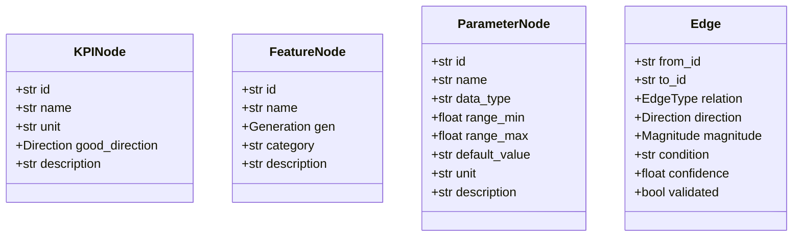
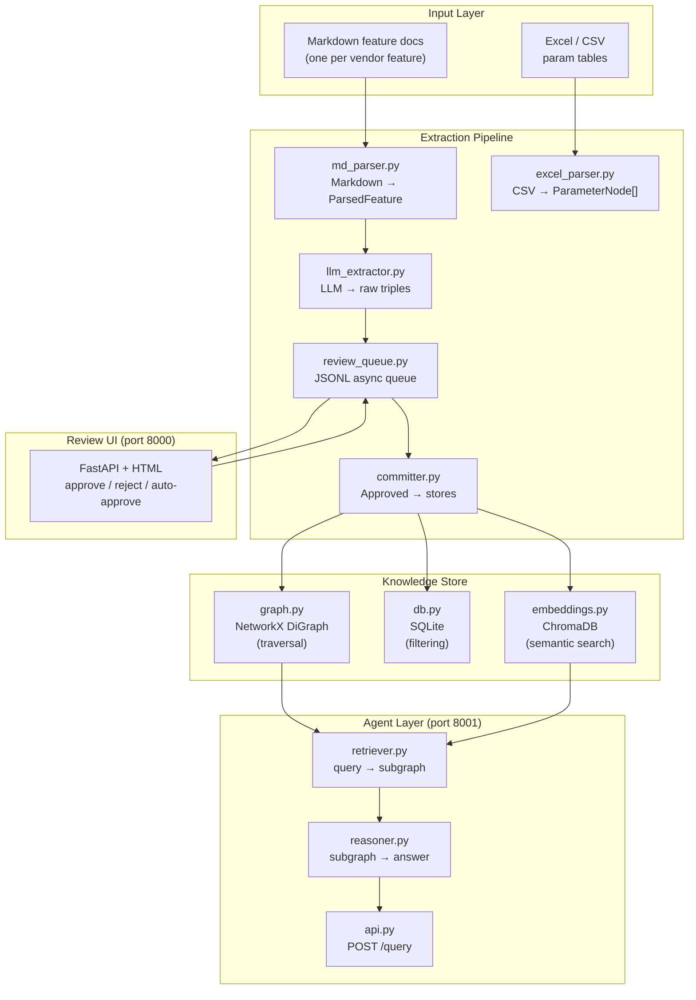
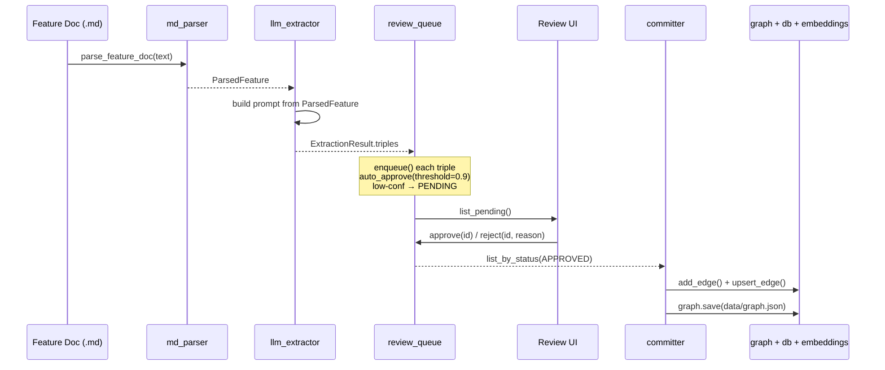
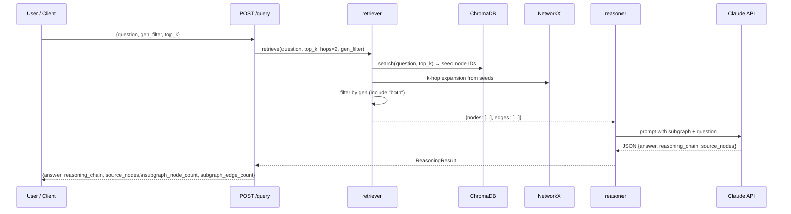

# Causality Graph — Architecture Reference

> **For LLMs:** This document is the primary context source for understanding this codebase. Read it before touching any file. All node IDs, edge types, and module boundaries described here are authoritative.

---

## What This System Does

Answers natural language optimization questions about cellular networks by traversing a causal knowledge graph.

**Example query:** *"What parameters improve downlink throughput in 5G?"*

**Answer path:**
1. Embed query → find `kpi:dl_throughput` in ChromaDB
2. Expand 2-hop subgraph: `kpi:dl_throughput ← feature:CA ← param:maxCaBands`
3. LLM reasons over subgraph → returns answer + reasoning chain

---

## Directory Tree

```
causality_graph/
├── schema.py                   # All node/edge dataclasses and enums (read first)
├── store/
│   ├── graph.py                # NetworkX graph — traversal and serialization
│   ├── db.py                   # SQLite — metadata filtering by type/gen/confidence
│   └── embeddings.py           # ChromaDB — semantic search over node descriptions
├── extraction/
│   ├── md_parser.py            # Markdown feature doc → ParsedFeature
│   ├── excel_parser.py         # CSV/Excel param table → list[ParameterNode]
│   ├── llm_extractor.py        # ParsedFeature → raw triples (calls Claude API)
│   ├── review_queue.py         # JSONL async queue — enqueue/approve/reject
│   └── committer.py            # Approved triples → graph + db + embeddings
├── review_ui/
│   ├── app.py                  # FastAPI review interface (port 8000)
│   └── templates/index.html    # HTML review table
└── agent/
    ├── retriever.py            # NL query → subgraph {"nodes": [], "edges": []}
    ├── reasoner.py             # subgraph + question → ReasoningResult
    └── api.py                  # FastAPI query API POST /query (port 8001)

tests/
├── fixtures/
│   ├── sample_feature.md       # Canonical markdown format for feature docs
│   └── sample_params.csv       # Canonical CSV format for parameter tables
├── scoring/
│   ├── goldset.jsonl           # NL queries + expected param IDs
│   └── score.py                # Precision@k scorer (requires live API on port 8001)
└── test_*.py                   # Unit tests (49 total, all mock-based)

data/
├── graph.json                  # Serialized NetworkX graph (runtime artifact)
├── chroma/                     # ChromaDB persist directory (runtime artifact)
└── review_queue.jsonl          # Pending/approved/rejected triples (runtime artifact)
```

---

## Data Model

### Node Types



### Node ID Convention

| Type | Prefix | Example |
|------|--------|---------|
| KPI | `kpi:` | `kpi:dl_throughput` |
| Feature | `feature:` | `feature:CA` |
| Parameter | `param:` | `param:maxCaBands` |

### Edge Types

| EdgeType | From → To | Meaning |
|----------|-----------|---------|
| `AFFECTS` | Feature → KPI | Feature causally affects KPI (direction: +/-) |
| `CONTROLLED_BY` | Feature → Parameter | Parameter controls feature behavior |
| `DEPENDS_ON` | Feature → Feature | Feature requires another feature |
| `CORRELATES` | KPI → KPI | KPIs move together |

### Enums

```python
Direction:  POSITIVE("+")  | NEGATIVE("-")
Generation: G4("4G") | G5("5G") | BOTH("both")
Magnitude:  LOW | MEDIUM | HIGH
NodeType:   KPI | FEATURE | PARAMETER
EdgeType:   AFFECTS | CONTROLLED_BY | DEPENDS_ON | CORRELATES
```

---

## System Architecture



---

## Extraction Pipeline Flow



---

## Query Flow



---

## Three-Store Design

Each store has a distinct role. All share node IDs.

| Store | File | Purpose | When to query |
|-------|------|---------|---------------|
| NetworkX | `data/graph.json` | Traversal: successors, predecessors, k-hop | Always in retriever |
| SQLite | `data/meta.db` | Filter: by NodeType, Generation, confidence | Offline analysis, admin queries |
| ChromaDB | `data/chroma/` | Semantic: find nodes similar to NL query | Entry point for agent retrieval |

**Invariant:** A node/edge in NetworkX must also exist in SQLite. ChromaDB embeddings are best-effort (regenerated if stale).

---

## Key Interfaces

### `CausalityGraph` (`store/graph.py`)
```python
g.add_kpi(KPINode)           # add node
g.add_feature(FeatureNode)
g.add_parameter(ParameterNode)
g.add_edge(Edge)             # add directed edge
g.get_node(node_id) → dict | None
g.get_neighbors(node_id) → list[dict]   # successors with {"id": ...}
g.get_edges_from(node_id) → list[dict]  # out-edges with edge properties
g.save(path)                 # serialize to JSON
CausalityGraph.load(path)    # deserialize from JSON
```

### `MetadataDB` (`store/db.py`)
```python
db.upsert_node(node, NodeType)
db.upsert_edge(Edge)
db.get_node(node_id) → dict | None
db.filter_nodes(node_type=None, gen=None) → list[dict]
db.filter_edges(validated=None, min_confidence=0.0) → list[dict]
```

### `EmbeddingStore` (`store/embeddings.py`)
```python
store.upsert_node(node_id, text, metadata)
store.search(query, top_k) → list[{"id", "score", "metadata"}]
```

### `ReviewQueue` (`extraction/review_queue.py`)
```python
queue.enqueue(triple_dict) → item_id
queue.list_pending() → list[dict]
queue.list_by_status(ReviewStatus) → list[dict]
queue.approve(item_id)
queue.reject(item_id, reason="")
queue.auto_approve(threshold=0.9) → int  # returns count approved
```

### `Retriever` (`agent/retriever.py`)
```python
retriever.retrieve(query, top_k=5, hops=2, gen_filter=None)
# → {"nodes": [{"id": ..., ...}], "edges": [{"from": ..., "to": ..., ...}]}
# gen_filter: "4G" | "5G" | None — includes nodes where gen == filter OR gen == "both"
```

### `Reasoner` (`agent/reasoner.py`)
```python
reasoner.answer(question, subgraph) → ReasoningResult
# ReasoningResult.answer: str
# ReasoningResult.reasoning_chain: list[str]  — inference steps
# ReasoningResult.source_nodes: list[str]     — node IDs cited
```

### Query API (`agent/api.py`)
```
POST /query
  Body: {"question": str, "gen_filter": "4G"|"5G"|null, "top_k": int}
  Response: {"answer", "reasoning_chain", "source_nodes",
             "subgraph_node_count", "subgraph_edge_count"}

GET /health → {"status": "ok"}
```

---

## Input Formats

### Feature Markdown (`tests/fixtures/sample_feature.md`)

```markdown
# Feature: <Name>

**Feature ID**: feature:<id>
**Generation**: 4G | 5G | both
**Category**: <category>

## Description
<prose>

## KPI Impact
| KPI ID | KPI Name | Direction | Magnitude | Condition |
|--------|----------|-----------|-----------|-----------|
| kpi:x  | Name     | +         | high      | condition |

## Controlling Parameters
| Parameter ID   | Effect When Increased |
|----------------|-----------------------|
| param:x        | description           |

## Feature Dependencies
| Feature ID  | Dependency Type |
|-------------|----------------|
| feature:x   | enables         |
```

### Parameter CSV (`tests/fixtures/sample_params.csv`)

```
id,name,data_type,range_min,range_max,default_value,unit,description,linked_feature_id
param:x,paramName,int,0,100,10,MHz,description,feature:y
```

---

## Running the System

```bash
# Install
pip install -e ".[dev]"

# Run extraction (populate graph from synthetic fixtures)
python -c "
from pathlib import Path
from causality_graph.extraction.md_parser import parse_feature_doc
from causality_graph.extraction.llm_extractor import LLMExtractor
from causality_graph.extraction.review_queue import ReviewQueue
import anthropic

doc = Path('tests/fixtures/sample_feature.md').read_text()
feature = parse_feature_doc(doc)
extractor = LLMExtractor(client=anthropic.Anthropic())
result = extractor.extract(feature)
queue = ReviewQueue(Path('data/review_queue.jsonl'))
for triple in result.triples:
    queue.enqueue(triple)
queue.auto_approve(threshold=0.85)
"

# Review UI (approve remaining pending items)
uvicorn causality_graph.review_ui.app:app --port 8000

# Commit approved triples to stores
python -c "
from pathlib import Path
from causality_graph.extraction.review_queue import ReviewQueue
from causality_graph.extraction.committer import commit_approved
from causality_graph.store.graph import CausalityGraph
from causality_graph.store.db import MetadataDB
from causality_graph.store.embeddings import EmbeddingStore

queue = ReviewQueue(Path('data/review_queue.jsonl'))
graph = CausalityGraph.load(Path('data/graph.json')) if Path('data/graph.json').exists() else CausalityGraph()
db = MetadataDB(Path('data/meta.db'))
embeddings = EmbeddingStore(persist_dir='data/chroma')
n = commit_approved(queue, graph, db, embeddings, Path('data/graph.json'))
print(f'Committed {n} edges')
"

# Query API
uvicorn causality_graph.agent.api:app --port 8001

# Score (requires API running)
python tests/scoring/score.py --top-k 3
```

---

## Constraints and Invariants

- **No real vendor docs in repo** — all dev/test uses synthetic fixtures in `tests/fixtures/`
- **gen="both" is inclusive** — retriever includes "both" nodes in any gen filter; SQLite `filter_nodes` does exact match only
- **Confidence threshold** — `auto_approve` default is 0.9; items below go to human review queue
- **Graph is append-only** — no delete/update for nodes or edges (add new edges with higher confidence instead)
- **Embeddings are best-effort** — ChromaDB may lag if `upsert_node` not called after graph changes
- **Single vendor** — graph schema has no vendor field; extend `FeatureNode` if multi-vendor support needed
