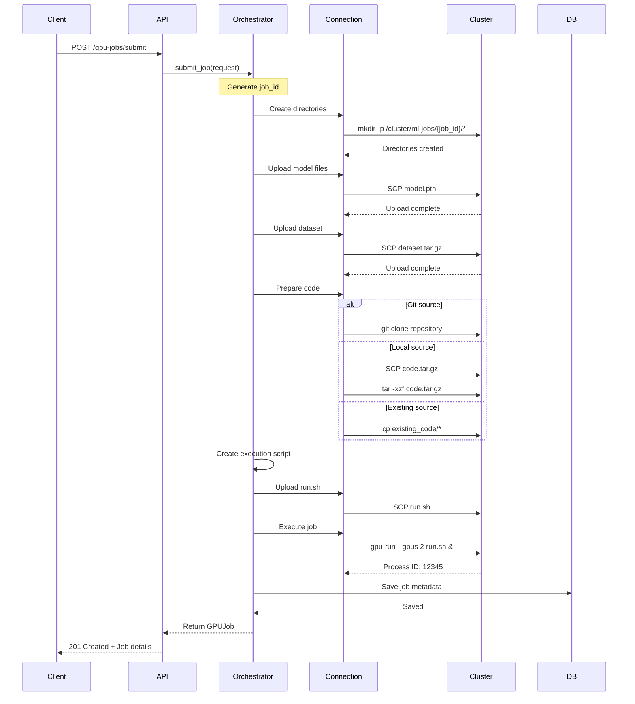
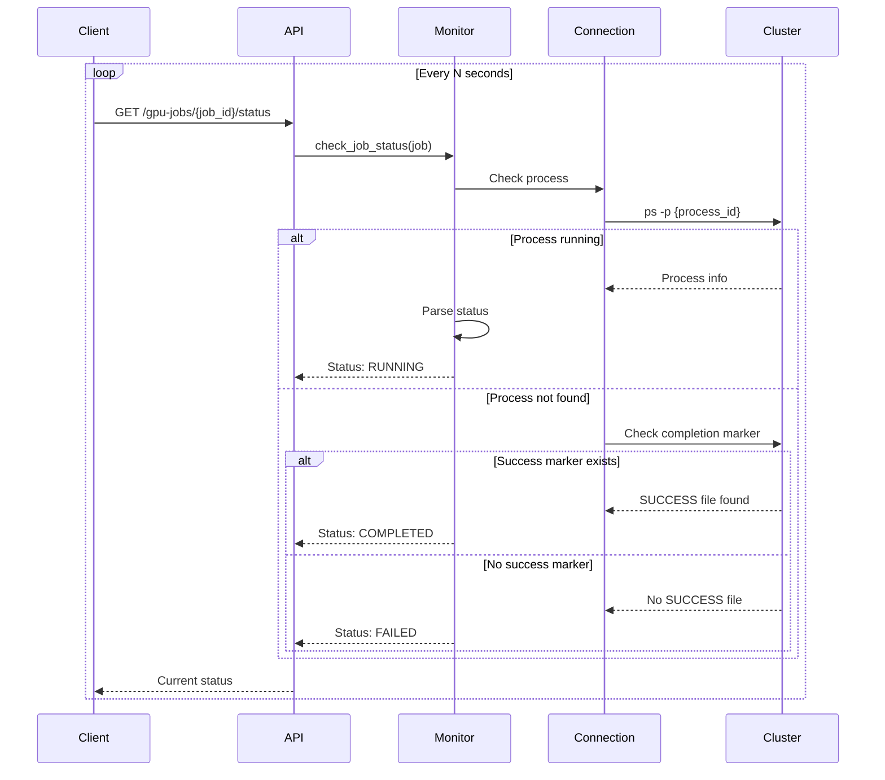
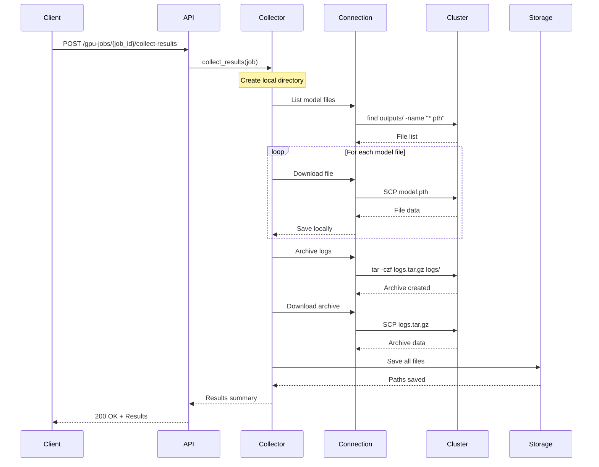

# GPU Cluster Integration System

## 목차
1. [개요](#개요)
2. [시스템 아키텍처](#시스템-아키텍처)
3. [핵심 컴포넌트](#핵심-컴포넌트)
4. [API 명세](#api-명세)
5. [작업 플로우](#작업-플로우)
6. [데이터 모델](#데이터-모델)
7. [구현 가이드](#구현-가이드)
8. [보안 고려사항](#보안-고려사항)
9. [모니터링 및 로깅](#모니터링-및-로깅)
10. [에러 처리](#에러-처리)

## 개요

### 시스템 목적
Deep Learning Platform과 외부 GPU 클러스터를 연동하여 머신러닝 모델의 학습, 재학습, 파인튜닝 작업을 원격으로 실행하고 관리하는 시스템입니다.

### 주요 기능
- **원격 작업 실행**: SSH를 통한 GPU 클러스터 작업 제출
- **파일 전송**: SCP를 통한 모델, 데이터, 코드 전송
- **작업 모니터링**: 프로세스 상태 추적 및 로그 수집
- **결과 수집**: 학습 완료 후 모델 및 결과 파일 수집

### 시스템 요구사항
- SSH/SCP를 통한 클러스터 접근
- GPU 클러스터의 작업 실행 명령어 인터페이스
- 파일 시스템 기반 데이터 교환
- 프로세스 ID 기반 작업 추적

## 시스템 아키텍처

### 전체 구조도

```
┌─────────────────────────────────────────────────────────────┐
│                     FastAPI Server                          │
├─────────────────────────────────────────────────────────────┤
│                                                             │
│  ┌─────────────────────────────────────────────────────┐   │
│  │               Job Orchestrator Service               │   │
│  │                                                      │   │
│  │  ┌─────────────┐  ┌─────────────┐  ┌────────────┐  │   │
│  │  │File Transfer│  │Job Executor │  │Job Monitor │  │   │
│  │  │   (SCP)     │  │   (SSH)     │  │  (SSH)     │  │   │
│  │  └─────────────┘  └─────────────┘  └────────────┘  │   │
│  │                                                      │   │
│  │  ┌─────────────────────────────────────────────┐    │   │
│  │  │           Result Collector (SCP)            │    │   │
│  │  └─────────────────────────────────────────────┘    │   │
│  └─────────────────────────────────────────────────────┘   │
│                                                             │
│  ┌─────────────────────────────────────────────────────┐   │
│  │                    Database Layer                    │   │
│  │  ┌──────────────┐  ┌──────────────┐                │   │
│  │  │  PostgreSQL  │  │    Redis     │                │   │
│  │  │  (Metadata)  │  │   (Cache)    │                │   │
│  │  └──────────────┘  └──────────────┘                │   │
│  └─────────────────────────────────────────────────────┘   │
│                           │                                 │
└───────────────────────────┼─────────────────────────────────┘
                           │ SSH/SCP Protocol
                           ▼
┌─────────────────────────────────────────────────────────────┐
│                      GPU Cluster                            │
│                                                             │
│  ┌──────────────────────────────────────────────────────┐  │
│  │              Cluster File System                      │  │
│  │                                                      │  │
│  │  /cluster/ml-jobs/                                   │  │
│  │  └── {job_id}/                                      │  │
│  │      ├── code/        # 실행 코드                   │  │
│  │      ├── data/        # 입력 데이터                 │  │
│  │      ├── models/      # 입력 모델 파일              │  │
│  │      ├── outputs/     # 출력 결과                   │  │
│  │      ├── logs/        # 실행 로그                   │  │
│  │      └── run.sh       # 실행 스크립트               │  │
│  └──────────────────────────────────────────────────────┘  │
│                                                             │
│  ┌──────────────────────────────────────────────────────┐  │
│  │           GPU Resources & Process Manager            │  │
│  │  • Multi-GPU allocation                             │  │
│  │  • Process lifecycle management                     │  │
│  │  • Resource monitoring                              │  │
│  └──────────────────────────────────────────────────────┘  │
└─────────────────────────────────────────────────────────────┘
```

### 계층 구조

| 계층 | 컴포넌트 | 책임 |
|------|----------|------|
| **Presentation** | REST API | HTTP 요청 처리, 응답 반환 |
| **Application** | Job Orchestrator | 작업 조정 및 워크플로우 관리 |
| **Domain** | Job, JobRequest Models | 비즈니스 로직 및 도메인 규칙 |
| **Infrastructure** | SSH/SCP Connection | 클러스터 통신 및 파일 전송 |
| **Persistence** | PostgreSQL, Redis | 데이터 저장 및 캐싱 |

## 핵심 컴포넌트

### 1. Job Orchestrator Service
작업의 전체 생명주기를 관리하는 핵심 서비스입니다.

**주요 기능:**
- 작업 디렉토리 생성 및 초기화
- 파일 전송 조정
- 실행 스크립트 생성
- 프로세스 실행 명령 전송
- 작업 상태 관리

**인터페이스:**
```python
class GPUJobOrchestrator:
    async def submit_job(request: GPUJobRequest) -> GPUJob
    async def cancel_job(job_id: str) -> bool
    async def retry_job(job_id: str) -> GPUJob
```

### 2. Cluster Connection Manager
SSH 및 SFTP 연결을 관리하고 명령 실행을 담당합니다.

**주요 기능:**
- SSH 연결 풀 관리
- SFTP를 통한 파일 전송
- 명령 실행 및 결과 반환
- 연결 재시도 및 오류 처리

**인터페이스:**
```python
class ClusterConnection:
    def execute_command(command: str) -> tuple[str, str, int]
    def upload_file(local_path: str, remote_path: str)
    def download_file(remote_path: str, local_path: str)
```

### 3. Job Monitor Service
실행 중인 작업의 상태를 모니터링합니다.

**주요 기능:**
- 프로세스 상태 확인 (대기/실행/완료)
- 로그 파일 실시간 모니터링
- 리소스 사용량 추적
- 작업 완료 감지

**인터페이스:**
```python
class JobMonitor:
    async def check_job_status(job: GPUJob) -> JobStatus
    async def get_job_logs(job: GPUJob, lines: int) -> str
    async def stream_logs(job: GPUJob) -> AsyncIterator[str]
```

### 4. Result Collector Service
완료된 작업의 결과를 수집합니다.

**주요 기능:**
- 모델 파일 다운로드
- 로그 파일 수집
- 메트릭 데이터 추출
- 결과 압축 및 저장

**인터페이스:**
```python
class ResultCollector:
    async def collect_results(job: GPUJob) -> dict
    async def archive_results(job: GPUJob) -> str
```

## API 명세

### 작업 제출
**POST** `/api/gpu-jobs/submit`

**Request Body:**
```json
{
  "job_name": "model_training_v1",
  "gpu_count": 2,
  "model_file_path": "/local/path/to/model.pth",
  "dataset_path": "/local/path/to/dataset.tar.gz",
  "code_source": "git",
  "code_path": "https://github.com/user/ml-project.git",
  "entry_script": "train.py",
  "script_args": {
    "epochs": "100",
    "batch_size": "32",
    "learning_rate": "0.001"
  },
  "environment_vars": {
    "CUDA_VISIBLE_DEVICES": "0,1",
    "WANDB_API_KEY": "xxx"
  }
}
```

**Response:**
```json
{
  "job_id": "550e8400-e29b-41d4-a716-446655440000",
  "process_id": "12345",
  "status": "pending",
  "cluster_path": "/cluster/ml-jobs/550e8400-e29b-41d4-a716-446655440000",
  "created_at": "2024-01-01T10:00:00Z",
  "estimated_start_time": "2024-01-01T10:05:00Z"
}
```

### 작업 상태 확인
**GET** `/api/gpu-jobs/{job_id}/status`

**Response:**
```json
{
  "job_id": "550e8400-e29b-41d4-a716-446655440000",
  "status": "running",
  "process_id": "12345",
  "started_at": "2024-01-01T10:05:00Z",
  "progress": {
    "current_epoch": 45,
    "total_epochs": 100,
    "current_loss": 0.234,
    "gpu_utilization": 85.5
  }
}
```

### 로그 조회
**GET** `/api/gpu-jobs/{job_id}/logs?lines=100`

**Response:**
```json
{
  "job_id": "550e8400-e29b-41d4-a716-446655440000",
  "logs": [
    "[2024-01-01 10:05:00] Starting training...",
    "[2024-01-01 10:05:01] Loading dataset...",
    "[2024-01-01 10:05:10] Epoch 1/100 - Loss: 2.234"
  ],
  "has_more": true
}
```

### 실시간 로그 스트리밍
**WebSocket** `/api/gpu-jobs/{job_id}/logs/stream`

**Message Format:**
```json
{
  "timestamp": "2024-01-01T10:05:00Z",
  "level": "INFO",
  "message": "Epoch 45/100 - Loss: 0.234 - Accuracy: 0.95"
}
```

### 결과 수집
**POST** `/api/gpu-jobs/{job_id}/collect-results`

**Response:**
```json
{
  "job_id": "550e8400-e29b-41d4-a716-446655440000",
  "status": "completed",
  "results": {
    "models": [
      "/storage/results/550e8400/models/best_model.pth",
      "/storage/results/550e8400/models/checkpoint_epoch_100.pth"
    ],
    "logs": [
      "/storage/results/550e8400/logs/training.log",
      "/storage/results/550e8400/logs/tensorboard/"
    ],
    "metrics": {
      "final_loss": 0.123,
      "final_accuracy": 0.98,
      "training_time": 3600
    }
  }
}
```

### 작업 목록 조회
**GET** `/api/gpu-jobs?status=running&limit=10&offset=0`

**Response:**
```json
{
  "total": 25,
  "jobs": [
    {
      "job_id": "550e8400-e29b-41d4-a716-446655440000",
      "job_name": "model_training_v1",
      "status": "running",
      "created_at": "2024-01-01T10:00:00Z",
      "gpu_count": 2
    }
  ]
}
```

## 작업 플로우

### 1. 작업 제출 플로우



### 2. 작업 모니터링 플로우



### 3. 결과 수집 플로우



## 데이터 모델

### Job Request Model
```python
class GPUJobRequest(BaseModel):
    """GPU 작업 요청 모델"""
    job_name: str                              # 작업 이름
    gpu_count: int = 1                         # 필요한 GPU 수
    
    # 파일 경로
    model_file_path: Optional[str] = None      # 로컬 모델 파일 경로
    dataset_path: Optional[str] = None         # 로컬 데이터셋 경로
    code_source: Literal["git", "local", "existing"]  # 코드 소스 타입
    code_path: str                              # 코드 위치 (URL 또는 경로)
    
    # 실행 설정
    entry_script: str                           # 실행할 메인 스크립트
    script_args: Dict[str, str] = {}           # 스크립트 인자
    environment_vars: Dict[str, str] = {}      # 환경 변수
    
    # 리소스 설정
    memory_gb: Optional[int] = None            # 메모리 요구사항 (GB)
    timeout_hours: Optional[int] = 24          # 최대 실행 시간
```

### Job Model
```python
class GPUJob(BaseModel):
    """GPU 작업 상태 모델"""
    job_id: str                                 # 고유 작업 ID
    job_name: str                               # 작업 이름
    user_id: str                                # 제출한 사용자 ID
    
    # 프로세스 정보
    process_id: Optional[str] = None           # 클러스터 프로세스 ID
    status: JobStatus                           # 현재 상태
    
    # 경로 정보
    cluster_path: str                           # 클러스터 내 작업 디렉토리
    local_results_path: Optional[str] = None   # 로컬 결과 저장 경로
    
    # 시간 정보
    created_at: datetime                        # 생성 시간
    queued_at: Optional[datetime] = None       # 큐 진입 시간
    started_at: Optional[datetime] = None      # 실행 시작 시간
    completed_at: Optional[datetime] = None    # 완료 시간
    
    # 실행 정보
    gpu_count: int                              # 할당된 GPU 수
    exit_code: Optional[int] = None            # 프로세스 종료 코드
    error_message: Optional[str] = None        # 에러 메시지
    
    # 메타데이터
    metadata: Dict[str, Any] = {}              # 추가 메타데이터
```

### Job Status Enum
```python
class JobStatus(str, Enum):
    """작업 상태"""
    PENDING = "pending"        # 제출됨, 대기 중
    QUEUED = "queued"         # 큐에 들어감
    PREPARING = "preparing"    # 파일 전송 중
    RUNNING = "running"        # 실행 중
    COMPLETED = "completed"    # 정상 완료
    FAILED = "failed"         # 실패
    CANCELLED = "cancelled"    # 취소됨
    TIMEOUT = "timeout"       # 시간 초과
```

### Job Progress Model
```python
class JobProgress(BaseModel):
    """작업 진행 상황"""
    job_id: str
    current_epoch: Optional[int] = None
    total_epochs: Optional[int] = None
    current_step: Optional[int] = None
    total_steps: Optional[int] = None
    current_loss: Optional[float] = None
    metrics: Dict[str, float] = {}
    gpu_utilization: Optional[float] = None
    memory_usage_gb: Optional[float] = None
    estimated_time_remaining: Optional[int] = None  # seconds
```

## 구현 가이드

### 1. 프로젝트 구조
```
dl-platform/
├── src/
│   ├── ml/
│   │   └── cluster/
│   │       ├── __init__.py
│   │       ├── models.py          # 데이터 모델
│   │       ├── connection.py      # SSH/SCP 연결 관리
│   │       ├── orchestrator.py    # 작업 조정 서비스
│   │       ├── monitor.py         # 모니터링 서비스
│   │       ├── collector.py       # 결과 수집 서비스
│   │       └── exceptions.py      # 커스텀 예외
│   ├── api/
│   │   └── endpoints/
│   │       └── gpu_jobs.py        # GPU 작업 API 엔드포인트
│   └── core/
│       └── config.py              # 클러스터 설정
```

### 2. 환경 설정
```python
# src/core/config.py
from pydantic import BaseSettings

class ClusterSettings(BaseSettings):
    """GPU 클러스터 설정"""
    cluster_host: str
    cluster_username: str
    cluster_key_path: str
    cluster_base_path: str = "/cluster/ml-jobs"
    
    # 연결 설정
    ssh_timeout: int = 30
    ssh_port: int = 22
    max_retries: int = 3
    
    # 파일 전송 설정
    chunk_size: int = 8192
    max_file_size_gb: int = 100
    
    class Config:
        env_prefix = "GPU_CLUSTER_"
```

### 3. 의존성 주입
```python
# src/api/dependencies.py
from functools import lru_cache
from src.ml.cluster import ClusterConnection, GPUJobOrchestrator

@lru_cache()
def get_cluster_connection() -> ClusterConnection:
    settings = get_settings()
    return ClusterConnection(
        host=settings.cluster_host,
        username=settings.cluster_username,
        key_path=settings.cluster_key_path
    )

def get_orchestrator() -> GPUJobOrchestrator:
    connection = get_cluster_connection()
    return GPUJobOrchestrator(connection)
```

### 4. 데이터베이스 스키마
```sql
-- GPU 작업 테이블
CREATE TABLE gpu_jobs (
    job_id UUID PRIMARY KEY DEFAULT gen_random_uuid(),
    job_name VARCHAR(255) NOT NULL,
    user_id UUID REFERENCES users(id),
    
    -- 프로세스 정보
    process_id VARCHAR(50),
    status VARCHAR(20) NOT NULL DEFAULT 'pending',
    
    -- 경로 정보
    cluster_path VARCHAR(500),
    local_results_path VARCHAR(500),
    
    -- 시간 정보
    created_at TIMESTAMP DEFAULT NOW(),
    queued_at TIMESTAMP,
    started_at TIMESTAMP,
    completed_at TIMESTAMP,
    
    -- 실행 정보
    gpu_count INTEGER DEFAULT 1,
    exit_code INTEGER,
    error_message TEXT,
    
    -- 요청 정보 (JSON)
    request_data JSONB,
    metadata JSONB,
    
    -- 인덱스
    INDEX idx_user_id (user_id),
    INDEX idx_status (status),
    INDEX idx_created_at (created_at)
);

-- 작업 로그 테이블
CREATE TABLE gpu_job_logs (
    id SERIAL PRIMARY KEY,
    job_id UUID REFERENCES gpu_jobs(job_id),
    timestamp TIMESTAMP DEFAULT NOW(),
    level VARCHAR(20),
    message TEXT,
    
    INDEX idx_job_id (job_id),
    INDEX idx_timestamp (timestamp)
);

-- 작업 결과 테이블
CREATE TABLE gpu_job_results (
    job_id UUID PRIMARY KEY REFERENCES gpu_jobs(job_id),
    model_files TEXT[],
    log_files TEXT[],
    metrics JSONB,
    collected_at TIMESTAMP DEFAULT NOW()
);
```

## 보안 고려사항

### 1. SSH 키 관리
- SSH 개인 키는 안전한 위치에 저장
- 파일 권한을 600으로 설정
- 환경 변수나 Secret Manager 사용
- 정기적인 키 로테이션

### 2. 명령 실행 보안
```python
# 명령 인젝션 방지
import shlex

def safe_command(cmd: str, args: List[str]) -> str:
    """안전한 명령 생성"""
    safe_args = [shlex.quote(arg) for arg in args]
    return f"{cmd} {' '.join(safe_args)}"
```

### 3. 파일 전송 검증
- 파일 크기 제한 검사
- 파일 타입 검증
- 악성 코드 스캔
- 체크섬 검증

### 4. 접근 제어
- 사용자별 작업 격리
- 리소스 할당 제한
- API 레이트 리미팅
- 작업 실행 권한 검증

## 모니터링 및 로깅

### 1. 메트릭 수집
```python
# Prometheus 메트릭 예시
from prometheus_client import Counter, Histogram, Gauge

job_submitted = Counter('gpu_jobs_submitted_total', 'Total submitted jobs')
job_duration = Histogram('gpu_job_duration_seconds', 'Job duration')
active_jobs = Gauge('gpu_jobs_active', 'Currently active jobs')
```

### 2. 로그 수집 전략
- **애플리케이션 로그**: FastAPI 앱 로그
- **작업 로그**: GPU 클러스터 실행 로그
- **시스템 로그**: SSH 연결, 파일 전송 로그
- **감사 로그**: 사용자 활동 및 보안 이벤트

### 3. 알림 설정
```python
class AlertManager:
    async def send_alert(self, job: GPUJob, event: str):
        """작업 이벤트 알림 전송"""
        if event == "completed":
            await self.notify_success(job)
        elif event == "failed":
            await self.notify_failure(job)
        elif event == "timeout":
            await self.notify_timeout(job)
```

## 에러 처리

### 1. 재시도 정책
```python
from tenacity import retry, stop_after_attempt, wait_exponential

@retry(
    stop=stop_after_attempt(3),
    wait=wait_exponential(multiplier=1, min=4, max=10)
)
async def transfer_file_with_retry(self, local_path: str, remote_path: str):
    """파일 전송 with 재시도"""
    return await self.transfer_file(local_path, remote_path)
```

### 2. 에러 분류
```python
class ClusterError(Exception):
    """기본 클러스터 에러"""
    pass

class ConnectionError(ClusterError):
    """SSH 연결 에러"""
    pass

class FileTransferError(ClusterError):
    """파일 전송 에러"""
    pass

class JobExecutionError(ClusterError):
    """작업 실행 에러"""
    pass

class ResourceUnavailableError(ClusterError):
    """리소스 부족 에러"""
    pass
```

### 3. 에러 복구 전략
- **연결 실패**: 재연결 시도 (최대 3회)
- **파일 전송 실패**: 체크포인트에서 재시작
- **작업 실패**: 사용자에게 알림 및 재시도 옵션 제공
- **타임아웃**: 작업 종료 및 리소스 정리

## 성능 최적화

### 1. 연결 풀링
```python
class ConnectionPool:
    """SSH 연결 풀"""
    def __init__(self, max_connections: int = 10):
        self.pool = []
        self.max_connections = max_connections
    
    async def get_connection(self) -> ClusterConnection:
        """풀에서 연결 가져오기"""
        # 구현...
```

### 2. 파일 전송 최적화
- 대용량 파일은 압축 후 전송
- 청크 단위 스트리밍 전송
- 병렬 파일 전송 지원
- 증분 동기화 (rsync 활용)

### 3. 캐싱 전략
```python
from functools import lru_cache
import redis

class JobCache:
    """작업 정보 캐싱"""
    def __init__(self):
        self.redis = redis.Redis()
    
    async def get_job_status(self, job_id: str) -> Optional[str]:
        """캐시에서 상태 조회"""
        cached = self.redis.get(f"job:status:{job_id}")
        if cached:
            return cached.decode()
        return None
```

## 테스트 전략

### 1. 단위 테스트
```python
# tests/test_orchestrator.py
import pytest
from unittest.mock import Mock, patch

@pytest.mark.asyncio
async def test_submit_job():
    """작업 제출 테스트"""
    mock_connection = Mock()
    orchestrator = GPUJobOrchestrator(mock_connection)
    
    request = GPUJobRequest(
        job_name="test_job",
        gpu_count=1,
        code_source="local",
        code_path="/test/path",
        entry_script="train.py"
    )
    
    job = await orchestrator.submit_job(request)
    assert job.status == JobStatus.PENDING
    assert job.job_name == "test_job"
```

### 2. 통합 테스트
```python
# tests/integration/test_cluster_integration.py
@pytest.mark.integration
async def test_end_to_end_job_flow():
    """전체 작업 플로우 테스트"""
    # 1. 작업 제출
    # 2. 상태 확인
    # 3. 로그 조회
    # 4. 결과 수집
    pass
```

### 3. 모의 클러스터 환경
```python
class MockCluster:
    """테스트용 모의 클러스터"""
    def execute_command(self, cmd: str):
        if "ps -p" in cmd:
            return "R", "", 0  # Running status
        return "", "", 0
```

## 배포 고려사항

### 1. 환경별 설정
```yaml
# config/production.yaml
cluster:
  host: gpu-cluster.prod.example.com
  username: ml-prod-user
  base_path: /cluster/production/ml-jobs
  
# config/staging.yaml
cluster:
  host: gpu-cluster.staging.example.com
  username: ml-staging-user
  base_path: /cluster/staging/ml-jobs
```

### 2. 스케일링 전략
- 수평 스케일링: API 서버 인스턴스 추가
- 연결 풀 크기 조정
- 작업 큐 분산 처리
- 로드 밸런싱 설정

### 3. 모니터링 대시보드
- Grafana를 통한 메트릭 시각화
- 실시간 작업 상태 모니터링
- 리소스 사용률 추적
- 에러 발생률 및 패턴 분석

## 향후 개선 사항

### 단기 (1-2개월)
- [ ] 작업 스케줄링 기능
- [ ] 작업 우선순위 관리
- [ ] 자동 재시도 메커니즘
- [ ] 상세 에러 리포팅

### 중기 (3-6개월)
- [ ] 분산 학습 지원
- [ ] 하이퍼파라미터 최적화
- [ ] A/B 테스팅 프레임워크
- [ ] 모델 버전 관리

### 장기 (6개월+)
- [ ] AutoML 통합
- [ ] 멀티 클러스터 지원
- [ ] 스마트 리소스 할당
- [ ] 비용 최적화 시스템