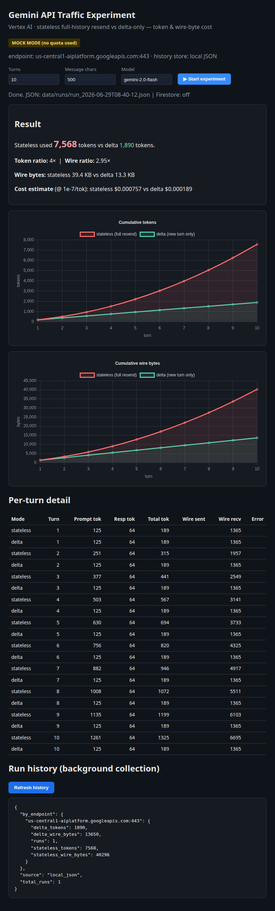

# Docs

## Rendered web UI

`gemini-ui-render.png` — full-page render of the live Flask dashboard after one
mock run (10 turns, 500 chars). Shows:

- **Status bar** — MOCK badge, Vertex endpoint, history store (local JSON / Firestore).
- **Result summary** — stateless vs delta tokens, token & wire ratios, cost estimate.
- **Cumulative tokens** chart — stateless (red) curves upward (O(N²)) vs delta (green) linear.
- **Cumulative wire bytes** chart — same divergence on real on-wire bytes.
- **Per-turn detail** table and **run history** (background collection) panel.

Regenerate: run `GEMINI_MOCK=1 python app.py`, open the page, click **Start
experiment**, screenshot the full page.

See also: [`../PROJECT_GOAL.md`](../PROJECT_GOAL.md),
[design spec](superpowers/specs/2026-06-26-gemini-traffic-test-design.md).
