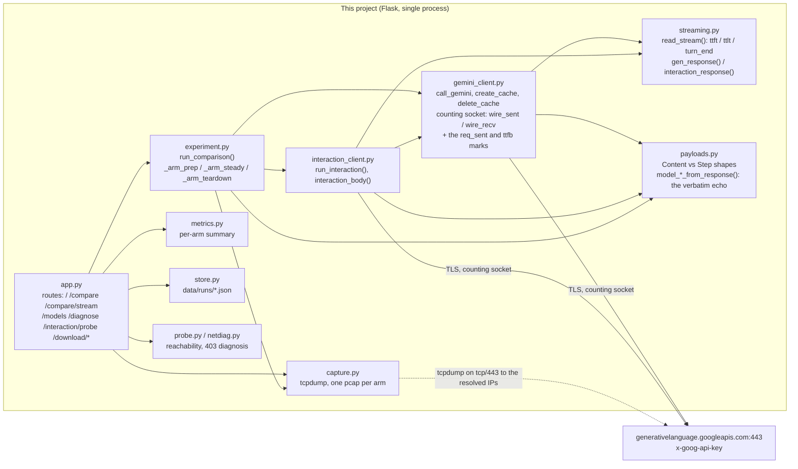
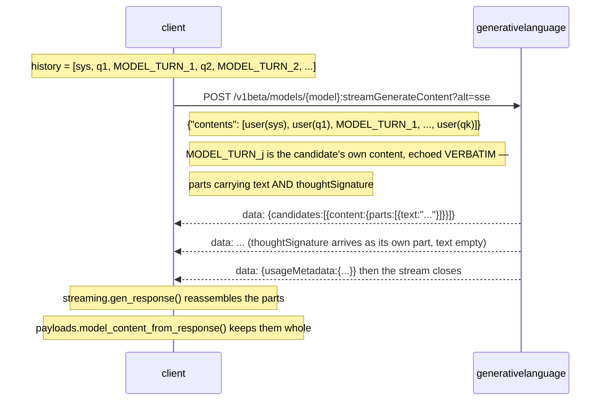
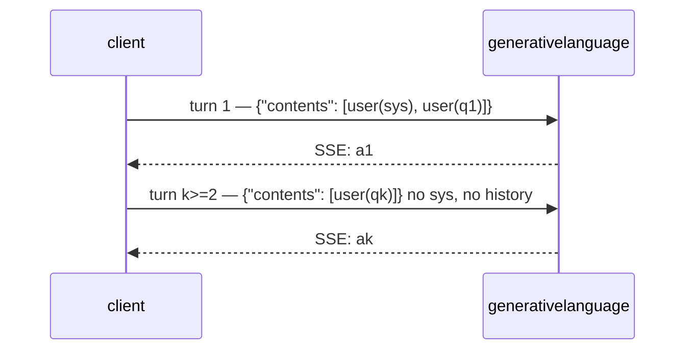
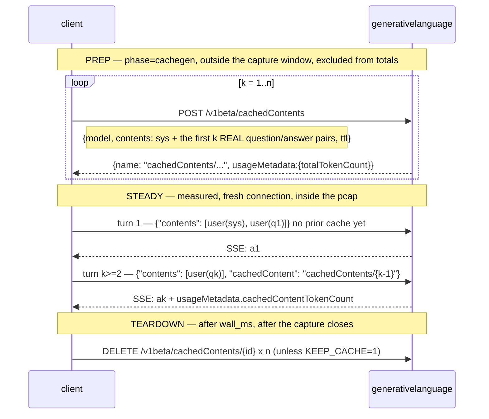
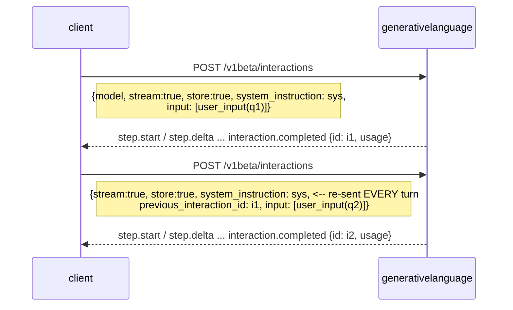
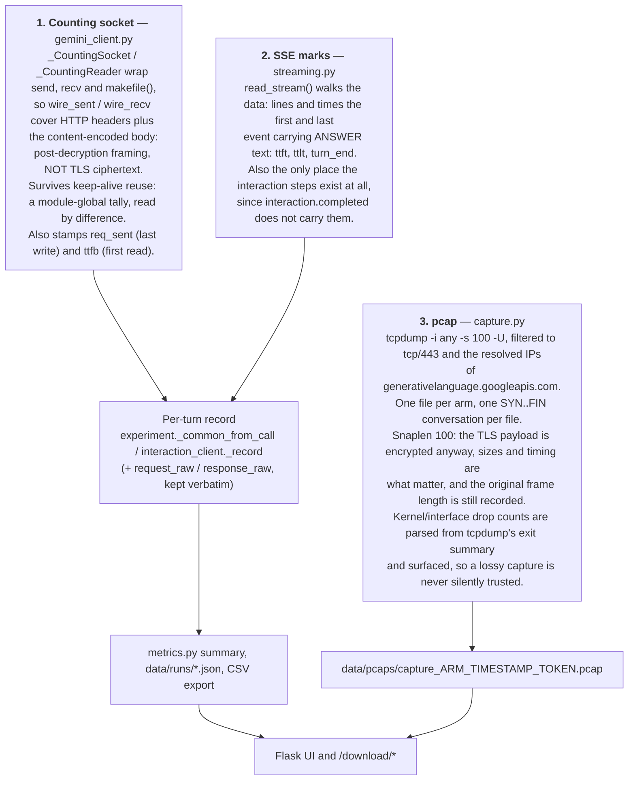

# Call flow

One host, one auth, one network path: every arm in this project talks to the
**Gemini Developer API** at `generativelanguage.googleapis.com` over HTTPS with an
`x-goog-api-key` header. There is no Vertex endpoint, no ADC, no agent sandbox, no
warmup call, no background execution and no tool declarations anywhere in the code —
if the arms sat on different hosts or different auth stacks, the latency numbers
would compare nothing.

The headline experiment is `experiment.run_comparison()`. It takes one scenario —
the system prompt and question list in `requests/perf.json` — and replays it across
six arms, each on its own fresh TCP connection and, optionally, into its own pcap.

The scenario's system prompt is **20,653 characters** (≈4.4k input tokens): a persona
plus a detailed tool description, large enough to be worth caching and large enough
that resending it every turn is visible on the wire. `perf.json` carries 10 steps; a
run uses the first `turns` of them.

The six arms:

| Arm | Who holds the conversation | Endpoint |
|---|---|---|
| `stateless` | the client, resending everything | `:streamGenerateContent?alt=sse` |
| `nocontext` | nobody (lower-bound diagnostic) | `:streamGenerateContent?alt=sse` |
| `cached` | an explicit `cachedContents` object | `:streamGenerateContent?alt=sse` + `cachedContent` |
| `interaction` | the server, chained by `previous_interaction_id` | `/interactions` |
| `interaction_inline` | the server, system prompt inlined into turn 1 | `/interactions` |
| `interaction_stateless` | the client, resending everything as `Step[]` | `/interactions` |

**Every arm streams.** `generateContent` is called as
`:streamGenerateContent?alt=sse`; the interactions arms send `"stream": true`. That
is not an aesthetic choice: TTFT cannot be measured any other way, and without TTFT
the stored-interaction arms get charged for the ~1.8 s write that lands *after* their
last token — a wait no streaming user ever does.

## 1. Components



`interaction_client` borrows `gemini_client`'s session, `wire_counter()` and auth, so
both wire vocabularies are counted by the same socket and timed by the same clock.

## 2. The `run_comparison` stage machine

Arms are ordered by `_order_arms()`: `stateless` runs first whenever `cached` is asked
for, because the caches are built from the answers `stateless` actually got — a cache
of a conversation that never happened measures nothing.

Each arm then runs five stages. Only the **steady** stage is measured: it is what the
pcap window covers and what `wall_ms[arm]` counts.

```mermaid
stateDiagram-v2
    [*] --> ResetPool
    ResetPool: reset_session() once, before the first arm — drop anything the probe or the model list left pooled

    ResetPool --> Arm

    state Arm {
        [*] --> Prep
        Prep: _arm_prep() — a no-op for every arm except `cached`, which builds one cachedContents per turn from the stateless transcript (phase=cachegen, excluded from totals)

        Prep --> CloseBefore
        CloseBefore: _close_connection(settle) — drop the keep-alive socket prep left open. settle = PCAP_SETTLE_SECONDS when capturing, so prep's FIN/ACK never lands inside the steady pcap

        CloseBefore --> Steady
        Steady: t0 = monotonic(); Capture(timestamp, arm) opens. _arm_steady() runs turns 1..n on a FRESH connection — one SYN..FIN conversation, one pcap

        Steady --> CloseAfter
        CloseAfter: _close_connection(settle) INSIDE the capture window, so the pcap ends with a complete teardown

        CloseAfter --> Wall
        Wall: capture stops; wall_ms[arm] = now - t0

        Wall --> Teardown
        Teardown: _arm_teardown() — `cached` DELETEs its caches (unless KEEP_CACHE=1), then closes the socket at zero settle: nothing is capturing, so there is nothing for the FIN to pollute

        Teardown --> [*]
    }

    Arm --> Pause: more arms left
    Pause: pause_seconds, ticked once a second so a long gap is distinguishable from a hang. Between arms only, never after the last one.
    Pause --> Arm

    Arm --> [*]: last arm, no trailing pause
```

Three properties fall out of this and are worth stating plainly:

- **A fresh connection per arm.** The `requests` session pools TLS connections; left
  alone, one socket would carry every arm and every pcap would open mid-conversation
  with no SYN. `_close_connection()` runs at the *end* of each arm's window rather than
  the start of the next, so an arm's FIN never shows up in the next arm's capture.
- **Prep and teardown sit outside the measurement.** Each cache build re-uploads the
  whole prefix, so counting them would make the `cached` arm O(n²) and drown everything
  the experiment is trying to show. They are recorded under the `cachegen` phase,
  reported separately, and excluded from the arm's totals. The cache DELETEs are not
  recorded at all.
- **`wall_ms` and the pcap cover the same window.** Both bracket the steady stage only.

## 3. What goes on the wire, per arm

`sys` is the 20,653-char system prompt; `qk` is turn k's question; `ak` is the model's
answer to it.

### `stateless` — the client resends everything



The echo matters. Rebuilding the model's turn from `response_text` would throw away the
`thoughtSignature` — roughly 1 KB of upload per turn that a real client does pay, and
that this arm must therefore pay too.

### `nocontext` — nobody keeps anything



A lower bound, not a usable client: the model answers turn k with no idea what turn
k-1 was.

### `cached` — the prefix lives server-side, in an explicit cache



Turn 1 has no prior cache and so behaves exactly like `stateless` turn 1; from turn 2
the prefix never goes back up the wire. A cache below `MIN_CACHE_TOKENS` (default 2048)
is skipped rather than created, and that turn falls back to sending `sys` inline.

### `interaction` — the server chains the history



`system_instruction` is **interaction-scoped**: the server keeps the conversation but
not the instruction context, so the 20 KB system prompt is re-uploaded on every single
turn. That is why this arm's upload barely falls below `stateless`, and why an explicit
cache can beat `previous_interaction_id` on bytes — a cache can hold the system prompt;
`previous_interaction_id` cannot.

`store:true` is not optional here: `store:false` together with `previous_interaction_id`
is rejected with `400 "store must be true when previous_interaction_id is set."`
`previous_interaction_id` itself costs ~14 ms; `store:true` holds the SSE stream open
~1.8 s after the last token while the server persists the interaction (measured — see
[`interactions-api-fields.md`](interactions-api-fields.md)). That tail is
`turn_end - ttlt`, reported as `store_tail_ms`.

### `interaction_inline` — same chain, but the prompt rides the first user turn

```mermaid
sequenceDiagram
    participant C as client
    participant G as generativelanguage
    C->>G: POST /v1beta/interactions
    Note right of C: {stream:true, store:true, input: [user_input(sys + "\n\n" + q1)]}<br/>NO system_instruction at all
    G-->>C: ... interaction.completed {id: i1}
    C->>G: POST /v1beta/interactions
    Note right of C: {stream:true, store:true, previous_interaction_id: i1,<br/>input: [user_input(q2)]}   <-- q2 alone; sys is in the stored history
    G-->>C: ... interaction.completed {id: i2}
```

Identical content reaches the model; what changes is who stores the system prompt — and
whether the model still gives it the weight a system instruction carries. By moving it
into the first user turn it becomes part of the server-side history, so every turn after
the first sends only its question.

### `interaction_stateless` — the interactions endpoint, taking the stateless bargain

```mermaid
sequenceDiagram
    participant C as client
    participant G as generativelanguage
    Note over C: store:false, no previous_interaction_id — the client keeps everything
    C->>G: POST /v1beta/interactions
    Note right of C: {stream:true, store:false, system_instruction: sys,  <-- still every turn<br/>input: [user_input(q1), THOUGHT_1, model_output(a1),<br/>        user_input(q2), THOUGHT_2, model_output(a2),<br/>        user_input(qk)]}
    G-->>C: step.start {type: thought} / step.delta {signature}
    G-->>C: step.start {type: model_output} / step.delta {text: "..."}
    G-->>C: interaction.completed {usage}   -- carries usage but NOT the steps
    Note over C: streaming.interaction_response() rebuilds the steps from the deltas,
    Note over C: by index; the client history echoes them VERBATIM —
    Note over C: thought step and its signature included
```

This is the one arm where the streaming reader is load-bearing for correctness and not
merely for timing: **`interaction.completed` carries the usage but not the steps**. The
model's turn exists only as the deltas that streamed past, so `streaming.py` reassembles
it (`step.start` declares the type, `step.delta` appends a signature or a text block) and
`payloads.model_steps_from_response()` hands it back whole for the echo. Rebuilding the
turn from the answer text alone would drop the thought step and under-report what a real
client uploads.

The gap between this arm and `interaction` is exactly what `previous_interaction_id`
buys. `store:false` also means there is no persist tail to pay.

## 4. What each arm sends on turn k, and what it costs

Send shape:

| Arm | Uploaded on turn k | Held server-side |
|---|---|---|
| `stateless` | `sys` + q1..qk + the model's own turns a1..a(k-1), text **and** `thoughtSignature` | nothing |
| `nocontext` | qk alone (`sys` rides turn 1 only) | nothing |
| `cached` | qk + a `cachedContent` reference (turn 1: `sys` + q1) | `sys` + Q&A 1..k-1, in cache k-1 |
| `interaction` | `sys` + qk + `previous_interaction_id` | Q&A 1..k-1 — never `sys` |
| `interaction_inline` | qk + `previous_interaction_id` (turn 1: `sys` + q1) | `sys` + Q&A 1..k-1 |
| `interaction_stateless` | `sys` + the whole conversation as `Step[]`, thought steps and signatures included | nothing |

Cost, from a **live 3-turn run** on `requests/perf.json`, recorded in commit `60d54e1c`.
Bytes are the arm's **steady total** across the three turns; the five marks are **means
per turn, in milliseconds**. This is one run on one network path — it is here to show the
shape of the differences, not as a benchmark:

| arm | up B | down B | req_sent | ttfb | ttft | ttlt | turn_end | store tail |
|---|---:|---:|---:|---:|---:|---:|---:|---:|
| `stateless` | 71,112 | 22,380 | 37 | 791 | 792 | 1847 | 1900 | 53 |
| `cached` | 23,555 | 31,041 | 52 | 758 | 759 | 2028 | 2077 | 49 |
| `interaction` | 65,174 | 17,690 | 54 | 595 | 963 | 2391 | 4359 | 1969 |
| `interaction_inline` | 23,686 | 15,383 | 51 | 559 | 924 | 2011 | 4101 | 2090 |
| `interaction_stateless` | 71,433 | 14,578 | 52 | 1045 | 1049 | 3214 | 3380 | 165 |
| `nocontext` | 23,403 | 33,448 | 56 | 698 | 699 | 2535 | 2582 | 47 |

The five marks, each measured from the instant the request started going out:

| Mark | Meaning | Where it comes from |
|---|---|---|
| `req_sent_ms` | request fully written to the socket — what resending a history actually costs in upload time | the last `sendall`/`send` on the counting socket |
| `ttfb_ms` | first response byte back — the server started talking | the first `recv`/`read` on the counting socket |
| `ttft_ms` | first SSE event carrying **answer** text; a `thought` part never starts this clock | `streaming.read_stream` |
| `ttlt_ms` | last SSE event carrying answer text — what a streaming user waits for | `streaming.read_stream` |
| `turn_end_ms` | the stream closed — what a blocking client waits for | `streaming.read_stream` |

`store_tail_ms = turn_end - ttlt`. It is ~50 ms on the `generateContent` arms, where
nothing happens after the last token, and ~2 s on the two `store:true` interaction arms.
That column is the server-side write, and it is why a single "elapsed" number was never
enough: it cannot tell a history still going up the wire apart from a model thinking
apart from a server persisting.

Reading the table: `cached` and `interaction_inline` upload about a third of what
`stateless` does; `interaction` uploads nearly as much as `stateless`, because it
re-sends the system prompt every turn; `interaction_stateless` uploads slightly *more*
than `stateless`, paying for `Step[]` framing on top of the same content. Per-turn token
counts (`input_tokens`, `cached_tokens`, `output_tokens`, `thought_tokens`) come from
`usageMetadata` on the generateContent arms and from the interaction's top-level `usage`,
and are exported per turn by `/download/compare/<exec_id>`.

## 5. Where the evidence comes from

Three layers, deliberately overlapping so they can be cross-checked:



The pcap exists to check the socket counter, not to replace it: the counter reports HTTP
bytes after TLS decryption, the pcap reports frames on the wire. The two should track
each other with a roughly constant TLS/TCP overhead, and if they diverge one of them is
lying. Every raw request and response body is kept verbatim on the per-turn record, so
any number in the table above can be traced back to the bytes it came from.

Capture is optional and degrades honestly: with no `tcpdump`, no `NET_RAW`, or an
AppArmor profile that forbids the output directory, `capture.available()` says exactly
which of those it is and the experiment runs without it.
