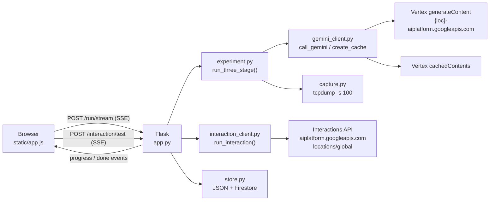
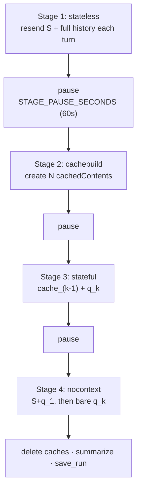
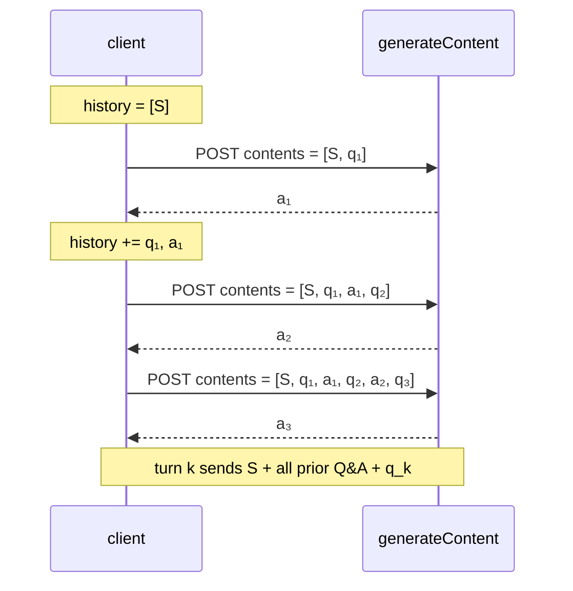
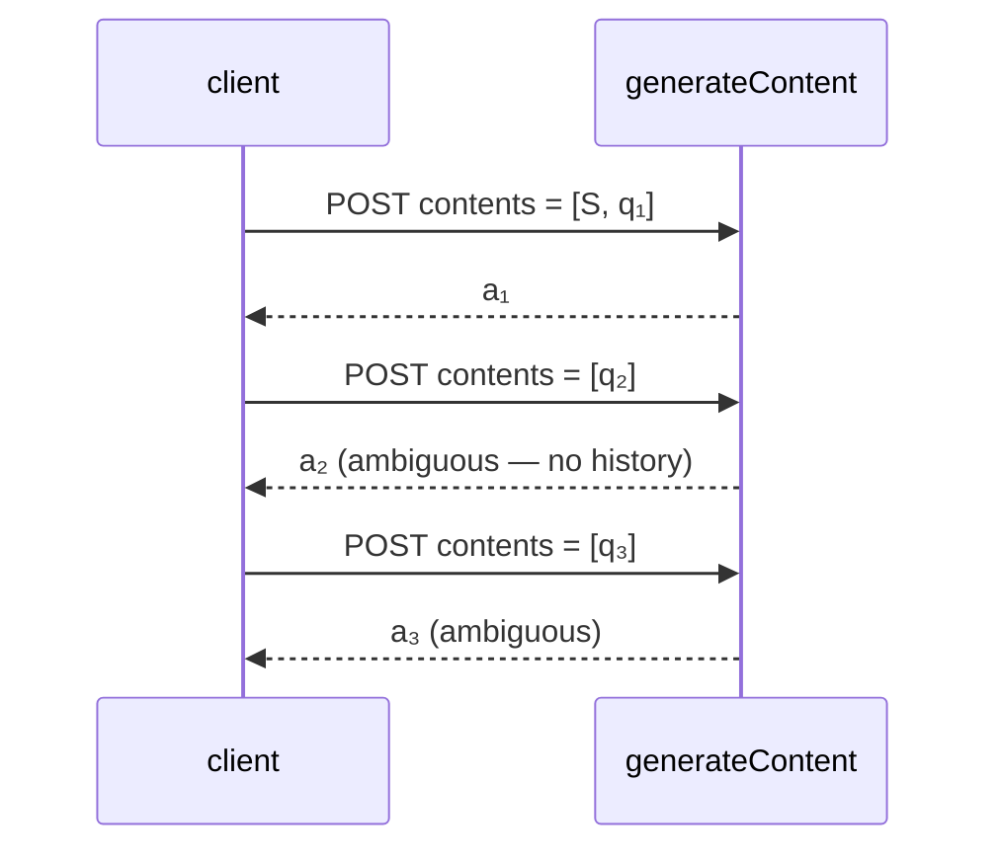
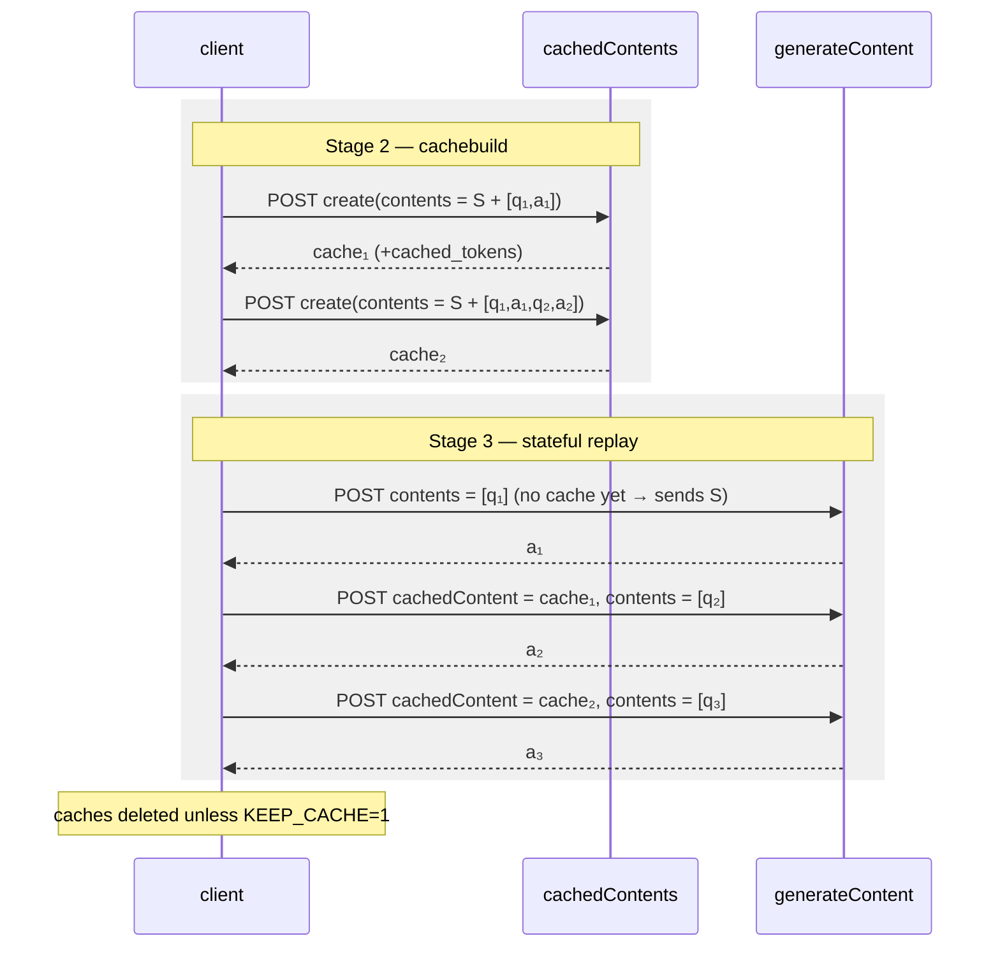
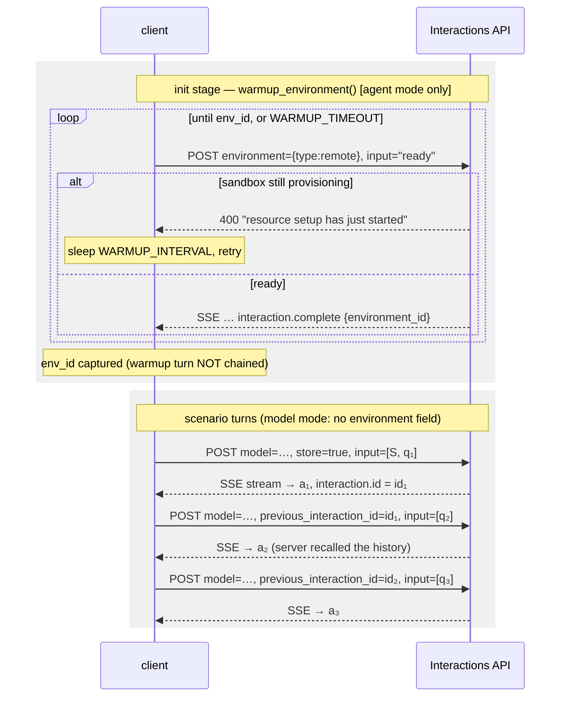

# Implementation & call flow

How the app drives Gemini four different ways, and what actually goes on the wire
each turn. `N` = number of turns; `q_k` = the k-th question; `S` = the large system
prompt (~9 KB, ~1.7k–2.3k tokens).

The point of the demo: **the same N questions, four transports, wildly different
bytes sent and answer quality.**

---

## 1. Components

All Google calls use the same **ADC bearer token** (service account / `gcloud`).
No Gemini API key anywhere.

---

## 2. The 3-stage run (`/run/stream`)

`run_three_stage()` executes four stages in order, each with its own pcap, and
pauses between them so a burst of turns doesn't trip Vertex per-minute quotas.

Each stage: `reset_session()` → start tcpdump → warmup 2s → turns → close socket →
drain 1s → stop tcpdump. The fresh socket makes every pcap start on a clean TCP
handshake.

---

### 2a. Stateless — full resend

Client keeps the transcript and replays all of it every turn. Bytes grow
quadratically; answers are coherent.

### 2b. No-context — pure question

System prompt rides the **first** query only; every later turn sends the bare
question. The server is stateless, so turns 2..N have no context at all —
pronoun/ellipsis questions ("bring it back", "that same check") go ambiguous.
This is the control case.

### 2c. Cache-based stateful

Two phases. First build one cache per prefix, then answer each turn with
`cachedContent` + the new question only. The prefix lives server-side; cached
input tokens bill at ~10%.

Turn `k` uses `cache_(k-1)`; turn 1 has no cache and falls back to sending the
prefix. A prefix below `MIN_CACHE_TOKENS` (2048) is skipped by the API, and that
turn falls back too.

---

## 3. Interaction API (`/interaction/test`)

Genuinely stateful: the **server** stores the conversation. The client sends only
the new question plus `previous_interaction_id`.

Two targets, chosen by `INTERACTION_AGENT`:

| | `model` mode (default) | `agent` mode (`INTERACTION_AGENT` set) |
|---|---|---|
| body field | `model: gemini-2.5-flash` | `agent: antigravity-preview-05-2026` |
| sandbox | none | remote container, provisioned on demand |
| `background` | `false` (foreground stream) | **`true` — required**; the service rejects `false` |
| warmup | not needed | yes, before turn 1 |
| speed | fast | slow (container + agent work) |

`agent` is only required when `model` is absent. Model mode skips the sandbox
entirely, which is why it's much faster.

The warmup below applies to **agent mode only**: the container is provisioned on
demand, so we warm it up *before* asking anything, otherwise turn 1 pays for (or
fails on) provisioning.

Set `INTERACTION_ENV_ID` to skip warmup entirely and reuse a sandbox (TTL 7 days,
reset on each interaction).

Each response is an **SSE event stream**; events are parsed as they arrive and
timestamped, so `first_event_ms` (time to the server's first event) separates
provisioning/queueing from the agent actually working.

---

## 4. What goes on the wire, per turn

| Case | Sent on turn k | Context the model has | Sent bytes |
|---|---|---|---|
| stateless | `S` + all prior Q&A + `q_k` | full | grows ~O(k) per turn, O(N²) total |
| no-context | `q_k` (turn 1: `S + q₁`) | none after turn 1 | flat, tiny |
| stateful (cache) | `cachedContent` ref + `q_k` | full (server-side prefix) | flat, tiny |
| interaction | `previous_interaction_id` + `q_k` | full (server-side history) | flat, tiny |
| interaction_stateless | `S` + all prior Q&A + `q_k` (`store: false`, no `previous_interaction_id`) | full (client-resent, server keeps nothing) | grows ~O(k) per turn, tracks stateless |

Coherent answers: stateless, stateful, interaction, interaction_stateless.
Ambiguous: no-context. Small requests: no-context, stateful, interaction. So
**stateful and interaction are the two ways to get "small request + coherent
answer"** — one caches the prefix, the other keeps the whole conversation
server-side. `interaction_stateless` fills the remaining cell of the endpoint
× who-keeps-the-history matrix: the interactions endpoint, but the client
keeps the history, like stateless. A live 3-turn run (2026-07-13,
gemini-3.1-flash-lite) shows its `input_tokens` tracking `stateless` turn for
turn (4459/4825/5337 vs 4459/4885/5413) rather than `interaction`'s
(4459/4886/5465), which grows at the same rate — proof the server actually
reads the client-supplied history rather than accepting and ignoring it.
Against `interaction`, the wire gap (21701/23342/25600 vs 21700/21755/21722)
is exactly what `previous_interaction_id` buys: ~3.9 KB by turn 3, widening
every turn — a **bytes** saving, not a token one. `interaction`'s
input_tokens (4459/4886/5465) grow at the same rate as every other arm's,
because the server replays and bills the stored history; the ~2% residual
against `interaction_stateless` (5337 vs 5465 at turn 3) is answer-length
variance, not a saving the mechanism produces.

---

## 5. Progress & evidence

- **SSE progress** — both endpoints emit `{stage, turn, turns}` per turn (plus
  `{stage:"pause", turn:secs_left}` and `{stage:"provisioning", attempt}`), with a
  `: keepalive` heartbeat so long runs don't idle out through a proxy.
- **Per-stage pcap** — `tcpdump -i any -s 100 -U` filtered to tcp/443. Snaplen 100
  keeps headers and the true packet length while cutting the disk I/O that causes
  kernel drops; the drop counters are parsed from tcpdump's stderr and shown in the
  UI.
- **Exports** — chat JSON (question, answer, raw request/response per turn) and a
  comparison CSV (`turn, query, stateless_response, nocontext_response,
  stateful_response`).
