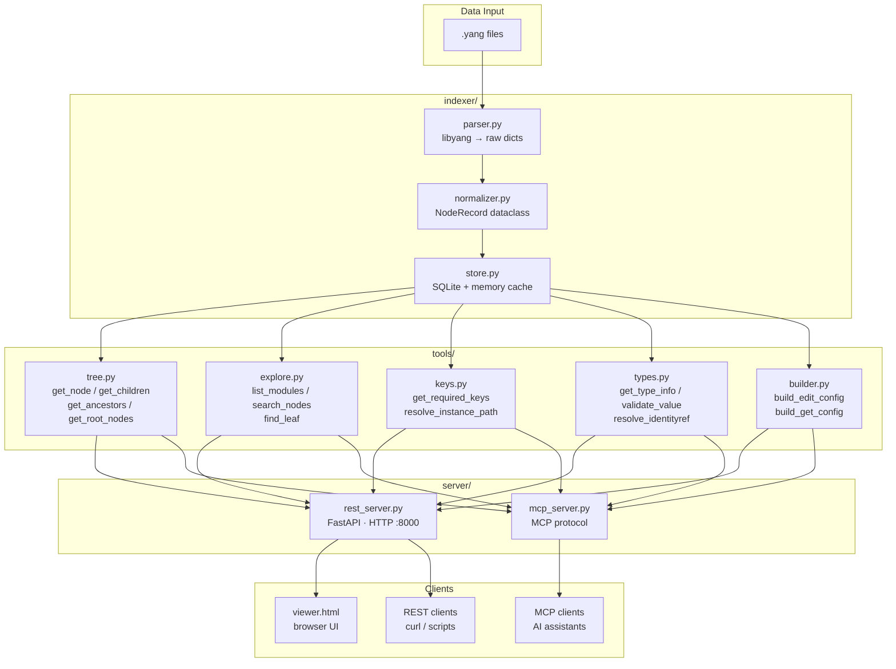

# YANG Schema Tool — Architecture

```mermaid
graph TD
    subgraph Input["Data Input"]
        Y[".yang files"]
    end

    subgraph Indexer["indexer/"]
        P["parser.py\nlibyang → raw dicts"]
        N["normalizer.py\nNodeRecord dataclass"]
        S["store.py\nSQLite + memory cache"]
    end

    subgraph Tools["tools/"]
        TR["tree.py\nget_node / get_children\nget_ancestors / get_root_nodes"]
        EX["explore.py\nlist_modules / search_nodes\nfind_leaf"]
        KY["keys.py\nget_required_keys\nresolve_instance_path"]
        TY["types.py\nget_type_info / validate_value\nresolve_identityref"]
        BL["builder.py\nbuild_edit_config\nbuild_get_config"]
    end

    subgraph Servers["server/"]
        RS["rest_server.py\nFastAPI · HTTP :8000"]
        MS["mcp_server.py\nMCP protocol"]
    end

    subgraph Clients["Clients"]
        UI["viewer.html\nbrowser UI"]
        AI["MCP clients\nAI assistants"]
        RC["REST clients\ncurl / scripts"]
    end

    Y --> P --> N --> S
    S --> TR & EX & KY & TY & BL
    TR & EX & KY & TY & BL --> RS
    TR & EX & KY & TY & BL --> MS
    RS --> UI & RC
    MS --> AI
```
